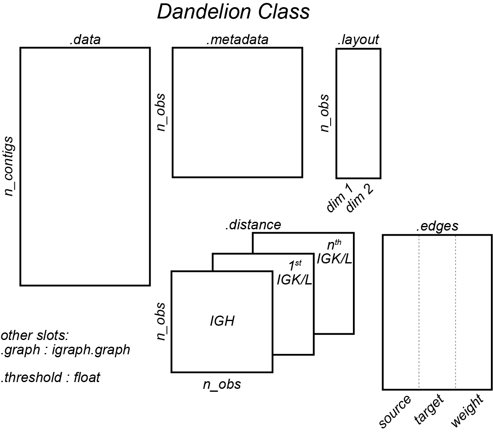

# dandelion


Version = 0.0.9

## Intro
Hi there! I have put together a python package for analyzing single cell BCR/V(D)J data from 10x Genomics 5' solution! It streamlines the pre-processing of immcantation tools for single-cell BCR analysis and includes a couple of functions for visualization. 

Overview


Illustration of the `Dandelion` class slots



## Example
Please see notebooks folder for a step-by-step [example](notebooks/).

The un-processed raw files for parts of the notebook can be accessed via [here](example_data/).

## Installation instructions

I would reccomend instaling this in order:
```bash
# create a conda environment with specific modules
conda create --name dandelion python=3.7
conda activate dandelion

# the following two are what's required by scanpy
conda install seaborn scikit-learn statsmodels numba pytables
conda install -c conda-forge python-igraph leidenalg 
# these are required by dandelion
conda install distance python-Levenshtein joblib plotnine hickle jupyter
conda install -c bioconda igblast blast changeo presto

# Use pip to install the following with --no-cache-dir --upgrade if necessary
pip install scanpy
pip install scrublet

# install rpy2
# If you prefer to use conda to manage R, then use:
# conda install -c conda-forge rpy2
pip install rpy2
# If it fails because it's compiling using clang, first, work out where the path is to your gcc compiler (use brew to install gcc if needed):
#
# example in terminal:
# which gcc-9
# /Users/kt16/homebrew/bin/gcc-9
#
# then run
env CC=/Users/kt16/homebrew/bin/gcc-9 pip install rpy2 # not using conda because I personally don't want to use r that comes with the conda installation. This will ensure I'm using the base R. 

# and then lastly install this
pip install git+https://github.com/zktuong/dandelion.git

# for the development branch, run this:
pip install git+https://github.com/zktuong/dandelion.git@devel
````

dandelion also requires some R packages intalled.
```R
install.packages(c("optparse", "alakazam", "tigger", "airr", "shazam", "ggplot2"))
```
or the following if using conda to manage R:
```bash
conda install -c bioconda r-optparse
conda install -c conda-forge r-alakazam r-tigger r-airr r-shazam 
```

The package should now be properly installed and when starting up jupyter notebook in the virtual environment, the kernel `python3` should work. Otherwise, you might need to add it manually:
```R
python -m ipykernel install --user --name dandelion --display-name "Python (dandelion)"
```

## Required database
Last but not least, you will need download the database folder in this repository and place them somewhere accessible. The the igblast and germline database folders were originally sourced from immcantation's [docker image](https://hub.docker.com/r/kleinstein/immcantation). I've uploaded a compressed version in [here](database) or [here](https://github.com/zktuong/databases_for_vdj/raw/master/database.tar.gz) which you should be able to download easily. Once you've unpacked the folders, export the the path to the database folders as environmental variables in your `~/.bash_profile` like below so that dandelion and the blast programs can access them properly.

So for example, if I unpack into `~/Documents`
```bash
# set up environmental variables in ~/.bash_profile
export GERMLINE=~/Documents/dandelion/database/germlines/
export IGDATA=~/Documents/dandelion/database/igblast/
export BLASTDB=~/Documents/dandelion/database/blast/
```

## External softwares
While blast and igblast executables are managed through conda, you can also download [igblast](https://ftp.ncbi.nih.gov/blast/executables/igblast/release/LATEST/) and [blast+](https://ftp.ncbi.nlm.nih.gov/blast/executables/blast+/LATEST/) manually, and store the softwares somewhere accessible. Just make sure to set the paths to them appropriately.
```bash
# unpack where relevant and export the path to the softwares, e.g. ~/Documents/
echo 'export PATH=~/Documents/software/bin:$PATH' >> ~/.bash_profile
source ~/.bash_profile
```

## Requirements
Python packages
```python
# conda
python==3.7.6 (conda-forge)
numpy==1.18.4 (conda-forge)
pandas==1.0.3 (conda-forge)
python-Levenshtein==0.12.0 (conda-forge)
distance==0.1.3 (conda-forge)
joblib==0.14.1 (conda-forge)
jupyter==1.0.0 (conda-forge)
scikit-learn==0.23.0 (conda-forge)
numba==0.48.0 (conda-forge)
pytables==3.6.1 (conda-forge)
seaborn==0.10.1 (conda-forge)
python-igraph==0.8.2 (conda-forge)
leidenalg==0.8.0 (conda-forge)
plotnine==0.6.0 (conda-forge)
hickle==3.4.5 (conda-forge)
changeo==1.0.0 (bioconda)
presto==0.6.0 (bioconda)

# Other executables (through conda)
blast>=2.10.0 (bioconda) # depends on the database version as well
igblast==1.15.0 (bioconda)

# pip
anndata>=0.7.1
scanpy>=1.4.6
scrublet==0.2.1
rpy2>=3.3.2
```

R packages
```R
alakazam_1.0.1
tigger_1.0.0
airr_1.2.0
shazam_1.0.0
ggplot2
```

## Acknowledgements
I would like to acknowledge the contributions from Dr. Ondrej Suschanek, Dr. Benjamin Stewart, Dr. Rachel Bashford-Rogers and Prof. Menna Clatworthy who helped with the initial conception of the project and for all discussions. 

I would also like to acknowledge Dr. Jongeun Park, Dr. Cecilia-Dominguez Conde, Dr. Hamish King, Dr. Krysztof Polanksi, Dr. Peng He with whom I have had very useful discussions. I would also like to thank my wife who helped name the package, because she thought the plots looked like a dandelion =D.

If there are any ideas, comments, suggestions, thing you would like to know more etc., please feel free to email me at kt16@sanger.ac.uk or post in the issue tracker and I will get back to you.
