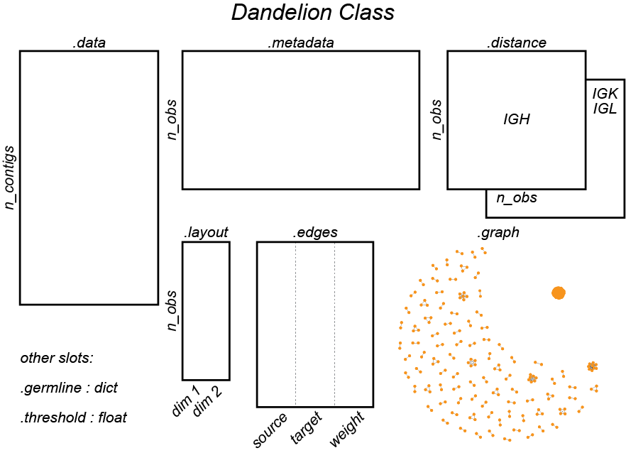

|Docs| |PyPI| |Master| |MasterTest| |Devel| |DevelTest| |CodeCov| |Colab|

|logo|

Hi there! I have put together a python package for analyzing single cell
BCR/V(D)J data from 10x Genomics 5' solution! It streamlines the
pre-processing, leveraging some tools from immcantation suite, and
integrates with scanpy/anndata for single-cell BCR analysis. It also
includes a couple of functions for visualization. Try it out on Google Colab above!

Overview
--------

|overview|

Illustration of the ``Dandelion`` class slots

|class|

Please refer to the
`documentation <https://sc-dandelion.readthedocs.io/>`__ or the
notebooks
`here <https://nbviewer.jupyter.org/github/zktuong/dandelion/tree/latest/docs/notebooks/>`__:

The raw files for the examples can be downloaded from 10X's Single Cell
Immune Profiling datasets
`website <https://support.10xgenomics.com/single-cell-vdj/datasets>`__.

Installation
------------

Singularity container
~~~~~~~~~~~~~~~~~~~~~

``dandelion`` now comes ready in the form of a singularity container:

.. code:: bash

    singularity pull library://kt16/default/sc-dandelion:latest
    singularity shell --writable-tmpfs -B $PWD sc-dandelion_latest.sif

| This will load up a conda-environment that has all the required
dependencies installed.
| This can be used for the preprocessing steps by navigating to the data
folder and use:

.. code:: bash

    singularity run -B $PWD sc-dandelion_latest.sif dandelion-preprocess

Please refer to the
`tutorial <https://sc-dandelion.readthedocs.io/en/latest/notebooks/singularity_preprocessing.html>`__
for more information.

For more fine control, as well as for the exploration steps, please
install via following the instructions below.

Manual
~~~~~~

I would reccomend installing this in order:

.. code:: bash

    # in bash/zsh terminal
    # create a conda environment with specific modules
    conda create --name dandelion python=3.7 # or 3.8, 3.9
    conda activate dandelion

python/conda packages
^^^^^^^^^^^^^^^^^^^^^

.. code:: bash

    # Install scanpy https://scanpy.readthedocs.io/en/latest/installation.html
    conda install seaborn scikit-learn statsmodels numba pytables
    conda install -c conda-forge python-igraph leidenalg
    pip install scanpy

    # skip if doing pre-processing via container
    conda install -c bioconda igblast blast # if this doesn't work, download them manually (see below)

    # optional: installing rpy2 (if not doing pre-processing)
    # This is optional because it's only used for interaction with some of the R packages from the immcantation suite. Skip if prefer keeping it simple and run the different tools separately
    # if you just want to stick with the base R
    pip install "rpy2>=3.4" # or if you don't mind having conda manage R: conda install -c conda-forge "rpy2>=3.4"
    # make sure not to use the same R package folder or you will end up with major issues later.

    # Use pip to install the following with --no-cache-dir --upgrade if necessary
    # and then lastly install this
    pip install sc-dandelion
    # or pip install git+https://github.com/zktuong/dandelion.git
    # for the development branch, run this: pip install git+https://github.com/zktuong/dandelion.git@devel

R packages
^^^^^^^^^^

If doing pre-preprocessing, ``dandelion`` requires some R packages
intalled.

.. code:: R

    # in R
    install.packages(c("optparse", "alakazam", "tigger", "airr", "shazam"))

or the following if using conda to manage R:

.. code:: bash

    # in bash/zsh terminal
    conda install -c conda-forge r-optparse r-alakazam r-tigger r-airr r-shazam

The package should now be properly installed and when starting up
jupyter notebook in the virtual environment, the kernel ``python3``
should work. Otherwise, you might need to add it manually:

.. code:: bash

    # in bash/zsh terminal
    python -m ipykernel install --user --name dandelion --display-name "Python (dandelion)"

Required database
-----------------

Last but not least, you will need to download the `database folder <https://github.com/zktuong/dandelion/tree/master/container>`__ in
the repository and place them somewhere accessible. The igblast and
germline database folders were originally downloaded from
`immcantation <https://immcantation.readthedocs.io/>`__
docker image (4.2.0). The blast database were downloaded from IMGT and
manually curated. I have uploaded a copy of the required databases in a
separate `repository <https://github.com/zktuong/databases_for_vdj>`__
(Last update: 01/08/2021). Once you've unpacked the folders, export the
the path to the database folders as environmental variables in your
``~/.bash_profile`` or ``~/.zshenv`` like below. This will allow
dandelion to access them easily. In the future, the databases will have
to be updated accordingly.

So for example, if I unpack into ``~/Documents``

.. code:: bash

    # in bash/zsh terminal
    # set up environmental variables in ~/.bash_profile
    echo 'export GERMLINE=~/Documents/dandelion/database/germlines/' >> ~/.bash_profile # or ~/.zshenv
    echo 'export IGDATA=~/Documents/dandelion/database/igblast/' >> ~/.bash_profile # or ~/.zshenv
    echo 'export BLASTDB=~/Documents/dandelion/database/blast/' >> ~/.bash_profile # or ~/.zshenv
    source ~/.bash_profile # or ~/.zshenv

see https://github.com/zktuong/dandelion/issues/66 for a known issue if
you are using a notebook via jupyterhub.

This is already available in the singularity container under
``/share/database/``.

External softwares
------------------

While blast and igblast executables are managed through conda, you can
also download
`igblast <https://ftp.ncbi.nih.gov/blast/executables/igblast/release/LATEST/>`__
and
`blast+ <https://ftp.ncbi.nlm.nih.gov/blast/executables/blast+/LATEST/>`__
manually, and store the softwares somewhere accessible. Just make sure
to set the paths to them appropriately.

.. code:: bash

    # in bash/zsh terminal
    # unpack where relevant and export the path to the softwares, e.g. ~/Documents/
    echo 'export PATH=~/Documents/software/bin:$PATH' >> ~/.bash_profile # or ~/.zshenv
    source ~/.bash_profile # or ~/.zshenv

This is already available in the singularity container under
``/share/``.

Basic requirements
------------------

Python packages

.. code:: python

    # conda
    python>=3.7,<=3.8 (conda-forge)
    numpy>=1.18.4 (conda-forge)
    pandas>=1.0.3 (conda-forge)
    distance>=0.1.3 (conda-forge)
    jupyter (conda-forge) # if running via a notebook
    scikit-learn>=0.23.0 (conda-forge)
    numba>=0.48.0 (conda-forge)
    pytables>=3.6.1 (conda-forge)
    seaborn>=0.10.1 (conda-forge)
    leidenalg>=0.8.0 (conda-forge)
    plotnine>=0.6.0 (conda-forge)

    # Other executables (through conda)
    blast>=2.10.1 (bioconda)
    igblast>=1.15.0 (bioconda)

    # pip
    anndata>=0.7.1
    scanpy>=1.4.6
    scrublet>=0.2.1
    changeo>=1.0.0
    presto>=0.6.0
    polyleven>=0.5
    networkx>=2.4
    rpy2>=3.4 # or rpy2>=3.3.2,<3.3.5

R packages

.. code:: R

    alakazam_1.0.1
    tigger_1.0.0
    airr_1.2.0
    shazam_1.0.0
    ggplot2

Acknowledgements
----------------

I would like to acknowledge the contributions from Dr. Ondrej Suschanek,
Dr. Benjamin Stewart, Dr. Rachel Bashford-Rogers and Prof. Menna
Clatworthy, who helped with the initial conception of the project and
for all discussions.

I would also like to acknowledge Dr. Jongeun Park, Dr. Cecilia-Dominguez
Conde, Dr. Hamish King, Dr. Krysztof Polanksi and Dr. Peng He with whom
I have had very useful discussions. I would also like to thank my wife
who helped name the package, because she thought the plots looked like a
dandelion =D.

Support
-------

Support is provided on a voluntary basis, as time permits.

If there are any ideas, comments, suggestions, thing you would like to
know more etc., please feel free to email me at kt16@sanger.ac.uk or
post in the issue tracker and I will get back to you.

Citation
--------

``dandelion`` is now included in the the following manuscript:

.. [Stephenson2021] Stephenson *et al.* (2021),
   *Single-cell multi-omics analysis of the immune response in COVID-19*,
   `Nature Medicine <https://www.nature.com/articles/s41591-021-01329-2>`__.

*Emily Stephenson, Gary Reynolds, Rachel A Botting, Fernando J
Calero-Nieto, Michael Morgan, Zewen Kelvin Tuong, Karsten Bach, Waradon
Sungnak, Kaylee B Worlock, Masahiro Yoshida, Natsuhiko Kumasaka,
Katarzyna Kania, Justin Engelbert, Bayanne Olabi, Jarmila Stremenova
Spegarova, Nicola K Wilson, Nicole Mende, Laura Jardine, Louis CS
Gardner, Issac Goh, Dave Horsfall, Jim McGrath, Simone Webb, Michael W
Mather, Rik GH Lindeboom, Emma Dann, Ni Huang, Krzysztof Polanski, Elena
Prigmore, Florian Gothe, Jonathan Scott, Rebecca P Payne, Kenneth F
Baker, Aidan T Hanrath, Ina CD Schim van der Loeff, Andrew S Barr, Amada
Sanchez-Gonzalez, Laura Bergamaschi, Federica Mescia, Josephine L
Barnes, Eliz Kilich, Angus de Wilton, Anita Saigal, Aarash Saleh, Sam M
Janes, Claire M Smith, Nusayhah Gopee, Caroline Wilson, Paul Coupland,
Jonathan M Coxhead, Vladimir Y Kiselev, Stijn van Dongen, Jaume
Bacardit, Hamish W King, Anthony J Rostron, A John Simpson, Sophie
Hambleton, Elisa Laurenti, Paul A Lyons, Kerstin B Meyer, Marko Z
Nikolic, Christopher JA Duncan, Ken Smith, Sarah A Teichmann, Menna R
Clatworthy, John C Marioni, Berthold Gottgens, Muzlifah Haniffa.*
**Single-cell multi-omics analysis of the immune response in
COVID-19**. *Nature Medicine 2021.04.20; doi:
https://dx.doi.org/10.1038/s41591-021-01329-2*

Original preprint:

*Emily Stephenson, Gary Reynolds, Rachel A Botting, Fernando J
Calero-Nieto, Michael Morgan, Zewen Kelvin Tuong, Karsten Bach, Waradon
Sungnak, Kaylee B Worlock, Masahiro Yoshida, Natsuhiko Kumasaka,
Katarzyna Kania, Justin Engelbert, Bayanne Olabi, Jarmila Stremenova
Spegarova, Nicola K Wilson, Nicole Mende, Laura Jardine, Louis CS
Gardner, Issac Goh, Dave Horsfall, Jim McGrath, Simone Webb, Michael W
Mather, Rik GH Lindeboom, Emma Dann, Ni Huang, Krzysztof Polanski, Elena
Prigmore, Florian Gothe, Jonathan Scott, Rebecca P Payne, Kenneth F
Baker, Aidan T Hanrath, Ina CD Schim van der Loeff, Andrew S Barr, Amada
Sanchez-Gonzalez, Laura Bergamaschi, Federica Mescia, Josephine L
Barnes, Eliz Kilich, Angus de Wilton, Anita Saigal, Aarash Saleh, Sam M
Janes, Claire M Smith, Nusayhah Gopee, Caroline Wilson, Paul Coupland,
Jonathan M Coxhead, Vladimir Y Kiselev, Stijn van Dongen, Jaume
Bacardit, Hamish W King, Anthony J Rostron, A John Simpson, Sophie
Hambleton, Elisa Laurenti, Paul A Lyons, Kerstin B Meyer, Marko Z
Nikolic, Christopher JA Duncan, Ken Smith, Sarah A Teichmann, Menna R
Clatworthy, John C Marioni, Berthold Gottgens, Muzlifah Haniffa.* **The
cellular immune response to COVID-19 deciphered by single cell
multi-omics across three UK centres**. *medRxiv 2021.01.13.21249725;
doi: https://doi.org/10.1101/2021.01.13.21249725*

If you use the pre-processing tools/functions, please cite the relevant manuscripts from the immcantation suite, including:

.. [changeo]
*Gupta NT, Vander Heiden JA, Uduman M, Gadala-Maria D, Yaari G, Kleinstein SH.* **Change-O: a toolkit for analyzing large-scale B cell immunoglobulin repertoire sequencing data.** *Bioinformatics 31, 3356-8 (2015). doi: https://doi.org/10.1093/bioinformatics/btv359*

.. [tigger]
*Gadala-Maria D, Yaari G, Uduman M, Kleinstein SH.* **Automated analysis of high-throughput B cell sequencing data reveals a high frequency of novel immunoglobulin V gene segment alleles.** *Proceedings of the National Academy of Sciency of the United States of America, E862-70.*

References
----------

.. [Bashford-Rogers13] Bashford-Rogers *et al.* (2013),
   *Network properties derived from deep sequencing of human B-cell receptor repertoires delineate B-cell populations*,
   `Genome Research <https://genome.cshlp.org/content/23/11/1874>`__.

.. [Bashford-Rogers19] Bashford-Rogers *et al.* (2019),
   *Analysis of the B cell receptor repertoire in six immune-mediated diseases*,
   `Nature <https://www.nature.com/articles/s41586-019-1595-3>`__.

.. [Gadala-Maria15] Gadala-Maria *et al.* (2015),
   *Automated analysis of high-throughput B cell sequencing data reveals a high frequency of novel immunoglobulin V gene segment alleles*,
   `Proceedings of the National Academy of Sciency of the United States of America <https://www.pnas.org/content/112/8/E862>`__.

.. [Gupta15] Gupta *et al.* (2015),
   *Change-O: a toolkit for analyzing large-scale B cell immunoglobulin repertoire sequencing data*,
   `Bioinformatics <https://academic.oup.com/bioinformatics/article/31/20/3356/195677>`__.

.. [Ma16] Ma *et al.* (2016)
   *nxviz: Composable and rational network visualizations in matplotlib*,
   `Github <https://github.com/ericmjl/nxviz>`__.

.. [Stephenson2021] Stephenson *et al.* (2021),
   *Single-cell multi-omics analysis of the immune response in COVID-19*,
   `Nature Medicine <https://www.nature.com/articles/s41591-021-01329-2>`__.

.. [Sturm2020] Sturm *et al.* (2020),
   *Scirpy: a Scanpy extension for analyzing single-cell T-cell receptor-sequencing data*,
   `Bioinformatics <https://academic.oup.com/bioinformatics/article/36/18/4817/5866543>`__.
   `GitHub <https://github.com/icbi-lab/scirpy>`__.

.. [Wolf18] Wolf *et al.* (2018),
   *Scanpy: large-scale single-cell gene expression data analysis*,
   `Genome Biology <https://doi.org/10.1186/s13059-017-1382-0>`__.
   `GitHub <https://github.com/theislab/scanpy>`__.

.. |Docs| image:: https://readthedocs.org/projects/sc-dandelion/badge/?version=latest
   :target: https://sc-dandelion.readthedocs.io/en/latest/?badge=latest
.. |PyPI| image:: https://img.shields.io/pypi/v/sc-dandelion?logo=PyPI
   :target: https://pypi.org/project/sc-dandelion/
.. |Master| image:: https://byob.yarr.is/zktuong/dandelion/master-version
   :target: https://github.com/zktuong/dandelion/tree/master
.. |MasterTest| image:: https://github.com/zktuong/dandelion/workflows/tests/badge.svg?branch=master
   :target: https://github.com/zktuong/dandelion/actions/workflows/tests.yml
.. |Devel| image:: https://byob.yarr.is/zktuong/dandelion/devel-version
   :target: https://github.com/zktuong/dandelion/tree/devel
.. |DevelTest| image:: https://github.com/zktuong/dandelion/workflows/tests/badge.svg?branch=devel
   :target: https://github.com/zktuong/dandelion/actions/workflows/tests.yml
.. |CodeCov| image:: https://codecov.io/gh/zktuong/dandelion/branch/master/graph/badge.svg?token=661BMU1FBO
   :target: https://codecov.io/gh/zktuong/dandelion
.. |Colab| image:: https://colab.research.google.com/assets/colab-badge.svg
   :target: https://colab.research.google.com/github/zktuong/dandelion/blob/master/container/dandelion_singularity.ipynb
.. |logo| image:: notebooks/img/dandelion_logo_illustration.png
.. |overview| image:: notebooks/img/dandelion_overview.png

