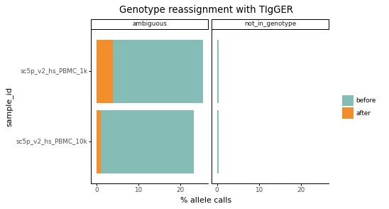
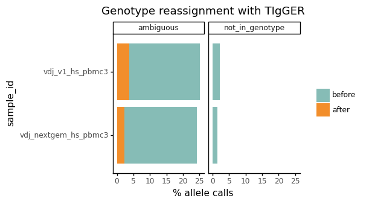
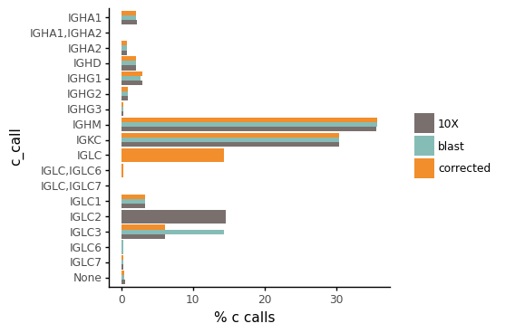
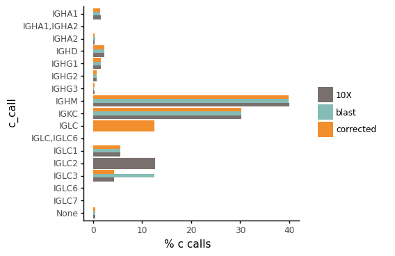
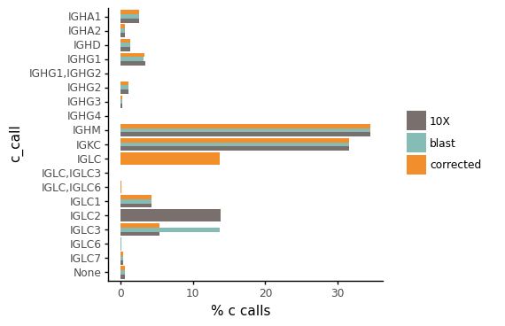

Pre-processing (Re-annotation)
==============================

.. figure:: img/dandelion_logo_illustration.png
   :alt: dandelion_logo

   dandelion_logo

Foreword
--------

**dandelion** is written in ``python=3.7`` (also compatible with
``3.8``, ``3.9`` and ``3.10``) and is primarily a single-cell BCR-seq
analysis package. It makes use of some tools from the fantastic
`immcantation suite <https://immcantation.readthedocs.io/>`__
`[Gupta2015] <https://academic.oup.com/bioinformatics/article/31/20/3356/195677>`__,
implementing a workflow to streamline the pre-processing and exploratory
stages for analyzing single-cell BCR-seq data from 10X Genomics.
Post-processed data from **dandelion** can be smoothly transferred to
`scanpy <https://scanpy.readthedocs.io/>`__/`AnnData <https://anndata.readthedocs.io/>`__
`[Wolf18] <https://doi.org/10.1186/s13059-017-1382-0>`__ object for
integration and exploration of BCR-seq data and RNA-seq data. I hope to
be able to introduce some new single-cell BCR-seq exploratory tools down
the road through *dandelion*.

This section will cover the initial pre-processing of files after 10X’s
``Cell Ranger vdj`` immune profiling data analysis pipeline
**manually**. As mentioned, there is now a `singularity
container <https://sc-dandelion.readthedocs.io/en/latest/notebooks/singularity_preprocessing.html>`__
that can automate the first few steps outlined below.

We will download the 10X data sets to process for this tutorial:

.. code:: bash

   # create sub-folders
   mkdir -p dandelion_tutorial/vdj_nextgem_hs_pbmc3
   mkdir -p dandelion_tutorial/vdj_v1_hs_pbmc3
   mkdir -p dandelion_tutorial/sc5p_v2_hs_PBMC_10k
   mkdir -p dandelion_tutorial/sc5p_v2_hs_PBMC_1k

   # change into each directory and download the necessary files
   cd dandelion_tutorial/vdj_v1_hs_pbmc3;
   wget -O filtered_feature_bc_matrix.h5 https://cf.10xgenomics.com/samples/cell-vdj/3.1.0/vdj_v1_hs_pbmc3/vdj_v1_hs_pbmc3_filtered_feature_bc_matrix.h5;
   wget -O filtered_contig_annotations.csv https://cf.10xgenomics.com/samples/cell-vdj/3.1.0/vdj_v1_hs_pbmc3/vdj_v1_hs_pbmc3_b_filtered_contig_annotations.csv;
   wget -O filtered_contig.fasta https://cf.10xgenomics.com/samples/cell-vdj/3.1.0/vdj_v1_hs_pbmc3/vdj_v1_hs_pbmc3_b_filtered_contig.fasta;

   cd ../vdj_nextgem_hs_pbmc3
   wget -O filtered_feature_bc_matrix.h5 https://cf.10xgenomics.com/samples/cell-vdj/3.1.0/vdj_nextgem_hs_pbmc3/vdj_nextgem_hs_pbmc3_filtered_feature_bc_matrix.h5;
   wget -O filtered_contig_annotations.csv https://cf.10xgenomics.com/samples/cell-vdj/3.1.0/vdj_nextgem_hs_pbmc3/vdj_nextgem_hs_pbmc3_b_filtered_contig_annotations.csv;
   wget -O filtered_contig.fasta https://cf.10xgenomics.com/samples/cell-vdj/3.1.0/vdj_nextgem_hs_pbmc3/vdj_nextgem_hs_pbmc3_b_filtered_contig.fasta;

   cd ../sc5p_v2_hs_PBMC_10k;
   wget -O filtered_feature_bc_matrix.h5 https://cf.10xgenomics.com/samples/cell-vdj/4.0.0/sc5p_v2_hs_PBMC_10k/sc5p_v2_hs_PBMC_10k_filtered_feature_bc_matrix.h5;
   wget -O filtered_contig_annotations.csv https://cf.10xgenomics.com/samples/cell-vdj/4.0.0/sc5p_v2_hs_PBMC_10k/sc5p_v2_hs_PBMC_10k_b_filtered_contig_annotations.csv;
   wget -O filtered_contig.fasta https://cf.10xgenomics.com/samples/cell-vdj/4.0.0/sc5p_v2_hs_PBMC_10k/sc5p_v2_hs_PBMC_10k_b_filtered_contig.fasta;

   cd ../sc5p_v2_hs_PBMC_1k;
   wget -O filtered_feature_bc_matrix.h5 wget https://cf.10xgenomics.com/samples/cell-vdj/4.0.0/sc5p_v2_hs_PBMC_1k/sc5p_v2_hs_PBMC_1k_filtered_feature_bc_matrix.h5;
   wget -O filtered_contig_annotations.csv wget https://cf.10xgenomics.com/samples/cell-vdj/4.0.0/sc5p_v2_hs_PBMC_1k/sc5p_v2_hs_PBMC_1k_b_filtered_contig_annotations.csv;
   wget -O filtered_contig.fasta https://cf.10xgenomics.com/samples/cell-vdj/4.0.0/sc5p_v2_hs_PBMC_1k/sc5p_v2_hs_PBMC_1k_b_filtered_contig.fasta;

**dandelion**\ ’s reannotation workflow requires the Cellranger fasta
files and annotation files to start, particularly either
*all_contig.fasta* or *filtered_contig.fasta* and corresponding
*all_contig_annotations.csv* and *filtered_contig_annotations.csv*.

I’m running everything with the *filtered_contig* files as a standard
analysis set up. I’m using a standard laptop for the analysis here:
entry level 2017 Macbook Pro with 2.3 GHz Intel Core i5 processor and 16
GB 2133 MHz LPDDR3 ram.

If you followed the installation instructions, you should have the
requisite auxillary softwares installed already. Otherwise, you can
download them manually:
`blast+ <https://ftp.ncbi.nih.gov/blast/executables/igblast/release/LATEST/>`__
and
`igblast <https://ftp.ncbi.nlm.nih.gov/blast/executables/blast+/LATEST/>`__.
For tigger-genotype, you can download it
`here <https://bitbucket.org/kleinstein/immcantation/src/default/pipelines/>`__.
Just note that I made some minor modifications to this file, hence there
is a version that comes with this package.

For convenience, in **shell**, export the path to the database folders
like as follows:

.. code:: bash

   # bash/shell
   echo "export GERMLINE=/Users/kt16/Documents/Github/dandelion/database/germlines/" >> ~/.bash_profile
   echo "export IGDATA=/Users/kt16/Documents/Github/dandelion/database/igblast/" >> ~/.bash_profile
   echo "export BLASTDB=/Users/kt16/Documents/Github/dandelion/database/blast/" >> ~/.bash_profile
   # reload
   source ~/.bash_profile

The databases for igblast are basically setup using `changeo’s
instructions <https://changeo.readthedocs.io/en/stable/examples/igblast.html>`__.

If you are using a jupyter notebook initialized via jupyterhub instance,
you might want to try the fix to a known issue where pathing requires
some adjustments https://github.com/zktuong/dandelion/discussions/146.

For reannotation of constant genes, reference fasta files were
downloaded from IMGT and only sequences corresponding to *CH1* region
for each constant gene/allele were retained. The headers were trimmed to
only keep the gene and allele information. Links to find the sequences
can be found here :
`human <http://www.imgt.org/genedb/GENElect?query=7.2+IGHC&species=Homo+sapiens>`__
and
`mouse <http://www.imgt.org/genedb/GENElect?query=7.2+IGHC&species=Mus>`__.

The utility function ``ddl.utl.makeblastdb`` is a wrapper for:

.. code:: bash

   # bash/shell
   makeblastdb -dbtype nucl -parse_seqids -in $BLASTDB/human/human_BCR_C.fasta

This does the same thing:

.. code:: python

   # python
   ddl.utl.makeblastdb('/Users/kt16/Documents/Github/dandelion/database/blast/human/human_BCR_C.fasta')

If you have cloned the directory from dandelion’s github, you should
have all the databases ready to go and would not need to run
makeblastdb.

This section will now demonstrate how I batch process multiple
samples/files from the same donor, as it will become important later on.

.. code:: ipython3

    # Import modules
    import sys
    import os
    import dandelion as ddl
    ddl.logging.print_versions()

.. parsed-literal::

    dandelion==0.2.4.dev57 pandas==1.4.2 numpy==1.21.6 matplotlib==3.5.2 networkx==2.8.4 scipy==1.8.1

.. code:: ipython3

    # change directory to somewhere more workable
    os.chdir(os.path.expanduser('/Users/kt16/Downloads/dandelion_tutorial/'))
    # print current working directory
    os.getcwd()

.. parsed-literal::

    '/Users/kt16/Downloads/dandelion_tutorial'

Step 1: Formatting the headers of the Cell Ranger fasta file
------------------------------------------------------------

Here, I’m adding a prefix to the headers of each contig in the fasta
files, via the function ``pp.format_fastas``. The prefix is basically
just the folder name, so in this case it’s: ``sc5p_v2_hs_PBMC_1k``,
``sc5p_v2_hs_PBMC_10k``, ``vdj_v1_hs_pbmc3`` and
``vdj_nextgem_hs_pbmc3``.

The function will also create sub-folders where a new fasta file and all
subsequent files will be located. The function will also add the prefix
to the corresponding annotation file automatically and create a copy in
the same folder as the formated fasta file.

This is to ensure that the barcodes are consistent throughout so as not
to interfere with subsequent integration with the gene expression data,
which will be covered in subsequent sections.

The file structure should look something like this later on if the
settings are left as default. The tmp directory can be deleted once the
initial preprocessing has completed.

.. code:: console

   # bash/shell
   (dandelion) mib113557i:dandelion_tutorial kt16$ tree sc5p_v2_hs_PBMC_1k
   sc5p_v2_hs_PBMC_1k
   ├── dandelion
   │   ├── filtered_contig.fasta
   │   ├── filtered_contig_annotations.csv
   │   ├── filtered_contig_igblast_db-pass_genotyped.tsv
   │   └── tmp
   │       ├── filtered_contig_igblast.fmt7
   │       ├── filtered_contig_igblast.tsv
   │       ├── filtered_contig_igblast_db-pass.blastsummary.txt
   │       ├── filtered_contig_igblast_db-pass.tsv
   │       ├── filtered_contig_igblast_db-pass.xml
   │       ├── filtered_contig_igblast_db-pass_genotyped.tsv
   │       ├── filtered_contig_igblast_db-pass_heavy_parse-select.tsv
   │       └── filtered_contig_igblast_db-pass_light_parse-select.tsv
   ├── filtered_contig.fasta
   ├── filtered_contig_annotations.csv
   └── filtered_feature_bc_matrix.h5

The first option of ``pp.format_fastas`` accepts a list of the fasta
file paths to reformat, or list of names of folders containing the fasta
files; each folder should only contain 1 fasta file, and 1
contig_annotation.csv. Make sure there’s no hidden files and delete
those if present.

You can provide ``prefixes`` and/or ``suffixes`` to add the the
cell/contig barcodes as a list and they will be formatted accordingly.
The prefixes/suffixes will be separated by an underscore (``_``) if left
as default but that can be adjusted with the ``sep`` option.

If you choose not to provide a prefix/suffix, then the function will
simply make a copy of the original files and place it in the
``dandelion`` sub-folders.

For more complex experimental setups, such as with data from multiplexed
experiments, please contact me (kt16@sanger.ac.uk) and I can walk you
through a slightly more advanced set up.

.. code:: ipython3

    # the first option is a list of fasta files to format and the second option is the list of prefix to add to each file.
    samples = ['sc5p_v2_hs_PBMC_1k', 'sc5p_v2_hs_PBMC_10k', 'vdj_v1_hs_pbmc3', 'vdj_nextgem_hs_pbmc3']
    ddl.pp.format_fastas(samples, prefix = samples)

.. parsed-literal::

    Formating fasta(s) : 100%|██████████| 4/4 [00:02<00:00,  1.52it/s]                                                                               

**Non-standard (filtered) input files**:

If you are not using ``filtered`` files, e.g. ``all_contig.fasta``,
please specify the ``filename_prefix`` option for all preprocessing
functions below (except for quantify_mutations).

For example, use ``filename_prefix = 'all'`` for ``all_contig.fasta``,
or ``filename_prefix = <insertprefix>`` for any files that are named
``<insertprefix>_contig.fasta``.

If you are running more than 1 sample and if each filename prefix needs
to be specified, ``filename_prefix`` in ``ddl.pp.format_fastas`` will
accept a list of prefixes
i.e. ``filename_prefix = ['all', 'filtered', ...]``.

Step 2: Reannotate the V/D/J genes with *igblastn*
--------------------------------------------------

Like immcantation, we will reannotate the V(D)J genes with igblastn
using the latest IMGT reference databases. However, as of v0.1.13,
``pp.reannotate_genes`` will use a ``flavour = 'strict'`` to run
``igblastn``, imposing lower e-value and higher D-penalty cut offs. The
original behaviour i.e. with
`changeo <https://changeo.readthedocs.io/en/stable/examples/10x.html>`__\ ’s
``AssignGenes.py``, is toggled with ``flavour = 'original'``.
Additionally, there is now an additional ``assign_dj`` option (default
is ``True``), which will use blastn to assign a stricter call for the D
and J genes because `igblastn can return random assignments if it cannot
detect a V gene <https://www.ncbi.nlm.nih.gov/igblast/faq.html>`__. In
the tmp folder, there will also be a table where all alignments
generated in this step will be shown (only the top hit is selected for
each contig). All the column headers are now adhereing to the
`AIRR <http://docs.airr-community.org/>`__ standard.

.. code:: ipython3

    ddl.pp.reannotate_genes(samples)

.. parsed-literal::

    Assigning genes :   0%|          | 0/4 [00:00<?, ?it/s]                                                                                          

.. parsed-literal::

             START> MakeDB
           COMMAND> igblast
      ALIGNER_FILE> filtered_contig_igblast.fmt7
          SEQ_FILE> filtered_contig.fasta
           ASIS_ID> False
        ASIS_CALLS> False
           PARTIAL> False
          EXTENDED> True
    INFER_JUNCTION> False
    
    PROGRESS> 23:40:10 |Done                | 0.0 min
    
    PROGRESS> 23:40:16 |####################| 100% (2,059) 0.1 min
    
    OUTPUT> filtered_contig_igblast_db-pass.tsv
      PASS> 1842
      FAIL> 217
       END> MakeDb
    
             START> MakeDB
           COMMAND> igblast
      ALIGNER_FILE> filtered_contig_igblast.fmt7
          SEQ_FILE> filtered_contig.fasta
           ASIS_ID> False
        ASIS_CALLS> False
           PARTIAL> False
          EXTENDED> True
    INFER_JUNCTION> False
    
    PROGRESS> 23:40:17 |Done                | 0.0 min
    
    PROGRESS> 23:40:23 |####################| 100% (2,059) 0.1 min
    
    OUTPUT> filtered_contig_igblast_db-pass.tsv
      PASS> 1842
      FAIL> 217
       END> MakeDb
    

.. parsed-literal::

    Assigning genes :  25%|██▌       | 1/4 [01:27<04:21, 87.12s/it]                                                                                  

.. parsed-literal::

             START> MakeDB
           COMMAND> igblast
      ALIGNER_FILE> filtered_contig_igblast.fmt7
          SEQ_FILE> filtered_contig.fasta
           ASIS_ID> False
        ASIS_CALLS> False
           PARTIAL> False
          EXTENDED> True
    INFER_JUNCTION> False
    
    PROGRESS> 23:42:36 |Done                | 0.0 min
    
    PROGRESS> 23:42:42 |####################| 100% (2,601) 0.1 min
    
    OUTPUT> filtered_contig_igblast_db-pass.tsv
      PASS> 2409
      FAIL> 192
       END> MakeDb
    
             START> MakeDB
           COMMAND> igblast
      ALIGNER_FILE> filtered_contig_igblast.fmt7
          SEQ_FILE> filtered_contig.fasta
           ASIS_ID> False
        ASIS_CALLS> False
           PARTIAL> False
          EXTENDED> True
    INFER_JUNCTION> False
    
    PROGRESS> 23:42:43 |Done                | 0.0 min
    
    PROGRESS> 23:42:49 |####################| 100% (2,601) 0.1 min
    
    OUTPUT> filtered_contig_igblast_db-pass.tsv
      PASS> 2409
      FAIL> 192
       END> MakeDb
    

.. parsed-literal::

    Assigning genes :  50%|█████     | 2/4 [03:53<04:04, 122.21s/it]                                                                                 

.. parsed-literal::

             START> MakeDB
           COMMAND> igblast
      ALIGNER_FILE> filtered_contig_igblast.fmt7
          SEQ_FILE> filtered_contig.fasta
           ASIS_ID> False
        ASIS_CALLS> False
           PARTIAL> False
          EXTENDED> True
    INFER_JUNCTION> False
    
    PROGRESS> 23:44:37 |Done                | 0.0 min
    
    PROGRESS> 23:44:44 |####################| 100% (2,059) 0.1 min
    
    OUTPUT> filtered_contig_igblast_db-pass.tsv
      PASS> 1842
      FAIL> 217
       END> MakeDb
    
             START> MakeDB
           COMMAND> igblast
      ALIGNER_FILE> filtered_contig_igblast.fmt7
          SEQ_FILE> filtered_contig.fasta
           ASIS_ID> False
        ASIS_CALLS> False
           PARTIAL> False
          EXTENDED> True
    INFER_JUNCTION> False
    
    PROGRESS> 23:44:44 |Done                | 0.0 min
    
    PROGRESS> 23:44:51 |####################| 100% (2,059) 0.1 min
    
    OUTPUT> filtered_contig_igblast_db-pass.tsv
      PASS> 1842
      FAIL> 217
       END> MakeDb
    

.. parsed-literal::

    Assigning genes :  75%|███████▌  | 3/4 [05:57<02:02, 122.77s/it]                                                                                 

.. parsed-literal::

             START> MakeDB
           COMMAND> igblast
      ALIGNER_FILE> filtered_contig_igblast.fmt7
          SEQ_FILE> filtered_contig.fasta
           ASIS_ID> False
        ASIS_CALLS> False
           PARTIAL> False
          EXTENDED> True
    INFER_JUNCTION> False
    
    PROGRESS> 23:47:42 |Done                | 0.0 min
    
    PROGRESS> 23:47:49 |####################| 100% (3,222) 0.1 min
    
    OUTPUT> filtered_contig_igblast_db-pass.tsv
      PASS> 2977
      FAIL> 245
       END> MakeDb
    
             START> MakeDB
           COMMAND> igblast
      ALIGNER_FILE> filtered_contig_igblast.fmt7
          SEQ_FILE> filtered_contig.fasta
           ASIS_ID> False
        ASIS_CALLS> False
           PARTIAL> False
          EXTENDED> True
    INFER_JUNCTION> False
    
    PROGRESS> 23:47:50 |Done                | 0.0 min
    
    PROGRESS> 23:47:56 |####################| 100% (3,222) 0.1 min
    
    OUTPUT> filtered_contig_igblast_db-pass.tsv
      PASS> 2977
      FAIL> 245
       END> MakeDb
    

.. parsed-literal::

    Assigning genes : 100%|██████████| 4/4 [09:02<00:00, 135.51s/it]                                                                                 

.. container:: alert alert-block alert-warning

   If you did not set a path to the igblast or germline paths in the
   environment above, you need to specify the path to the folders
   containing the fasta files directly.

   .. code:: python

      ddl.pp.reannotate_genes(samples, igblast_db = "database/igblast/", germline = "database/germlines/imgt/human/vdj/")

Step 3 : Reassigning heavy chain V gene alleles *(optional but recommended)*
----------------------------------------------------------------------------

Next, we use *immcantation’s TIgGER*
`[Gadala-Maria15] <https://www.pnas.org/content/112/8/E862>`__ method to
reassign allelic calls for heavy chain V genes with
``pp.reassign_alleles``. As stated in TIgGER’s
`website <https://tigger.readthedocs.io/en/stable/>`__ and
`manuscript <https://www.pnas.org/content/112/8/E862>`__, *‘TIgGER is a
computational method that significantly improves V(D)J allele
assignments by first determining the complete set of gene segments
carried by an individual (including novel alleles) from V(D)J-rearrange
sequences. TIgGER can then infer a subject’s genotype from these
sequences, and use this genotype to correct the initial V(D)J allele
assignments.’*

This impacts on how contigs are chosen for finding clones later. It is
also important when considering to do mutational analysis. For
convenience, germline sequences are reconstructed at this step using the
corrected V-gene alleles. Therefore, it is highly recommended to run it.

However, this will only work properly if there is sufficient contigs. An
ideal scenario would be to run it on multiple samples from the same
subject to allow for more information to be used to confidently assign a
genotyped *v_call*. In this tutorial, I’m assuming the four samples can
be split into two sets where sets of two corresponds to a
different/single individual. So while important, this step can be
skipped if you don’t have enough data to do this.

``pp.reassign_alleles`` requires the ``combined_folder`` option to be
specified so that a merged/concatenated file can be produced for running
TIgGER.

.. code:: ipython3

    # reassigning alleles on the first set of samples
    ddl.pp.reassign_alleles(samples[:2], combined_folder = 'tutorial_scgp1')

.. parsed-literal::

    Processing data file(s) :   0%|          | 0/2 [00:00<?, ?it/s]                                                                                  

.. parsed-literal::

      START> ParseDb
    COMMAND> select
       FILE> filtered_contig_igblast_db-pass.tsv
     FIELDS> locus
     VALUES> IGH
      REGEX> True
    
    PROGRESS> 23:48:05 |####################| 100% (1,842) 0.0 min
    
       OUTPUT> filtered_contig_igblast_db-pass_heavy_parse-select.tsv
      RECORDS> 1842
     SELECTED> 834
    DISCARDED> 1008
          END> ParseDb
    

.. parsed-literal::

    Processing data file(s) :  50%|█████     | 1/2 [00:01<00:01,  1.30s/it]                                                                          

.. parsed-literal::

      START> ParseDb
    COMMAND> select
       FILE> filtered_contig_igblast_db-pass.tsv
     FIELDS> locus
     VALUES> IG[LK]
      REGEX> True
    
    PROGRESS> 23:48:05 |####################| 100% (1,842) 0.0 min
    
       OUTPUT> filtered_contig_igblast_db-pass_light_parse-select.tsv
      RECORDS> 1842
     SELECTED> 1008
    DISCARDED> 834
          END> ParseDb
    
      START> ParseDb
    COMMAND> select
       FILE> filtered_contig_igblast_db-pass.tsv
     FIELDS> locus
     VALUES> IGH
      REGEX> True
    
    PROGRESS> 23:48:06 |####################| 100% (2,409) 0.0 min
    
       OUTPUT> filtered_contig_igblast_db-pass_heavy_parse-select.tsv
      RECORDS> 2409
     SELECTED> 1135
    DISCARDED> 1274
          END> ParseDb
    

.. parsed-literal::

    Processing data file(s) : 100%|██████████| 2/2 [00:02<00:00,  1.28s/it]                                                                          

.. parsed-literal::

      START> ParseDb
    COMMAND> select
       FILE> filtered_contig_igblast_db-pass.tsv
     FIELDS> locus
     VALUES> IG[LK]
      REGEX> True
    
    PROGRESS> 23:48:06 |####################| 100% (2,409) 0.0 min
    
       OUTPUT> filtered_contig_igblast_db-pass_light_parse-select.tsv
      RECORDS> 2409
     SELECTED> 1274
    DISCARDED> 1135
          END> ParseDb
    

.. parsed-literal::

    

.. parsed-literal::

          Reassigning alleles

.. parsed-literal::

    Error in findNovelAlleles(db, germline_db = igv, v_call = v_call, j_call = j_call,  : 
      Not enough sample sequences were assigned to any germline:
      (1) germline_min is too large or
      (2) sequences names don't match germlines.
    Execution halted

.. parsed-literal::

                Reconstructing heavy chain dmask germline sequences with v_call_genotyped.
         START> CreateGermlines
          FILE> tutorial_scgp1_heavy_igblast_db-pass_genotyped.tsv
    GERM_TYPES> dmask
     SEQ_FIELD> sequence_alignment
       V_FIELD> v_call_genotyped
       D_FIELD> d_call
       J_FIELD> j_call
        CLONED> False
    
    PROGRESS> 23:48:23 |####################| 100% (1,969) 0.0 min
    
     OUTPUT> tutorial_scgp1_heavy_igblast_db-pass_genotyped_germ-pass.tsv
    RECORDS> 1969
       PASS> 1954
       FAIL> 15
        END> CreateGermlines
    
                Reconstructing light chain dmaskgermline sequences with v_call.
         START> CreateGermlines
          FILE> tutorial_scgp1_light_igblast_db-pass.tsv
    GERM_TYPES> dmask
     SEQ_FIELD> sequence_alignment
       V_FIELD> v_call
       D_FIELD> d_call
       J_FIELD> j_call
        CLONED> False
    
    PROGRESS> 23:48:29 |####################| 100% (2,282) 0.0 min
    
     OUTPUT> tutorial_scgp1_light_igblast_db-pass_germ-pass.tsv
    RECORDS> 2282
       PASS> 2282
       FAIL> 0
        END> CreateGermlines
    

.. parsed-literal::

    /Users/kt16/Documents/Github/dandelion/dandelion/preprocessing/_preprocessing.py:1498: FutureWarning: The frame.append method is deprecated and will be removed from pandas in a future version. Use pandas.concat instead.
    /Users/kt16/Documents/Github/dandelion/dandelion/preprocessing/_preprocessing.py:1600: FutureWarning: The `inplace` parameter in pandas.Categorical.reorder_categories is deprecated and will be removed in a future version. Reordering categories will always return a new Categorical object.
    /Users/kt16/Documents/Github/dandelion/dandelion/preprocessing/_preprocessing.py:1603: FutureWarning: The `inplace` parameter in pandas.Categorical.reorder_categories is deprecated and will be removed in a future version. Reordering categories will always return a new Categorical object.
    /Users/kt16/miniconda3/envs/dandelion/lib/python3.9/site-packages/plotnine/utils.py:371: FutureWarning: The frame.append method is deprecated and will be removed from pandas in a future version. Use pandas.concat instead.

.. parsed-literal::

    

.. parsed-literal::

    Writing out to individual folders : 100%|██████████| 2/2 [00:01<00:00,  1.06it/s]                                                                

.. code:: ipython3

    # reassigning alleles on the second set of samples
    ddl.pp.reassign_alleles(samples[2:], combined_folder = 'tutorial_scgp2')

.. parsed-literal::

    Processing data file(s) :   0%|          | 0/2 [00:00<?, ?it/s]                                                                                  

.. parsed-literal::

      START> ParseDb
    COMMAND> select
       FILE> filtered_contig_igblast_db-pass.tsv
     FIELDS> locus
     VALUES> IGH
      REGEX> True
    
    PROGRESS> 23:48:34 |####################| 100% (1,842) 0.0 min
    
       OUTPUT> filtered_contig_igblast_db-pass_heavy_parse-select.tsv
      RECORDS> 1842
     SELECTED> 834
    DISCARDED> 1008
          END> ParseDb
    

.. parsed-literal::

    Processing data file(s) :  50%|█████     | 1/2 [00:01<00:01,  1.24s/it]                                                                          

.. parsed-literal::

      START> ParseDb
    COMMAND> select
       FILE> filtered_contig_igblast_db-pass.tsv
     FIELDS> locus
     VALUES> IG[LK]
      REGEX> True
    
    PROGRESS> 23:48:34 |####################| 100% (1,842) 0.0 min
    
       OUTPUT> filtered_contig_igblast_db-pass_light_parse-select.tsv
      RECORDS> 1842
     SELECTED> 1008
    DISCARDED> 834
          END> ParseDb
    
      START> ParseDb
    COMMAND> select
       FILE> filtered_contig_igblast_db-pass.tsv
     FIELDS> locus
     VALUES> IGH
      REGEX> True
    
    PROGRESS> 23:48:35 |####################| 100% (2,977) 0.0 min
    
       OUTPUT> filtered_contig_igblast_db-pass_heavy_parse-select.tsv
      RECORDS> 2977
     SELECTED> 1331
    DISCARDED> 1646
          END> ParseDb
    
      START> ParseDb
    COMMAND> select
       FILE> filtered_contig_igblast_db-pass.tsv
     FIELDS> locus
     VALUES> IG[LK]
      REGEX> True
    
    PROGRESS> 23:48:36 |################### |  95% (2,831) 0.0 min

.. parsed-literal::

    Processing data file(s) : 100%|██████████| 2/2 [00:02<00:00,  1.32s/it]                                                                          

.. parsed-literal::

    PROGRESS> 23:48:36 |####################| 100% (2,977) 0.0 min
    
       OUTPUT> filtered_contig_igblast_db-pass_light_parse-select.tsv
      RECORDS> 2977
     SELECTED> 1646
    DISCARDED> 1331
          END> ParseDb
    

.. parsed-literal::

    

.. parsed-literal::

          Reassigning alleles
    null device 
              1 
                Reconstructing heavy chain dmask germline sequences with v_call_genotyped.
         START> CreateGermlines
          FILE> tutorial_scgp2_heavy_igblast_db-pass_genotyped.tsv
    GERM_TYPES> dmask
     SEQ_FIELD> sequence_alignment
       V_FIELD> v_call_genotyped
       D_FIELD> d_call
       J_FIELD> j_call
        CLONED> False
    
    PROGRESS> 23:49:08 |####################| 100% (2,165) 0.0 min
    
     OUTPUT> tutorial_scgp2_heavy_igblast_db-pass_genotyped_germ-pass.tsv
    RECORDS> 2165
       PASS> 2115
       FAIL> 50
        END> CreateGermlines
    
                Reconstructing light chain dmaskgermline sequences with v_call.
         START> CreateGermlines
          FILE> tutorial_scgp2_light_igblast_db-pass.tsv
    GERM_TYPES> dmask
     SEQ_FIELD> sequence_alignment
       V_FIELD> v_call
       D_FIELD> d_call
       J_FIELD> j_call
        CLONED> False
    
    PROGRESS> 23:49:14 |####################| 100% (2,654) 0.0 min
    
     OUTPUT> tutorial_scgp2_light_igblast_db-pass_germ-pass.tsv
    RECORDS> 2654
       PASS> 2654
       FAIL> 0
        END> CreateGermlines
    

.. parsed-literal::

    /Users/kt16/Documents/Github/dandelion/dandelion/preprocessing/_preprocessing.py:1498: FutureWarning: The frame.append method is deprecated and will be removed from pandas in a future version. Use pandas.concat instead.
    /Users/kt16/Documents/Github/dandelion/dandelion/preprocessing/_preprocessing.py:1600: FutureWarning: The `inplace` parameter in pandas.Categorical.reorder_categories is deprecated and will be removed in a future version. Reordering categories will always return a new Categorical object.
    /Users/kt16/Documents/Github/dandelion/dandelion/preprocessing/_preprocessing.py:1603: FutureWarning: The `inplace` parameter in pandas.Categorical.reorder_categories is deprecated and will be removed in a future version. Reordering categories will always return a new Categorical object.
    /Users/kt16/miniconda3/envs/dandelion/lib/python3.9/site-packages/plotnine/utils.py:371: FutureWarning: The frame.append method is deprecated and will be removed from pandas in a future version. Use pandas.concat instead.

.. parsed-literal::

    

.. parsed-literal::

    Writing out to individual folders : 100%|██████████| 2/2 [00:02<00:00,  1.07s/it]                                                                

We can see that most of the original ambiguous V calls have now been
corrected and only a few remain.

.. container:: alert alert-block alert-warning

   Similar to above, if you you can specify the path to the folder
   containing the fasta files accordingly:

   .. code:: python

      ddl.pp.reassign_alleles(samples[2:], combined_folder = 'tutorial_scgp2', germline = "database/germlines/imgt/human/vdj")

Step 4: Assigning constant region calls
---------------------------------------

Cell Ranger’s annotation files provides a *c_gene* column, but rather
than simply relying on Cell Ranger’s annotation, it is common to use
`immcantation-presto\ ’s
MaskPrimers.py <https://presto.readthedocs.io/en/version-0.5.3---license-change/tools/MaskPrimers.html>`__
with a custom primer list.

As an alternative, ``dandelion`` includes a pre-processing function,
``pp.assign_isotypes``, to use *blastn* to annotate constant region
calls for all contigs and retrieves the call, merging it with the tsv
files. This function will overwrite the output from previous steps and
add a *c_call* column at the end, or replace the existing column if it
already exists. The Cell Ranger calls are returned as ``c_call_10x``.

Further, to deal with incorrect constant gene calls due to insufficient
length, a pairwise alignment will be run against `curated
sequences <https://immunology.sciencemag.org/content/6/56/eabe6291>`__
that were deemed to be highly specific in distinguishing ``IGHA1`` vs
``IGHA2``, and ``IGHG1`` to ``IGHG4``. I have also curated sets of
sequences that should help deal with ``IGLC3/6/7`` as these are
problematic too. If there is insufficient info, the ``c_call`` will be
returned as a combination of the most aligned sets of sequences. Because
of how similar the lambda light chains are, extremely ambiguous calls
(only able to map to a common sequence across the light chains) will be
returned as ``IGLC``. This typically occurs when the constant sequence
is very short. Those that have equal alignment scores between
``IGLC3/6/7`` sequences and the common sequence will be returned as a
concatenated call; for example, a contig initially annotated as
``IGLC3`` will be returned as ``IGLC,IGLC3``.

.. container:: alert alert-block alert-info

   The curated sequences can be updated/replaced with a
   dict-of-dict-of-dict style dictionary via the option
   ``correction_dict``. The provided dictionary should be a nested
   dictionary like the following:

   .. code:: python

      primer_dict = {
          'IGHG':{
              'IGHG1':'GCCTCCACCAAGGGCCCATCGGTCTTCCCCCTGGCACCCTCCTCCAAGAGCACCTCTGGGGGCACAGCGGCCCTGGGC',
              'IGHG2':'GCCTCCACCAAGGGCCCATCGGTCTTCCCCCTGGCGCCCTGCTCCAGGAGCACCTCCGAGAGCACAGCGGCCCTGGGC',
              'IGHG3':'GCTTCCACCAAGGGCCCATCGGTCTTCCCCCTGGCGCCCTGCTCCAGGAGCACCTCTGGGGGCACAGCGGCCCTGGGC',
              'IGHG4':'GCTTCCACCAAGGGCCCATCCGTCTTCCCCCTGGCGCCCTGCTCCAGGAGCACCTCCGAGAGCACAGCCGCCCTGGGC'}}

   The key for the first level of the dictionary is used for searching
   whether the string pattern exists in the ``c_call``, and the second
   level holds the dictionary for the the reference sequences to align
   to. The keys in the second level are used for replacing the existing
   ``c_call`` annotation if it is returned with the highest alignment
   score. The function currently only accepts 2-4 reference sequences
   for the pairwise alignment.

.. code:: ipython3

    ddl.pp.assign_isotypes(samples)

.. parsed-literal::

    

.. parsed-literal::

    

.. parsed-literal::

    

.. parsed-literal::

    

.. container:: alert alert-block alert-warning

   Should you want to use a different reference fasta file for this
   step, run with the following option:

   .. code:: python

      ddl.pp.assign_isotypes(samples, blastdb = "path/to/custom_BCR_constant.fasta")

   The default option will return a summary plot that can be disabled
   with ``plot = False``.

Finally, it’s worthwhile to manually check the the sequences for
constant calls returned as IGHA1-2, IGHG1-4 and the light chains and
manually correct them if necessary.

Step 5: Quantify mutations *(optional)*.
----------------------------------------

At this stage, with all the necessary columns in the files, you can
quantify the basic mutational load with ``pp.quantify_mutations``, a
wrapper of ``SHaZaM``\ ’s basic mutational analysis in R
`[Gupta2015] <https://academic.oup.com/bioinformatics/article/31/20/3356/195677>`__,
before subsequent analyses. This will be covered again later in the
``Calculating diversity and mutation`` section.

.. code:: ipython3

    from tqdm import tqdm
    # quantify mutations
    for s in tqdm(samples, desc = 'Basic mutational load analysis '):
        filePath = s+'/dandelion/filtered_contig_dandelion.tsv'
        ddl.pp.quantify_mutations(filePath)

.. parsed-literal::

    Basic mutational load analysis : 100%|█████████████████████████████████████████████████████████████████████████████| 4/4 [00:48<00:00, 12.20s/it]

