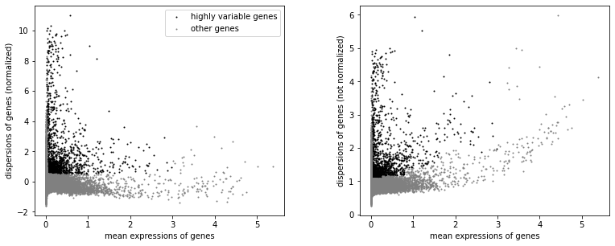
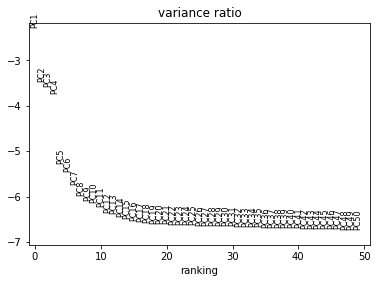
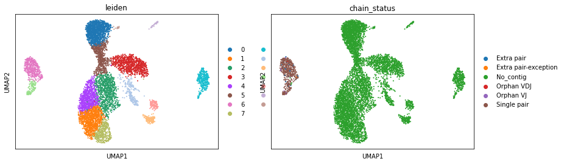
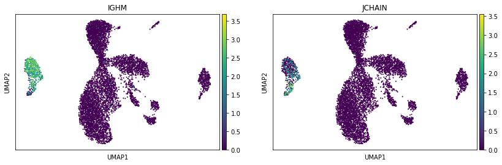

Reading 10X Cell Ranger output directly
=======================================

.. figure:: img/dandelion_logo_illustration.png
   :alt: dandelion_logo

   dandelion_logo

If for whatever reason you’ve decided to skip the
reannotation/preprocessing, you can read the files directly from the
Cell Ranger output folder with ``Dandelion``\ ’s ``ddl.read_10x_vdj``,
which accepts the ``*_contig_annotations.csv`` or
``all_contig_annotations.json`` file(s) as input. If reading with the
``.csv`` file, and the ``.fasta`` file and/or ``.json`` file(s) are in
the same folder, ``ddl.read_10x_vdj`` will try to extract additional
information not found in the ``.csv`` file e.g. contig sequences.

From **Cell Ranger V4** onwards, there is also an
``airr_rearrangement.tsv`` file that can be used directly with
``Dandelion``. However, doing so will miss out on the reannotation steps
but that is entirely up to you.

We will download the *airr_rearrangement.tsv* file from here:

.. code:: bash

   # bash
   wget https://cf.10xgenomics.com/samples/cell-vdj/4.0.0/sc5p_v2_hs_PBMC_10k/sc5p_v2_hs_PBMC_10k_b_filtered_contig_annotations.csv
   wget https://cf.10xgenomics.com/samples/cell-vdj/4.0.0/sc5p_v2_hs_PBMC_10k/sc5p_v2_hs_PBMC_10k_b_filtered_contig.fasta
   # wget https://cf.10xgenomics.com/samples/cell-vdj/4.0.0/sc5p_v2_hs_PBMC_10k/sc5p_v2_hs_PBMC_10k_b_all_contig_annotations.json
   wget https://cf.10xgenomics.com/samples/cell-vdj/4.0.0/sc5p_v2_hs_PBMC_10k/sc5p_v2_hs_PBMC_10k_b_airr_rearrangement.tsv

**Import dandelion module**

.. code:: ipython3

    import os
    import dandelion as ddl
    # change directory to somewhere more workable
    os.chdir(os.path.expanduser('/Users/kt16/Downloads/dandelion_tutorial/'))
    ddl.logging.print_versions()

.. parsed-literal::

    dandelion==0.2.4.dev57 pandas==1.4.2 numpy==1.21.6 matplotlib==3.5.2 networkx==2.8.4 scipy==1.8.1

With ``ddl.read_10x_vdj``:

.. code:: ipython3

    folder_location = 'sc5p_v2_hs_PBMC_10k'
    # or file_location = 'sc5p_v2_hs_PBMC_10k/'
    vdj = ddl.read_10x_vdj(folder_location, filename_prefix='sc5p_v2_hs_PBMC_10k_b_filtered', verbose = True)
    vdj

.. parsed-literal::

    Dandelion class object with n_obs = 994 and n_contigs = 2601
        data: 'cell_id', 'is_cell_10x', 'sequence_id', 'high_confidence_10x', 'sequence_length_10x', 'locus', 'v_call', 'd_call', 'j_call', 'c_call', 'complete_vdj', 'productive', 'junction_aa', 'junction', 'consensus_count', 'duplicate_count', 'clone_id', 'raw_consensus_id_10x', 'sequence', 'rearrangement_status'
        metadata: 'clone_id', 'clone_id_by_size', 'locus_VDJ', 'locus_VJ', 'productive_VDJ', 'productive_VJ', 'v_call_VDJ', 'd_call_VDJ', 'j_call_VDJ', 'v_call_VJ', 'j_call_VJ', 'c_call_VDJ', 'c_call_VJ', 'junction_VDJ', 'junction_VJ', 'junction_aa_VDJ', 'junction_aa_VJ', 'v_call_B_VDJ', 'd_call_B_VDJ', 'j_call_B_VDJ', 'v_call_B_VJ', 'j_call_B_VJ', 'productive_B_VDJ', 'productive_B_VJ', 'duplicate_count_B_VDJ', 'duplicate_count_B_VJ', 'isotype', 'isotype_status', 'locus_status', 'chain_status', 'rearrangement_status_VDJ', 'rearrangement_status_VJ'

With ``ddl.read_10x_airr``:

.. code:: ipython3

    # read in the airr_rearrangement.tsv file
    file_location = 'sc5p_v2_hs_PBMC_10k/sc5p_v2_hs_PBMC_10k_b_airr_rearrangement.tsv'
    vdj = ddl.read_10x_airr(file_location)
    vdj

.. parsed-literal::

    Dandelion class object with n_obs = 994 and n_contigs = 2093
        data: 'cell_id', 'sequence_id', 'sequence', 'sequence_aa', 'productive', 'rev_comp', 'v_call', 'v_cigar', 'd_call', 'd_cigar', 'j_call', 'j_cigar', 'c_call', 'c_cigar', 'sequence_alignment', 'germline_alignment', 'junction', 'junction_aa', 'junction_length', 'junction_aa_length', 'v_sequence_start', 'v_sequence_end', 'd_sequence_start', 'd_sequence_end', 'j_sequence_start', 'j_sequence_end', 'c_sequence_start', 'c_sequence_end', 'consensus_count', 'duplicate_count', 'is_cell', 'locus', 'rearrangement_status'
        metadata: 'locus_VDJ', 'locus_VJ', 'productive_VDJ', 'productive_VJ', 'v_call_VDJ', 'd_call_VDJ', 'j_call_VDJ', 'v_call_VJ', 'j_call_VJ', 'c_call_VDJ', 'c_call_VJ', 'junction_VDJ', 'junction_VJ', 'junction_aa_VDJ', 'junction_aa_VJ', 'v_call_B_VDJ', 'd_call_B_VDJ', 'j_call_B_VDJ', 'v_call_B_VJ', 'j_call_B_VJ', 'productive_B_VDJ', 'productive_B_VJ', 'duplicate_count_B_VDJ', 'duplicate_count_B_VJ', 'isotype', 'isotype_status', 'locus_status', 'chain_status', 'rearrangement_status_VDJ', 'rearrangement_status_VJ'

We will continue with the rest of the filtering part of the analysis to
show how it slots smoothly with the rest of the workflow.

**Import modules for use with scanpy**

.. code:: ipython3

    import pandas as pd
    import numpy as np
    import scanpy as sc
    import warnings
    import functools
    import seaborn as sns
    import scipy.stats
    import anndata
    
    warnings.filterwarnings('ignore')
    sc.logging.print_header()

.. parsed-literal::

    scanpy==1.9.1 anndata==0.8.0 umap==0.5.3 numpy==1.21.6 scipy==1.8.1 pandas==1.4.2 scikit-learn==1.1.1 statsmodels==0.13.2 python-igraph==0.9.11 pynndescent==0.5.7

**Import the transcriptome data**

.. code:: ipython3

    adata = sc.read_10x_h5('sc5p_v2_hs_PBMC_10k/filtered_feature_bc_matrix.h5', gex_only=True)
    adata.obs['sample_id'] = 'sc5p_v2_hs_PBMC_10k'
    adata.var_names_make_unique()
    adata

.. parsed-literal::

    AnnData object with n_obs × n_vars = 10553 × 36601
        obs: 'sample_id'
        var: 'gene_ids', 'feature_types', 'genome'

Run QC on the transcriptome data.

.. code:: ipython3

    ddl.pp.recipe_scanpy_qc(adata)
    adata

.. parsed-literal::

    AnnData object with n_obs × n_vars = 10553 × 36601
        obs: 'sample_id', 'scrublet_score', 'n_genes', 'n_genes_by_counts', 'total_counts', 'total_counts_mt', 'pct_counts_mt', 'is_doublet', 'filter_rna'
        var: 'gene_ids', 'feature_types', 'genome'

Run the filtering of bcr data. Note that I’m using the ``Dandelion``
object as input rather than the pandas dataframe (yes both types of
input will works. In fact, a file path to the .tsv will work too).

.. code:: ipython3

    # The function will return both objects. 
    vdj, adata = ddl.pp.check_contigs(vdj, adata)

.. parsed-literal::

    Scanning for poor quality/ambiguous contigs: 100%|██████████| 994/994 [00:04<00:00, 242.73it/s]                                                  

**Check the output V(D)J table**

The vdj table is returned as a ``Dandelion`` class object in the
``.data`` slot; if a file was provided for ``filter_bcr`` above, a new
file will be created in the same folder with the ``filtered`` prefix.
Note that this V(D)J table is indexed based on contigs (sequence_id).

.. code:: ipython3

    vdj

.. parsed-literal::

    Dandelion class object with n_obs = 984 and n_contigs = 2073
        data: 'cell_id', 'sequence_id', 'sequence', 'sequence_aa', 'productive', 'rev_comp', 'v_call', 'v_cigar', 'd_call', 'd_cigar', 'j_call', 'j_cigar', 'c_call', 'c_cigar', 'sequence_alignment', 'germline_alignment', 'junction', 'junction_aa', 'junction_length', 'junction_aa_length', 'v_sequence_start', 'v_sequence_end', 'd_sequence_start', 'd_sequence_end', 'j_sequence_start', 'j_sequence_end', 'c_sequence_start', 'c_sequence_end', 'consensus_count', 'duplicate_count', 'is_cell', 'locus', 'rearrangement_status', 'ambiguous'
        metadata: 'locus_VDJ', 'locus_VJ', 'productive_VDJ', 'productive_VJ', 'v_call_VDJ', 'd_call_VDJ', 'j_call_VDJ', 'v_call_VJ', 'j_call_VJ', 'c_call_VDJ', 'c_call_VJ', 'junction_VDJ', 'junction_VJ', 'junction_aa_VDJ', 'junction_aa_VJ', 'v_call_B_VDJ', 'd_call_B_VDJ', 'j_call_B_VDJ', 'v_call_B_VJ', 'j_call_B_VJ', 'productive_B_VDJ', 'productive_B_VJ', 'duplicate_count_B_VDJ', 'duplicate_count_B_VJ', 'isotype', 'isotype_status', 'locus_status', 'chain_status', 'rearrangement_status_VDJ', 'rearrangement_status_VJ'

**Check the AnnData object as well**

And the ``AnnData`` object is indexed based on cells.

.. code:: ipython3

    adata

.. parsed-literal::

    AnnData object with n_obs × n_vars = 10553 × 36601
        obs: 'sample_id', 'scrublet_score', 'n_genes', 'n_genes_by_counts', 'total_counts', 'total_counts_mt', 'pct_counts_mt', 'is_doublet', 'filter_rna', 'has_contig', 'locus_VDJ', 'locus_VJ', 'productive_VDJ', 'productive_VJ', 'v_call_VDJ', 'd_call_VDJ', 'j_call_VDJ', 'v_call_VJ', 'j_call_VJ', 'c_call_VDJ', 'c_call_VJ', 'junction_VDJ', 'junction_VJ', 'junction_aa_VDJ', 'junction_aa_VJ', 'v_call_B_VDJ', 'd_call_B_VDJ', 'j_call_B_VDJ', 'v_call_B_VJ', 'j_call_B_VJ', 'productive_B_VDJ', 'productive_B_VJ', 'duplicate_count_B_VDJ', 'duplicate_count_B_VJ', 'isotype', 'isotype_status', 'locus_status', 'chain_status', 'rearrangement_status_VDJ', 'rearrangement_status_VJ'
        var: 'gene_ids', 'feature_types', 'genome'

**The number of cells that actually has a matching BCR can be
tabluated.**

.. code:: ipython3

    pd.crosstab(adata.obs['has_contig'], adata.obs['chain_status'])

.. raw:: html

    

    
    <table border="1" class="dataframe">
      <thead>
        <tr style="text-align: right;">
          <th>chain_status</th>
          <th>Extra pair</th>
          <th>Extra pair-exception</th>
          <th>No_contig</th>
          <th>Orphan VDJ</th>
          <th>Orphan VJ</th>
          <th>Single pair</th>
        </tr>
        <tr>
          <th>has_contig</th>
          <th></th>
          <th></th>
          <th></th>
          <th></th>
          <th></th>
          <th></th>
        </tr>
      </thead>
      <tbody>
        <tr>
          <th>No_contig</th>
          <td>0</td>
          <td>0</td>
          <td>9569</td>
          <td>0</td>
          <td>0</td>
          <td>0</td>
        </tr>
        <tr>
          <th>True</th>
          <td>57</td>
          <td>2</td>
          <td>0</td>
          <td>5</td>
          <td>39</td>
          <td>881</td>
        </tr>
      </tbody>
    </table>
    

**Now actually filter the AnnData object and run through a standard
workflow starting by filtering genes and normalizing the data**

Because the ‘filtered’ ``AnnData`` object was returned as a filtered but
otherwise unprocessed object, we still need to normalize and run through
the usual process here. The following is just a standard scanpy
workflow.

.. code:: ipython3

    adata = adata[adata.obs['filter_rna'] == 'False'] # from ddl.pp.recipe_scanpy_qc
    # filter genes
    sc.pp.filter_genes(adata, min_cells=3)
    # Normalize the counts
    sc.pp.normalize_total(adata, target_sum=1e4)
    # Logarithmize the data
    sc.pp.log1p(adata)
    # Stash the normalised counts
    adata.raw = adata

**Identify highly-variable genes**

.. code:: ipython3

    sc.pp.highly_variable_genes(adata, min_mean=0.0125, max_mean=3, min_disp=0.5)
    sc.pl.highly_variable_genes(adata)

**Filter the genes to only those marked as highly-variable**

.. code:: ipython3

    adata = adata[:, adata.var.highly_variable]

**Regress out effects of total counts per cell and the percentage of
mitochondrial genes expressed. Scale the data to unit variance.**

.. code:: ipython3

    sc.pp.regress_out(adata, ['total_counts', 'pct_counts_mt'])
    sc.pp.scale(adata, max_value=10)

**Run PCA**

.. code:: ipython3

    sc.tl.pca(adata, svd_solver='arpack')
    sc.pl.pca_variance_ratio(adata, log=True, n_pcs = 50)

**Computing the neighborhood graph, umap and clusters**

.. code:: ipython3

    # Computing the neighborhood graph
    sc.pp.neighbors(adata)
    # Embedding the neighborhood graph
    sc.tl.umap(adata)
    # Clustering the neighborhood graph
    sc.tl.leiden(adata)

**Visualizing the clusters and whether or not there’s a corresponding
BCR**

.. code:: ipython3

    sc.pl.umap(adata, color=['leiden', 'chain_status'])

**Visualizing some B cell genes**

.. code:: ipython3

    sc.pl.umap(adata, color=['IGHM', 'JCHAIN'])

**Save AnnData**

We can save this ``AnnData`` object for now.

.. code:: ipython3

    adata.write('adata2.h5ad', compression = 'gzip')

**Save dandelion**

To save the vdj object, we have two options - either save the ``.data``
and ``.metadata`` slots with pandas’ functions:

.. code:: ipython3

    vdj.data.to_csv('filtered_vdj_table2.tsv', sep = '\t')

.. code:: ipython3

    vdj.write_h5ddl('dandelion_results2.h5ddl', complib = 'bzip2')

