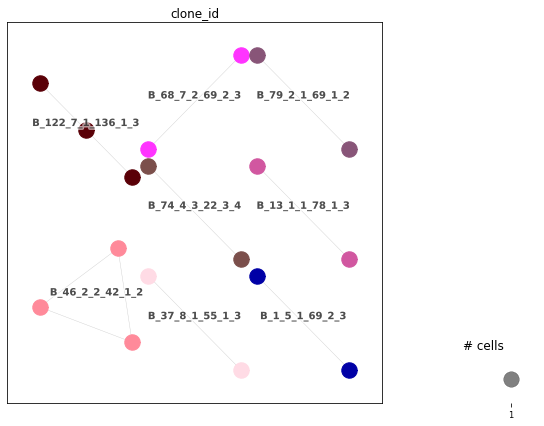
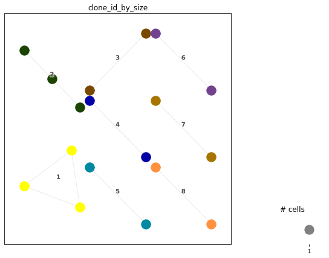
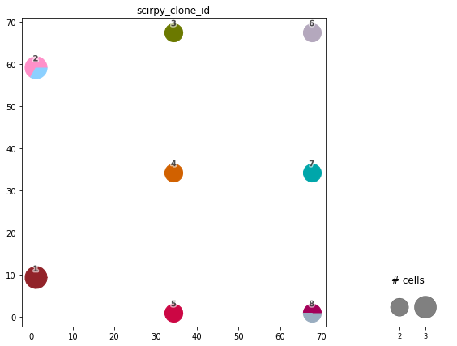

Interoperability with ``scirpy``
================================

.. figure:: img/dandelion_logo_illustration.png
   :alt: dandelion_logo

   dandelion_logo

It is now possible to convert the file formats between
``dandelion>=0.1.1`` and ``scirpy>=0.6.2``
`[Sturm2020] <https://academic.oup.com/bioinformatics/article/36/18/4817/5866543>`__
to enhance the collaboration between the analysis toolkits.

We will download the *airr_rearrangement.tsv* file from here:

.. code:: bash

   # bash
   wget https://cf.10xgenomics.com/samples/cell-vdj/4.0.0/sc5p_v2_hs_PBMC_10k/sc5p_v2_hs_PBMC_10k_b_airr_rearrangement.tsv

**Import dandelion module**

.. code:: ipython3

    import os
    import dandelion as ddl
    # change directory to somewhere more workable
    os.chdir(os.path.expanduser('/Users/kt16/Downloads/dandelion_tutorial/'))
    ddl.logging.print_versions()

.. parsed-literal::

    dandelion==0.2.4.dev57 pandas==1.4.2 numpy==1.21.6 matplotlib==3.5.2 networkx==2.8.4 scipy==1.8.1

.. code:: ipython3

    import scirpy as ir
    ir.__version__

.. parsed-literal::

    '0.10.2.dev28+g2c5b99e'

``dandelion``
-------------

.. code:: ipython3

    # read in the airr_rearrangement.tsv file
    file_location = 'sc5p_v2_hs_PBMC_10k/sc5p_v2_hs_PBMC_10k_b_airr_rearrangement.tsv'
    vdj = ddl.read_10x_airr(file_location)
    vdj

.. parsed-literal::

    Dandelion class object with n_obs = 994 and n_contigs = 2093
        data: 'cell_id', 'sequence_id', 'sequence', 'sequence_aa', 'productive', 'rev_comp', 'v_call', 'v_cigar', 'd_call', 'd_cigar', 'j_call', 'j_cigar', 'c_call', 'c_cigar', 'sequence_alignment', 'germline_alignment', 'junction', 'junction_aa', 'junction_length', 'junction_aa_length', 'v_sequence_start', 'v_sequence_end', 'd_sequence_start', 'd_sequence_end', 'j_sequence_start', 'j_sequence_end', 'c_sequence_start', 'c_sequence_end', 'consensus_count', 'duplicate_count', 'is_cell', 'locus', 'rearrangement_status'
        metadata: 'locus_VDJ', 'locus_VJ', 'productive_VDJ', 'productive_VJ', 'v_call_VDJ', 'd_call_VDJ', 'j_call_VDJ', 'v_call_VJ', 'j_call_VJ', 'c_call_VDJ', 'c_call_VJ', 'junction_VDJ', 'junction_VJ', 'junction_aa_VDJ', 'junction_aa_VJ', 'v_call_B_VDJ', 'd_call_B_VDJ', 'j_call_B_VDJ', 'v_call_B_VJ', 'j_call_B_VJ', 'productive_B_VDJ', 'productive_B_VJ', 'duplicate_count_B_VDJ', 'duplicate_count_B_VJ', 'isotype', 'isotype_status', 'locus_status', 'chain_status', 'rearrangement_status_VDJ', 'rearrangement_status_VJ'

The test file contains a blank ``clone_id`` column so we run
``find_clones`` to populate it first.

.. code:: ipython3

    ddl.tl.find_clones(vdj)

.. parsed-literal::

    Finding clones based on B cell VDJ chains : 100%|██████████| 157/157 [00:00<00:00, 2160.72it/s]                                                  
    Refining clone assignment based on VJ chain pairing : 100%|██████████| 978/978 [00:00<00:00, 245058.21it/s]                                      

``ddl.to_scirpy`` : Converting ``dandelion`` to ``scirpy``
~~~~~~~~~~~~~~~~~~~~~~~~~~~~~~~~~~~~~~~~~~~~~~~~~~~~~~~~~~

.. code:: ipython3

    irdata = ddl.to_scirpy(vdj)
    irdata

.. parsed-literal::

    /Users/kt16/Documents/Github/scirpy/scirpy/io/_convert_anndata.py:81: FutureWarning: X.dtype being converted to np.float32 from float64. In the next version of anndata (0.9) conversion will not be automatic. Pass dtype explicitly to avoid this warning. Pass `AnnData(X, dtype=X.dtype, ...)` to get the future behavour.

.. parsed-literal::

    AnnData object with n_obs × n_vars = 994 × 0
        obs: 'multi_chain', 'extra_chains', 'IR_VJ_1_c_call', 'IR_VJ_2_c_call', 'IR_VDJ_1_c_call', 'IR_VDJ_2_c_call', 'IR_VJ_1_consensus_count', 'IR_VJ_2_consensus_count', 'IR_VDJ_1_consensus_count', 'IR_VDJ_2_consensus_count', 'IR_VJ_1_d_call', 'IR_VJ_2_d_call', 'IR_VDJ_1_d_call', 'IR_VDJ_2_d_call', 'IR_VJ_1_duplicate_count', 'IR_VJ_2_duplicate_count', 'IR_VDJ_1_duplicate_count', 'IR_VDJ_2_duplicate_count', 'IR_VJ_1_j_call', 'IR_VJ_2_j_call', 'IR_VDJ_1_j_call', 'IR_VDJ_2_j_call', 'IR_VJ_1_junction', 'IR_VJ_2_junction', 'IR_VDJ_1_junction', 'IR_VDJ_2_junction', 'IR_VJ_1_junction_aa', 'IR_VJ_2_junction_aa', 'IR_VDJ_1_junction_aa', 'IR_VDJ_2_junction_aa', 'IR_VJ_1_locus', 'IR_VJ_2_locus', 'IR_VDJ_1_locus', 'IR_VDJ_2_locus', 'IR_VJ_1_productive', 'IR_VJ_2_productive', 'IR_VDJ_1_productive', 'IR_VDJ_2_productive', 'IR_VJ_1_v_call', 'IR_VJ_2_v_call', 'IR_VDJ_1_v_call', 'IR_VDJ_2_v_call', 'has_ir'
        uns: 'scirpy_version'

to transfer every column found in a dandelion airr object (including
things like ``germline_alignment_d_mask``) do:

.. code:: ipython3

    irdata = ddl.to_scirpy(vdj, include_fields = vdj.data.columns)
    irdata

.. parsed-literal::

    /Users/kt16/Documents/Github/scirpy/scirpy/io/_convert_anndata.py:81: FutureWarning: X.dtype being converted to np.float32 from float64. In the next version of anndata (0.9) conversion will not be automatic. Pass dtype explicitly to avoid this warning. Pass `AnnData(X, dtype=X.dtype, ...)` to get the future behavour.

.. parsed-literal::

    AnnData object with n_obs × n_vars = 994 × 0
        obs: 'is_cell', 'multi_chain', 'extra_chains', 'IR_VJ_1_c_call', 'IR_VJ_2_c_call', 'IR_VDJ_1_c_call', 'IR_VDJ_2_c_call', 'IR_VJ_1_c_cigar', 'IR_VJ_2_c_cigar', 'IR_VDJ_1_c_cigar', 'IR_VDJ_2_c_cigar', 'IR_VJ_1_c_sequence_end', 'IR_VJ_2_c_sequence_end', 'IR_VDJ_1_c_sequence_end', 'IR_VDJ_2_c_sequence_end', 'IR_VJ_1_c_sequence_start', 'IR_VJ_2_c_sequence_start', 'IR_VDJ_1_c_sequence_start', 'IR_VDJ_2_c_sequence_start', 'IR_VJ_1_clone_id', 'IR_VJ_2_clone_id', 'IR_VDJ_1_clone_id', 'IR_VDJ_2_clone_id', 'IR_VJ_1_consensus_count', 'IR_VJ_2_consensus_count', 'IR_VDJ_1_consensus_count', 'IR_VDJ_2_consensus_count', 'IR_VJ_1_d_call', 'IR_VJ_2_d_call', 'IR_VDJ_1_d_call', 'IR_VDJ_2_d_call', 'IR_VJ_1_d_cigar', 'IR_VJ_2_d_cigar', 'IR_VDJ_1_d_cigar', 'IR_VDJ_2_d_cigar', 'IR_VJ_1_d_sequence_end', 'IR_VJ_2_d_sequence_end', 'IR_VDJ_1_d_sequence_end', 'IR_VDJ_2_d_sequence_end', 'IR_VJ_1_d_sequence_start', 'IR_VJ_2_d_sequence_start', 'IR_VDJ_1_d_sequence_start', 'IR_VDJ_2_d_sequence_start', 'IR_VJ_1_duplicate_count', 'IR_VJ_2_duplicate_count', 'IR_VDJ_1_duplicate_count', 'IR_VDJ_2_duplicate_count', 'IR_VJ_1_germline_alignment', 'IR_VJ_2_germline_alignment', 'IR_VDJ_1_germline_alignment', 'IR_VDJ_2_germline_alignment', 'IR_VJ_1_j_call', 'IR_VJ_2_j_call', 'IR_VDJ_1_j_call', 'IR_VDJ_2_j_call', 'IR_VJ_1_j_cigar', 'IR_VJ_2_j_cigar', 'IR_VDJ_1_j_cigar', 'IR_VDJ_2_j_cigar', 'IR_VJ_1_j_sequence_end', 'IR_VJ_2_j_sequence_end', 'IR_VDJ_1_j_sequence_end', 'IR_VDJ_2_j_sequence_end', 'IR_VJ_1_j_sequence_start', 'IR_VJ_2_j_sequence_start', 'IR_VDJ_1_j_sequence_start', 'IR_VDJ_2_j_sequence_start', 'IR_VJ_1_junction', 'IR_VJ_2_junction', 'IR_VDJ_1_junction', 'IR_VDJ_2_junction', 'IR_VJ_1_junction_aa', 'IR_VJ_2_junction_aa', 'IR_VDJ_1_junction_aa', 'IR_VDJ_2_junction_aa', 'IR_VJ_1_junction_aa_length', 'IR_VJ_2_junction_aa_length', 'IR_VDJ_1_junction_aa_length', 'IR_VDJ_2_junction_aa_length', 'IR_VJ_1_junction_length', 'IR_VJ_2_junction_length', 'IR_VDJ_1_junction_length', 'IR_VDJ_2_junction_length', 'IR_VJ_1_locus', 'IR_VJ_2_locus', 'IR_VDJ_1_locus', 'IR_VDJ_2_locus', 'IR_VJ_1_productive', 'IR_VJ_2_productive', 'IR_VDJ_1_productive', 'IR_VDJ_2_productive', 'IR_VJ_1_rearrangement_status', 'IR_VJ_2_rearrangement_status', 'IR_VDJ_1_rearrangement_status', 'IR_VDJ_2_rearrangement_status', 'IR_VJ_1_rev_comp', 'IR_VJ_2_rev_comp', 'IR_VDJ_1_rev_comp', 'IR_VDJ_2_rev_comp', 'IR_VJ_1_sequence', 'IR_VJ_2_sequence', 'IR_VDJ_1_sequence', 'IR_VDJ_2_sequence', 'IR_VJ_1_sequence_aa', 'IR_VJ_2_sequence_aa', 'IR_VDJ_1_sequence_aa', 'IR_VDJ_2_sequence_aa', 'IR_VJ_1_sequence_alignment', 'IR_VJ_2_sequence_alignment', 'IR_VDJ_1_sequence_alignment', 'IR_VDJ_2_sequence_alignment', 'IR_VJ_1_sequence_id', 'IR_VJ_2_sequence_id', 'IR_VDJ_1_sequence_id', 'IR_VDJ_2_sequence_id', 'IR_VJ_1_v_call', 'IR_VJ_2_v_call', 'IR_VDJ_1_v_call', 'IR_VDJ_2_v_call', 'IR_VJ_1_v_cigar', 'IR_VJ_2_v_cigar', 'IR_VDJ_1_v_cigar', 'IR_VDJ_2_v_cigar', 'IR_VJ_1_v_sequence_end', 'IR_VJ_2_v_sequence_end', 'IR_VDJ_1_v_sequence_end', 'IR_VDJ_2_v_sequence_end', 'IR_VJ_1_v_sequence_start', 'IR_VJ_2_v_sequence_start', 'IR_VDJ_1_v_sequence_start', 'IR_VDJ_2_v_sequence_start', 'has_ir'
        uns: 'scirpy_version'

The ``clone_id`` is mapped to ``IR_VJ_1_clone_id`` column.

``transfer = True`` will perform dandelion’s ``tl.transfer``.

.. code:: ipython3

    irdatax = ddl.to_scirpy(vdj, transfer = True)
    irdatax

.. parsed-literal::

    /Users/kt16/Documents/Github/scirpy/scirpy/io/_convert_anndata.py:81: FutureWarning: X.dtype being converted to np.float32 from float64. In the next version of anndata (0.9) conversion will not be automatic. Pass dtype explicitly to avoid this warning. Pass `AnnData(X, dtype=X.dtype, ...)` to get the future behavour.

.. parsed-literal::

    AnnData object with n_obs × n_vars = 994 × 0
        obs: 'multi_chain', 'extra_chains', 'IR_VJ_1_c_call', 'IR_VJ_2_c_call', 'IR_VDJ_1_c_call', 'IR_VDJ_2_c_call', 'IR_VJ_1_consensus_count', 'IR_VJ_2_consensus_count', 'IR_VDJ_1_consensus_count', 'IR_VDJ_2_consensus_count', 'IR_VJ_1_d_call', 'IR_VJ_2_d_call', 'IR_VDJ_1_d_call', 'IR_VDJ_2_d_call', 'IR_VJ_1_duplicate_count', 'IR_VJ_2_duplicate_count', 'IR_VDJ_1_duplicate_count', 'IR_VDJ_2_duplicate_count', 'IR_VJ_1_j_call', 'IR_VJ_2_j_call', 'IR_VDJ_1_j_call', 'IR_VDJ_2_j_call', 'IR_VJ_1_junction', 'IR_VJ_2_junction', 'IR_VDJ_1_junction', 'IR_VDJ_2_junction', 'IR_VJ_1_junction_aa', 'IR_VJ_2_junction_aa', 'IR_VDJ_1_junction_aa', 'IR_VDJ_2_junction_aa', 'IR_VJ_1_locus', 'IR_VJ_2_locus', 'IR_VDJ_1_locus', 'IR_VDJ_2_locus', 'IR_VJ_1_productive', 'IR_VJ_2_productive', 'IR_VDJ_1_productive', 'IR_VDJ_2_productive', 'IR_VJ_1_v_call', 'IR_VJ_2_v_call', 'IR_VDJ_1_v_call', 'IR_VDJ_2_v_call', 'has_ir', 'clone_id', 'clone_id_by_size', 'locus_VDJ', 'locus_VJ', 'productive_VDJ', 'productive_VJ', 'v_call_VDJ', 'd_call_VDJ', 'j_call_VDJ', 'v_call_VJ', 'j_call_VJ', 'c_call_VDJ', 'c_call_VJ', 'junction_VDJ', 'junction_VJ', 'junction_aa_VDJ', 'junction_aa_VJ', 'v_call_B_VDJ', 'd_call_B_VDJ', 'j_call_B_VDJ', 'v_call_B_VJ', 'j_call_B_VJ', 'productive_B_VDJ', 'productive_B_VJ', 'duplicate_count_B_VDJ', 'duplicate_count_B_VJ', 'isotype', 'isotype_status', 'locus_status', 'chain_status', 'rearrangement_status_VDJ', 'rearrangement_status_VJ'
        uns: 'scirpy_version'

``ddl.from_scirpy`` : Converting ``scirpy`` to ``dandelion``
~~~~~~~~~~~~~~~~~~~~~~~~~~~~~~~~~~~~~~~~~~~~~~~~~~~~~~~~~~~~

.. code:: ipython3

    vdjx = ddl.from_scirpy(irdata)
    vdjx

.. parsed-literal::

    Dandelion class object with n_obs = 994 and n_contigs = 2093
        data: 'sequence_id', 'sequence', 'rev_comp', 'productive', 'v_call', 'd_call', 'j_call', 'sequence_alignment', 'germline_alignment', 'junction', 'junction_aa', 'v_cigar', 'd_cigar', 'j_cigar', 'c_call', 'c_cigar', 'c_sequence_end', 'c_sequence_start', 'clone_id', 'consensus_count', 'd_sequence_end', 'd_sequence_start', 'duplicate_count', 'j_sequence_end', 'j_sequence_start', 'junction_aa_length', 'junction_length', 'locus', 'rearrangement_status', 'sequence_aa', 'v_sequence_end', 'v_sequence_start', 'cell_id', 'multi_chain', 'is_cell'
        metadata: 'clone_id', 'clone_id_by_size', 'locus_VDJ', 'locus_VJ', 'productive_VDJ', 'productive_VJ', 'v_call_VDJ', 'd_call_VDJ', 'j_call_VDJ', 'v_call_VJ', 'j_call_VJ', 'c_call_VDJ', 'c_call_VJ', 'junction_VDJ', 'junction_VJ', 'junction_aa_VDJ', 'junction_aa_VJ', 'v_call_B_VDJ', 'd_call_B_VDJ', 'j_call_B_VDJ', 'v_call_B_VJ', 'j_call_B_VJ', 'productive_B_VDJ', 'productive_B_VJ', 'duplicate_count_B_VDJ', 'duplicate_count_B_VJ', 'isotype', 'isotype_status', 'locus_status', 'chain_status', 'rearrangement_status_VDJ', 'rearrangement_status_VJ'

.. code:: ipython3

    vdjx.metadata

.. raw:: html

    

    
    <table border="1" class="dataframe">
      <thead>
        <tr style="text-align: right;">
          <th></th>
          <th>clone_id</th>
          <th>clone_id_by_size</th>
          <th>locus_VDJ</th>
          <th>locus_VJ</th>
          <th>productive_VDJ</th>
          <th>productive_VJ</th>
          <th>v_call_VDJ</th>
          <th>d_call_VDJ</th>
          <th>j_call_VDJ</th>
          <th>v_call_VJ</th>
          <th>...</th>
          <th>productive_B_VDJ</th>
          <th>productive_B_VJ</th>
          <th>duplicate_count_B_VDJ</th>
          <th>duplicate_count_B_VJ</th>
          <th>isotype</th>
          <th>isotype_status</th>
          <th>locus_status</th>
          <th>chain_status</th>
          <th>rearrangement_status_VDJ</th>
          <th>rearrangement_status_VJ</th>
        </tr>
      </thead>
      <tbody>
        <tr>
          <th>AAACCTGTCATATCGG-1</th>
          <td>None</td>
          <td>None</td>
          <td>None</td>
          <td>IGK</td>
          <td>None</td>
          <td>True</td>
          <td>None</td>
          <td>None</td>
          <td>None</td>
          <td>IGKV1-8</td>
          <td>...</td>
          <td>None</td>
          <td>True</td>
          <td>NaN</td>
          <td>68.0</td>
          <td>None</td>
          <td>None</td>
          <td>Orphan IGK</td>
          <td>Orphan VJ</td>
          <td>None</td>
          <td>standard</td>
        </tr>
        <tr>
          <th>AAACCTGTCCGTTGTC-1</th>
          <td>B_40_3_1_79_2_1</td>
          <td>949</td>
          <td>IGH</td>
          <td>IGK</td>
          <td>True</td>
          <td>True</td>
          <td>IGHV1-69D</td>
          <td>IGHD3-22</td>
          <td>IGHJ3</td>
          <td>IGKV1-8</td>
          <td>...</td>
          <td>True</td>
          <td>True</td>
          <td>51.0</td>
          <td>43.0</td>
          <td>IgM</td>
          <td>IgM</td>
          <td>IGH + IGK</td>
          <td>Single pair</td>
          <td>standard</td>
          <td>standard</td>
        </tr>
        <tr>
          <th>AAACCTGTCGAGAACG-1</th>
          <td>B_51_4_1_60_1_1</td>
          <td>766</td>
          <td>IGH</td>
          <td>IGL</td>
          <td>True</td>
          <td>True</td>
          <td>IGHV1-2</td>
          <td>None</td>
          <td>IGHJ3</td>
          <td>IGLV5-45</td>
          <td>...</td>
          <td>True</td>
          <td>True</td>
          <td>47.0</td>
          <td>90.0</td>
          <td>IgM</td>
          <td>IgM</td>
          <td>IGH + IGL</td>
          <td>Single pair</td>
          <td>standard</td>
          <td>standard</td>
        </tr>
        <tr>
          <th>AAACCTGTCTTGAGAC-1</th>
          <td>B_110_1_1_20_1_1</td>
          <td>765</td>
          <td>IGH</td>
          <td>IGK</td>
          <td>True</td>
          <td>True</td>
          <td>IGHV5-51</td>
          <td>None</td>
          <td>IGHJ3</td>
          <td>IGKV1D-8</td>
          <td>...</td>
          <td>True</td>
          <td>True</td>
          <td>80.0</td>
          <td>22.0</td>
          <td>IgM</td>
          <td>IgM</td>
          <td>IGH + IGK</td>
          <td>Single pair</td>
          <td>standard</td>
          <td>standard</td>
        </tr>
        <tr>
          <th>AAACGGGAGCGACGTA-1</th>
          <td>B_79_1_1_48_2_3</td>
          <td>764</td>
          <td>IGH</td>
          <td>IGL</td>
          <td>True</td>
          <td>True</td>
          <td>IGHV4-59</td>
          <td>None</td>
          <td>IGHJ3</td>
          <td>IGLV3-19</td>
          <td>...</td>
          <td>True</td>
          <td>True</td>
          <td>18.0</td>
          <td>14.0</td>
          <td>IgM</td>
          <td>IgM</td>
          <td>IGH + IGL</td>
          <td>Single pair</td>
          <td>standard</td>
          <td>standard</td>
        </tr>
        <tr>
          <th>...</th>
          <td>...</td>
          <td>...</td>
          <td>...</td>
          <td>...</td>
          <td>...</td>
          <td>...</td>
          <td>...</td>
          <td>...</td>
          <td>...</td>
          <td>...</td>
          <td>...</td>
          <td>...</td>
          <td>...</td>
          <td>...</td>
          <td>...</td>
          <td>...</td>
          <td>...</td>
          <td>...</td>
          <td>...</td>
          <td>...</td>
          <td>...</td>
        </tr>
        <tr>
          <th>TTTGCGCTCTAACGGT-1</th>
          <td>B_9_3_1_117_1_1</td>
          <td>383</td>
          <td>IGH</td>
          <td>IGL</td>
          <td>True</td>
          <td>True</td>
          <td>IGHV3-43</td>
          <td>None</td>
          <td>IGHJ6</td>
          <td>IGLV2-8</td>
          <td>...</td>
          <td>True</td>
          <td>True</td>
          <td>46.0</td>
          <td>163.0</td>
          <td>IgM</td>
          <td>IgM</td>
          <td>IGH + IGL</td>
          <td>Single pair</td>
          <td>standard</td>
          <td>standard</td>
        </tr>
        <tr>
          <th>TTTGGTTGTAGCCTAT-1</th>
          <td>B_109_1_1_102_2_1</td>
          <td>382</td>
          <td>IGH</td>
          <td>IGK</td>
          <td>True</td>
          <td>True</td>
          <td>IGHV4-39</td>
          <td>None</td>
          <td>IGHJ2</td>
          <td>IGKV6-21</td>
          <td>...</td>
          <td>True</td>
          <td>True</td>
          <td>5.0</td>
          <td>6.0</td>
          <td>IgM</td>
          <td>IgM</td>
          <td>IGH + IGK</td>
          <td>Single pair</td>
          <td>standard</td>
          <td>standard</td>
        </tr>
        <tr>
          <th>TTTGGTTTCAGAGCTT-1</th>
          <td>B_14_5_1_105_1_1</td>
          <td>381</td>
          <td>IGH</td>
          <td>IGK</td>
          <td>True</td>
          <td>True</td>
          <td>IGHV7-4-1</td>
          <td>IGHD3-10</td>
          <td>IGHJ4</td>
          <td>IGKV3-11</td>
          <td>...</td>
          <td>True</td>
          <td>True</td>
          <td>73.0</td>
          <td>73.0</td>
          <td>IgM</td>
          <td>IgM</td>
          <td>IGH + IGK</td>
          <td>Single pair</td>
          <td>standard</td>
          <td>standard</td>
        </tr>
        <tr>
          <th>TTTGGTTTCAGTGTTG-1</th>
          <td>B_1_1_1_38_2_1</td>
          <td>380</td>
          <td>IGH</td>
          <td>IGL</td>
          <td>True</td>
          <td>True</td>
          <td>IGHV2-5</td>
          <td>None</td>
          <td>IGHJ4</td>
          <td>IGLV2-23</td>
          <td>...</td>
          <td>True</td>
          <td>True</td>
          <td>33.0</td>
          <td>58.0</td>
          <td>IgM</td>
          <td>IgM</td>
          <td>IGH + IGL</td>
          <td>Single pair</td>
          <td>standard</td>
          <td>standard</td>
        </tr>
        <tr>
          <th>TTTGGTTTCGGTGTCG-1</th>
          <td>B_91_1_1_50_3_1</td>
          <td>1138</td>
          <td>IGH</td>
          <td>IGK</td>
          <td>True</td>
          <td>True</td>
          <td>IGHV3-21</td>
          <td>None</td>
          <td>IGHJ2</td>
          <td>IGKV3-11</td>
          <td>...</td>
          <td>True</td>
          <td>True</td>
          <td>12.0</td>
          <td>22.0</td>
          <td>IgM</td>
          <td>IgM</td>
          <td>IGH + IGK</td>
          <td>Single pair</td>
          <td>standard</td>
          <td>standard</td>
        </tr>
      </tbody>
    </table>
    
994 rows × 32 columns

    

``scirpy``
----------

``ir.io.from_dandelion`` : Converting ``dandelion`` to ``scirpy``
~~~~~~~~~~~~~~~~~~~~~~~~~~~~~~~~~~~~~~~~~~~~~~~~~~~~~~~~~~~~~~~~~

.. code:: ipython3

    irdata2 = ir.io.from_dandelion(vdj, include_fields = vdj.data.columns)
    irdata2

.. parsed-literal::

    /Users/kt16/Documents/Github/scirpy/scirpy/io/_convert_anndata.py:81: FutureWarning: X.dtype being converted to np.float32 from float64. In the next version of anndata (0.9) conversion will not be automatic. Pass dtype explicitly to avoid this warning. Pass `AnnData(X, dtype=X.dtype, ...)` to get the future behavour.

.. parsed-literal::

    AnnData object with n_obs × n_vars = 994 × 0
        obs: 'is_cell', 'multi_chain', 'extra_chains', 'IR_VJ_1_c_call', 'IR_VJ_2_c_call', 'IR_VDJ_1_c_call', 'IR_VDJ_2_c_call', 'IR_VJ_1_c_cigar', 'IR_VJ_2_c_cigar', 'IR_VDJ_1_c_cigar', 'IR_VDJ_2_c_cigar', 'IR_VJ_1_c_sequence_end', 'IR_VJ_2_c_sequence_end', 'IR_VDJ_1_c_sequence_end', 'IR_VDJ_2_c_sequence_end', 'IR_VJ_1_c_sequence_start', 'IR_VJ_2_c_sequence_start', 'IR_VDJ_1_c_sequence_start', 'IR_VDJ_2_c_sequence_start', 'IR_VJ_1_clone_id', 'IR_VJ_2_clone_id', 'IR_VDJ_1_clone_id', 'IR_VDJ_2_clone_id', 'IR_VJ_1_consensus_count', 'IR_VJ_2_consensus_count', 'IR_VDJ_1_consensus_count', 'IR_VDJ_2_consensus_count', 'IR_VJ_1_d_call', 'IR_VJ_2_d_call', 'IR_VDJ_1_d_call', 'IR_VDJ_2_d_call', 'IR_VJ_1_d_cigar', 'IR_VJ_2_d_cigar', 'IR_VDJ_1_d_cigar', 'IR_VDJ_2_d_cigar', 'IR_VJ_1_d_sequence_end', 'IR_VJ_2_d_sequence_end', 'IR_VDJ_1_d_sequence_end', 'IR_VDJ_2_d_sequence_end', 'IR_VJ_1_d_sequence_start', 'IR_VJ_2_d_sequence_start', 'IR_VDJ_1_d_sequence_start', 'IR_VDJ_2_d_sequence_start', 'IR_VJ_1_duplicate_count', 'IR_VJ_2_duplicate_count', 'IR_VDJ_1_duplicate_count', 'IR_VDJ_2_duplicate_count', 'IR_VJ_1_germline_alignment', 'IR_VJ_2_germline_alignment', 'IR_VDJ_1_germline_alignment', 'IR_VDJ_2_germline_alignment', 'IR_VJ_1_j_call', 'IR_VJ_2_j_call', 'IR_VDJ_1_j_call', 'IR_VDJ_2_j_call', 'IR_VJ_1_j_cigar', 'IR_VJ_2_j_cigar', 'IR_VDJ_1_j_cigar', 'IR_VDJ_2_j_cigar', 'IR_VJ_1_j_sequence_end', 'IR_VJ_2_j_sequence_end', 'IR_VDJ_1_j_sequence_end', 'IR_VDJ_2_j_sequence_end', 'IR_VJ_1_j_sequence_start', 'IR_VJ_2_j_sequence_start', 'IR_VDJ_1_j_sequence_start', 'IR_VDJ_2_j_sequence_start', 'IR_VJ_1_junction', 'IR_VJ_2_junction', 'IR_VDJ_1_junction', 'IR_VDJ_2_junction', 'IR_VJ_1_junction_aa', 'IR_VJ_2_junction_aa', 'IR_VDJ_1_junction_aa', 'IR_VDJ_2_junction_aa', 'IR_VJ_1_junction_aa_length', 'IR_VJ_2_junction_aa_length', 'IR_VDJ_1_junction_aa_length', 'IR_VDJ_2_junction_aa_length', 'IR_VJ_1_junction_length', 'IR_VJ_2_junction_length', 'IR_VDJ_1_junction_length', 'IR_VDJ_2_junction_length', 'IR_VJ_1_locus', 'IR_VJ_2_locus', 'IR_VDJ_1_locus', 'IR_VDJ_2_locus', 'IR_VJ_1_productive', 'IR_VJ_2_productive', 'IR_VDJ_1_productive', 'IR_VDJ_2_productive', 'IR_VJ_1_rearrangement_status', 'IR_VJ_2_rearrangement_status', 'IR_VDJ_1_rearrangement_status', 'IR_VDJ_2_rearrangement_status', 'IR_VJ_1_rev_comp', 'IR_VJ_2_rev_comp', 'IR_VDJ_1_rev_comp', 'IR_VDJ_2_rev_comp', 'IR_VJ_1_sequence', 'IR_VJ_2_sequence', 'IR_VDJ_1_sequence', 'IR_VDJ_2_sequence', 'IR_VJ_1_sequence_aa', 'IR_VJ_2_sequence_aa', 'IR_VDJ_1_sequence_aa', 'IR_VDJ_2_sequence_aa', 'IR_VJ_1_sequence_alignment', 'IR_VJ_2_sequence_alignment', 'IR_VDJ_1_sequence_alignment', 'IR_VDJ_2_sequence_alignment', 'IR_VJ_1_sequence_id', 'IR_VJ_2_sequence_id', 'IR_VDJ_1_sequence_id', 'IR_VDJ_2_sequence_id', 'IR_VJ_1_v_call', 'IR_VJ_2_v_call', 'IR_VDJ_1_v_call', 'IR_VDJ_2_v_call', 'IR_VJ_1_v_cigar', 'IR_VJ_2_v_cigar', 'IR_VDJ_1_v_cigar', 'IR_VDJ_2_v_cigar', 'IR_VJ_1_v_sequence_end', 'IR_VJ_2_v_sequence_end', 'IR_VDJ_1_v_sequence_end', 'IR_VDJ_2_v_sequence_end', 'IR_VJ_1_v_sequence_start', 'IR_VJ_2_v_sequence_start', 'IR_VDJ_1_v_sequence_start', 'IR_VDJ_2_v_sequence_start', 'has_ir'
        uns: 'scirpy_version'

likewise, ``transfer = True`` will perform dandelion’s ``tl.transfer``.

.. code:: ipython3

    irdata2x = ir.io.from_dandelion(vdj, transfer = True, include_fields = vdj.data.columns)
    irdata2x

.. parsed-literal::

    /Users/kt16/Documents/Github/scirpy/scirpy/io/_convert_anndata.py:81: FutureWarning: X.dtype being converted to np.float32 from float64. In the next version of anndata (0.9) conversion will not be automatic. Pass dtype explicitly to avoid this warning. Pass `AnnData(X, dtype=X.dtype, ...)` to get the future behavour.

.. parsed-literal::

    AnnData object with n_obs × n_vars = 994 × 0
        obs: 'is_cell', 'multi_chain', 'extra_chains', 'IR_VJ_1_c_call', 'IR_VJ_2_c_call', 'IR_VDJ_1_c_call', 'IR_VDJ_2_c_call', 'IR_VJ_1_c_cigar', 'IR_VJ_2_c_cigar', 'IR_VDJ_1_c_cigar', 'IR_VDJ_2_c_cigar', 'IR_VJ_1_c_sequence_end', 'IR_VJ_2_c_sequence_end', 'IR_VDJ_1_c_sequence_end', 'IR_VDJ_2_c_sequence_end', 'IR_VJ_1_c_sequence_start', 'IR_VJ_2_c_sequence_start', 'IR_VDJ_1_c_sequence_start', 'IR_VDJ_2_c_sequence_start', 'IR_VJ_1_clone_id', 'IR_VJ_2_clone_id', 'IR_VDJ_1_clone_id', 'IR_VDJ_2_clone_id', 'IR_VJ_1_consensus_count', 'IR_VJ_2_consensus_count', 'IR_VDJ_1_consensus_count', 'IR_VDJ_2_consensus_count', 'IR_VJ_1_d_call', 'IR_VJ_2_d_call', 'IR_VDJ_1_d_call', 'IR_VDJ_2_d_call', 'IR_VJ_1_d_cigar', 'IR_VJ_2_d_cigar', 'IR_VDJ_1_d_cigar', 'IR_VDJ_2_d_cigar', 'IR_VJ_1_d_sequence_end', 'IR_VJ_2_d_sequence_end', 'IR_VDJ_1_d_sequence_end', 'IR_VDJ_2_d_sequence_end', 'IR_VJ_1_d_sequence_start', 'IR_VJ_2_d_sequence_start', 'IR_VDJ_1_d_sequence_start', 'IR_VDJ_2_d_sequence_start', 'IR_VJ_1_duplicate_count', 'IR_VJ_2_duplicate_count', 'IR_VDJ_1_duplicate_count', 'IR_VDJ_2_duplicate_count', 'IR_VJ_1_germline_alignment', 'IR_VJ_2_germline_alignment', 'IR_VDJ_1_germline_alignment', 'IR_VDJ_2_germline_alignment', 'IR_VJ_1_j_call', 'IR_VJ_2_j_call', 'IR_VDJ_1_j_call', 'IR_VDJ_2_j_call', 'IR_VJ_1_j_cigar', 'IR_VJ_2_j_cigar', 'IR_VDJ_1_j_cigar', 'IR_VDJ_2_j_cigar', 'IR_VJ_1_j_sequence_end', 'IR_VJ_2_j_sequence_end', 'IR_VDJ_1_j_sequence_end', 'IR_VDJ_2_j_sequence_end', 'IR_VJ_1_j_sequence_start', 'IR_VJ_2_j_sequence_start', 'IR_VDJ_1_j_sequence_start', 'IR_VDJ_2_j_sequence_start', 'IR_VJ_1_junction', 'IR_VJ_2_junction', 'IR_VDJ_1_junction', 'IR_VDJ_2_junction', 'IR_VJ_1_junction_aa', 'IR_VJ_2_junction_aa', 'IR_VDJ_1_junction_aa', 'IR_VDJ_2_junction_aa', 'IR_VJ_1_junction_aa_length', 'IR_VJ_2_junction_aa_length', 'IR_VDJ_1_junction_aa_length', 'IR_VDJ_2_junction_aa_length', 'IR_VJ_1_junction_length', 'IR_VJ_2_junction_length', 'IR_VDJ_1_junction_length', 'IR_VDJ_2_junction_length', 'IR_VJ_1_locus', 'IR_VJ_2_locus', 'IR_VDJ_1_locus', 'IR_VDJ_2_locus', 'IR_VJ_1_productive', 'IR_VJ_2_productive', 'IR_VDJ_1_productive', 'IR_VDJ_2_productive', 'IR_VJ_1_rearrangement_status', 'IR_VJ_2_rearrangement_status', 'IR_VDJ_1_rearrangement_status', 'IR_VDJ_2_rearrangement_status', 'IR_VJ_1_rev_comp', 'IR_VJ_2_rev_comp', 'IR_VDJ_1_rev_comp', 'IR_VDJ_2_rev_comp', 'IR_VJ_1_sequence', 'IR_VJ_2_sequence', 'IR_VDJ_1_sequence', 'IR_VDJ_2_sequence', 'IR_VJ_1_sequence_aa', 'IR_VJ_2_sequence_aa', 'IR_VDJ_1_sequence_aa', 'IR_VDJ_2_sequence_aa', 'IR_VJ_1_sequence_alignment', 'IR_VJ_2_sequence_alignment', 'IR_VDJ_1_sequence_alignment', 'IR_VDJ_2_sequence_alignment', 'IR_VJ_1_sequence_id', 'IR_VJ_2_sequence_id', 'IR_VDJ_1_sequence_id', 'IR_VDJ_2_sequence_id', 'IR_VJ_1_v_call', 'IR_VJ_2_v_call', 'IR_VDJ_1_v_call', 'IR_VDJ_2_v_call', 'IR_VJ_1_v_cigar', 'IR_VJ_2_v_cigar', 'IR_VDJ_1_v_cigar', 'IR_VDJ_2_v_cigar', 'IR_VJ_1_v_sequence_end', 'IR_VJ_2_v_sequence_end', 'IR_VDJ_1_v_sequence_end', 'IR_VDJ_2_v_sequence_end', 'IR_VJ_1_v_sequence_start', 'IR_VJ_2_v_sequence_start', 'IR_VDJ_1_v_sequence_start', 'IR_VDJ_2_v_sequence_start', 'has_ir', 'clone_id', 'clone_id_by_size', 'locus_VDJ', 'locus_VJ', 'productive_VDJ', 'productive_VJ', 'v_call_VDJ', 'd_call_VDJ', 'j_call_VDJ', 'v_call_VJ', 'j_call_VJ', 'c_call_VDJ', 'c_call_VJ', 'junction_VDJ', 'junction_VJ', 'junction_aa_VDJ', 'junction_aa_VJ', 'v_call_B_VDJ', 'd_call_B_VDJ', 'j_call_B_VDJ', 'v_call_B_VJ', 'j_call_B_VJ', 'productive_B_VDJ', 'productive_B_VJ', 'duplicate_count_B_VDJ', 'duplicate_count_B_VJ', 'isotype', 'isotype_status', 'locus_status', 'chain_status', 'rearrangement_status_VDJ', 'rearrangement_status_VJ'
        uns: 'scirpy_version'

``ir.io.to_dandelion`` : Converting ``scirpy`` to ``dandelion``
~~~~~~~~~~~~~~~~~~~~~~~~~~~~~~~~~~~~~~~~~~~~~~~~~~~~~~~~~~~~~~~

.. code:: ipython3

    vdj3 = ir.io.to_dandelion(irdata2)
    vdj3

.. parsed-literal::

    Dandelion class object with n_obs = 994 and n_contigs = 2093
        data: 'sequence_id', 'sequence', 'rev_comp', 'productive', 'v_call', 'd_call', 'j_call', 'sequence_alignment', 'germline_alignment', 'junction', 'junction_aa', 'v_cigar', 'd_cigar', 'j_cigar', 'c_call', 'c_cigar', 'c_sequence_end', 'c_sequence_start', 'clone_id', 'consensus_count', 'd_sequence_end', 'd_sequence_start', 'duplicate_count', 'j_sequence_end', 'j_sequence_start', 'junction_aa_length', 'junction_length', 'locus', 'rearrangement_status', 'sequence_aa', 'v_sequence_end', 'v_sequence_start', 'cell_id', 'multi_chain', 'is_cell'
        metadata: 'clone_id', 'clone_id_by_size', 'locus_VDJ', 'locus_VJ', 'productive_VDJ', 'productive_VJ', 'v_call_VDJ', 'd_call_VDJ', 'j_call_VDJ', 'v_call_VJ', 'j_call_VJ', 'c_call_VDJ', 'c_call_VJ', 'junction_VDJ', 'junction_VJ', 'junction_aa_VDJ', 'junction_aa_VJ', 'v_call_B_VDJ', 'd_call_B_VDJ', 'j_call_B_VDJ', 'v_call_B_VJ', 'j_call_B_VJ', 'productive_B_VDJ', 'productive_B_VJ', 'duplicate_count_B_VDJ', 'duplicate_count_B_VJ', 'isotype', 'isotype_status', 'locus_status', 'chain_status', 'rearrangement_status_VDJ', 'rearrangement_status_VJ'

Example of reading with ``scirpy`` followed by conversion to ``dandelion``
~~~~~~~~~~~~~~~~~~~~~~~~~~~~~~~~~~~~~~~~~~~~~~~~~~~~~~~~~~~~~~~~~~~~~~~~~~

.. code:: ipython3

    # read in the airr_rearrangement.tsv file
    file_location = 'sc5p_v2_hs_PBMC_10k/sc5p_v2_hs_PBMC_10k_b_airr_rearrangement.tsv'
    irdata_s = ir.io.read_airr(file_location)
    irdata_s

.. parsed-literal::

    WARNING: `locus` column not found in input data. The locus is being inferred from the {v,d,j,c}_call columns.

.. parsed-literal::

    /Users/kt16/Documents/Github/scirpy/scirpy/io/_convert_anndata.py:81: FutureWarning: X.dtype being converted to np.float32 from float64. In the next version of anndata (0.9) conversion will not be automatic. Pass dtype explicitly to avoid this warning. Pass `AnnData(X, dtype=X.dtype, ...)` to get the future behavour.

.. parsed-literal::

    AnnData object with n_obs × n_vars = 994 × 0
        obs: 'multi_chain', 'extra_chains', 'IR_VJ_1_c_call', 'IR_VJ_2_c_call', 'IR_VDJ_1_c_call', 'IR_VDJ_2_c_call', 'IR_VJ_1_consensus_count', 'IR_VJ_2_consensus_count', 'IR_VDJ_1_consensus_count', 'IR_VDJ_2_consensus_count', 'IR_VJ_1_d_call', 'IR_VJ_2_d_call', 'IR_VDJ_1_d_call', 'IR_VDJ_2_d_call', 'IR_VJ_1_duplicate_count', 'IR_VJ_2_duplicate_count', 'IR_VDJ_1_duplicate_count', 'IR_VDJ_2_duplicate_count', 'IR_VJ_1_j_call', 'IR_VJ_2_j_call', 'IR_VDJ_1_j_call', 'IR_VDJ_2_j_call', 'IR_VJ_1_junction', 'IR_VJ_2_junction', 'IR_VDJ_1_junction', 'IR_VDJ_2_junction', 'IR_VJ_1_junction_aa', 'IR_VJ_2_junction_aa', 'IR_VDJ_1_junction_aa', 'IR_VDJ_2_junction_aa', 'IR_VJ_1_locus', 'IR_VJ_2_locus', 'IR_VDJ_1_locus', 'IR_VDJ_2_locus', 'IR_VJ_1_productive', 'IR_VJ_2_productive', 'IR_VDJ_1_productive', 'IR_VDJ_2_productive', 'IR_VJ_1_v_call', 'IR_VJ_2_v_call', 'IR_VDJ_1_v_call', 'IR_VDJ_2_v_call', 'has_ir'
        uns: 'scirpy_version'

This time, find clones with ``scirpy``\ ’s method.

.. code:: ipython3

    ir.tl.chain_qc(irdata_s)
    ir.pp.ir_dist(irdata_s, metric = 'hamming', sequence="aa")
    ir.tl.define_clonotypes(irdata_s)
    irdata_s

.. parsed-literal::

      0%|          | 0/105 [00:00<?, ?it/s]

.. parsed-literal::

      0%|          | 0/231 [00:00<?, ?it/s]

.. parsed-literal::

      0%|          | 0/984 [00:00<?, ?it/s]

.. parsed-literal::

    AnnData object with n_obs × n_vars = 994 × 0
        obs: 'multi_chain', 'extra_chains', 'IR_VJ_1_c_call', 'IR_VJ_2_c_call', 'IR_VDJ_1_c_call', 'IR_VDJ_2_c_call', 'IR_VJ_1_consensus_count', 'IR_VJ_2_consensus_count', 'IR_VDJ_1_consensus_count', 'IR_VDJ_2_consensus_count', 'IR_VJ_1_d_call', 'IR_VJ_2_d_call', 'IR_VDJ_1_d_call', 'IR_VDJ_2_d_call', 'IR_VJ_1_duplicate_count', 'IR_VJ_2_duplicate_count', 'IR_VDJ_1_duplicate_count', 'IR_VDJ_2_duplicate_count', 'IR_VJ_1_j_call', 'IR_VJ_2_j_call', 'IR_VDJ_1_j_call', 'IR_VDJ_2_j_call', 'IR_VJ_1_junction', 'IR_VJ_2_junction', 'IR_VDJ_1_junction', 'IR_VDJ_2_junction', 'IR_VJ_1_junction_aa', 'IR_VJ_2_junction_aa', 'IR_VDJ_1_junction_aa', 'IR_VDJ_2_junction_aa', 'IR_VJ_1_locus', 'IR_VJ_2_locus', 'IR_VDJ_1_locus', 'IR_VDJ_2_locus', 'IR_VJ_1_productive', 'IR_VJ_2_productive', 'IR_VDJ_1_productive', 'IR_VDJ_2_productive', 'IR_VJ_1_v_call', 'IR_VJ_2_v_call', 'IR_VDJ_1_v_call', 'IR_VDJ_2_v_call', 'has_ir', 'receptor_type', 'receptor_subtype', 'chain_pairing', 'clone_id', 'clone_id_size'
        uns: 'scirpy_version', 'ir_dist_aa_hamming', 'ir_dist_nt_identity', 'clone_id'

.. code:: ipython3

    vdj4 = ir.io.to_dandelion(irdata_s)
    vdj4

.. parsed-literal::

    Dandelion class object with n_obs = 994 and n_contigs = 2093
        data: 'sequence_id', 'sequence', 'rev_comp', 'productive', 'v_call', 'd_call', 'j_call', 'sequence_alignment', 'germline_alignment', 'junction', 'junction_aa', 'v_cigar', 'd_cigar', 'j_cigar', 'c_call', 'consensus_count', 'duplicate_count', 'locus', 'cell_id', 'multi_chain', 'receptor_subtype', 'clone_id_size', 'receptor_type', 'chain_pairing', 'clone_id', 'rearrangement_status'
        metadata: 'clone_id', 'clone_id_by_size', 'locus_VDJ', 'locus_VJ', 'productive_VDJ', 'productive_VJ', 'v_call_VDJ', 'd_call_VDJ', 'j_call_VDJ', 'v_call_VJ', 'j_call_VJ', 'c_call_VDJ', 'c_call_VJ', 'junction_VDJ', 'junction_VJ', 'junction_aa_VDJ', 'junction_aa_VJ', 'v_call_B_VDJ', 'd_call_B_VDJ', 'j_call_B_VDJ', 'v_call_B_VJ', 'j_call_B_VJ', 'productive_B_VDJ', 'productive_B_VJ', 'duplicate_count_B_VDJ', 'duplicate_count_B_VJ', 'isotype', 'isotype_status', 'locus_status', 'chain_status', 'rearrangement_status_VDJ', 'rearrangement_status_VJ'

Visualising with ``scirpy``\ ’s plotting tools
~~~~~~~~~~~~~~~~~~~~~~~~~~~~~~~~~~~~~~~~~~~~~~

You can now also plot ``dandelion`` networks using ``scirpy``\ ’s
functions.

.. code:: ipython3

    ddl.tl.generate_network(vdj, key = 'junction')

.. parsed-literal::

    Setting up data: 2093it [00:00, 6822.11it/s]
    Calculating distances... : 100%|██████████| 1138/1138 [00:00<00:00, 3107.69it/s]                                                                 
    Generating edge list : 100%|██████████| 8/8 [00:00<00:00, 597.19it/s]                                                                            
    Computing overlap : 100%|██████████| 1138/1138 [00:01<00:00, 999.63it/s]                                                                         
    Linking edges : 100%|██████████| 968/968 [00:00<00:00, 55905.57it/s]                                                                             

.. code:: ipython3

    irdata_s.obs['scirpy_clone_id'] = irdata_s.obs['clone_id'] # stash it
    ddl.tl.transfer(irdata_s, vdj, overwrite = True) # overwrite scirpy's clone_id definition

.. code:: ipython3

    ir.tl.clonotype_network(irdata_s, min_cells = 2)
    ir.pl.clonotype_network(irdata_s, color = 'clone_id', panel_size=(7,7))

.. parsed-literal::

    <AxesSubplot:>

to swap to a shorter clone_id name (ordered by size)

.. code:: ipython3

    ddl.tl.transfer(irdata_s, vdj, clone_key = 'clone_id_by_size')
    ir.tl.clonotype_network(irdata_s, clonotype_key= 'clone_id_by_size', min_cells = 2)
    ir.pl.clonotype_network(irdata_s, color = 'clone_id_by_size', panel_size=(7,7))

.. parsed-literal::

    <AxesSubplot:>

you can also collapse the networks to a single node and plot by size

.. code:: ipython3

    ddl.tl.transfer(irdata_s, vdj, clone_key = 'clone_id_by_size', collapse_nodes = True)
    ir.tl.clonotype_network(irdata_s, clonotype_key = 'clone_id_by_size', min_cells = 2)
    ir.pl.clonotype_network(irdata_s, color = 'scirpy_clone_id', panel_size=(7,7))

.. parsed-literal::

    <AxesSubplot:>

