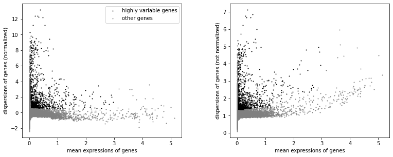
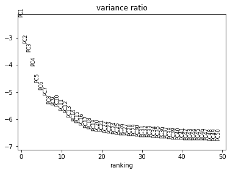
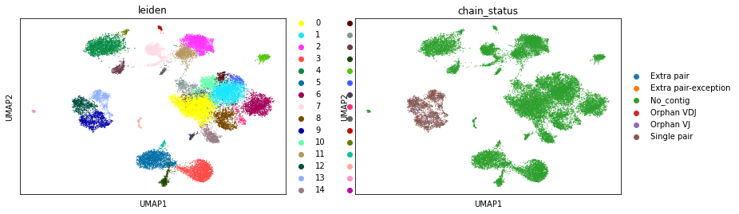
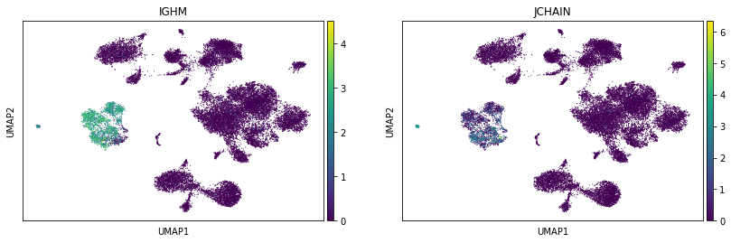

Filtering
=========

.. figure:: img/dandelion_logo_illustration.png
   :alt: dandelion_logo

   dandelion_logo

We now move on to filtering out BCR contigs (and corresponding cells if
necessary) from the BCR data and transcriptome object loaded in
*scanpy*.

**Import dandelion module**

.. code:: ipython3

    import os
    import dandelion as ddl
    # change directory to somewhere more workable
    os.chdir(os.path.expanduser('/Users/kt16/Downloads/dandelion_tutorial/'))
    ddl.logging.print_header()

.. parsed-literal::

    dandelion==0.2.4.dev57 pandas==1.4.2 numpy==1.21.6 matplotlib==3.5.2 networkx==2.8.4 scipy==1.8.1

**Import modules for use with scanpy**

.. code:: ipython3

    import pandas as pd
    import numpy as np
    import scanpy as sc
    import warnings
    import functools
    import seaborn as sns
    import scipy.stats
    import anndata
    
    warnings.filterwarnings('ignore')
    sc.logging.print_header()

.. parsed-literal::

    scanpy==1.9.1 anndata==0.8.0 umap==0.5.3 numpy==1.21.6 scipy==1.8.1 pandas==1.4.2 scikit-learn==1.1.1 statsmodels==0.13.2 python-igraph==0.9.11 pynndescent==0.5.7

**Import the transcriptome data**

.. code:: ipython3

    samples = ['sc5p_v2_hs_PBMC_1k', 'sc5p_v2_hs_PBMC_10k', 'vdj_v1_hs_pbmc3', 'vdj_nextgem_hs_pbmc3']
    adata_list = []
    for sample in samples:
        adata = sc.read_10x_h5(sample +'/filtered_feature_bc_matrix.h5', gex_only=True)
        adata.obs['sampleid'] = sample
        # rename cells to sample id + barcode
        adata.obs_names = [str(sample)+'_'+str(j) for j in adata.obs_names]
        adata.var_names_make_unique()
        adata_list.append(adata)
    adata = adata_list[0].concatenate(adata_list[1:])
    # rename the obs_names again, this time cleaving the trailing -#
    adata.obs_names = [str(j).split('-')[0] for j in adata.obs_names]
    adata

.. parsed-literal::

    AnnData object with n_obs × n_vars = 36730 × 31915
        obs: 'sampleid', 'batch'
        var: 'feature_types', 'genome', 'gene_ids-0', 'gene_ids-1', 'gene_ids-2', 'gene_ids-3'

I’m using a wrapper called ``pp.recipe_scanpy_qc`` to run through a
generic
`scanpy <https://scanpy-tutorials.readthedocs.io/en/latest/pbmc3k.html>`__
workflow. You can skip this if you already have a pre-processed
``AnnData`` object for the subsequent steps.

.. code:: ipython3

    ddl.pp.recipe_scanpy_qc(adata, mito_cutoff = None) # use a gmm model to decide
    # we can continue with those that survive qc
    adata = adata[adata.obs['filter_rna'] == 'False'].copy()
    adata

.. parsed-literal::

    AnnData object with n_obs × n_vars = 29000 × 31915
        obs: 'sampleid', 'batch', 'scrublet_score', 'n_genes', 'n_genes_by_counts', 'total_counts', 'total_counts_mt', 'pct_counts_mt', 'gmm_pct_count_clusters_keep', 'is_doublet', 'filter_rna'
        var: 'feature_types', 'genome', 'gene_ids-0', 'gene_ids-1', 'gene_ids-2', 'gene_ids-3'

Filter cells that are potental doublets and poor quality in both the V(D)J data and transcriptome data
------------------------------------------------------------------------------------------------------

``ddl.pp.filter_contigs``
~~~~~~~~~~~~~~~~~~~~~~~~~

.. container:: alert alert-block alert-info

   Pre v0.2.4, the normal workflow involves using
   ``ddl.pp.filter_contigs`` to remove poor quality contigs. From v0.2.4
   onwards however, a separate function, ``ddl.pp.check_contigs`` will
   be an alternative mode to perform the QCs. The difference is that
   ``ddl.pp.filter_contigs`` will remove contigs from the final data,
   whereas ``ddl.pp.check_contigs`` simply marks the problematic contigs
   as ``ambiguous``. We will go through each option separately

We use the function ``pp.filter_contigs`` to mark and filter out cells
and contigs from both the V(D)J data and transcriptome data in
``AnnData``. The operation will remove bad quality cells based on
transcriptome information as well as remove V(D)J doublets (multiplet
heavy/long chains, and/or light/short chains) from the V(D)J data. In
some situations, a single cell can have multiple heavy/long and
light/short chain contigs although they have an identical V(D)J+C
alignment; in situations like this, the contigs with lesser umis will be
dropped and the umis transferred to duplicate_count column. The same
procedure is applied to both heavy chain and light chains before
identifying doublets.

Cells in the gene expression object without V(D)J information will not
be affected which means that the ``AnnData`` object can hold non-B/T
cells. Run ``?ddl.pp.filter_contigs`` to check what each option does.

.. code:: ipython3

    # first we read in the 4 bcr files
    bcr_files = []
    for sample in samples:
        file_location = sample +'/dandelion/filtered_contig_dandelion.tsv'
        bcr_files.append(pd.read_csv(file_location, sep = '\t'))
    bcr = bcr_files[0].append(bcr_files[1:])
    bcr.reset_index(inplace = True, drop = True)
    bcr

.. raw:: html

    

    
    <table border="1" class="dataframe">
      <thead>
        <tr style="text-align: right;">
          <th></th>
          <th>sequence_id</th>
          <th>sequence</th>
          <th>rev_comp</th>
          <th>productive</th>
          <th>v_call</th>
          <th>d_call</th>
          <th>j_call</th>
          <th>sequence_alignment</th>
          <th>germline_alignment</th>
          <th>junction</th>
          <th>...</th>
          <th>fwr3_aa</th>
          <th>fwr4_aa</th>
          <th>cdr1_aa</th>
          <th>cdr2_aa</th>
          <th>cdr3_aa</th>
          <th>sequence_alignment_aa</th>
          <th>v_sequence_alignment_aa</th>
          <th>d_sequence_alignment_aa</th>
          <th>j_sequence_alignment_aa</th>
          <th>mu_count</th>
        </tr>
      </thead>
      <tbody>
        <tr>
          <th>0</th>
          <td>sc5p_v2_hs_PBMC_1k_AAACCTGTCACTGGGC_contig_1</td>
          <td>GGGGGAGGAGTCAGTCCCAACCAGGACACAGCATGGACATGAGGGT...</td>
          <td>F</td>
          <td>T</td>
          <td>IGKV1-33*01,IGKV1D-33*01</td>
          <td>NaN</td>
          <td>IGKJ4*01</td>
          <td>..CATCCAGATGACCCAGTCTCCATCCTCCCTGTCTGCATCTGTAG...</td>
          <td>GACATCCAGATGACCCAGTCTCCATCCTCCCTGTCTGCATCTGTAG...</td>
          <td>TGTCAACAGTATGATAATCTCCCGCTCACTTTC</td>
          <td>...</td>
          <td>NLEAGVPSRFSGSGSGTDFTFTISSLQPEDIATYYC</td>
          <td>FGGGTKVEIK</td>
          <td>QDISNY</td>
          <td>DAS</td>
          <td>QQYDNLPLT</td>
          <td>IQMTQSPSSLSASVGDRVTITCQASQDISNYLNWYQQKPGKAPKLL...</td>
          <td>IQMTQSPSSLSASVGDRVTITCQASQDISNYLNWYQQKPGKAPKLL...</td>
          <td>NaN</td>
          <td>LTFGGGTKVEIK</td>
          <td>1</td>
        </tr>
        <tr>
          <th>1</th>
          <td>sc5p_v2_hs_PBMC_1k_AAACCTGTCACTGGGC_contig_2</td>
          <td>GGGGACTTTCTGAGAGTCCTGGACCTCCTGCACAAGAACATGAAAC...</td>
          <td>F</td>
          <td>T</td>
          <td>IGHV4-4*07</td>
          <td>NaN</td>
          <td>IGHJ5*02</td>
          <td>CAGGTGCAGCTGCAGGAGTCGGGCCCA...GGACTGGTGAAGCCTT...</td>
          <td>CAGGTGCAGCTGCAGGAGTCGGGCCCA...GGACTGGTGAAGCCTT...</td>
          <td>TGTGCGAGAGGCGGGAACAGTGGCTTAGACCCCTGG</td>
          <td>...</td>
          <td>NYNPSLKSRVTMSVDTSKNQFSLKLSSVTAADTAVYYC</td>
          <td>WGQGTLVTVSS</td>
          <td>GGSIRSYY</td>
          <td>IYISGST</td>
          <td>ARGGNSGLDP</td>
          <td>QVQLQESGPGLVKPSETLSLTCTVSGGSIRSYYWSWIRQPAGKGLE...</td>
          <td>QVQLQESGPGLVKPSETLSLTCTVSGGSIRSYYWSWIRQPAGKGLE...</td>
          <td>NaN</td>
          <td>DPWGQGTLVTVSS</td>
          <td>4</td>
        </tr>
        <tr>
          <th>2</th>
          <td>sc5p_v2_hs_PBMC_1k_AAACCTGTCACTGGGC_contig_3</td>
          <td>GGGGACTGATCAGGACTCCTCAGTTCACCTTCTCACAATGAGGCTC...</td>
          <td>F</td>
          <td>F</td>
          <td>IGKV2D-30*01</td>
          <td>NaN</td>
          <td>IGKJ1*01</td>
          <td>GATGTTGTGATGACTCAGTCTCCACTCTCCCTGCCCGTCACCCTTG...</td>
          <td>GATGTTGTGATGACTCAGTCTCCACTCTCCCTGCCCGTCACCCTTG...</td>
          <td>TGCATGCAAGGTACACACTGGCCTGGACGTTC</td>
          <td>...</td>
          <td>NWDSGVPDRFSGSGSGTDFTLKISRVEAEDVGVYYC</td>
          <td>SAKGPRWKS</td>
          <td>QSLVYSDGNTY</td>
          <td>KFS</td>
          <td>MQGTHWPGR</td>
          <td>DVVMTQSPLSLPVTLGQPASISCRSSQSLVYSDGNTYLNWFQQRPG...</td>
          <td>DVVMTQSPLSLPVTLGQPASISCRSSQSLVYSDGNTYLNWFQQRPG...</td>
          <td>NaN</td>
          <td>GRSAKGPRWKSN</td>
          <td>1</td>
        </tr>
        <tr>
          <th>3</th>
          <td>sc5p_v2_hs_PBMC_1k_AAACCTGTCAGGTAAA_contig_2</td>
          <td>GGAGGAACTGCTCAGTTAGGACCCAGACGGAACCATGGAAGCCCCA...</td>
          <td>F</td>
          <td>T</td>
          <td>IGKV3-15*01</td>
          <td>NaN</td>
          <td>IGKJ2*01</td>
          <td>GAAATAGTGATGACGCAGTCTCCAGCCACCCTGTCTGTGTCTCCAG...</td>
          <td>GAAATAGTGATGACGCAGTCTCCAGCCACCCTGTCTGTGTCTCCAG...</td>
          <td>TGTCAGCAGTATGATAACTGGCCTCCGTACACTTTT</td>
          <td>...</td>
          <td>TRATGIPARFSGSGSGTEFTLTISSLQSEDFAVYYC</td>
          <td>FGQGTKLEIK</td>
          <td>QSVSSN</td>
          <td>GTS</td>
          <td>QQYDNWPPYT</td>
          <td>EIVMTQSPATLSVSPGERATLSCRASQSVSSNLAWYQQKPGQAPRL...</td>
          <td>EIVMTQSPATLSVSPGERATLSCRASQSVSSNLAWYQQKPGQAPRL...</td>
          <td>NaN</td>
          <td>YTFGQGTKLEIK</td>
          <td>3</td>
        </tr>
        <tr>
          <th>4</th>
          <td>sc5p_v2_hs_PBMC_1k_AAACCTGTCAGGTAAA_contig_3</td>
          <td>GGAATCCTCTCCTCCTCCTGTTCCTCTCTCACTGCACAGGTTCCCT...</td>
          <td>F</td>
          <td>T</td>
          <td>IGLV5-48*01</td>
          <td>NaN</td>
          <td>IGLJ2*01,IGLJ3*01</td>
          <td>CAGCCTGTGCTGACTCAGCCAACTTCC...CTCTCAGCATCTCCTG...</td>
          <td>CAGCCTGTGCTGACTCAGCCAACTTCC...CTCTCAGCATCTCCTG...</td>
          <td>TGTATGATTTGGCACAGCAGTGCTTCGGTATTC</td>
          <td>...</td>
          <td>HQGSGVPSRFSGSKDASSNAGILVISGLQSEDEADYYC</td>
          <td>FGGGTKLTVL</td>
          <td>SGINLGSYR</td>
          <td>YYSDSSK</td>
          <td>MIWHSSASV</td>
          <td>QPVLTQPTSLSASPGASARLTCTLRSGINLGSYRIFWYQQKPESPP...</td>
          <td>QPVLTQPTSLSASPGASARLTCTLRSGINLGSYRIFWYQQKPESPP...</td>
          <td>NaN</td>
          <td>VFGGGTKLTVL</td>
          <td>0</td>
        </tr>
        <tr>
          <th>...</th>
          <td>...</td>
          <td>...</td>
          <td>...</td>
          <td>...</td>
          <td>...</td>
          <td>...</td>
          <td>...</td>
          <td>...</td>
          <td>...</td>
          <td>...</td>
          <td>...</td>
          <td>...</td>
          <td>...</td>
          <td>...</td>
          <td>...</td>
          <td>...</td>
          <td>...</td>
          <td>...</td>
          <td>...</td>
          <td>...</td>
          <td>...</td>
        </tr>
        <tr>
          <th>9000</th>
          <td>vdj_nextgem_hs_pbmc3_TTTGCGCTCTGTCAAG_contig_2</td>
          <td>ATCACATAACAACCACATTCCTCCTCTAAAGAAGCCCCCGGGAGCC...</td>
          <td>F</td>
          <td>T</td>
          <td>IGHV1-69*01,IGHV1-69D*01</td>
          <td>IGHD3-22*01</td>
          <td>IGHJ4*02</td>
          <td>CAGGTGCAGCTGGTGCAGTCTGGGGCT...GAAGTGAAGAAGCCTG...</td>
          <td>CAGGTGCAGCTGGTGCAGTCTGGGGCT...GAGGTGAAGAAGCCTG...</td>
          <td>TGTGCGAGGGGGAAGTATTACTATGATAAAAGTGGGTCTCCACCTC...</td>
          <td>...</td>
          <td>NYAQKFQGRVSITADESTTTAYMELSSLRSEDSAVYYC</td>
          <td>WGQGTLVTVSS</td>
          <td>GGIFSSYA</td>
          <td>IIPIFGAT</td>
          <td>ARGKYYYDKSGSPPPIYSFDY</td>
          <td>QVQLVQSGAEVKKPGSSVKVSCKVSGGIFSSYAISWVRQAPGQGLE...</td>
          <td>QVQLVQSGAEVKKPGSSVKVSCKVSGGIFSSYAISWVRQAPGQGLE...</td>
          <td>YYYDKSG</td>
          <td>FDYWGQGTLVTVSS</td>
          <td>16</td>
        </tr>
        <tr>
          <th>9001</th>
          <td>vdj_nextgem_hs_pbmc3_TTTGGTTGTAAGGATT_contig_1</td>
          <td>AGAGCTCTGGAGAAGAGCTGCTCAGTTAGGACCCAGAGGGAACCAT...</td>
          <td>F</td>
          <td>T</td>
          <td>IGKV3-20*01</td>
          <td>NaN</td>
          <td>IGKJ2*01,IGKJ2*02</td>
          <td>GAAATTGTGTTGACGCAGTCTCCAGGCACCCTGTCTTTGTCTCCAG...</td>
          <td>GAAATTGTGTTGACGCAGTCTCCAGGCACCCTGTCTTTGTCTCCAG...</td>
          <td>TGTCAGCAGTATGATGAGTCACCTCTGACTTTT</td>
          <td>...</td>
          <td>SRATGIPDRFSGSGSGTDFTLTISRLVPEDFAVYYC</td>
          <td>FGQGTKLEIK</td>
          <td>QSLTNSQ</td>
          <td>GAS</td>
          <td>QQYDESPLT</td>
          <td>EIVLTQSPGTLSLSPGERATLSCRASQSLTNSQLAWYQQKPGQAPR...</td>
          <td>EIVLTQSPGTLSLSPGERATLSCRASQSLTNSQLAWYQQKPGQAPR...</td>
          <td>NaN</td>
          <td>TFGQGTKLEIK</td>
          <td>11</td>
        </tr>
        <tr>
          <th>9002</th>
          <td>vdj_nextgem_hs_pbmc3_TTTGGTTGTAAGGATT_contig_2</td>
          <td>AGCTCTGGGAGAGGAGCCCCAGCCCTGAGATTCCCAGGTGTTTCCA...</td>
          <td>F</td>
          <td>T</td>
          <td>IGHV3-9*01</td>
          <td>IGHD5-18*01,IGHD5-5*01</td>
          <td>IGHJ6*03</td>
          <td>GAAGTGCAGCTGGTGGAGTCTGGGGGA...GGCTTGGTACAGCCTG...</td>
          <td>GAAGTGCAGCTGGTGGAGTCTGGGGGA...GGCTTGGTACAGCCTG...</td>
          <td>TGTGCAAAAGACGGATACAGCTATCGTTCGTCATACTACTTTTACA...</td>
          <td>...</td>
          <td>GYADSVKGRFTISRDNAKNSLYLQMNSLRAEDTALYYC</td>
          <td>WGKGTTVTVSS</td>
          <td>GFSFDDYV</td>
          <td>ISWNSGRT</td>
          <td>AKDGYSYRSSYYFYMDV</td>
          <td>EVQLVESGGGLVQPGRSLRLSCAASGFSFDDYVMHWVRQAPGKGLE...</td>
          <td>EVQLVESGGGLVQPGRSLRLSCAASGFSFDDYVMHWVRQAPGKGLE...</td>
          <td>GYSYR</td>
          <td>YYFYMDVWGKGTTVTVSS</td>
          <td>10</td>
        </tr>
        <tr>
          <th>9003</th>
          <td>vdj_nextgem_hs_pbmc3_TTTGTCACAGTAGAGC_contig_1</td>
          <td>AGCTCTGAGAGAGGAGCCCAGCCCTGGGATTTTCAGGTGTTTTCAT...</td>
          <td>F</td>
          <td>T</td>
          <td>IGHV3-23*01,IGHV3-23D*01</td>
          <td>IGHD4-17*01</td>
          <td>IGHJ4*02</td>
          <td>GAGGTGCAGCTGTTGGAGTCTGGGGGA...GGCTTGGTACAGCCTG...</td>
          <td>GAGGTGCAGCTGTTGGAGTCTGGGGGA...GGCTTGGTACAGCCTG...</td>
          <td>TGTGCGAAAGATTTTAGGTCGCCATACGGTGACTACTACTTTGACT...</td>
          <td>...</td>
          <td>YYADSVKGRFTISRDNSKNTLYLQMNSLRAEDTAVYYC</td>
          <td>WGQGTLVTVSS</td>
          <td>GFTFSSYA</td>
          <td>ISGSGGST</td>
          <td>AKDFRSPYGDYYFDY</td>
          <td>EVQLLESGGGLVQPGGSLRLSCAASGFTFSSYAMSWVRQAPGKGLE...</td>
          <td>EVQLLESGGGLVQPGGSLRLSCAASGFTFSSYAMSWVRQAPGKGLE...</td>
          <td>YGD</td>
          <td>YFDYWGQGTLVTVSS</td>
          <td>0</td>
        </tr>
        <tr>
          <th>9004</th>
          <td>vdj_nextgem_hs_pbmc3_TTTGTCACAGTAGAGC_contig_2</td>
          <td>GTGGGTCCAGGAGGCAGAACTCTGGGTGTCTCACCATGGCCTGGAT...</td>
          <td>F</td>
          <td>T</td>
          <td>IGLV3-25*03</td>
          <td>NaN</td>
          <td>IGLJ1*01</td>
          <td>TCCTATGAGCTGACACAGCCACCCTCG...GTGTCAGTGTCCCCAG...</td>
          <td>TCCTATGAGCTGACACAGCCACCCTCG...GTGTCAGTGTCCCCAG...</td>
          <td>TGTCAATCAGCAGACAGCAGTGGTACTTATCTTTATGTCTTC</td>
          <td>...</td>
          <td>ERPSGIPERFSGSSSGTTVTLTISGVQAEDEADYYC</td>
          <td>FGTGTKVTVL</td>
          <td>ALPKQY</td>
          <td>KDS</td>
          <td>QSADSSGTYLYV</td>
          <td>SYELTQPPSVSVSPGQTARITCSGDALPKQYAYWYQQKPGQAPVLV...</td>
          <td>SYELTQPPSVSVSPGQTARITCSGDALPKQYAYWYQQKPGQAPVLV...</td>
          <td>NaN</td>
          <td>YVFGTGTKVTVL</td>
          <td>0</td>
        </tr>
      </tbody>
    </table>
    
9005 rows × 115 columns

    

.. container:: alert alert-block alert-warning

   It is recommended to specify the library_type argument as it will
   remove all contigs that do not belong to the related loci. The
   rationale is that the choice of the library type should mean that the
   primers used would most likely amplify those related sequences and if
   there’s any unexpected loci, they likely represent artifacts and
   shouldn’t be analysed. The optional argument accepts: ``ig``,
   ``tr-ab``, ``tr-gd`` or ``None`` where ``None`` means all contigs
   will be kept.

.. code:: ipython3

    # The function will return both objects. 
    vdj, adata2 = ddl.pp.filter_contigs(bcr, adata, library_type = 'ig', filter_rna = True) # filter_rna is set to True to speed up the rest of the analyses. Usually I leave it as False.

.. parsed-literal::

    Preparing data: 7946it [00:03, 2563.27it/s]
    Scanning for poor quality/ambiguous contigs: 100%|██████████| 3847/3847 [00:25<00:00, 148.85it/s]                                             

.. container:: alert alert-block alert-info

   Filtering parameters to consider

-  The default mode is to filter any extra VDJ chains (BCR heavy chains
   and TCR long chains) because of allelic exclusion, with some
   exceptions: IgM and IgD pairs will be kept and productive TCR delta
   chains will be kept in alpha-beta T cells because of allelic
   inclusion
   `[Sleckman1998] <https://rupress.org/jem/article-lookup/doi/10.1084/jem.188.8.1465>`__.
   The option to change the behaviour (i.e keep all extra VDJ chains) is
   by toggling:

.. code:: python

   filter_extra_vdj_chains=False

-  The default mode is to keep any extra VJ chains (BCR light chains and
   TCR short chains), but some may be interested in removing them. The
   option to change the behaviour is by toggling:

.. code:: python

   filter_extra_vj_chains=True

-  If the cell in the V(D)J table cannot be found in the transcriptomic
   data, it will also be removed from the V(D)J data by default. This
   can be changed by toggling:

.. code:: python

   filter_missing=False

-  When contigs are marked as poor quality, the default behaviour is to
   remove the contigs associated with the barcode, and not the barcode
   from the transcriptome data. This can be toggled to remove the entire
   cell if the intention is to retain a conservative dataset for both
   V(D)J and transcriptome data:

.. code:: python

   filter_poorqualitycontig=True

-  The default behaviour is to rescue the chain/contig with the highest
   umi if there are multiple contigs for a single cell. The function
   requires a minimum fold-difference of 2 between the highest and
   lowest umi in order to rescue the contig. However, if the contigs
   have similar number of umis, or if the sum of the umis are very low,
   then the entire cell will be filtered. The fold-difference cut-off
   can be specified via the option ``umi_foldchange_cutoff``. This can
   be toggled to ``False`` i.e. drop all multiple chains/contigs:

.. code:: python

   keep_highest_umi=True

-  The default behaviour is to only consider productive contigs but some
   cell types may require examination of non-productive chains
   (e.g. developing early B/T cells, ILCs, NKTs etc.). Because the
   filtering of productive and non-productive contigs are kept separate,
   this should not impact on productive contigs. But specifying
   ``productive_only = True`` will remove all non-productive contigs.

.. code:: python

   productive_only=False

-  If you just want to mark which contigs to remove and not actually
   remove them from consideration, this can be toggled with:

.. code:: python

   filter_contig=False

-  If you want to keep the processed transcriptome data as is, and not
   make use of the V(D)J data to filter out potentially poor quality
   cells because of multiplet V(D)J detection, consider using:

.. code:: python

   filter_rna=False

This should keep the ``anndata`` as per the input but with the ``.obs``
columns appropriately filled in with the V(D)J QC metrics.

-  Lastly, if you just want to do a light filtering (like just check
   that the V(D)J+C genes are matching), then you can toggle
   ``simple = True``. This will ignore all the other options:

.. code:: python

   simple = True

**Check the output V(D)J table**

The vdj table is returned as a ``Dandelion`` class object in the
``.data`` slot (described in further detail
`here <https://sc-dandelion.readthedocs.io/en/latest/notebooks/0_dandelion_primer.html>`__);
if a file was provided for ``filter_bcr`` above, a new file will be
created in the same folder with the ``filtered`` prefix. Note that this
V(D)J table is indexed based on contigs (sequence_id).

.. code:: ipython3

    vdj

.. parsed-literal::

    Dandelion class object with n_obs = 2545 and n_contigs = 5218
        data: 'sequence_id', 'sequence', 'rev_comp', 'productive', 'v_call', 'd_call', 'j_call', 'sequence_alignment', 'germline_alignment', 'junction', 'junction_aa', 'v_cigar', 'd_cigar', 'j_cigar', 'stop_codon', 'vj_in_frame', 'locus', 'junction_length', 'np1_length', 'np2_length', 'v_sequence_start', 'v_sequence_end', 'v_germline_start', 'v_germline_end', 'd_sequence_start', 'd_sequence_end', 'd_germline_start', 'd_germline_end', 'j_sequence_start', 'j_sequence_end', 'j_germline_start', 'j_germline_end', 'v_score', 'v_identity', 'v_support', 'd_score', 'd_identity', 'd_support', 'j_score', 'j_identity', 'j_support', 'fwr1', 'fwr2', 'fwr3', 'fwr4', 'cdr1', 'cdr2', 'cdr3', 'cell_id', 'c_call', 'consensus_count', 'duplicate_count', 'v_call_10x', 'd_call_10x', 'j_call_10x', 'junction_10x', 'junction_10x_aa', 'v_call_genotyped', 'germline_alignment_d_mask', 'sample_id', 'j_support_igblastn', 'j_score_igblastn', 'j_call_igblastn', 'j_call_blastn', 'j_identity_blastn', 'j_alignment_length_blastn', 'j_number_of_mismatches_blastn', 'j_number_of_gap_openings_blastn', 'j_sequence_start_blastn', 'j_sequence_end_blastn', 'j_germline_start_blastn', 'j_germline_end_blastn', 'j_support_blastn', 'j_score_blastn', 'j_sequence_alignment_blastn', 'j_germline_alignment_blastn', 'cell_id_blastn', 'j_source', 'd_support_igblastn', 'd_score_igblastn', 'd_call_igblastn', 'd_call_blastn', 'd_identity_blastn', 'd_alignment_length_blastn', 'd_number_of_mismatches_blastn', 'd_number_of_gap_openings_blastn', 'd_sequence_start_blastn', 'd_sequence_end_blastn', 'd_germline_start_blastn', 'd_germline_end_blastn', 'd_support_blastn', 'd_score_blastn', 'd_sequence_alignment_blastn', 'd_germline_alignment_blastn', 'd_source', 'c_sequence_alignment', 'c_germline_alignment', 'c_sequence_start', 'c_sequence_end', 'c_score', 'c_identity', 'c_call_10x', 'junction_aa_length', 'fwr1_aa', 'fwr2_aa', 'fwr3_aa', 'fwr4_aa', 'cdr1_aa', 'cdr2_aa', 'cdr3_aa', 'sequence_alignment_aa', 'v_sequence_alignment_aa', 'd_sequence_alignment_aa', 'j_sequence_alignment_aa', 'mu_count', 'rearrangement_status'
        metadata: 'sample_id', 'locus_VDJ', 'locus_VJ', 'productive_VDJ', 'productive_VJ', 'v_call_genotyped_VDJ', 'd_call_VDJ', 'j_call_VDJ', 'v_call_genotyped_VJ', 'j_call_VJ', 'c_call_VDJ', 'c_call_VJ', 'junction_VDJ', 'junction_VJ', 'junction_aa_VDJ', 'junction_aa_VJ', 'v_call_genotyped_B_VDJ', 'd_call_B_VDJ', 'j_call_B_VDJ', 'v_call_genotyped_B_VJ', 'j_call_B_VJ', 'productive_B_VDJ', 'productive_B_VJ', 'duplicate_count_B_VDJ', 'duplicate_count_B_VJ', 'isotype', 'isotype_status', 'locus_status', 'chain_status', 'rearrangement_status_VDJ', 'rearrangement_status_VJ'

**Check the AnnData object as well**

And the ``AnnData`` object is indexed based on cells.

.. code:: ipython3

    adata2

.. parsed-literal::

    AnnData object with n_obs × n_vars = 28912 × 31915
        obs: 'sampleid', 'batch', 'scrublet_score', 'n_genes', 'n_genes_by_counts', 'total_counts', 'total_counts_mt', 'pct_counts_mt', 'gmm_pct_count_clusters_keep', 'is_doublet', 'filter_rna', 'has_contig', 'filter_contig_quality', 'filter_contig_VDJ', 'filter_contig_VJ', 'contig_QC_pass', 'filter_contig'
        var: 'feature_types', 'genome', 'gene_ids-0', 'gene_ids-1', 'gene_ids-2', 'gene_ids-3'

The ``.obs`` slot in the ``AnnData`` object now contains a few new
columns related to the V(D)J chains:

.. container:: alert alert-block alert-info

   1) has_contig : whether cells have V(D)J chains. 2)
   filter_contig_quality : recommendation for filtering cells identified
   as having poor quality contigs. 3) filter_contig_VDJ : recommendation
   for filtering cells identified as VDJ ‘multiplets’. 4)
   filter_contig_VJ : recommendation for filtering cells identifed as
   having multiple VJ contigs. 5) contig_QC_pass : cells where V(D)J
   chains successfully passed QC. 6) filter_contig : recommendation for
   filter for cells due to bad quality chains.

So this means that to go forward, you want to only select cells that
have BCR that passed QC (``has_contig == 'True'`` and
``contig_QC_pass == 'True'``) with filtering recommendation to be false
(``filter_contig == 'False'``).

**The number of cells that actually has a matching BCR can be
tabluated.**

.. code:: ipython3

    pd.crosstab(adata2.obs['has_contig'], adata2.obs['filter_contig'])

.. raw:: html

    

    
    <table border="1" class="dataframe">
      <thead>
        <tr style="text-align: right;">
          <th>filter_contig</th>
          <th>False</th>
        </tr>
        <tr>
          <th>has_contig</th>
          <th></th>
        </tr>
      </thead>
      <tbody>
        <tr>
          <th>No_contig</th>
          <td>26227</td>
        </tr>
        <tr>
          <th>True</th>
          <td>2685</td>
        </tr>
      </tbody>
    </table>
    

.. code:: ipython3

    pd.crosstab(adata2.obs['has_contig'], adata2.obs['contig_QC_pass'])

.. raw:: html

    

    
    <table border="1" class="dataframe">
      <thead>
        <tr style="text-align: right;">
          <th>contig_QC_pass</th>
          <th>False</th>
          <th>No_contig</th>
          <th>True</th>
        </tr>
        <tr>
          <th>has_contig</th>
          <th></th>
          <th></th>
          <th></th>
        </tr>
      </thead>
      <tbody>
        <tr>
          <th>No_contig</th>
          <td>0</td>
          <td>26227</td>
          <td>0</td>
        </tr>
        <tr>
          <th>True</th>
          <td>140</td>
          <td>0</td>
          <td>2545</td>
        </tr>
      </tbody>
    </table>
    

.. code:: ipython3

    pd.crosstab(adata2.obs['contig_QC_pass'], adata2.obs['filter_contig'])

.. raw:: html

    

    
    <table border="1" class="dataframe">
      <thead>
        <tr style="text-align: right;">
          <th>filter_contig</th>
          <th>False</th>
        </tr>
        <tr>
          <th>contig_QC_pass</th>
          <th></th>
        </tr>
      </thead>
      <tbody>
        <tr>
          <th>False</th>
          <td>140</td>
        </tr>
        <tr>
          <th>No_contig</th>
          <td>26227</td>
        </tr>
        <tr>
          <th>True</th>
          <td>2545</td>
        </tr>
      </tbody>
    </table>
    

``ddl.pp.check_contigs``
~~~~~~~~~~~~~~~~~~~~~~~~

From ``v0.2.4`` onwards, there’s a new function that performs similarly
to ``ddl.pp.filter_contigs``, but relaxed settings so as not to
forcefully remove contigs. The function is also simplified with reduced
arguments. The main output of this function is an additional
``ambiguous`` column in ``vdj.data``, which flags ``T`` or ``F`` for
contigs that were marked as poor quality. The numbers of ``ambiguous``
contigs would not tally with the number of contigs removed from
``ddl.pp.filter_contigs`` because while ``ddl.pp.check_contigs`` only
assess ambiguity at the contig level (i.e. whether a contig can be
considered good/bad on its own), ``ddl.pp.filter_contigs`` imposes
additional ‘strict’ assumptions (e.g. a cell should only contain 1
productive pair of VDJ pairs).

.. code:: ipython3

    # Usage is similar
    vdj, adata = ddl.pp.check_contigs(bcr, adata, library_type = 'ig')

.. parsed-literal::

    Scanning for poor quality/ambiguous contigs: 100%|██████████| 3847/3847 [00:26<00:00, 143.89it/s]                                             

**Check the Dandelion object**

.. code:: ipython3

    vdj

.. parsed-literal::

    Dandelion class object with n_obs = 2773 and n_contigs = 5706
        data: 'sequence_id', 'sequence', 'rev_comp', 'productive', 'v_call', 'd_call', 'j_call', 'sequence_alignment', 'germline_alignment', 'junction', 'junction_aa', 'v_cigar', 'd_cigar', 'j_cigar', 'stop_codon', 'vj_in_frame', 'locus', 'junction_length', 'np1_length', 'np2_length', 'v_sequence_start', 'v_sequence_end', 'v_germline_start', 'v_germline_end', 'd_sequence_start', 'd_sequence_end', 'd_germline_start', 'd_germline_end', 'j_sequence_start', 'j_sequence_end', 'j_germline_start', 'j_germline_end', 'v_score', 'v_identity', 'v_support', 'd_score', 'd_identity', 'd_support', 'j_score', 'j_identity', 'j_support', 'fwr1', 'fwr2', 'fwr3', 'fwr4', 'cdr1', 'cdr2', 'cdr3', 'cell_id', 'c_call', 'consensus_count', 'duplicate_count', 'v_call_10x', 'd_call_10x', 'j_call_10x', 'junction_10x', 'junction_10x_aa', 'v_call_genotyped', 'germline_alignment_d_mask', 'sample_id', 'j_support_igblastn', 'j_score_igblastn', 'j_call_igblastn', 'j_call_blastn', 'j_identity_blastn', 'j_alignment_length_blastn', 'j_number_of_mismatches_blastn', 'j_number_of_gap_openings_blastn', 'j_sequence_start_blastn', 'j_sequence_end_blastn', 'j_germline_start_blastn', 'j_germline_end_blastn', 'j_support_blastn', 'j_score_blastn', 'j_sequence_alignment_blastn', 'j_germline_alignment_blastn', 'cell_id_blastn', 'j_source', 'd_support_igblastn', 'd_score_igblastn', 'd_call_igblastn', 'd_call_blastn', 'd_identity_blastn', 'd_alignment_length_blastn', 'd_number_of_mismatches_blastn', 'd_number_of_gap_openings_blastn', 'd_sequence_start_blastn', 'd_sequence_end_blastn', 'd_germline_start_blastn', 'd_germline_end_blastn', 'd_support_blastn', 'd_score_blastn', 'd_sequence_alignment_blastn', 'd_germline_alignment_blastn', 'd_source', 'c_sequence_alignment', 'c_germline_alignment', 'c_sequence_start', 'c_sequence_end', 'c_score', 'c_identity', 'c_call_10x', 'junction_aa_length', 'fwr1_aa', 'fwr2_aa', 'fwr3_aa', 'fwr4_aa', 'cdr1_aa', 'cdr2_aa', 'cdr3_aa', 'sequence_alignment_aa', 'v_sequence_alignment_aa', 'd_sequence_alignment_aa', 'j_sequence_alignment_aa', 'mu_count', 'ambiguous', 'rearrangement_status'
        metadata: 'sample_id', 'locus_VDJ', 'locus_VJ', 'productive_VDJ', 'productive_VJ', 'v_call_genotyped_VDJ', 'd_call_VDJ', 'j_call_VDJ', 'v_call_genotyped_VJ', 'j_call_VJ', 'c_call_VDJ', 'c_call_VJ', 'junction_VDJ', 'junction_VJ', 'junction_aa_VDJ', 'junction_aa_VJ', 'v_call_genotyped_B_VDJ', 'd_call_B_VDJ', 'j_call_B_VDJ', 'v_call_genotyped_B_VJ', 'j_call_B_VJ', 'productive_B_VDJ', 'productive_B_VJ', 'duplicate_count_B_VDJ', 'duplicate_count_B_VJ', 'isotype', 'isotype_status', 'locus_status', 'chain_status', 'rearrangement_status_VDJ', 'rearrangement_status_VJ'

**Check the AnnData object as well**

.. code:: ipython3

    adata

.. parsed-literal::

    AnnData object with n_obs × n_vars = 29000 × 31915
        obs: 'sampleid', 'batch', 'scrublet_score', 'n_genes', 'n_genes_by_counts', 'total_counts', 'total_counts_mt', 'pct_counts_mt', 'gmm_pct_count_clusters_keep', 'is_doublet', 'filter_rna', 'has_contig', 'sample_id', 'locus_VDJ', 'locus_VJ', 'productive_VDJ', 'productive_VJ', 'v_call_genotyped_VDJ', 'd_call_VDJ', 'j_call_VDJ', 'v_call_genotyped_VJ', 'j_call_VJ', 'c_call_VDJ', 'c_call_VJ', 'junction_VDJ', 'junction_VJ', 'junction_aa_VDJ', 'junction_aa_VJ', 'v_call_genotyped_B_VDJ', 'd_call_B_VDJ', 'j_call_B_VDJ', 'v_call_genotyped_B_VJ', 'j_call_B_VJ', 'productive_B_VDJ', 'productive_B_VJ', 'duplicate_count_B_VDJ', 'duplicate_count_B_VJ', 'isotype', 'isotype_status', 'locus_status', 'chain_status', 'rearrangement_status_VDJ', 'rearrangement_status_VJ'
        var: 'feature_types', 'genome', 'gene_ids-0', 'gene_ids-1', 'gene_ids-2', 'gene_ids-3'

The ``.obs`` slot in the ``AnnData`` object (and also ``.metadata`` slot
in the ``Dandelion`` object) have different columns from the output of
``ddl.pp.filter_contigs``:

I will highlight the ones that are relevant at this stage:

.. container:: alert alert-block alert-info

   1) has_contig : whether cells have V(D)J chains. 2) locus_status :
   detailed information on chain status pairings (below). 2)
   chain_status : summarised information of the chain locus status
   pairings. This is similar to ``chain_pairing`` in ``scirpy``\ ’s
   output. No additional filtering is required: the updated
   ``Dandelion`` is designed to work without having the need to filter
   the contigs marked as ``ambiguous`` in the
   ``.metadata.chain_status``.

**Let’s take a look at these new columns**

.. code:: ipython3

    pd.crosstab(adata.obs['chain_status'], adata.obs['locus_status'])

.. raw:: html

    

    
    <table border="1" class="dataframe">
      <thead>
        <tr style="text-align: right;">
          <th>locus_status</th>
          <th>Extra VDJ + Extra VJ</th>
          <th>Extra VDJ + IGK</th>
          <th>Extra VDJ + IGL</th>
          <th>IGH + Extra VJ</th>
          <th>IGH + IGK</th>
          <th>IGH + IGL</th>
          <th>IgM/IgD + Extra VJ</th>
          <th>IgM/IgD + IGK</th>
          <th>IgM/IgD + IGL</th>
          <th>No_contig</th>
          <th>Orphan Extra VJ</th>
          <th>Orphan IGH</th>
          <th>Orphan IGK</th>
          <th>Orphan IGL</th>
        </tr>
        <tr>
          <th>chain_status</th>
          <th></th>
          <th></th>
          <th></th>
          <th></th>
          <th></th>
          <th></th>
          <th></th>
          <th></th>
          <th></th>
          <th></th>
          <th></th>
          <th></th>
          <th></th>
          <th></th>
        </tr>
      </thead>
      <tbody>
        <tr>
          <th>Extra pair</th>
          <td>34</td>
          <td>4</td>
          <td>4</td>
          <td>116</td>
          <td>0</td>
          <td>0</td>
          <td>0</td>
          <td>0</td>
          <td>0</td>
          <td>0</td>
          <td>0</td>
          <td>0</td>
          <td>0</td>
          <td>0</td>
        </tr>
        <tr>
          <th>Extra pair-exception</th>
          <td>0</td>
          <td>0</td>
          <td>0</td>
          <td>0</td>
          <td>0</td>
          <td>0</td>
          <td>8</td>
          <td>3</td>
          <td>1</td>
          <td>0</td>
          <td>0</td>
          <td>0</td>
          <td>0</td>
          <td>0</td>
        </tr>
        <tr>
          <th>No_contig</th>
          <td>0</td>
          <td>0</td>
          <td>0</td>
          <td>0</td>
          <td>0</td>
          <td>0</td>
          <td>0</td>
          <td>0</td>
          <td>0</td>
          <td>26227</td>
          <td>0</td>
          <td>0</td>
          <td>0</td>
          <td>0</td>
        </tr>
        <tr>
          <th>Orphan VDJ</th>
          <td>0</td>
          <td>0</td>
          <td>0</td>
          <td>0</td>
          <td>0</td>
          <td>0</td>
          <td>0</td>
          <td>0</td>
          <td>0</td>
          <td>0</td>
          <td>0</td>
          <td>8</td>
          <td>0</td>
          <td>0</td>
        </tr>
        <tr>
          <th>Orphan VJ</th>
          <td>0</td>
          <td>0</td>
          <td>0</td>
          <td>0</td>
          <td>0</td>
          <td>0</td>
          <td>0</td>
          <td>0</td>
          <td>0</td>
          <td>0</td>
          <td>44</td>
          <td>0</td>
          <td>94</td>
          <td>49</td>
        </tr>
        <tr>
          <th>Single pair</th>
          <td>0</td>
          <td>0</td>
          <td>0</td>
          <td>0</td>
          <td>1384</td>
          <td>1024</td>
          <td>0</td>
          <td>0</td>
          <td>0</td>
          <td>0</td>
          <td>0</td>
          <td>0</td>
          <td>0</td>
          <td>0</td>
        </tr>
      </tbody>
    </table>
    

if there are multiple library types, i.e. ``ddl.pp.filter_contigs`` or
``ddl.pp.check_contigs`` was run with ``library_type = None``, or if
several tcr/bcr ``Dandelion`` objects are concatenated, there will be
additional columns where the ``v/d/j/c calls`` and ``productive`` will
be split into additional columns to reflect those that belong to a B
cell, alpha-beta T cell, or gamma-delta T cell.

We will use this ``contig_checked`` object going forward.

Now actually filter the AnnData object and run through a standard workflow starting by filtering genes and normalizing the data
-------------------------------------------------------------------------------------------------------------------------------

Because the ‘filtered’ ``AnnData`` object was returned as a filtered but
otherwise unprocessed object, we still need to normalize and run through
the usual process here. The following is just a standard scanpy
workflow.

.. code:: ipython3

    # filter genes
    sc.pp.filter_genes(adata, min_cells=3)
    # Normalize the counts
    sc.pp.normalize_total(adata, target_sum=1e4)
    # Logarithmize the data
    sc.pp.log1p(adata)
    # Stash the normalised counts
    adata.raw = adata

**Identify highly-variable genes**

.. code:: ipython3

    sc.pp.highly_variable_genes(adata, min_mean=0.0125, max_mean=3, min_disp=0.5)
    sc.pl.highly_variable_genes(adata)

**Filter the genes to only those marked as highly-variable**

.. code:: ipython3

    adata = adata[:, adata.var.highly_variable]

**Regress out effects of total counts per cell and the percentage of
mitochondrial genes expressed. Scale the data to unit variance.**

.. code:: ipython3

    sc.pp.regress_out(adata, ['total_counts', 'pct_counts_mt'])
    sc.pp.scale(adata, max_value=10)

**Run PCA**

.. code:: ipython3

    sc.tl.pca(adata, svd_solver='arpack')
    sc.pl.pca_variance_ratio(adata, log=True, n_pcs = 50)

**Computing the neighborhood graph, umap and clusters**

.. code:: ipython3

    # Computing the neighborhood graph
    sc.pp.neighbors(adata)
    # Embedding the neighborhood graph
    sc.tl.umap(adata)
    # Clustering the neighborhood graph
    sc.tl.leiden(adata)

**Visualizing the clusters and whether or not there’s a corresponding
V(D)J receptor**

.. code:: ipython3

    sc.pl.umap(adata, color=['leiden', 'chain_status'])

**Visualizing some B cell genes**

.. code:: ipython3

    sc.pl.umap(adata, color=['IGHM', 'JCHAIN'])

**Save AnnData**

We can save this ``AnnData`` object for now.

.. code:: ipython3

    adata.write('adata.h5ad', compression = 'gzip')

**Save dandelion**

To save the vdj object, we have two options - either save the ``.data``
and ``.metadata`` slots with pandas’ functions:

.. code:: ipython3

    vdj.data.to_csv('filtered_vdj_table.tsv', sep = '\t')

Or save the whole Dandelion class object with either
``.write_h5ddl/.write_h5/.write``, which saves the class to a HDF5
format, or using a pickle-based ``.write_pkl`` function.

.. code:: ipython3

    vdj.write_h5ddl('dandelion_results.h5ddl', compression = 'blosc:lz4')

.. code:: ipython3

    vdj.write_pkl('dandelion_results.pkl.pbz2') # this will automatically use bzip2 for compression, swith the extension to .gz for gzip

Running ``ddl.pp.filter_contigs`` without ``AnnData``
-----------------------------------------------------

Finally, ``ddl.pp.filter_contigs`` can also be run without an
``AnnData`` object:

.. code:: ipython3

    vdj3 = ddl.pp.filter_contigs(bcr)
    vdj3

.. parsed-literal::

    Preparing data: 7946it [00:03, 2396.16it/s]
    Scanning for poor quality/ambiguous contigs: 100%|██████████| 3847/3847 [00:26<00:00, 146.83it/s]                                             

.. parsed-literal::

    Dandelion class object with n_obs = 3424 and n_contigs = 7016
        data: 'sequence_id', 'sequence', 'rev_comp', 'productive', 'v_call', 'd_call', 'j_call', 'sequence_alignment', 'germline_alignment', 'junction', 'junction_aa', 'v_cigar', 'd_cigar', 'j_cigar', 'stop_codon', 'vj_in_frame', 'locus', 'junction_length', 'np1_length', 'np2_length', 'v_sequence_start', 'v_sequence_end', 'v_germline_start', 'v_germline_end', 'd_sequence_start', 'd_sequence_end', 'd_germline_start', 'd_germline_end', 'j_sequence_start', 'j_sequence_end', 'j_germline_start', 'j_germline_end', 'v_score', 'v_identity', 'v_support', 'd_score', 'd_identity', 'd_support', 'j_score', 'j_identity', 'j_support', 'fwr1', 'fwr2', 'fwr3', 'fwr4', 'cdr1', 'cdr2', 'cdr3', 'cell_id', 'c_call', 'consensus_count', 'duplicate_count', 'v_call_10x', 'd_call_10x', 'j_call_10x', 'junction_10x', 'junction_10x_aa', 'v_call_genotyped', 'germline_alignment_d_mask', 'sample_id', 'j_support_igblastn', 'j_score_igblastn', 'j_call_igblastn', 'j_call_blastn', 'j_identity_blastn', 'j_alignment_length_blastn', 'j_number_of_mismatches_blastn', 'j_number_of_gap_openings_blastn', 'j_sequence_start_blastn', 'j_sequence_end_blastn', 'j_germline_start_blastn', 'j_germline_end_blastn', 'j_support_blastn', 'j_score_blastn', 'j_sequence_alignment_blastn', 'j_germline_alignment_blastn', 'cell_id_blastn', 'j_source', 'd_support_igblastn', 'd_score_igblastn', 'd_call_igblastn', 'd_call_blastn', 'd_identity_blastn', 'd_alignment_length_blastn', 'd_number_of_mismatches_blastn', 'd_number_of_gap_openings_blastn', 'd_sequence_start_blastn', 'd_sequence_end_blastn', 'd_germline_start_blastn', 'd_germline_end_blastn', 'd_support_blastn', 'd_score_blastn', 'd_sequence_alignment_blastn', 'd_germline_alignment_blastn', 'd_source', 'c_sequence_alignment', 'c_germline_alignment', 'c_sequence_start', 'c_sequence_end', 'c_score', 'c_identity', 'c_call_10x', 'junction_aa_length', 'fwr1_aa', 'fwr2_aa', 'fwr3_aa', 'fwr4_aa', 'cdr1_aa', 'cdr2_aa', 'cdr3_aa', 'sequence_alignment_aa', 'v_sequence_alignment_aa', 'd_sequence_alignment_aa', 'j_sequence_alignment_aa', 'mu_count', 'rearrangement_status'
        metadata: 'sample_id', 'locus_VDJ', 'locus_VJ', 'productive_VDJ', 'productive_VJ', 'v_call_genotyped_VDJ', 'd_call_VDJ', 'j_call_VDJ', 'v_call_genotyped_VJ', 'j_call_VJ', 'c_call_VDJ', 'c_call_VJ', 'junction_VDJ', 'junction_VJ', 'junction_aa_VDJ', 'junction_aa_VJ', 'v_call_genotyped_B_VDJ', 'd_call_B_VDJ', 'j_call_B_VDJ', 'v_call_genotyped_B_VJ', 'j_call_B_VJ', 'productive_B_VDJ', 'productive_B_VJ', 'duplicate_count_B_VDJ', 'duplicate_count_B_VJ', 'isotype', 'isotype_status', 'locus_status', 'chain_status', 'rearrangement_status_VDJ', 'rearrangement_status_VJ'

.. code:: ipython3

    vdj4 = ddl.pp.check_contigs(bcr)
    vdj4

.. parsed-literal::

    Scanning for poor quality/ambiguous contigs: 100%|██████████| 3847/3847 [00:26<00:00, 143.38it/s]                                             

.. parsed-literal::

    Dandelion class object with n_obs = 3843 and n_contigs = 7946
        data: 'sequence_id', 'sequence', 'rev_comp', 'productive', 'v_call', 'd_call', 'j_call', 'sequence_alignment', 'germline_alignment', 'junction', 'junction_aa', 'v_cigar', 'd_cigar', 'j_cigar', 'stop_codon', 'vj_in_frame', 'locus', 'junction_length', 'np1_length', 'np2_length', 'v_sequence_start', 'v_sequence_end', 'v_germline_start', 'v_germline_end', 'd_sequence_start', 'd_sequence_end', 'd_germline_start', 'd_germline_end', 'j_sequence_start', 'j_sequence_end', 'j_germline_start', 'j_germline_end', 'v_score', 'v_identity', 'v_support', 'd_score', 'd_identity', 'd_support', 'j_score', 'j_identity', 'j_support', 'fwr1', 'fwr2', 'fwr3', 'fwr4', 'cdr1', 'cdr2', 'cdr3', 'cell_id', 'c_call', 'consensus_count', 'duplicate_count', 'v_call_10x', 'd_call_10x', 'j_call_10x', 'junction_10x', 'junction_10x_aa', 'v_call_genotyped', 'germline_alignment_d_mask', 'sample_id', 'j_support_igblastn', 'j_score_igblastn', 'j_call_igblastn', 'j_call_blastn', 'j_identity_blastn', 'j_alignment_length_blastn', 'j_number_of_mismatches_blastn', 'j_number_of_gap_openings_blastn', 'j_sequence_start_blastn', 'j_sequence_end_blastn', 'j_germline_start_blastn', 'j_germline_end_blastn', 'j_support_blastn', 'j_score_blastn', 'j_sequence_alignment_blastn', 'j_germline_alignment_blastn', 'cell_id_blastn', 'j_source', 'd_support_igblastn', 'd_score_igblastn', 'd_call_igblastn', 'd_call_blastn', 'd_identity_blastn', 'd_alignment_length_blastn', 'd_number_of_mismatches_blastn', 'd_number_of_gap_openings_blastn', 'd_sequence_start_blastn', 'd_sequence_end_blastn', 'd_germline_start_blastn', 'd_germline_end_blastn', 'd_support_blastn', 'd_score_blastn', 'd_sequence_alignment_blastn', 'd_germline_alignment_blastn', 'd_source', 'c_sequence_alignment', 'c_germline_alignment', 'c_sequence_start', 'c_sequence_end', 'c_score', 'c_identity', 'c_call_10x', 'junction_aa_length', 'fwr1_aa', 'fwr2_aa', 'fwr3_aa', 'fwr4_aa', 'cdr1_aa', 'cdr2_aa', 'cdr3_aa', 'sequence_alignment_aa', 'v_sequence_alignment_aa', 'd_sequence_alignment_aa', 'j_sequence_alignment_aa', 'mu_count', 'ambiguous', 'rearrangement_status'
        metadata: 'sample_id', 'locus_VDJ', 'locus_VJ', 'productive_VDJ', 'productive_VJ', 'v_call_genotyped_VDJ', 'd_call_VDJ', 'j_call_VDJ', 'v_call_genotyped_VJ', 'j_call_VJ', 'c_call_VDJ', 'c_call_VJ', 'junction_VDJ', 'junction_VJ', 'junction_aa_VDJ', 'junction_aa_VJ', 'v_call_genotyped_B_VDJ', 'd_call_B_VDJ', 'j_call_B_VDJ', 'v_call_genotyped_B_VJ', 'j_call_B_VJ', 'productive_B_VDJ', 'productive_B_VJ', 'duplicate_count_B_VDJ', 'duplicate_count_B_VJ', 'isotype', 'isotype_status', 'locus_status', 'chain_status', 'rearrangement_status_VDJ', 'rearrangement_status_VJ'

