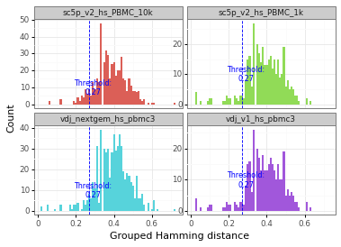
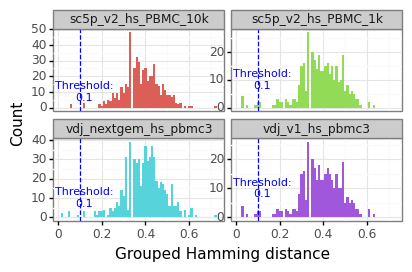

V(D)J clustering
================

.. figure:: img/dandelion_logo_illustration.png
   :alt: dandelion_logo

   dandelion_logo

On the topic of finding clones/clonotypes, there are many ways used for
clustering BCRs, almost all involving some measure based on sequence
similarity. There are also a lot of very well established guidelines and
criterias maintained by the BCR community. For example, *immcantation*
uses a number of model-based
`methods <https://changeo.readthedocs.io/en/stable/methods/clustering.html>`__
`[Gupta2015] <https://academic.oup.com/bioinformatics/article/31/20/3356/195677>`__
to group clones based on the distribution of length-normalised
junctional hamming distance while others use the whole BCR V(D)J
sequence to define clones as shown in this paper
`[Bashford-Rogers19] <https://www.nature.com/articles/s41586-019-1595-3>`__.

**Import modules**

.. code:: ipython3

    import os
    import pandas as pd
    import dandelion as ddl
    ddl.logging.print_header()

.. parsed-literal::

    dandelion==0.2.4.dev57 pandas==1.4.2 numpy==1.21.6 matplotlib==3.5.2 networkx==2.8.4 scipy==1.8.1

.. code:: ipython3

    # change directory to somewhere more workable
    os.chdir(os.path.expanduser('/Users/kt16/Downloads/dandelion_tutorial/'))
    # I'm importing scanpy here to make use of its logging module.
    import scanpy as sc
    sc.settings.verbosity = 3
    import warnings
    warnings.filterwarnings('ignore')
    sc.logging.print_header()

.. parsed-literal::

    scanpy==1.9.1 anndata==0.8.0 umap==0.5.3 numpy==1.21.6 scipy==1.8.1 pandas==1.4.2 scikit-learn==1.1.1 statsmodels==0.13.2 python-igraph==0.9.11 pynndescent==0.5.7

**Read in the previously saved files**

I will work with the same example from the previous section since I have
the filtered V(D)J data stored in a ``Dandelion`` class.

.. code:: ipython3

    vdj = ddl.read_h5ddl('dandelion_results.h5ddl')
    vdj

.. parsed-literal::

    Dandelion class object with n_obs = 2773 and n_contigs = 5706
        data: 'sequence_id', 'sequence', 'rev_comp', 'productive', 'v_call', 'd_call', 'j_call', 'sequence_alignment', 'germline_alignment', 'junction', 'junction_aa', 'v_cigar', 'd_cigar', 'j_cigar', 'stop_codon', 'vj_in_frame', 'locus', 'junction_length', 'np1_length', 'np2_length', 'v_sequence_start', 'v_sequence_end', 'v_germline_start', 'v_germline_end', 'd_sequence_start', 'd_sequence_end', 'd_germline_start', 'd_germline_end', 'j_sequence_start', 'j_sequence_end', 'j_germline_start', 'j_germline_end', 'v_score', 'v_identity', 'v_support', 'd_score', 'd_identity', 'd_support', 'j_score', 'j_identity', 'j_support', 'fwr1', 'fwr2', 'fwr3', 'fwr4', 'cdr1', 'cdr2', 'cdr3', 'cell_id', 'c_call', 'consensus_count', 'duplicate_count', 'v_call_10x', 'd_call_10x', 'j_call_10x', 'junction_10x', 'junction_10x_aa', 'v_call_genotyped', 'germline_alignment_d_mask', 'sample_id', 'j_support_igblastn', 'j_score_igblastn', 'j_call_igblastn', 'j_call_blastn', 'j_identity_blastn', 'j_alignment_length_blastn', 'j_number_of_mismatches_blastn', 'j_number_of_gap_openings_blastn', 'j_sequence_start_blastn', 'j_sequence_end_blastn', 'j_germline_start_blastn', 'j_germline_end_blastn', 'j_support_blastn', 'j_score_blastn', 'j_sequence_alignment_blastn', 'j_germline_alignment_blastn', 'cell_id_blastn', 'j_source', 'd_support_igblastn', 'd_score_igblastn', 'd_call_igblastn', 'd_call_blastn', 'd_identity_blastn', 'd_alignment_length_blastn', 'd_number_of_mismatches_blastn', 'd_number_of_gap_openings_blastn', 'd_sequence_start_blastn', 'd_sequence_end_blastn', 'd_germline_start_blastn', 'd_germline_end_blastn', 'd_support_blastn', 'd_score_blastn', 'd_sequence_alignment_blastn', 'd_germline_alignment_blastn', 'd_source', 'c_sequence_alignment', 'c_germline_alignment', 'c_sequence_start', 'c_sequence_end', 'c_score', 'c_identity', 'c_call_10x', 'junction_aa_length', 'fwr1_aa', 'fwr2_aa', 'fwr3_aa', 'fwr4_aa', 'cdr1_aa', 'cdr2_aa', 'cdr3_aa', 'sequence_alignment_aa', 'v_sequence_alignment_aa', 'd_sequence_alignment_aa', 'j_sequence_alignment_aa', 'mu_count', 'ambiguous', 'rearrangement_status'
        metadata: 'sample_id', 'locus_VDJ', 'locus_VJ', 'productive_VDJ', 'productive_VJ', 'v_call_genotyped_VDJ', 'd_call_VDJ', 'j_call_VDJ', 'v_call_genotyped_VJ', 'j_call_VJ', 'c_call_VDJ', 'c_call_VJ', 'junction_VDJ', 'junction_VJ', 'junction_aa_VDJ', 'junction_aa_VJ', 'v_call_genotyped_B_VDJ', 'd_call_B_VDJ', 'j_call_B_VDJ', 'v_call_genotyped_B_VJ', 'j_call_B_VJ', 'productive_B_VDJ', 'productive_B_VJ', 'duplicate_count_B_VDJ', 'duplicate_count_B_VJ', 'isotype', 'isotype_status', 'locus_status', 'chain_status', 'rearrangement_status_VDJ', 'rearrangement_status_VJ'

Finding clones
--------------

The following is *dandelion*\ ’s implementation of a rather conventional
method to define clones, ``ddl.tl.find_clones``.

.. container:: alert alert-block alert-warning

   Clone definition is based on the following criterion: (1) Identical
   V- and J-gene usage in the VDJ chain (IGH/TRB/TRD). (2) Identical
   CDR3 junctional/CDR3 sequence length in the VDJ chain. (3) VDJ chain
   junctional/CDR3 sequences attains a minimum of % sequence similarity,
   based on hamming distance. The similarity cut-off is tunable (default
   is 85%; change to 100% if analyzing TCR data). (4) VJ chain
   (IGK/IGL/TRA/TRG) usage. If cells within clones use different VJ
   chains, the clone will be splitted following the same conditions for
   VDJ chains in (1-3) as above.

.. container:: alert alert-block alert-info

   The ‘clone_id’ name follows a ``A_B_C_D_E_F`` format and largely
   reflects the conditions above where:

   (A) indicates if the contigs use the same V and J genes in the VDJ
   chain.

   (B) indicates if junctional/CDR3 sequences are equal in length in the
   VJ chain.

   (C) indicates if clones are splitted based on junctional/CDR3 hamming
   distance threshold (for VDJ chain).

   (D) indicates if the contigs use the same V and J genes in the VJ
   chain.

   (E) indicates if junctional/CDR3 sequences are equal in length in the
   VJ chain.

   (F) indicates if clones are splitted based on junctional/CDR3 hamming
   distance threshold (for VJ chain). If ``collapse_label = True``, then
   instead of a 6-part format i.e. ``A_B_C_D_E_F``, it becomes 4 parts:

   (A) indicates if the contigs use the same V and J genes in the VDJ
   chain.

   (B) indicates if junctional/CDR3 sequences are equal in length in the
   VDJ chain.

   (C) indicates if clones are splitted based on junctional/CDR3 hamming
   distance threshold (for VDJ chain).

   (D) a single global number indicating VJ chain pairing.

   The last position will not be annotated if there’s only one group of
   light chains usage detected in the clone.

Orphan VJs and ambiguous contigs will be ignored for this.

To prevent issues with clone ids matching between B cells and T cells,
there will be a prefix added to the clone_id to reflect whether or not
it’s a ``B``, ``abT`` or ``gdT`` clone.

Running ``ddl.tl.find_clones``
~~~~~~~~~~~~~~~~~~~~~~~~~~~~~~

The function will take a file path, a pandas ``DataFrame`` (for example
if you’ve used pandas to read in the filtered file already), or a
``Dandelion`` class object. The default mode for calculation of
junctional hamming distance is to use the CDR3 junction amino acid
sequences, specified via the ``key`` option (``None`` defaults to
``junction_aa``). You can switch it to using CDR3 junction nucleotide
sequences (``key = 'junction'``), or even the full V(D)J amino acid
sequence (``key = 'sequence_alignment_aa``), as long as the column name
exists in the ``.data`` slot.

If you want to use the alleles for defining V-J gene usuage, specify:

.. code:: python

   by_alleles = True

Clustering TCR is potentially possible with the same setup, although
some parameters may need to be tweaked (covered in the TCR section).

.. code:: ipython3

    ddl.tl.find_clones(vdj)
    vdj

.. parsed-literal::

    Finding clonotypes

.. parsed-literal::

    Finding clones based on B cell VDJ chains : 100%|██████████| 217/217 [00:00<00:00, 953.21it/s]                                                   
    Refining clone assignment based on VJ chain pairing : 100%|██████████| 2586/2586 [00:00<00:00, 318910.65it/s]                                    

.. parsed-literal::

     finished: Updated Dandelion object: 
       'data', contig-indexed clone table
       'metadata', cell-indexed clone table
     (0:00:00)

.. parsed-literal::

    

.. parsed-literal::

    Dandelion class object with n_obs = 2773 and n_contigs = 5609
        data: 'sequence_id', 'sequence', 'rev_comp', 'productive', 'v_call', 'd_call', 'j_call', 'sequence_alignment', 'germline_alignment', 'junction', 'junction_aa', 'v_cigar', 'd_cigar', 'j_cigar', 'stop_codon', 'vj_in_frame', 'locus', 'junction_length', 'np1_length', 'np2_length', 'v_sequence_start', 'v_sequence_end', 'v_germline_start', 'v_germline_end', 'd_sequence_start', 'd_sequence_end', 'd_germline_start', 'd_germline_end', 'j_sequence_start', 'j_sequence_end', 'j_germline_start', 'j_germline_end', 'v_score', 'v_identity', 'v_support', 'd_score', 'd_identity', 'd_support', 'j_score', 'j_identity', 'j_support', 'fwr1', 'fwr2', 'fwr3', 'fwr4', 'cdr1', 'cdr2', 'cdr3', 'cell_id', 'c_call', 'consensus_count', 'duplicate_count', 'v_call_10x', 'd_call_10x', 'j_call_10x', 'junction_10x', 'junction_10x_aa', 'v_call_genotyped', 'germline_alignment_d_mask', 'sample_id', 'j_support_igblastn', 'j_score_igblastn', 'j_call_igblastn', 'j_call_blastn', 'j_identity_blastn', 'j_alignment_length_blastn', 'j_number_of_mismatches_blastn', 'j_number_of_gap_openings_blastn', 'j_sequence_start_blastn', 'j_sequence_end_blastn', 'j_germline_start_blastn', 'j_germline_end_blastn', 'j_support_blastn', 'j_score_blastn', 'j_sequence_alignment_blastn', 'j_germline_alignment_blastn', 'cell_id_blastn', 'j_source', 'd_support_igblastn', 'd_score_igblastn', 'd_call_igblastn', 'd_call_blastn', 'd_identity_blastn', 'd_alignment_length_blastn', 'd_number_of_mismatches_blastn', 'd_number_of_gap_openings_blastn', 'd_sequence_start_blastn', 'd_sequence_end_blastn', 'd_germline_start_blastn', 'd_germline_end_blastn', 'd_support_blastn', 'd_score_blastn', 'd_sequence_alignment_blastn', 'd_germline_alignment_blastn', 'd_source', 'c_sequence_alignment', 'c_germline_alignment', 'c_sequence_start', 'c_sequence_end', 'c_score', 'c_identity', 'c_call_10x', 'junction_aa_length', 'fwr1_aa', 'fwr2_aa', 'fwr3_aa', 'fwr4_aa', 'cdr1_aa', 'cdr2_aa', 'cdr3_aa', 'sequence_alignment_aa', 'v_sequence_alignment_aa', 'd_sequence_alignment_aa', 'j_sequence_alignment_aa', 'mu_count', 'ambiguous', 'rearrangement_status', 'clone_id'
        metadata: 'clone_id', 'clone_id_by_size', 'sample_id', 'locus_VDJ', 'locus_VJ', 'productive_VDJ', 'productive_VJ', 'v_call_genotyped_VDJ', 'd_call_VDJ', 'j_call_VDJ', 'v_call_genotyped_VJ', 'j_call_VJ', 'c_call_VDJ', 'c_call_VJ', 'junction_VDJ', 'junction_VJ', 'junction_aa_VDJ', 'junction_aa_VJ', 'v_call_genotyped_B_VDJ', 'd_call_B_VDJ', 'j_call_B_VDJ', 'v_call_genotyped_B_VJ', 'j_call_B_VJ', 'productive_B_VDJ', 'productive_B_VJ', 'duplicate_count_B_VDJ', 'duplicate_count_B_VJ', 'isotype', 'isotype_status', 'locus_status', 'chain_status', 'rearrangement_status_VDJ', 'rearrangement_status_VJ'

This will return a new column with the column name ``'clone_id'`` as per
convention. If a file path is provided as input, it will also save the
file automatically into the base directory of the file name. Otherwise,
a ``Dandelion`` object will be returned.

.. code:: ipython3

    vdj.metadata

.. raw:: html

    

    
    <table border="1" class="dataframe">
      <thead>
        <tr style="text-align: right;">
          <th></th>
          <th>clone_id</th>
          <th>clone_id_by_size</th>
          <th>sample_id</th>
          <th>locus_VDJ</th>
          <th>locus_VJ</th>
          <th>productive_VDJ</th>
          <th>productive_VJ</th>
          <th>v_call_genotyped_VDJ</th>
          <th>d_call_VDJ</th>
          <th>j_call_VDJ</th>
          <th>...</th>
          <th>productive_B_VDJ</th>
          <th>productive_B_VJ</th>
          <th>duplicate_count_B_VDJ</th>
          <th>duplicate_count_B_VJ</th>
          <th>isotype</th>
          <th>isotype_status</th>
          <th>locus_status</th>
          <th>chain_status</th>
          <th>rearrangement_status_VDJ</th>
          <th>rearrangement_status_VJ</th>
        </tr>
      </thead>
      <tbody>
        <tr>
          <th>sc5p_v2_hs_PBMC_10k_AAACCTGTCATATCGG</th>
          <td>None</td>
          <td>None</td>
          <td>sc5p_v2_hs_PBMC_10k</td>
          <td>None</td>
          <td>IGK</td>
          <td>None</td>
          <td>T</td>
          <td>None</td>
          <td>None</td>
          <td>None</td>
          <td>...</td>
          <td>None</td>
          <td>T</td>
          <td>NaN</td>
          <td>68.0</td>
          <td>None</td>
          <td>None</td>
          <td>Orphan IGK</td>
          <td>Orphan VJ</td>
          <td>None</td>
          <td>standard</td>
        </tr>
        <tr>
          <th>sc5p_v2_hs_PBMC_10k_AAACCTGTCCGTTGTC</th>
          <td>B_36_3_2_153_2_2</td>
          <td>2191</td>
          <td>sc5p_v2_hs_PBMC_10k</td>
          <td>IGH</td>
          <td>IGK</td>
          <td>T</td>
          <td>T</td>
          <td>IGHV1-69</td>
          <td>IGHD3-22</td>
          <td>IGHJ3</td>
          <td>...</td>
          <td>T</td>
          <td>T</td>
          <td>51.0</td>
          <td>43.0</td>
          <td>IgM</td>
          <td>IgM</td>
          <td>IGH + IGK</td>
          <td>Single pair</td>
          <td>standard</td>
          <td>standard</td>
        </tr>
        <tr>
          <th>sc5p_v2_hs_PBMC_10k_AAACCTGTCGAGAACG</th>
          <td>B_40_1_1_181_1_1</td>
          <td>1172</td>
          <td>sc5p_v2_hs_PBMC_10k</td>
          <td>IGH</td>
          <td>IGL</td>
          <td>T</td>
          <td>T</td>
          <td>IGHV1-2</td>
          <td>None</td>
          <td>IGHJ3</td>
          <td>...</td>
          <td>T</td>
          <td>T</td>
          <td>47.0</td>
          <td>90.0</td>
          <td>IgM</td>
          <td>IgM</td>
          <td>IGH + IGL</td>
          <td>Single pair</td>
          <td>standard</td>
          <td>standard</td>
        </tr>
        <tr>
          <th>sc5p_v2_hs_PBMC_10k_AAACCTGTCTTGAGAC</th>
          <td>B_174_4_3_202_1_1</td>
          <td>1086</td>
          <td>sc5p_v2_hs_PBMC_10k</td>
          <td>IGH</td>
          <td>IGK</td>
          <td>T</td>
          <td>T</td>
          <td>IGHV5-51</td>
          <td>None</td>
          <td>IGHJ3</td>
          <td>...</td>
          <td>T</td>
          <td>T</td>
          <td>80.0</td>
          <td>22.0</td>
          <td>IgM</td>
          <td>IgM</td>
          <td>IGH + IGK</td>
          <td>Single pair</td>
          <td>standard</td>
          <td>standard</td>
        </tr>
        <tr>
          <th>sc5p_v2_hs_PBMC_10k_AAACGGGAGCGACGTA</th>
          <td>B_53_2_1_22_2_7</td>
          <td>1398</td>
          <td>sc5p_v2_hs_PBMC_10k</td>
          <td>IGH</td>
          <td>IGL</td>
          <td>T</td>
          <td>T</td>
          <td>IGHV4-4</td>
          <td>IGHD6-13</td>
          <td>IGHJ3</td>
          <td>...</td>
          <td>T</td>
          <td>T</td>
          <td>18.0</td>
          <td>14.0</td>
          <td>IgM</td>
          <td>IgM</td>
          <td>IGH + IGL</td>
          <td>Single pair</td>
          <td>standard</td>
          <td>standard</td>
        </tr>
        <tr>
          <th>...</th>
          <td>...</td>
          <td>...</td>
          <td>...</td>
          <td>...</td>
          <td>...</td>
          <td>...</td>
          <td>...</td>
          <td>...</td>
          <td>...</td>
          <td>...</td>
          <td>...</td>
          <td>...</td>
          <td>...</td>
          <td>...</td>
          <td>...</td>
          <td>...</td>
          <td>...</td>
          <td>...</td>
          <td>...</td>
          <td>...</td>
          <td>...</td>
        </tr>
        <tr>
          <th>vdj_v1_hs_pbmc3_TTTCCTCAGCAATATG</th>
          <td>B_82_2_1_41_2_8</td>
          <td>384</td>
          <td>vdj_v1_hs_pbmc3</td>
          <td>IGH</td>
          <td>IGK</td>
          <td>T</td>
          <td>T</td>
          <td>IGHV2-5</td>
          <td>IGHD5/OR15-5b,IGHD5/OR15-5a</td>
          <td>IGHJ4,IGHJ5</td>
          <td>...</td>
          <td>T</td>
          <td>T</td>
          <td>41.0</td>
          <td>71.0</td>
          <td>IgM</td>
          <td>IgM</td>
          <td>IGH + IGK</td>
          <td>Single pair</td>
          <td>standard</td>
          <td>standard</td>
        </tr>
        <tr>
          <th>vdj_v1_hs_pbmc3_TTTCCTCAGCGCTTAT</th>
          <td>B_148_6_5_99_1_3</td>
          <td>400</td>
          <td>vdj_v1_hs_pbmc3</td>
          <td>IGH</td>
          <td>IGK</td>
          <td>T</td>
          <td>T</td>
          <td>IGHV3-30</td>
          <td>IGHD4-17</td>
          <td>IGHJ6</td>
          <td>...</td>
          <td>T</td>
          <td>T</td>
          <td>11.0</td>
          <td>28.0</td>
          <td>IgM</td>
          <td>IgM</td>
          <td>IGH + IGK</td>
          <td>Single pair</td>
          <td>standard</td>
          <td>standard</td>
        </tr>
        <tr>
          <th>vdj_v1_hs_pbmc3_TTTCCTCAGGGAAACA</th>
          <td>B_70_1_1_68_4_13</td>
          <td>381</td>
          <td>vdj_v1_hs_pbmc3</td>
          <td>IGH</td>
          <td>IGK</td>
          <td>T</td>
          <td>T</td>
          <td>IGHV4-59</td>
          <td>IGHD6-13</td>
          <td>IGHJ2</td>
          <td>...</td>
          <td>T</td>
          <td>T</td>
          <td>14.0</td>
          <td>159.0</td>
          <td>IgM</td>
          <td>IgM</td>
          <td>IGH + IGK</td>
          <td>Single pair</td>
          <td>standard</td>
          <td>standard</td>
        </tr>
        <tr>
          <th>vdj_v1_hs_pbmc3_TTTGCGCCATACCATG</th>
          <td>B_68_7_1_114_2_6</td>
          <td>380</td>
          <td>vdj_v1_hs_pbmc3</td>
          <td>IGH</td>
          <td>IGL</td>
          <td>T</td>
          <td>T</td>
          <td>IGHV1-69</td>
          <td>IGHD2-15</td>
          <td>IGHJ6</td>
          <td>...</td>
          <td>T</td>
          <td>T</td>
          <td>32.0</td>
          <td>28.0</td>
          <td>IgM</td>
          <td>IgM</td>
          <td>IGH + IGL</td>
          <td>Single pair</td>
          <td>standard</td>
          <td>standard</td>
        </tr>
        <tr>
          <th>vdj_v1_hs_pbmc3_TTTGGTTGTAGGCATG</th>
          <td>B_186_5_3_178_3_2</td>
          <td>379</td>
          <td>vdj_v1_hs_pbmc3</td>
          <td>IGH</td>
          <td>IGL</td>
          <td>T</td>
          <td>T</td>
          <td>IGHV3-23</td>
          <td>None</td>
          <td>IGHJ4</td>
          <td>...</td>
          <td>T</td>
          <td>T</td>
          <td>22.0</td>
          <td>36.0</td>
          <td>IgM</td>
          <td>IgM</td>
          <td>IGH + IGL</td>
          <td>Single pair</td>
          <td>standard</td>
          <td>standard</td>
        </tr>
      </tbody>
    </table>
    
2773 rows × 33 columns

    

Alternative : Running ``tl.define_clones``
~~~~~~~~~~~~~~~~~~~~~~~~~~~~~~~~~~~~~~~~~~

Alternatively, a wrapper to call *changeo’s* ``DefineClones.py``
`[Gupta2015] <https://academic.oup.com/bioinformatics/article/31/20/3356/195677>`__
is also included. To run it, you need to choose the distance threshold
for clonal assignment. To facilitate this, the function
``pp.calculate_threshold`` will run `shazam’s
distToNearest <https://shazam.readthedocs.io/en/stable/topics/distToNearest/>`__
function and return a plot showing the length normalized hamming
distance distribution and automated threshold value.

Again, ``pp.calculate_threshold`` will take a file path, pandas
``DataFrame`` or ``Dandelion`` object as input. If a dandelion object is
provided, the threshold value will be inserted into the ``.threshold``
slot. For more fine control, please use `shazam’s
distToNearest <https://shazam.readthedocs.io/en/stable/topics/distToNearest/>`__
and `changeo’s
DefineClones.py <https://immcantation.readthedocs.io/en/stable/tutorials/10x_tutorial.html>`__
functions directly.

.. code:: ipython3

    ddl.pp.calculate_threshold(vdj)

.. parsed-literal::

    Calculating threshold

.. parsed-literal::

    R[write to console]: Error in (function (db, sequenceColumn = "junction", vCallColumn = "v_call",  : 
      54 cell(s) with multiple heavy chains found. One heavy chain per cell is expected.
    

.. parsed-literal::

    Rerun this after filtering. For now, switching to heavy mode.
          Threshold method 'density' did not return with any values. Switching to method = 'gmm'.

.. parsed-literal::

    
     finished: Updated Dandelion object: 
       'threshold', threshold value for tuning clonal assignment
     (0:01:54)

.. code:: ipython3

    # see the actual value in .threshold slot
    vdj.threshold

.. parsed-literal::

    0.26895803577794286

You can also manually select a value as the threshold if you wish. Note
that rerunning this with ``manual_threshold`` is just for reproducing
the plot but with the line at 0.1 in this tutorial. You can just edit
``vdj.threshold`` directly if you wish.

.. code:: ipython3

    ddl.pp.calculate_threshold(vdj, manual_threshold = 0.1)

.. parsed-literal::

    Calculating threshold

.. parsed-literal::

    R[write to console]: Error in (function (db, sequenceColumn = "junction", vCallColumn = "v_call",  : 
      54 cell(s) with multiple heavy chains found. One heavy chain per cell is expected.
    

.. parsed-literal::

    Rerun this after filtering. For now, switching to heavy mode.
          Threshold method 'density' did not return with any values. Switching to method = 'gmm'.

.. parsed-literal::

    
     finished: Updated Dandelion object: 
       'threshold', threshold value for tuning clonal assignment
     (0:01:22)

.. code:: ipython3

    # see the updated .threshold slot
    vdj.threshold

.. parsed-literal::

    0.1

We can run ``ddl.tl.define_clones`` to call *changeo’s*
``DefineClones.py``; see
`here <https://changeo.readthedocs.io/en/stable/methods/clustering.html>`__
for more info. Note, if a ``pandas.DataFrame`` or file path is provided
as the input, the value in dist option (corresponds to threshold value)
needs to be manually supplied. If a ``Dandelion`` object is provided, it
will automatically retrieve it from the threshold slot.

.. code:: ipython3

    ddl.tl.define_clones(vdj, key_added = 'changeo_clone_id')
    vdj

.. parsed-literal::

    Finding clones
    Running command: DefineClones.py -d /var/folders/nb/wrd6px6171j52lqpmkljt6vw000l2l/T/tmpyr37996v/tmp/dandelion_define_clones_heavy-clone.tsv -o /var/folders/nb/wrd6px6171j52lqpmkljt6vw000l2l/T/tmpdxu1m08j/dandelion_define_clones_heavy-clone.tsv --act set --model ham --norm len --dist 0.1 --nproc 1 --vf v_call_genotyped
    
           START> DefineClones
            FILE> dandelion_define_clones_heavy-clone.tsv
       SEQ_FIELD> junction
         V_FIELD> v_call_genotyped
         J_FIELD> j_call
     MAX_MISSING> 0
    GROUP_FIELDS> None
          ACTION> set
            MODE> gene
        DISTANCE> 0.1
         LINKAGE> single
           MODEL> ham
            NORM> len
             SYM> avg
           NPROC> 1
    
    PROGRESS> [Grouping sequences] 08:29:16 (2641) 0.0 min
    
    PROGRESS> [Assigning clones] 08:29:23 |####################| 100% (2,641) 0.2 min
    
     OUTPUT> dandelion_define_clones_heavy-clone.tsv
     CLONES> 2077
    RECORDS> 2641
       PASS> 2641
       FAIL> 0
        END> DefineClones
    
     finished: Updated Dandelion object: 
       'data', contig-indexed clone table
       'metadata', cell-indexed clone table
     (0:00:32)

.. parsed-literal::

    Dandelion class object with n_obs = 2773 and n_contigs = 5609
        data: 'sequence_id', 'sequence', 'rev_comp', 'productive', 'v_call', 'd_call', 'j_call', 'sequence_alignment', 'germline_alignment', 'junction', 'junction_aa', 'v_cigar', 'd_cigar', 'j_cigar', 'stop_codon', 'vj_in_frame', 'locus', 'junction_length', 'np1_length', 'np2_length', 'v_sequence_start', 'v_sequence_end', 'v_germline_start', 'v_germline_end', 'd_sequence_start', 'd_sequence_end', 'd_germline_start', 'd_germline_end', 'j_sequence_start', 'j_sequence_end', 'j_germline_start', 'j_germline_end', 'v_score', 'v_identity', 'v_support', 'd_score', 'd_identity', 'd_support', 'j_score', 'j_identity', 'j_support', 'fwr1', 'fwr2', 'fwr3', 'fwr4', 'cdr1', 'cdr2', 'cdr3', 'cell_id', 'c_call', 'consensus_count', 'duplicate_count', 'v_call_10x', 'd_call_10x', 'j_call_10x', 'junction_10x', 'junction_10x_aa', 'v_call_genotyped', 'germline_alignment_d_mask', 'sample_id', 'j_support_igblastn', 'j_score_igblastn', 'j_call_igblastn', 'j_call_blastn', 'j_identity_blastn', 'j_alignment_length_blastn', 'j_number_of_mismatches_blastn', 'j_number_of_gap_openings_blastn', 'j_sequence_start_blastn', 'j_sequence_end_blastn', 'j_germline_start_blastn', 'j_germline_end_blastn', 'j_support_blastn', 'j_score_blastn', 'j_sequence_alignment_blastn', 'j_germline_alignment_blastn', 'cell_id_blastn', 'j_source', 'd_support_igblastn', 'd_score_igblastn', 'd_call_igblastn', 'd_call_blastn', 'd_identity_blastn', 'd_alignment_length_blastn', 'd_number_of_mismatches_blastn', 'd_number_of_gap_openings_blastn', 'd_sequence_start_blastn', 'd_sequence_end_blastn', 'd_germline_start_blastn', 'd_germline_end_blastn', 'd_support_blastn', 'd_score_blastn', 'd_sequence_alignment_blastn', 'd_germline_alignment_blastn', 'd_source', 'c_sequence_alignment', 'c_germline_alignment', 'c_sequence_start', 'c_sequence_end', 'c_score', 'c_identity', 'c_call_10x', 'junction_aa_length', 'fwr1_aa', 'fwr2_aa', 'fwr3_aa', 'fwr4_aa', 'cdr1_aa', 'cdr2_aa', 'cdr3_aa', 'sequence_alignment_aa', 'v_sequence_alignment_aa', 'd_sequence_alignment_aa', 'j_sequence_alignment_aa', 'mu_count', 'ambiguous', 'rearrangement_status', 'clone_id', 'changeo_clone_id'
        metadata: 'clone_id', 'clone_id_by_size', 'sample_id', 'locus_VDJ', 'locus_VJ', 'productive_VDJ', 'productive_VJ', 'v_call_genotyped_VDJ', 'd_call_VDJ', 'j_call_VDJ', 'v_call_genotyped_VJ', 'j_call_VJ', 'c_call_VDJ', 'c_call_VJ', 'junction_VDJ', 'junction_VJ', 'junction_aa_VDJ', 'junction_aa_VJ', 'v_call_genotyped_B_VDJ', 'd_call_B_VDJ', 'j_call_B_VDJ', 'v_call_genotyped_B_VJ', 'j_call_B_VJ', 'productive_B_VDJ', 'productive_B_VJ', 'duplicate_count_B_VDJ', 'duplicate_count_B_VJ', 'isotype', 'isotype_status', 'locus_status', 'chain_status', 'rearrangement_status_VDJ', 'rearrangement_status_VJ', 'changeo_clone_id'

Note that I specified the option ``key_added`` and this adds the output
from ``tl.define_clones`` into a separate column. If left as default
(``None``), it will write into ``clone_id`` column. The same option can
be specified in ``tl.find_clones`` earlier.

Generation of V(D)J network
---------------------------

*dandelion* generates a network to facilitate visualisation of results,
inspired from
`[Bashford-Rogers13] <https://genome.cshlp.org/content/23/11/1874>`__.
This uses the full V(D)J contig sequences instead of just the junctional
sequences to chart a tree-like network for each clone. The actual
visualization will be achieved through ``scanpy`` later.

``ddl.tl.generate_network``
~~~~~~~~~~~~~~~~~~~~~~~~~~~

First we need to generate the network. ``ddl.tl.generate_network`` will
take a V(D)J table that has clones defined, specifically under the
``'clone_id'`` column. The default mode is to use amino acid sequences
for constructing Levenshtein distance matrices, but can be toggled using
the ``key`` option.

If you have a pre-processed table parsed from immcantation’s
`method <https://changeo.readthedocs.io/en/stable/examples/10x.html>`__,
or any other method as long as it’s in a *AIRR* format, the table can be
used as well.

You can specify the ``clone_key`` option for generating the network for
the clone id definition of choice as long as it exists as a column in
the ``.data`` slot.

.. code:: ipython3

    ddl.tl.generate_network(vdj)

.. parsed-literal::

    Generating network

.. parsed-literal::

    Setting up data: 5609it [00:02, 2221.64it/s]
    Calculating distances... : 100%|██████████| 2232/2232 [00:01<00:00, 1831.05it/s]                                                                 
    Generating edge list : 100%|██████████| 526/526 [00:00<00:00, 945.55it/s]                                                                        
    Computing overlap : 100%|██████████| 2232/2232 [00:02<00:00, 813.93it/s]                                                                         
    Linking edges : 100%|██████████| 2045/2045 [00:00<00:00, 2193.15it/s]                                                                            

.. parsed-literal::

    generating network layout

.. parsed-literal::

    

.. parsed-literal::

     finished: Updated Dandelion object: 
       'data', contig-indexed clone table
       'metadata', cell-indexed clone table
       'layout', graph layout
       'graph', network constructed from distance matrices of VDJ- and VJ- chains (0:01:46)

In ``dandelion`` version ``>=0.2.2``, the default ``layout_method`` is
changed to ``sfdp``, which is implemented through ``graph-tool``
`package <https://graph-tool.skewed.de/>`__. This is significantly
faster than the default modified Fruchterman-Reingold layout which while
will work reasonably fast here, it will take quite a while when a lot of
contigs are provided (>100k cells may take 1 hour). You can toggle this
behaviour with:

.. code:: python

   ddl.tl.generate_network(vdj, layout_method = 'mod_fr') # for the original
   ddl.tl.generate_network(vdj, layout_method = 'sfdp') # for sfdp

generating graph without layout
^^^^^^^^^^^^^^^^^^^^^^^^^^^^^^^

If you don’t care for the layout and simply want access to the
network/graph, you can do:

.. code:: python

   ddl.tl.generate_network(vdj, compute_layout = False)

and use the ``networkx`` graph in ``vdj.graph[0]`` or ``vdj.graph[1]``
and compute your own layout as you wish.

down sampling data/graph
^^^^^^^^^^^^^^^^^^^^^^^^

You can also downsample the number of cells. This will return a new
object as a downsampled copy of the original with its own distance
matrix.

.. code:: ipython3

    vdj_downsample = ddl.tl.generate_network(vdj, downsample = 500)
    vdj_downsample

.. parsed-literal::

    Generating network
    Downsampling to 500 cells.

.. parsed-literal::

    Setting up data: 1032it [00:00, 2807.81it/s]
    Calculating distances... : 100%|██████████| 532/532 [00:00<00:00, 3029.19it/s]                                                                   
    Generating edge list : 100%|██████████| 25/25 [00:00<00:00, 977.75it/s]                                                                          
    Computing overlap : 100%|██████████| 532/532 [00:00<00:00, 1113.32it/s]                                                                          
    Linking edges : 100%|██████████| 470/470 [00:00<00:00, 10652.98it/s]                                                                             

.. parsed-literal::

    generating network layout

.. parsed-literal::

    

.. parsed-literal::

     finished: Updated Dandelion object: 
       'data', contig-indexed clone table
       'metadata', cell-indexed clone table
       'layout', graph layout
       'graph', network constructed from distance matrices of VDJ- and VJ- chains (0:00:03)

.. parsed-literal::

    Dandelion class object with n_obs = 497 and n_contigs = 1032
        data: 'sequence_id', 'sequence', 'rev_comp', 'productive', 'v_call', 'd_call', 'j_call', 'sequence_alignment', 'germline_alignment', 'junction', 'junction_aa', 'v_cigar', 'd_cigar', 'j_cigar', 'stop_codon', 'vj_in_frame', 'locus', 'junction_length', 'np1_length', 'np2_length', 'v_sequence_start', 'v_sequence_end', 'v_germline_start', 'v_germline_end', 'd_sequence_start', 'd_sequence_end', 'd_germline_start', 'd_germline_end', 'j_sequence_start', 'j_sequence_end', 'j_germline_start', 'j_germline_end', 'v_score', 'v_identity', 'v_support', 'd_score', 'd_identity', 'd_support', 'j_score', 'j_identity', 'j_support', 'fwr1', 'fwr2', 'fwr3', 'fwr4', 'cdr1', 'cdr2', 'cdr3', 'cell_id', 'c_call', 'consensus_count', 'duplicate_count', 'v_call_10x', 'd_call_10x', 'j_call_10x', 'junction_10x', 'junction_10x_aa', 'v_call_genotyped', 'germline_alignment_d_mask', 'sample_id', 'j_support_igblastn', 'j_score_igblastn', 'j_call_igblastn', 'j_call_blastn', 'j_identity_blastn', 'j_alignment_length_blastn', 'j_number_of_mismatches_blastn', 'j_number_of_gap_openings_blastn', 'j_sequence_start_blastn', 'j_sequence_end_blastn', 'j_germline_start_blastn', 'j_germline_end_blastn', 'j_support_blastn', 'j_score_blastn', 'j_sequence_alignment_blastn', 'j_germline_alignment_blastn', 'cell_id_blastn', 'j_source', 'd_support_igblastn', 'd_score_igblastn', 'd_call_igblastn', 'd_call_blastn', 'd_identity_blastn', 'd_alignment_length_blastn', 'd_number_of_mismatches_blastn', 'd_number_of_gap_openings_blastn', 'd_sequence_start_blastn', 'd_sequence_end_blastn', 'd_germline_start_blastn', 'd_germline_end_blastn', 'd_support_blastn', 'd_score_blastn', 'd_sequence_alignment_blastn', 'd_germline_alignment_blastn', 'd_source', 'c_sequence_alignment', 'c_germline_alignment', 'c_sequence_start', 'c_sequence_end', 'c_score', 'c_identity', 'c_call_10x', 'junction_aa_length', 'fwr1_aa', 'fwr2_aa', 'fwr3_aa', 'fwr4_aa', 'cdr1_aa', 'cdr2_aa', 'cdr3_aa', 'sequence_alignment_aa', 'v_sequence_alignment_aa', 'd_sequence_alignment_aa', 'j_sequence_alignment_aa', 'mu_count', 'ambiguous', 'rearrangement_status', 'clone_id', 'changeo_clone_id'
        metadata: 'clone_id', 'clone_id_by_size', 'sample_id', 'locus_VDJ', 'locus_VJ', 'productive_VDJ', 'productive_VJ', 'v_call_genotyped_VDJ', 'd_call_VDJ', 'j_call_VDJ', 'v_call_genotyped_VJ', 'j_call_VJ', 'c_call_VDJ', 'c_call_VJ', 'junction_VDJ', 'junction_VJ', 'junction_aa_VDJ', 'junction_aa_VJ', 'v_call_genotyped_B_VDJ', 'd_call_B_VDJ', 'j_call_B_VDJ', 'v_call_genotyped_B_VJ', 'j_call_B_VJ', 'productive_B_VDJ', 'productive_B_VJ', 'duplicate_count_B_VDJ', 'duplicate_count_B_VJ', 'isotype', 'isotype_status', 'locus_status', 'chain_status', 'rearrangement_status_VDJ', 'rearrangement_status_VJ'
        layout: layout for 497 vertices, layout for 52 vertices
        graph: networkx graph of 497 vertices, networkx graph of 52 vertices 

**check the newly re-initialized Dandelion object**

.. code:: ipython3

    vdj

.. parsed-literal::

    Dandelion class object with n_obs = 2773 and n_contigs = 5609
        data: 'sequence_id', 'sequence', 'rev_comp', 'productive', 'v_call', 'd_call', 'j_call', 'sequence_alignment', 'germline_alignment', 'junction', 'junction_aa', 'v_cigar', 'd_cigar', 'j_cigar', 'stop_codon', 'vj_in_frame', 'locus', 'junction_length', 'np1_length', 'np2_length', 'v_sequence_start', 'v_sequence_end', 'v_germline_start', 'v_germline_end', 'd_sequence_start', 'd_sequence_end', 'd_germline_start', 'd_germline_end', 'j_sequence_start', 'j_sequence_end', 'j_germline_start', 'j_germline_end', 'v_score', 'v_identity', 'v_support', 'd_score', 'd_identity', 'd_support', 'j_score', 'j_identity', 'j_support', 'fwr1', 'fwr2', 'fwr3', 'fwr4', 'cdr1', 'cdr2', 'cdr3', 'cell_id', 'c_call', 'consensus_count', 'duplicate_count', 'v_call_10x', 'd_call_10x', 'j_call_10x', 'junction_10x', 'junction_10x_aa', 'v_call_genotyped', 'germline_alignment_d_mask', 'sample_id', 'j_support_igblastn', 'j_score_igblastn', 'j_call_igblastn', 'j_call_blastn', 'j_identity_blastn', 'j_alignment_length_blastn', 'j_number_of_mismatches_blastn', 'j_number_of_gap_openings_blastn', 'j_sequence_start_blastn', 'j_sequence_end_blastn', 'j_germline_start_blastn', 'j_germline_end_blastn', 'j_support_blastn', 'j_score_blastn', 'j_sequence_alignment_blastn', 'j_germline_alignment_blastn', 'cell_id_blastn', 'j_source', 'd_support_igblastn', 'd_score_igblastn', 'd_call_igblastn', 'd_call_blastn', 'd_identity_blastn', 'd_alignment_length_blastn', 'd_number_of_mismatches_blastn', 'd_number_of_gap_openings_blastn', 'd_sequence_start_blastn', 'd_sequence_end_blastn', 'd_germline_start_blastn', 'd_germline_end_blastn', 'd_support_blastn', 'd_score_blastn', 'd_sequence_alignment_blastn', 'd_germline_alignment_blastn', 'd_source', 'c_sequence_alignment', 'c_germline_alignment', 'c_sequence_start', 'c_sequence_end', 'c_score', 'c_identity', 'c_call_10x', 'junction_aa_length', 'fwr1_aa', 'fwr2_aa', 'fwr3_aa', 'fwr4_aa', 'cdr1_aa', 'cdr2_aa', 'cdr3_aa', 'sequence_alignment_aa', 'v_sequence_alignment_aa', 'd_sequence_alignment_aa', 'j_sequence_alignment_aa', 'mu_count', 'ambiguous', 'rearrangement_status', 'clone_id', 'changeo_clone_id'
        metadata: 'clone_id', 'clone_id_by_size', 'sample_id', 'locus_VDJ', 'locus_VJ', 'productive_VDJ', 'productive_VJ', 'v_call_genotyped_VDJ', 'd_call_VDJ', 'j_call_VDJ', 'v_call_genotyped_VJ', 'j_call_VJ', 'c_call_VDJ', 'c_call_VJ', 'junction_VDJ', 'junction_VJ', 'junction_aa_VDJ', 'junction_aa_VJ', 'v_call_genotyped_B_VDJ', 'd_call_B_VDJ', 'j_call_B_VDJ', 'v_call_genotyped_B_VJ', 'j_call_B_VJ', 'productive_B_VDJ', 'productive_B_VJ', 'duplicate_count_B_VDJ', 'duplicate_count_B_VJ', 'isotype', 'isotype_status', 'locus_status', 'chain_status', 'rearrangement_status_VDJ', 'rearrangement_status_VJ', 'changeo_clone_id'
        layout: layout for 2773 vertices, layout for 1067 vertices
        graph: networkx graph of 2773 vertices, networkx graph of 1067 vertices 

The graph/networks can be accessed through the ``.graph`` slot as an
`networkx <https://networkx.org/>`__ graph object if you want to extract
the data for network statistics or make any changes to the network.

At this point, we can save the dandelion object; the file can be quite
big because the distance matrix is not sparse. I reccomend some form of
compression (I use ``bzip2`` below but that can impact on read/write
times significantly). See
`here <https://pandas.pydata.org/pandas-docs/stable/reference/api/pandas.DataFrame.to_hdf.html>`__
for compression options.

.. code:: ipython3

    vdj.write_h5ddl('dandelion_results.h5ddl', complib = 'bzip2')

