Visualizing BCR data
====================

.. figure:: img/dandelion_logo_illustration.png
   :alt: dandelion_logo

   dandelion_logo

Integration with ``scanpy``
---------------------------

Now that we have both 1) a pre-processed BCR data in ``Dandelion``
object and 2) matching ``AnnData`` object, we can start finding clones
and *‘integrate’* the results. All the BCR analyses files can be saved
as *.tsv* format so that it can be used in other tools like
*immcantation*, *immunoarch*, *vdjtools*, etc.

The results can also be ported into the ``AnnData`` object for access to
more plotting functions provided through ``scanpy``
`[Wolf18] <https://doi.org/10.1186/s13059-017-1382-0>`__.

**Import modules**

.. code:: ipython3

    import os
    import pandas as pd
    import dandelion as ddl
    ddl.logging.print_header()

.. parsed-literal::

    dandelion==0.2.4.dev57 pandas==1.4.2 numpy==1.21.6 matplotlib==3.5.2 networkx==2.8.4 scipy==1.8.1

.. code:: ipython3

    # change directory to somewhere more workable
    os.chdir(os.path.expanduser('/Users/kt16/Downloads/dandelion_tutorial/'))
    # I'm importing scanpy here to make use of its logging module.
    import scanpy as sc
    sc.settings.verbosity = 3
    import warnings
    warnings.filterwarnings('ignore')
    sc.logging.print_header()

.. parsed-literal::

    scanpy==1.9.1 anndata==0.8.0 umap==0.5.3 numpy==1.21.6 scipy==1.8.1 pandas==1.4.2 scikit-learn==1.1.1 statsmodels==0.13.2 python-igraph==0.9.11 pynndescent==0.5.7

**Read in the previously saved files**

I will work with the same example from the previous section since I have
the ``AnnData`` object saved and vdj table filtered.

.. code:: ipython3

    adata = sc.read_h5ad('adata.h5ad')

.. code:: ipython3

    vdj = ddl.read_h5('dandelion_results.h5ddl')
    vdj

.. parsed-literal::

    Dandelion class object with n_obs = 2773 and n_contigs = 5609
        data: 'sequence_id', 'sequence', 'rev_comp', 'productive', 'v_call', 'd_call', 'j_call', 'sequence_alignment', 'germline_alignment', 'junction', 'junction_aa', 'v_cigar', 'd_cigar', 'j_cigar', 'stop_codon', 'vj_in_frame', 'locus', 'junction_length', 'np1_length', 'np2_length', 'v_sequence_start', 'v_sequence_end', 'v_germline_start', 'v_germline_end', 'd_sequence_start', 'd_sequence_end', 'd_germline_start', 'd_germline_end', 'j_sequence_start', 'j_sequence_end', 'j_germline_start', 'j_germline_end', 'v_score', 'v_identity', 'v_support', 'd_score', 'd_identity', 'd_support', 'j_score', 'j_identity', 'j_support', 'fwr1', 'fwr2', 'fwr3', 'fwr4', 'cdr1', 'cdr2', 'cdr3', 'cell_id', 'c_call', 'consensus_count', 'duplicate_count', 'v_call_10x', 'd_call_10x', 'j_call_10x', 'junction_10x', 'junction_10x_aa', 'v_call_genotyped', 'germline_alignment_d_mask', 'sample_id', 'j_support_igblastn', 'j_score_igblastn', 'j_call_igblastn', 'j_call_blastn', 'j_identity_blastn', 'j_alignment_length_blastn', 'j_number_of_mismatches_blastn', 'j_number_of_gap_openings_blastn', 'j_sequence_start_blastn', 'j_sequence_end_blastn', 'j_germline_start_blastn', 'j_germline_end_blastn', 'j_support_blastn', 'j_score_blastn', 'j_sequence_alignment_blastn', 'j_germline_alignment_blastn', 'cell_id_blastn', 'j_source', 'd_support_igblastn', 'd_score_igblastn', 'd_call_igblastn', 'd_call_blastn', 'd_identity_blastn', 'd_alignment_length_blastn', 'd_number_of_mismatches_blastn', 'd_number_of_gap_openings_blastn', 'd_sequence_start_blastn', 'd_sequence_end_blastn', 'd_germline_start_blastn', 'd_germline_end_blastn', 'd_support_blastn', 'd_score_blastn', 'd_sequence_alignment_blastn', 'd_germline_alignment_blastn', 'd_source', 'c_sequence_alignment', 'c_germline_alignment', 'c_sequence_start', 'c_sequence_end', 'c_score', 'c_identity', 'c_call_10x', 'junction_aa_length', 'fwr1_aa', 'fwr2_aa', 'fwr3_aa', 'fwr4_aa', 'cdr1_aa', 'cdr2_aa', 'cdr3_aa', 'sequence_alignment_aa', 'v_sequence_alignment_aa', 'd_sequence_alignment_aa', 'j_sequence_alignment_aa', 'mu_count', 'ambiguous', 'rearrangement_status', 'clone_id', 'changeo_clone_id'
        metadata: 'clone_id', 'clone_id_by_size', 'sample_id', 'locus_VDJ', 'locus_VJ', 'productive_VDJ', 'productive_VJ', 'v_call_genotyped_VDJ', 'd_call_VDJ', 'j_call_VDJ', 'v_call_genotyped_VJ', 'j_call_VJ', 'c_call_VDJ', 'c_call_VJ', 'junction_VDJ', 'junction_VJ', 'junction_aa_VDJ', 'junction_aa_VJ', 'v_call_genotyped_B_VDJ', 'd_call_B_VDJ', 'j_call_B_VDJ', 'v_call_genotyped_B_VJ', 'j_call_B_VJ', 'productive_B_VDJ', 'productive_B_VJ', 'duplicate_count_B_VDJ', 'duplicate_count_B_VJ', 'isotype', 'isotype_status', 'locus_status', 'chain_status', 'rearrangement_status_VDJ', 'rearrangement_status_VJ', 'changeo_clone_id'
        layout: layout for 2773 vertices, layout for 1067 vertices
        graph: networkx graph of 2773 vertices, networkx graph of 1067 vertices 

``tl.transfer``
~~~~~~~~~~~~~~~

To proceed, we first need to initialise the ``AnnData`` object with our
network. This is done by using the tool function ``tl.transfer``.

.. code:: ipython3

    ddl.tl.transfer(adata, vdj) # this will include singletons.
    adata

.. parsed-literal::

    Transferring network
    converting matrices
    Updating anndata slots
     finished: updated `.obs` with `.metadata`
    added to `.uns['neighbors']` and `.uns['clone_id']`
    and `.obsp`
       'distances', clonotype-weighted adjacency matrix
       'connectivities', clonotype-weighted adjacency matrix (0:00:33)

.. parsed-literal::

    AnnData object with n_obs × n_vars = 29000 × 1318
        obs: 'sampleid', 'batch', 'scrublet_score', 'n_genes', 'n_genes_by_counts', 'total_counts', 'total_counts_mt', 'pct_counts_mt', 'gmm_pct_count_clusters_keep', 'is_doublet', 'filter_rna', 'has_contig', 'sample_id', 'locus_VDJ', 'locus_VJ', 'productive_VDJ', 'productive_VJ', 'v_call_genotyped_VDJ', 'd_call_VDJ', 'j_call_VDJ', 'v_call_genotyped_VJ', 'j_call_VJ', 'c_call_VDJ', 'c_call_VJ', 'junction_VDJ', 'junction_VJ', 'junction_aa_VDJ', 'junction_aa_VJ', 'v_call_genotyped_B_VDJ', 'd_call_B_VDJ', 'j_call_B_VDJ', 'v_call_genotyped_B_VJ', 'j_call_B_VJ', 'productive_B_VDJ', 'productive_B_VJ', 'duplicate_count_B_VDJ', 'duplicate_count_B_VJ', 'isotype', 'isotype_status', 'locus_status', 'chain_status', 'rearrangement_status_VDJ', 'rearrangement_status_VJ', 'leiden', 'clone_id', 'clone_id_by_size', 'changeo_clone_id'
        var: 'feature_types', 'genome', 'gene_ids-0', 'gene_ids-1', 'gene_ids-2', 'gene_ids-3', 'n_cells', 'highly_variable', 'means', 'dispersions', 'dispersions_norm', 'mean', 'std'
        uns: 'chain_status_colors', 'hvg', 'leiden', 'leiden_colors', 'log1p', 'neighbors', 'pca', 'umap', 'rna_neighbors', 'clone_id'
        obsm: 'X_pca', 'X_umap', 'X_vdj'
        varm: 'PCs'
        obsp: 'connectivities', 'distances', 'rna_connectivities', 'rna_distances', 'vdj_connectivities', 'vdj_distances'

To show only expanded clones, specify ``expanded_only=True``

.. code:: ipython3

    adata2 = adata.copy()
    ddl.tl.transfer(adata2, vdj, expanded_only=True)
    adata2

.. parsed-literal::

    Transferring network
    converting matrices
    Updating anndata slots
     finished: updated `.obs` with `.metadata`
    added to `.uns['neighbors']` and `.uns['clone_id']`
    and `.obsp`
       'distances', clonotype-weighted adjacency matrix
       'connectivities', clonotype-weighted adjacency matrix (0:00:26)

.. parsed-literal::

    AnnData object with n_obs × n_vars = 29000 × 1318
        obs: 'sampleid', 'batch', 'scrublet_score', 'n_genes', 'n_genes_by_counts', 'total_counts', 'total_counts_mt', 'pct_counts_mt', 'gmm_pct_count_clusters_keep', 'is_doublet', 'filter_rna', 'has_contig', 'sample_id', 'locus_VDJ', 'locus_VJ', 'productive_VDJ', 'productive_VJ', 'v_call_genotyped_VDJ', 'd_call_VDJ', 'j_call_VDJ', 'v_call_genotyped_VJ', 'j_call_VJ', 'c_call_VDJ', 'c_call_VJ', 'junction_VDJ', 'junction_VJ', 'junction_aa_VDJ', 'junction_aa_VJ', 'v_call_genotyped_B_VDJ', 'd_call_B_VDJ', 'j_call_B_VDJ', 'v_call_genotyped_B_VJ', 'j_call_B_VJ', 'productive_B_VDJ', 'productive_B_VJ', 'duplicate_count_B_VDJ', 'duplicate_count_B_VJ', 'isotype', 'isotype_status', 'locus_status', 'chain_status', 'rearrangement_status_VDJ', 'rearrangement_status_VJ', 'leiden', 'clone_id', 'clone_id_by_size', 'changeo_clone_id'
        var: 'feature_types', 'genome', 'gene_ids-0', 'gene_ids-1', 'gene_ids-2', 'gene_ids-3', 'n_cells', 'highly_variable', 'means', 'dispersions', 'dispersions_norm', 'mean', 'std'
        uns: 'chain_status_colors', 'hvg', 'leiden', 'leiden_colors', 'log1p', 'neighbors', 'pca', 'umap', 'rna_neighbors', 'clone_id'
        obsm: 'X_pca', 'X_umap', 'X_vdj'
        varm: 'PCs'
        obsp: 'connectivities', 'distances', 'rna_connectivities', 'rna_distances', 'vdj_connectivities', 'vdj_distances'

.. container:: alert alert-block alert-info

   If a column with the same name between ``Dandelion.metadata`` and
   ``AnnData.obs`` already exists, ``tl.transfer`` will not overwrite
   the column in the ``AnnData`` object. This can be toggled to
   overwrite all with ``overwrite = True`` or
   ``overwrite = ['column_name1', 'column_name2']`` if only some columns
   are to be overwritten.

You can see that ``AnnData`` object now contains a couple more columns
in the ``.obs`` slot, corresponding to the metadata that is returned
after ``tl.generate_network``, and newly populated ``.obsm`` and
``.obsp`` slots. The original RNA connectivities and distances are now
added into the ``.obsp`` slot as well.

Plotting in ``scanpy``
----------------------

``ddl.pl.clone_network``
~~~~~~~~~~~~~~~~~~~~~~~~

So now, basically we can plot in ``scanpy`` with their plotting modules.
I’ve included a plotting function in **dandelion**,
``pl.clone_network``, which is really just a wrapper of their
``pl.embedding`` module.

.. code:: ipython3

    sc.set_figure_params(figsize = [4,4])
    ddl.pl.clone_network(adata, 
                         color = ['sampleid'], 
                         edges_width = 1,
                         size = 20)
    # show where clones/clonotypes have more than 1 cell
    ddl.pl.clone_network(adata2, 
                         color = ['sampleid'], 
                         edges_width = 1,
                         size = 20)

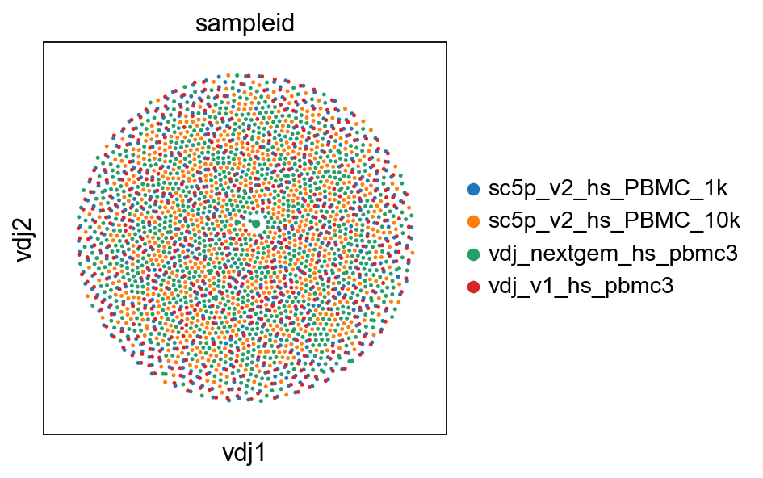

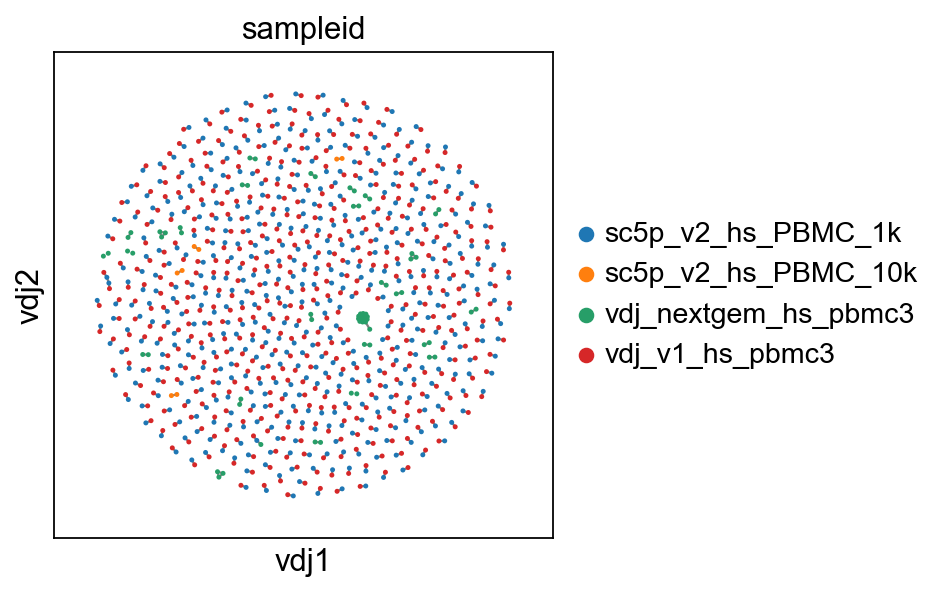

.. container:: alert alert-block alert-info

   if you prefer the original (modified) Fruchterman-Reingold layout,
   you can generate the layout with ``layout_method = 'mod_fr'``. Just
   note that this is significantly slower. Although the ``X`` and ``Y``
   axes (``vdj1`` and ``vdj2``) are arbitrary, the ``mod_fr`` layout
   seems to produce more pronounced repulsion between clusters, so
   something to keep in mind for when trying to work with a lot of
   cells/clusters.

.. code:: ipython3

    # making a copy of both adata and vdj
    vdj3 = vdj.copy()
    adata3 = adata.copy()
    # recompute layout with original method
    ddl.tl.generate_network(vdj3, layout_method = 'mod_fr')
    ddl.tl.transfer(adata3, vdj3)
    # also for > 1 cells
    adata4 = adata3.copy()
    ddl.tl.transfer(adata4, vdj3, expanded_only = True)
    # visualise
    ddl.pl.clone_network(adata3, 
                         color = ['sampleid'], 
                         edges_width = 1,
                         size = 20) 
    # show where clones/clonotypes have more than 1 cell
    ddl.pl.clone_network(adata4, 
                         color = ['sampleid'], 
                         edges_width = 1,
                         size = 20) 

.. parsed-literal::

    Generating network

.. parsed-literal::

    Setting up data: 5609it [00:02, 2454.40it/s]
    Calculating distances... : 100%|██████████| 2232/2232 [00:01<00:00, 1433.76it/s]                                                                 
    Generating edge list : 100%|██████████| 526/526 [00:07<00:00, 75.08it/s]                                                                         
    Computing overlap : 100%|██████████| 2232/2232 [00:02<00:00, 813.19it/s]                                                                         
    Linking edges : 100%|██████████| 2045/2045 [00:00<00:00, 2099.67it/s]                                                                            

.. parsed-literal::

    generating network layout

.. parsed-literal::

    

.. parsed-literal::

     finished: Updated Dandelion object: 
       'data', contig-indexed clone table
       'metadata', cell-indexed clone table
       'layout', graph layout
       'graph', network constructed from distance matrices of VDJ- and VJ- chains (0:01:55)
    Transferring network
    converting matrices
    Updating anndata slots
     finished: updated `.obs` with `.metadata`
    added to `.uns['neighbors']` and `.uns['clone_id']`
    and `.obsp`
       'distances', clonotype-weighted adjacency matrix
       'connectivities', clonotype-weighted adjacency matrix (0:00:24)
    Transferring network
    converting matrices
    Updating anndata slots
     finished: updated `.obs` with `.metadata`
    added to `.uns['neighbors']` and `.uns['clone_id']`
    and `.obsp`
       'distances', clonotype-weighted adjacency matrix
       'connectivities', clonotype-weighted adjacency matrix (0:00:20)

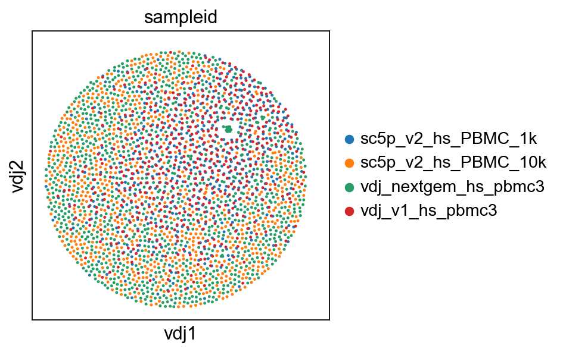

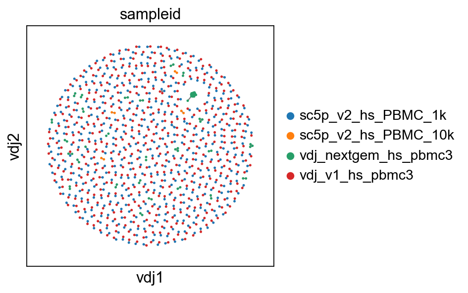

``ddl.tl.extract_edge_weights``
~~~~~~~~~~~~~~~~~~~~~~~~~~~~~~~

**dandelion** provides an edge weight extractor tool
``tl.extract_edge_weights`` to retrieve the edge weights that can be
used to specify the edge widths according to weight/distance.

.. code:: ipython3

    # To illustrate this, first recompute the graph by specifying a minimum size
    vdjx = vdj.copy()
    adatax = adata.copy()
    ddl.tl.generate_network(vdjx, min_size = 3) # second graph will only contain clones/clonotypes with >= 3 cells
    ddl.tl.transfer(adatax, vdjx, expanded_only = True)
    
    edgeweights = [1/(e+1) for e in ddl.tl.extract_edge_weights(vdjx)] # invert and add 1 to each edge weight (e) so that distance of 0 becomes the thickest edge
    # therefore, the thicker the line, the shorter the edit distance.
    ddl.pl.clone_network(adatax, 
                         color = ['isotype_status'], 
                         legend_fontoutline=3, 
                         edges_width = edgeweights,
                         size = 50
                        )

.. parsed-literal::

    Generating network

.. parsed-literal::

    Setting up data: 5609it [00:02, 2605.83it/s]
    Calculating distances... : 100%|██████████| 2232/2232 [00:01<00:00, 1847.44it/s]                                                                 
    Generating edge list : 100%|██████████| 526/526 [00:06<00:00, 82.03it/s]                                                                         
    Computing overlap : 100%|██████████| 2232/2232 [00:03<00:00, 741.56it/s]                                                                         
    Linking edges : 100%|██████████| 2045/2045 [00:00<00:00, 2065.25it/s]                                                                            

.. parsed-literal::

    generating network layout

.. parsed-literal::

    

.. parsed-literal::

     finished: Updated Dandelion object: 
       'data', contig-indexed clone table
       'metadata', cell-indexed clone table
       'layout', graph layout
       'graph', network constructed from distance matrices of VDJ- and VJ- chains (0:01:44)
    Transferring network
    converting matrices
    Updating anndata slots
     finished: updated `.obs` with `.metadata`
    added to `.uns['neighbors']` and `.uns['clone_id']`
    and `.obsp`
       'distances', clonotype-weighted adjacency matrix
       'connectivities', clonotype-weighted adjacency matrix (0:00:29)

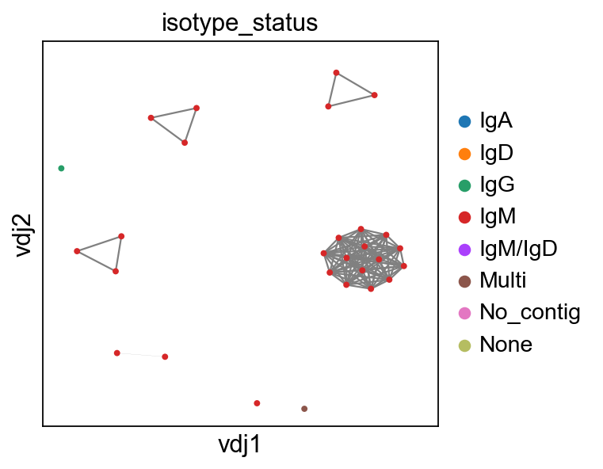

``None`` here means there is no isotype information i.e. no ``c_call``.
If ``No_contig`` appears, it means there’s no BCR information.

You can interact with ``pl.clone_network`` just as how you interact with
the rest of the scatterplot modules in ``scanpy``.

.. code:: ipython3

    sc.set_figure_params(figsize = [4,4.5])
    ddl.pl.clone_network(adata, 
                         color = ['locus_status', 'chain_status'], 
                         ncols = 1, 
                         legend_fontoutline=3, 
                         edges_width = 1, 
                         size = 20)

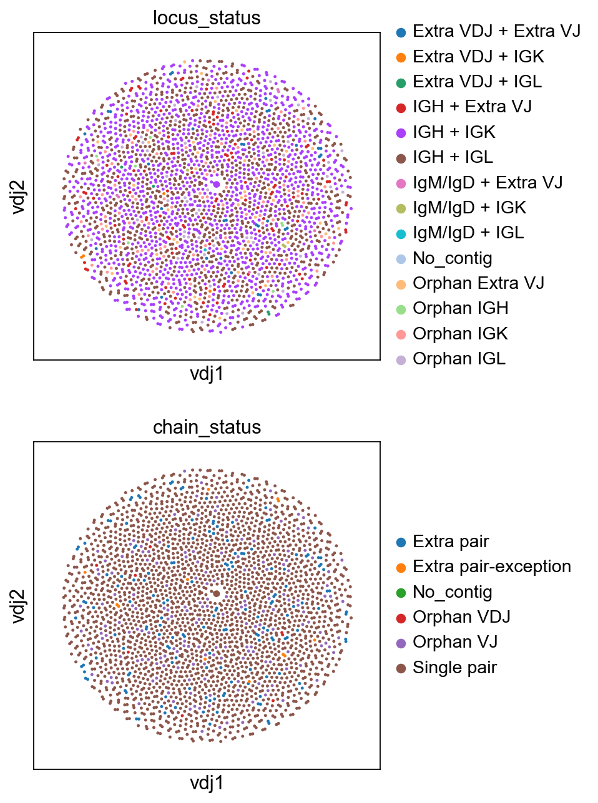

you should be able to save the adata object and interact with it as per
normal.

.. code:: ipython3

    adata.write('adata.h5ad', compression = 'gzip')

Calculating size of clones
--------------------------

``tl.clone_size``
~~~~~~~~~~~~~~~~~

Sometimes it’s useful to evaluate the size of the clone. Here
``tl.quantify_clone_size`` does a simple calculation to enable that.

.. code:: ipython3

    ddl.tl.clone_size(vdj)
    ddl.tl.transfer(adata, vdj)

.. parsed-literal::

    Quantifying clone sizes
     finished: Updated Dandelion object: 
       'metadata', cell-indexed clone table (0:00:00)
    Transferring network
    converting matrices
    Updating anndata slots
     finished: updated `.obs` with `.metadata`
    added to `.uns['neighbors']` and `.uns['clone_id']`
    and `.obsp`
       'distances', clonotype-weighted adjacency matrix
       'connectivities', clonotype-weighted adjacency matrix (0:00:28)

.. code:: ipython3

    sc.set_figure_params(figsize = [5,4.5])
    ddl.pl.clone_network(adata,
                         color = ['clone_id_size'], 
                         legend_loc = 'none', 
                         legend_fontoutline=3, 
                         edges_width = 1, 
                         size = 20,
                         color_map = 'viridis'
                        )
    sc.pl.umap(adata, color = ['clone_id_size'], color_map = 'viridis')

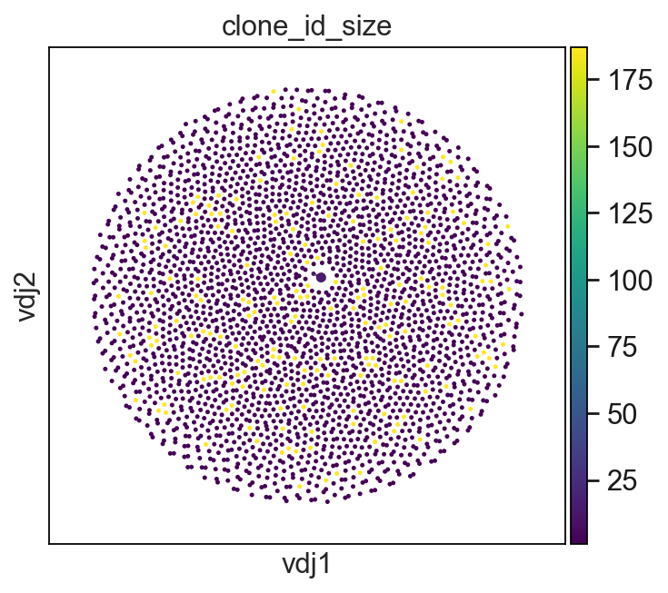

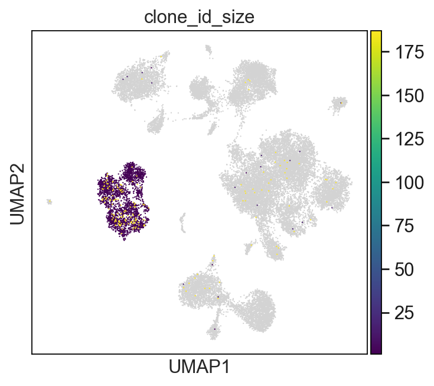

You can also specify ``max_size`` to clip off the calculation at a fixed
value.

.. code:: ipython3

    ddl.tl.clone_size(vdj, max_size = 3)
    ddl.tl.transfer(adata, vdj)

.. parsed-literal::

    Quantifying clone sizes
     finished: Updated Dandelion object: 
       'metadata', cell-indexed clone table (0:00:00)
    Transferring network
    converting matrices
    Updating anndata slots
     finished: updated `.obs` with `.metadata`
    added to `.uns['neighbors']` and `.uns['clone_id']`
    and `.obsp`
       'distances', clonotype-weighted adjacency matrix
       'connectivities', clonotype-weighted adjacency matrix (0:00:23)

.. code:: ipython3

    sc.set_figure_params(figsize = [4.5,4.5])
    ddl.pl.clone_network(adata, 
                         color = ['clone_id_size_max_3'], 
                         ncols = 2, 
                         legend_fontoutline=3, 
                         edges_width = 1, 
                         palette = ['grey', 'red', 'blue', 'white'], 
                         size = 20)
    sc.pl.umap(adata[adata.obs['has_contig'] == 'True'], 
               color = ['clone_id_size_max_3'], groups = ['2', ">= 3"],
               palette = ['red', 'blue'], size = 10)

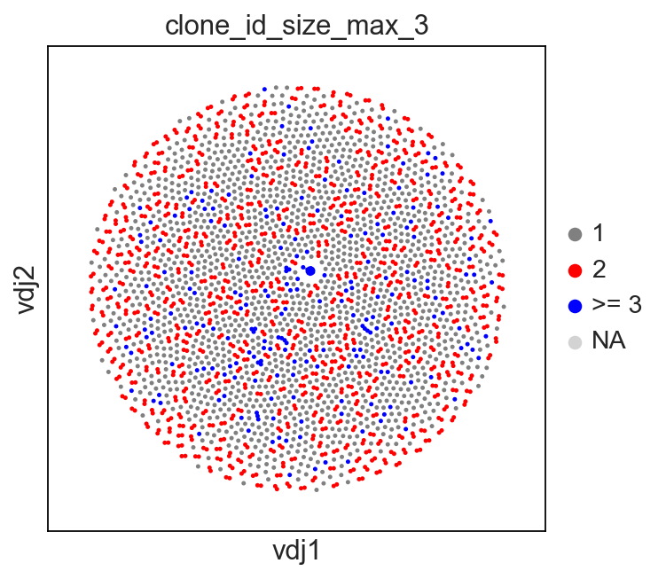

.. parsed-literal::

    WARNING: Length of palette colors is smaller than the number of categories (palette length: 2, categories length: 3. Some categories will have the same color.

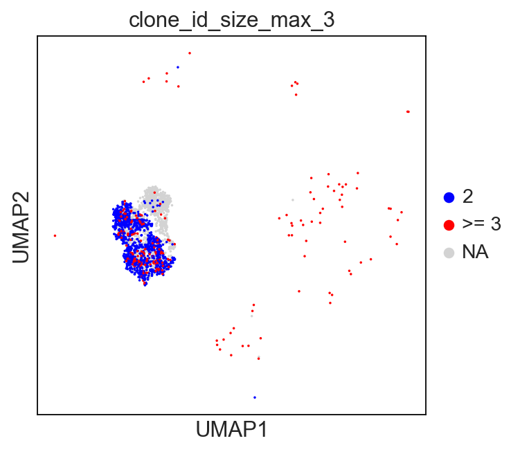

Additional plotting functions
-----------------------------

``ddl.pl.barplot``
~~~~~~~~~~~~~~~~~~

``pl.barplot`` is a generic barplot function that will plot items in the
metadata slot as a bar plot. This function will also interact with
``.obs`` slot if a ``scanpy`` object is used in place of ``Dandelion``
object. However, if your ``scanpy`` object holds a lot of non-B cells,
then the plotting will be just be saturated with nan values.

.. code:: ipython3

    import matplotlib as mpl
    mpl.rcParams.update(mpl.rcParamsDefault)
    ddl.pl.barplot(vdj[vdj.metadata.isotype_status != 'Multi'], # remove multi from the plots
                   color = 'v_call_genotyped_VDJ', 
                   figsize = (12, 4))

.. parsed-literal::

    (<Figure size 1200x400 with 1 Axes>,
     <AxesSubplot:title={'center':'v call genotyped VDJ usage'}, ylabel='proportion'>)

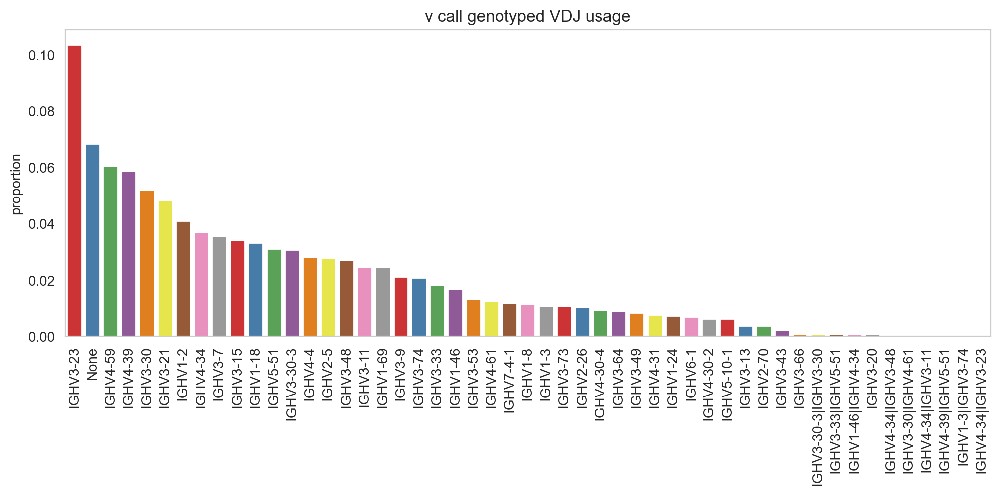

You can prevent it from sorting by specifying
``sort_descending = None``. Colours can be changed with ``palette``
option.

.. code:: ipython3

    ddl.pl.barplot(vdj[vdj.metadata.isotype_status != 'Multi'], 
                   color = 'v_call_genotyped_VDJ', 
                   figsize = (12, 4), 
                   sort_descending = None, 
                   palette = 'tab20')

.. parsed-literal::

    (<Figure size 1200x400 with 1 Axes>,
     <AxesSubplot:title={'center':'v call genotyped VDJ usage'}, ylabel='proportion'>)

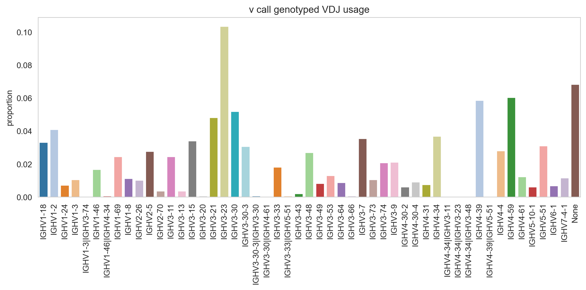

Specifying ``normalize = False`` will change the y-axis to counts.

.. code:: ipython3

    ddl.pl.barplot(vdj[vdj.metadata.isotype_status != 'Multi'], 
                   color = 'v_call_genotyped_VDJ', 
                   normalize = False, 
                   figsize = (12, 4), 
                   sort_descending = None, 
                   palette = 'tab20')

.. parsed-literal::

    (<Figure size 1200x400 with 1 Axes>,
     <AxesSubplot:title={'center':'v call genotyped VDJ usage'}, ylabel='count'>)

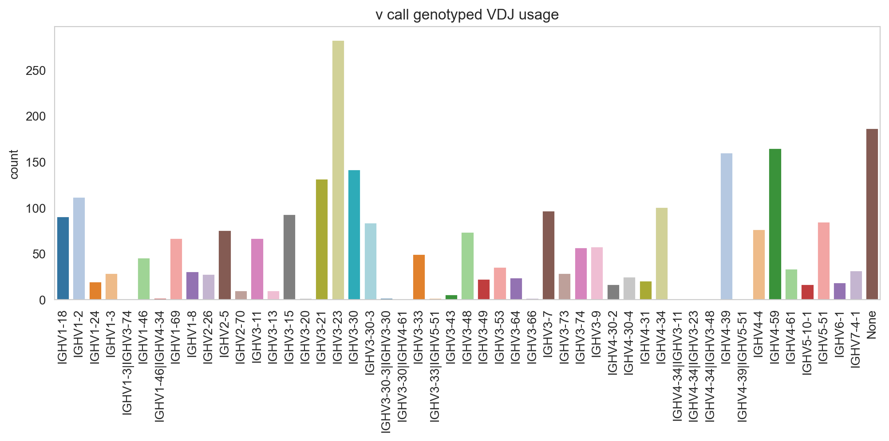

``pl.stackedbarplot``
~~~~~~~~~~~~~~~~~~~~~

``pl.stackedbarplot`` is similar to above but can split between
specified groups. Some examples below:

.. code:: ipython3

    import matplotlib.pyplot as plt
    ddl.pl.stackedbarplot(vdj[vdj.metadata.isotype_status != 'Multi'], 
                          color = 'isotype_status', 
                          groupby = 'locus_status', 
                          xtick_rotation =0, 
                          figsize = (4,4))
    plt.legend(bbox_to_anchor = (1,1), 
               loc='upper left', 
               frameon=False)

.. parsed-literal::

    <matplotlib.legend.Legend at 0x174ad28e0>

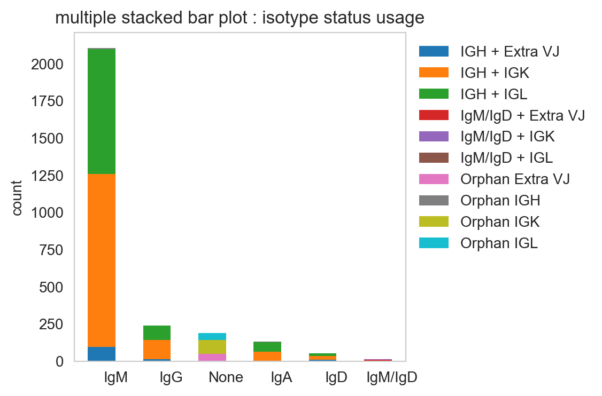

.. code:: ipython3

    ddl.pl.stackedbarplot(vdj[vdj.metadata.isotype_status != 'Multi'], 
                          color = 'v_call_genotyped_VDJ', 
                          groupby = 'isotype_status')
    plt.legend(bbox_to_anchor = (1,1), 
               loc='upper left', 
               frameon=False)

.. parsed-literal::

    <matplotlib.legend.Legend at 0x17f62bee0>

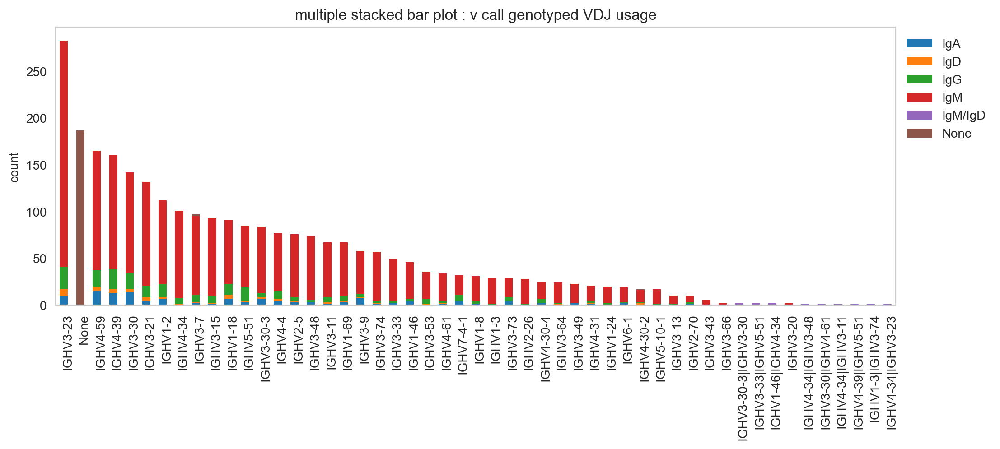

.. code:: ipython3

    ddl.pl.stackedbarplot(vdj[vdj.metadata.isotype_status != 'Multi'], 
                          color = 'v_call_genotyped_VDJ', 
                          groupby = 'isotype_status', 
                          normalize = True)
    plt.legend(bbox_to_anchor = (1,1), 
               loc='upper left', 
               frameon=False)

.. parsed-literal::

    <matplotlib.legend.Legend at 0x14831d430>

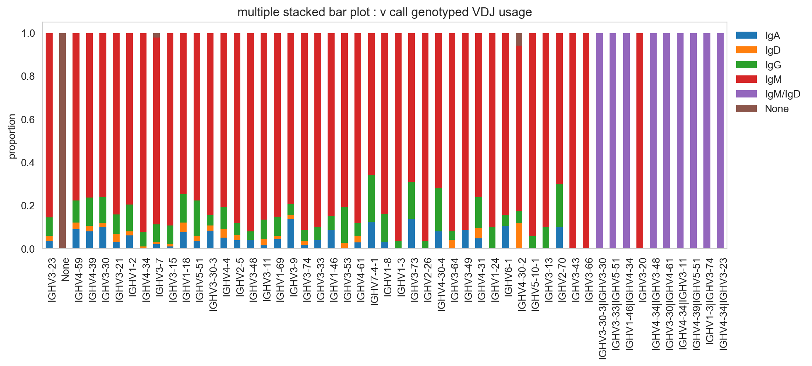

.. code:: ipython3

    ddl.pl.stackedbarplot(vdj[vdj.metadata.isotype_status != 'Multi'], 
                          color = 'v_call_genotyped_VDJ', 
                          groupby = 'chain_status')
    plt.legend(bbox_to_anchor = (1,1), 
               loc='upper left', 
               frameon=False)

.. parsed-literal::

    <matplotlib.legend.Legend at 0x174767bb0>

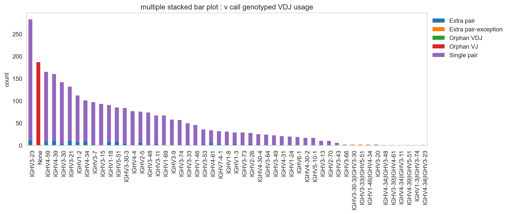

It’s obviously more useful if you don’t have too many groups, but you
could try and plot everything and jiggle the legend options and color.

.. code:: ipython3

    ddl.pl.stackedbarplot(vdj[vdj.metadata.isotype_status != 'Multi'], 
                          color = 'v_call_genotyped_VDJ', 
                          groupby = 'sample_id')
    plt.legend(bbox_to_anchor = (1, 0.5), 
               loc='center left', 
               frameon=False)

.. parsed-literal::

    <matplotlib.legend.Legend at 0x17cecba30>

.. image:: 4_dandelion_visualization-10x_data_files/4_dandelion_visualization-10x_data_44_1.png
   :width: 1210px
   :height: 497px

``ddl.pl.spectratype``
~~~~~~~~~~~~~~~~~~~~~~

Spectratype plots contain info displaying CDR3 length distribution for
specified groups. For this function, the current method only works for
``dandelion`` objects as it requires access to the contig-indexed
*.data* slot.

.. code:: ipython3

    ddl.pl.spectratype(vdj[vdj.metadata.isotype_status != 'Multi'], 
                       color = 'junction_length', 
                       groupby = 'c_call', 
                       locus='IGH', 
                       width = 2.3)
    plt.legend(bbox_to_anchor = (1,1), 
               loc='upper left', 
               frameon=False)

.. parsed-literal::

    <matplotlib.legend.Legend at 0x17f65fd30>

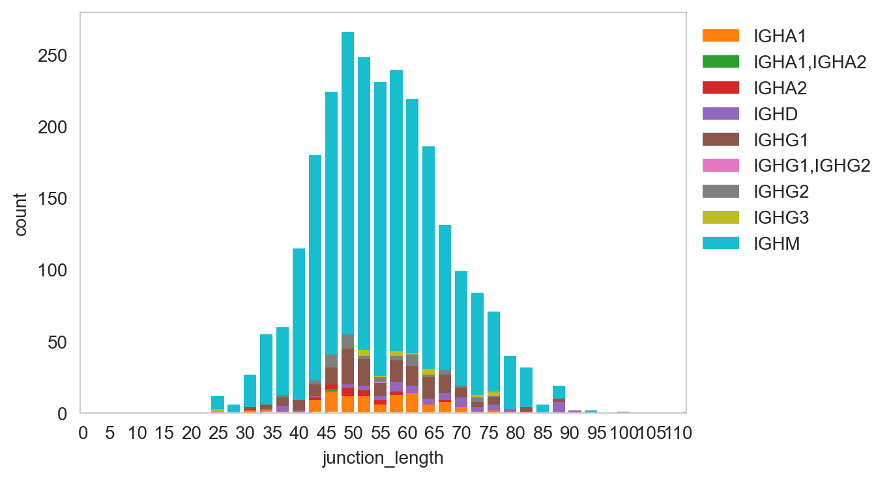

.. code:: ipython3

    ddl.pl.spectratype(vdj[vdj.metadata.isotype_status != 'Multi'], 
                       color = 'junction_aa_length', 
                       groupby = 'c_call', 
                       locus='IGH')
    plt.legend(bbox_to_anchor = (1,1), 
               loc='upper left', 
               frameon=False)

.. parsed-literal::

    <matplotlib.legend.Legend at 0x17d1b3a00>

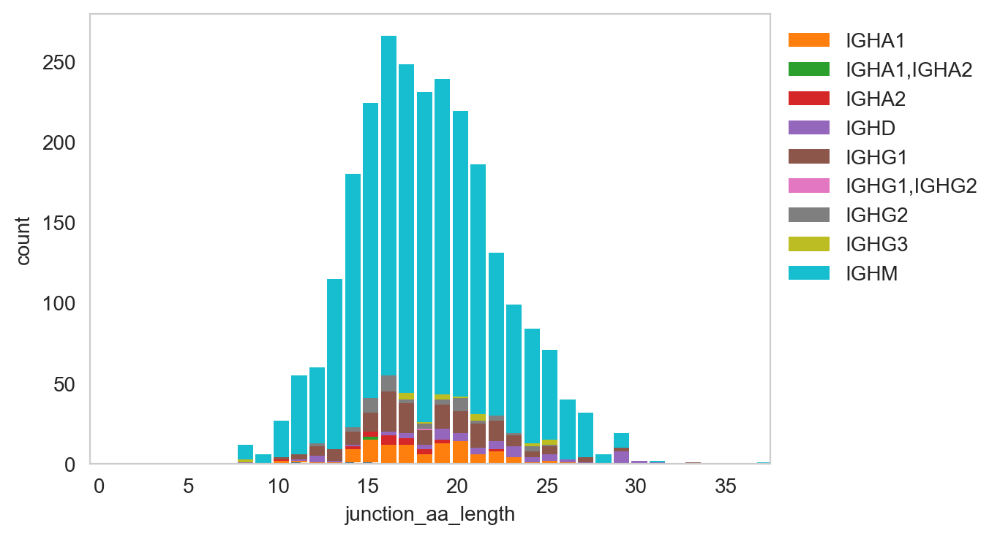

.. code:: ipython3

    ddl.pl.spectratype(vdj[vdj.metadata.isotype_status != 'Multi'], 
                       color = 'junction_aa_length', 
                       groupby = 'c_call', 
                       locus=['IGK','IGL'])
    plt.legend(bbox_to_anchor = (1,1), 
               loc='upper left', 
               frameon=False)

.. parsed-literal::

    <matplotlib.legend.Legend at 0x14c7f39d0>

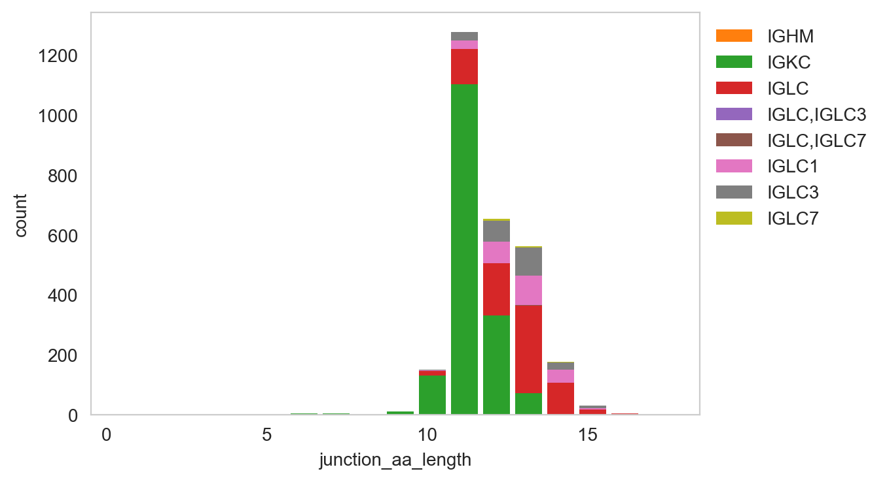

``ddl.pl.clone_overlap``
~~~~~~~~~~~~~~~~~~~~~~~~

There is now a circos-style clone overlap function where it looks for
whather different samples share a clone. If they do, an arc/connection
will be drawn between them. This requires the python module ``nxviz``
`[Ma16] <https://github.com/ericmjl/nxviz>`__ to be installed; at the
start of the writing of this tutorial, there were some dependencies
issues with ``pip install nxviz``, therefore I’ve adjusted the
requirements in a forked repository which you can install via:
``pip install git+https://github.com/zktuong/nxviz.git``

.. code:: ipython3

    ddl.tl.clone_overlap(adata, 
                         groupby = 'leiden', 
                         colorby = 'leiden')

.. parsed-literal::

    Finding clones
     finished: Updated AnnData: 
       'uns', clone overlap table (0:00:00)

.. code:: ipython3

    sc.set_figure_params(figsize = [6,6])
    ddl.pl.clone_overlap(adata, 
                         groupby = 'leiden', 
                         colorby = 'leiden')

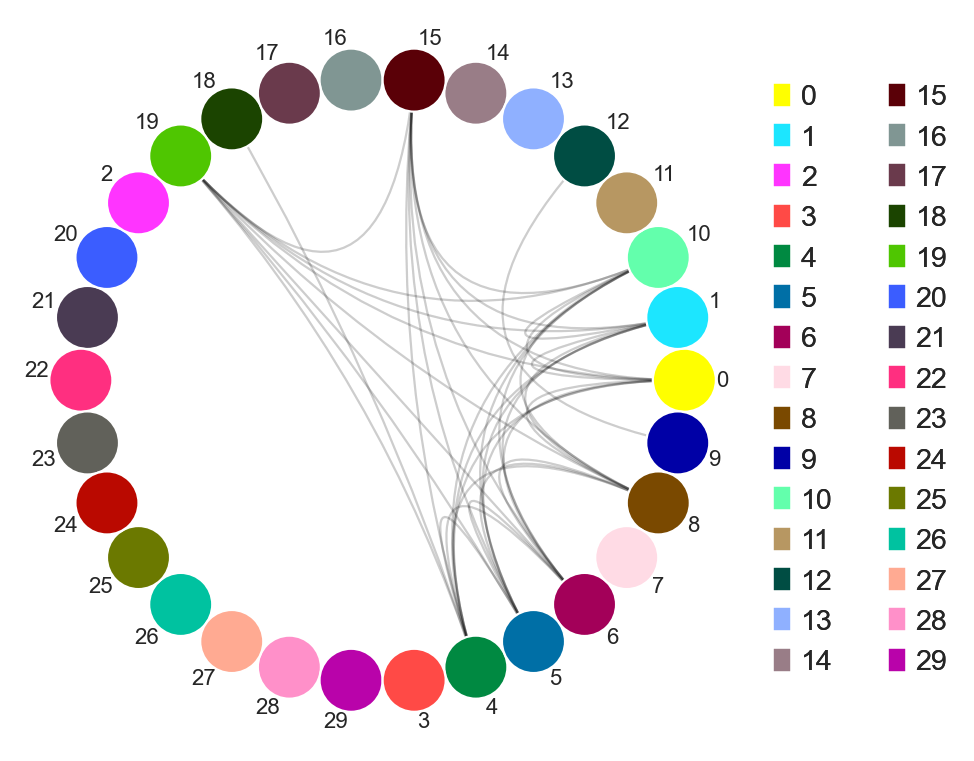

Other use cases for this would be, for example, to plot nodes as
individual samples and the colors as group classifications of the
samples. As long as this information is found in the ``.obs`` column in
the ``AnnData``, or even ``Dandelion.metadata``, this will work.

You an also specify ``weighted_overlap = True`` and the thickness of the
edges will reflect the number of cells found to overlap between the
nodes/samples.

.. code:: ipython3

    ddl.tl.clone_overlap(adata,groupby = 'leiden', 
                         colorby = 'leiden', weighted_overlap = True)
    ddl.pl.clone_overlap(adata, 
                         groupby = 'leiden', 
                         colorby = 'leiden', 
                         weighted_overlap = True)

.. parsed-literal::

    Finding clones
     finished: Updated AnnData: 
       'uns', clone overlap table (0:00:00)

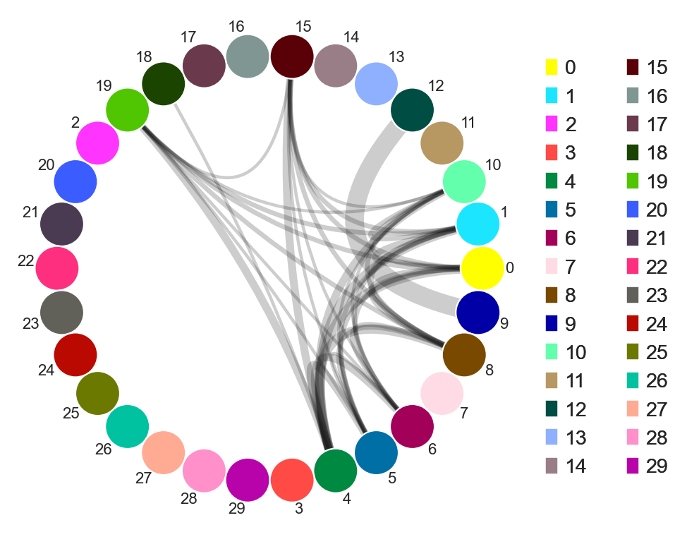

You can also visualise this as a heatmap by specifying
``as_heatmap = True``.

.. code:: ipython3

    import seaborn as sns
    sns.set(font_scale=.8)
    ddl.pl.clone_overlap(adata, 
                         groupby = 'leiden', 
                         colorby = 'leiden', 
                         weighted_overlap = True, as_heatmap = True, 
                         # seaborn clustermap kwargs
                         cmap = 'Blues', annot = True, figsize=(8,8), annot_kws={"size": 10})

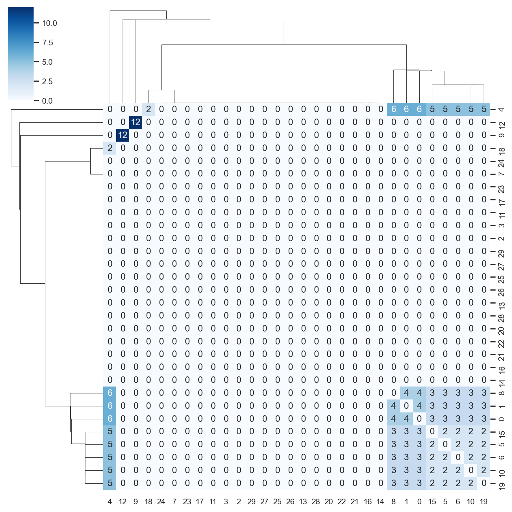

