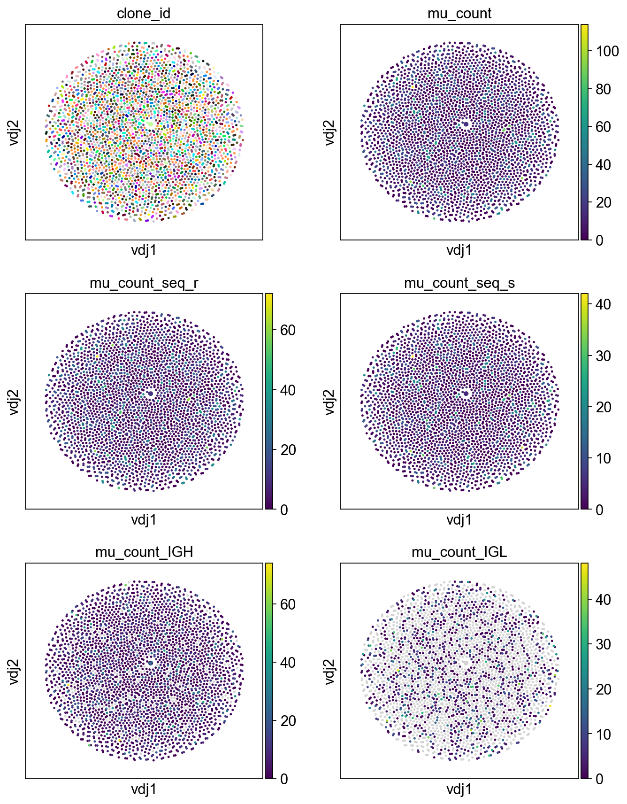
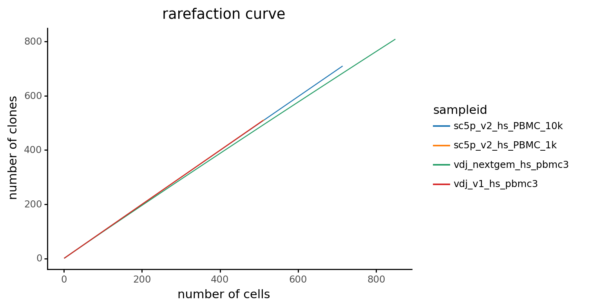
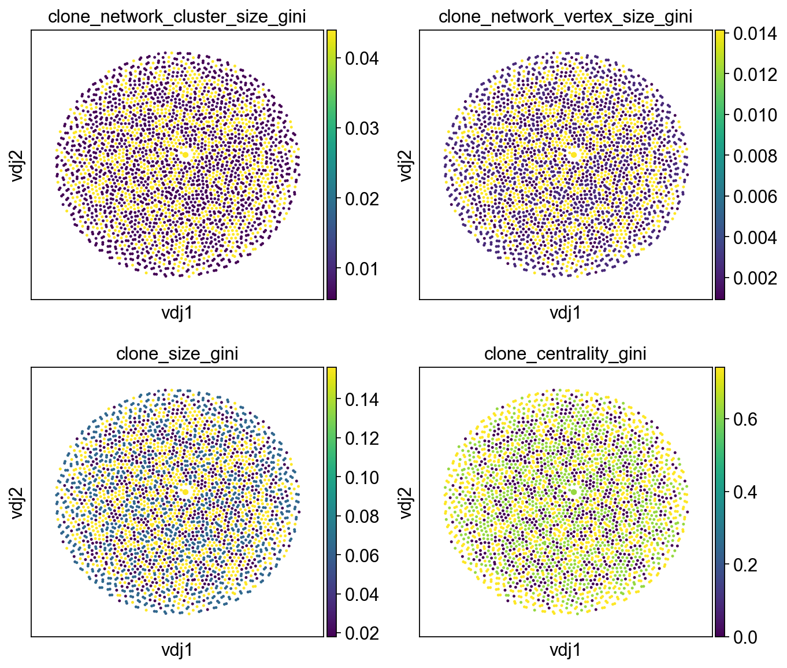
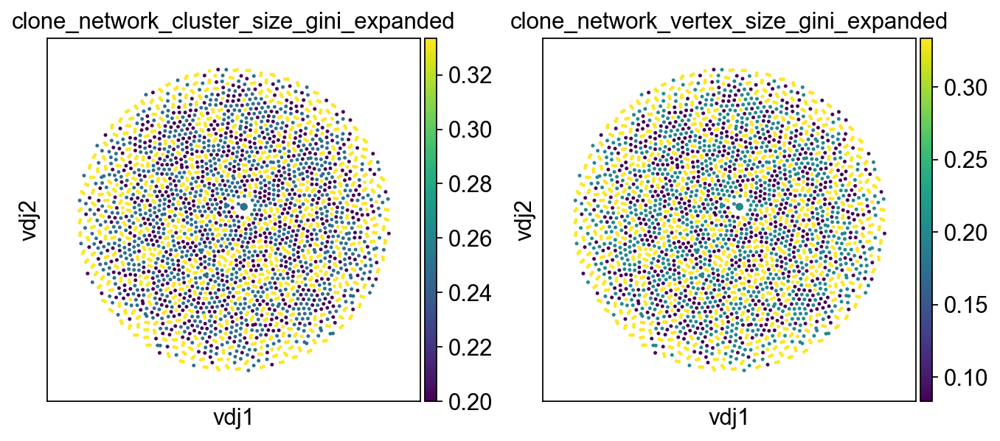
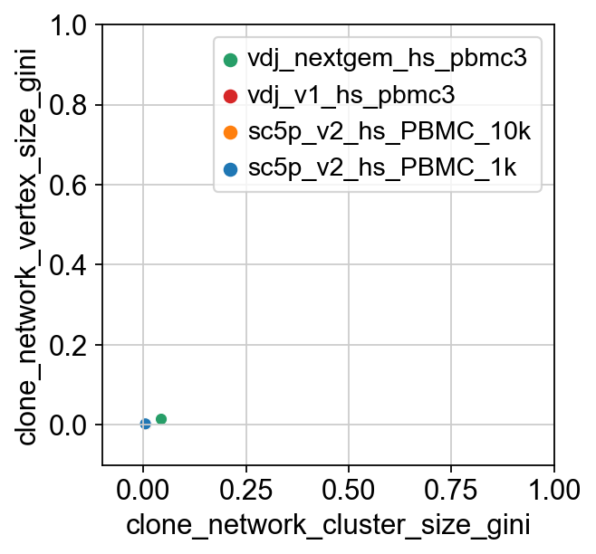
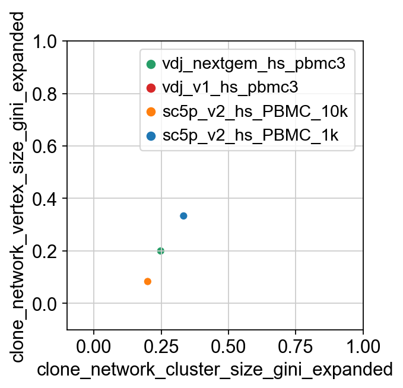
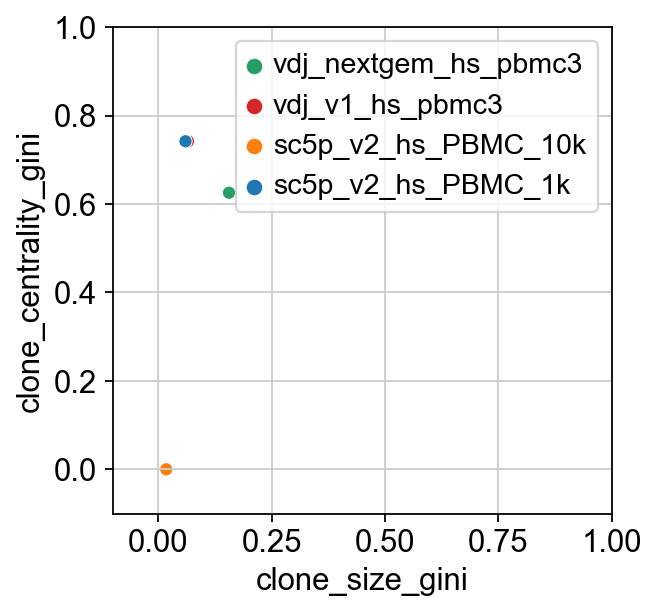

Calculating diversity and mutation
==================================

.. figure:: img/dandelion_logo_illustration.png
   :alt: dandelion_logo

   dandelion_logo

Calculating mutational load
---------------------------

To calculate mutational load, the functions from ``immcantation``
suite’s ``shazam``
`[Gupta2015] <https://academic.oup.com/bioinformatics/article/31/20/3356/195677>`__
can be accessed via ``rpy2`` to work with the ``dandelion`` class
object.

This can be run immediately after ``pp.reassign_alleles`` during the
reannotation pre-processing stage because the required germline columns
should be present in the genotyped ``.tsv`` file. I would reccomend to
run this after TIgGER
`[Gadala-Maria15] <https://www.pnas.org/content/112/8/E862>`__, after
the v_calls were corrected. Otherwise, if the reannotation was skipped,
you can run it now as follows:

**Import modules**

.. code:: ipython3

    import os
    import pandas as pd
    import dandelion as ddl
    ddl.logging.print_header()

.. parsed-literal::

    dandelion==0.2.4.dev58 pandas==1.4.2 numpy==1.21.6 matplotlib==3.5.2 networkx==2.8.4 scipy==1.8.1

.. code:: ipython3

    # change directory to somewhere more workable
    os.chdir(os.path.expanduser('/Users/kt16/Downloads/dandelion_tutorial/'))
    # I'm importing scanpy here to make use of its logging module.
    import scanpy as sc
    sc.settings.verbosity = 3
    import warnings
    warnings.filterwarnings('ignore')
    sc.logging.print_header()

.. parsed-literal::

    scanpy==1.9.1 anndata==0.8.0 umap==0.5.3 numpy==1.21.6 scipy==1.8.1 pandas==1.4.2 scikit-learn==1.1.1 statsmodels==0.13.2 python-igraph==0.9.11 pynndescent==0.5.7

**Read in the previously saved files**

.. code:: ipython3

    adata = sc.read_h5ad('adata.h5ad')
    adata

.. parsed-literal::

    AnnData object with n_obs × n_vars = 29000 × 1318
        obs: 'sampleid', 'batch', 'scrublet_score', 'n_genes', 'n_genes_by_counts', 'total_counts', 'total_counts_mt', 'pct_counts_mt', 'gmm_pct_count_clusters_keep', 'is_doublet', 'filter_rna', 'has_contig', 'sample_id', 'locus_VDJ', 'locus_VJ', 'productive_VDJ', 'productive_VJ', 'v_call_genotyped_VDJ', 'd_call_VDJ', 'j_call_VDJ', 'v_call_genotyped_VJ', 'j_call_VJ', 'c_call_VDJ', 'c_call_VJ', 'junction_VDJ', 'junction_VJ', 'junction_aa_VDJ', 'junction_aa_VJ', 'v_call_genotyped_B_VDJ', 'd_call_B_VDJ', 'j_call_B_VDJ', 'v_call_genotyped_B_VJ', 'j_call_B_VJ', 'productive_B_VDJ', 'productive_B_VJ', 'duplicate_count_B_VDJ', 'duplicate_count_B_VJ', 'isotype', 'isotype_status', 'locus_status', 'chain_status', 'rearrangement_status_VDJ', 'rearrangement_status_VJ', 'leiden', 'clone_id', 'clone_id_by_size', 'changeo_clone_id'
        var: 'feature_types', 'genome', 'gene_ids-0', 'gene_ids-1', 'gene_ids-2', 'gene_ids-3', 'n_cells', 'highly_variable', 'means', 'dispersions', 'dispersions_norm', 'mean', 'std'
        uns: 'chain_status_colors', 'clone_id', 'hvg', 'leiden', 'leiden_colors', 'locus_status_colors', 'log1p', 'neighbors', 'pca', 'rna_neighbors', 'sampleid_colors', 'umap'
        obsm: 'X_pca', 'X_umap', 'X_vdj'
        varm: 'PCs'
        obsp: 'connectivities', 'distances', 'rna_connectivities', 'rna_distances', 'vdj_connectivities', 'vdj_distances'

.. code:: ipython3

    vdj = ddl.read_h5ddl('dandelion_results.h5ddl')
    vdj

.. parsed-literal::

    Dandelion class object with n_obs = 2773 and n_contigs = 5609
        data: 'sequence_id', 'sequence', 'rev_comp', 'productive', 'v_call', 'd_call', 'j_call', 'sequence_alignment', 'germline_alignment', 'junction', 'junction_aa', 'v_cigar', 'd_cigar', 'j_cigar', 'stop_codon', 'vj_in_frame', 'locus', 'junction_length', 'np1_length', 'np2_length', 'v_sequence_start', 'v_sequence_end', 'v_germline_start', 'v_germline_end', 'd_sequence_start', 'd_sequence_end', 'd_germline_start', 'd_germline_end', 'j_sequence_start', 'j_sequence_end', 'j_germline_start', 'j_germline_end', 'v_score', 'v_identity', 'v_support', 'd_score', 'd_identity', 'd_support', 'j_score', 'j_identity', 'j_support', 'fwr1', 'fwr2', 'fwr3', 'fwr4', 'cdr1', 'cdr2', 'cdr3', 'cell_id', 'c_call', 'consensus_count', 'duplicate_count', 'v_call_10x', 'd_call_10x', 'j_call_10x', 'junction_10x', 'junction_10x_aa', 'v_call_genotyped', 'germline_alignment_d_mask', 'sample_id', 'j_support_igblastn', 'j_score_igblastn', 'j_call_igblastn', 'j_call_blastn', 'j_identity_blastn', 'j_alignment_length_blastn', 'j_number_of_mismatches_blastn', 'j_number_of_gap_openings_blastn', 'j_sequence_start_blastn', 'j_sequence_end_blastn', 'j_germline_start_blastn', 'j_germline_end_blastn', 'j_support_blastn', 'j_score_blastn', 'j_sequence_alignment_blastn', 'j_germline_alignment_blastn', 'cell_id_blastn', 'j_source', 'd_support_igblastn', 'd_score_igblastn', 'd_call_igblastn', 'd_call_blastn', 'd_identity_blastn', 'd_alignment_length_blastn', 'd_number_of_mismatches_blastn', 'd_number_of_gap_openings_blastn', 'd_sequence_start_blastn', 'd_sequence_end_blastn', 'd_germline_start_blastn', 'd_germline_end_blastn', 'd_support_blastn', 'd_score_blastn', 'd_sequence_alignment_blastn', 'd_germline_alignment_blastn', 'd_source', 'c_sequence_alignment', 'c_germline_alignment', 'c_sequence_start', 'c_sequence_end', 'c_score', 'c_identity', 'c_call_10x', 'junction_aa_length', 'fwr1_aa', 'fwr2_aa', 'fwr3_aa', 'fwr4_aa', 'cdr1_aa', 'cdr2_aa', 'cdr3_aa', 'sequence_alignment_aa', 'v_sequence_alignment_aa', 'd_sequence_alignment_aa', 'j_sequence_alignment_aa', 'mu_count', 'ambiguous', 'rearrangement_status', 'clone_id', 'changeo_clone_id'
        metadata: 'clone_id', 'clone_id_by_size', 'sample_id', 'locus_VDJ', 'locus_VJ', 'productive_VDJ', 'productive_VJ', 'v_call_genotyped_VDJ', 'd_call_VDJ', 'j_call_VDJ', 'v_call_genotyped_VJ', 'j_call_VJ', 'c_call_VDJ', 'c_call_VJ', 'junction_VDJ', 'junction_VJ', 'junction_aa_VDJ', 'junction_aa_VJ', 'v_call_genotyped_B_VDJ', 'd_call_B_VDJ', 'j_call_B_VDJ', 'v_call_genotyped_B_VJ', 'j_call_B_VJ', 'productive_B_VDJ', 'productive_B_VJ', 'duplicate_count_B_VDJ', 'duplicate_count_B_VJ', 'isotype', 'isotype_status', 'locus_status', 'chain_status', 'rearrangement_status_VDJ', 'rearrangement_status_VJ', 'changeo_clone_id'
        layout: layout for 2773 vertices, layout for 1067 vertices
        graph: networkx graph of 2773 vertices, networkx graph of 1067 vertices 

.. code:: ipython3

    # let's recreate the vdj object with only the first two samples
    subset_data = vdj.data[vdj.data['sample_id'].isin(['sc5p_v2_hs_PBMC_1k', 'sc5p_v2_hs_PBMC_10k'])]
    subset_data

.. raw:: html

    

    
    <table border="1" class="dataframe">
      <thead>
        <tr style="text-align: right;">
          <th></th>
          <th>sequence_id</th>
          <th>sequence</th>
          <th>rev_comp</th>
          <th>productive</th>
          <th>v_call</th>
          <th>d_call</th>
          <th>j_call</th>
          <th>sequence_alignment</th>
          <th>germline_alignment</th>
          <th>junction</th>
          <th>...</th>
          <th>cdr3_aa</th>
          <th>sequence_alignment_aa</th>
          <th>v_sequence_alignment_aa</th>
          <th>d_sequence_alignment_aa</th>
          <th>j_sequence_alignment_aa</th>
          <th>mu_count</th>
          <th>ambiguous</th>
          <th>rearrangement_status</th>
          <th>clone_id</th>
          <th>changeo_clone_id</th>
        </tr>
        <tr>
          <th>sequence_id</th>
          <th></th>
          <th></th>
          <th></th>
          <th></th>
          <th></th>
          <th></th>
          <th></th>
          <th></th>
          <th></th>
          <th></th>
          <th></th>
          <th></th>
          <th></th>
          <th></th>
          <th></th>
          <th></th>
          <th></th>
          <th></th>
          <th></th>
          <th></th>
          <th></th>
        </tr>
      </thead>
      <tbody>
        <tr>
          <th>sc5p_v2_hs_PBMC_10k_AAACCTGTCATATCGG_contig_1</th>
          <td>sc5p_v2_hs_PBMC_10k_AAACCTGTCATATCGG_contig_1</td>
          <td>TGGGGAGGAGTCAGTCCCAACCAGGACACGGCCTGGACATGAGGGT...</td>
          <td>F</td>
          <td>T</td>
          <td>IGKV1-33*01,IGKV1D-33*01</td>
          <td></td>
          <td>IGKJ4*01</td>
          <td>GACATCCAGATGACCCAGTCTCCATCCTCCCTGTCTGCATCTGTGG...</td>
          <td>GACATCCAGATGACCCAGTCTCCATCCTCCCTGTCTGCATCTGTAG...</td>
          <td>TGTCAACAATATGACGAACTTCCCGTCACTTTC</td>
          <td>...</td>
          <td>QQYDELPVT</td>
          <td>DIQMTQSPSSLSASVGDRVTITCQATQDINNYVNWYQQKPGKAPKL...</td>
          <td>DIQMTQSPSSLSASVGDRVTITCQATQDINNYVNWYQQKPGKAPKL...</td>
          <td></td>
          <td>TFGGGTNV</td>
          <td>27</td>
          <td>F</td>
          <td>standard</td>
          <td></td>
          <td></td>
        </tr>
        <tr>
          <th>sc5p_v2_hs_PBMC_10k_AAACCTGTCCGTTGTC_contig_2</th>
          <td>sc5p_v2_hs_PBMC_10k_AAACCTGTCCGTTGTC_contig_2</td>
          <td>ATCACATAACAACCACATTCCTCCTCTAAAGAAGCCCCTGGGAGCA...</td>
          <td>F</td>
          <td>T</td>
          <td>IGHV1-69*01,IGHV1-69D*01</td>
          <td>IGHD3-22*01</td>
          <td>IGHJ3*02</td>
          <td>CAGGTGCAGCTGGTGCAGTCTGGGGCT...GAGGTGAAGAAGCCTG...</td>
          <td>CAGGTGCAGCTGGTGCAGTCTGGGGCT...GAGGTGAAGAAGCCTG...</td>
          <td>TGTGCGACTACGTATTACTATGATAGTAGTGGTTATTACCAGAATG...</td>
          <td>...</td>
          <td>ATTYYYDSSGYYQNDAFDI</td>
          <td>QVQLVQSGAEVKKPGSSVKVSCKASGGTFSSYAISWVRQAPGQGLE...</td>
          <td>QVQLVQSGAEVKKPGSSVKVSCKASGGTFSSYAISWVRQAPGQGLE...</td>
          <td>YYYDSSGYY</td>
          <td>DAFDIWGQGTMVTVSS</td>
          <td>0</td>
          <td>F</td>
          <td>standard</td>
          <td>B_36_3_2_153_2_2</td>
          <td>9_0</td>
        </tr>
        <tr>
          <th>sc5p_v2_hs_PBMC_10k_AAACCTGTCCGTTGTC_contig_1</th>
          <td>sc5p_v2_hs_PBMC_10k_AAACCTGTCCGTTGTC_contig_1</td>
          <td>AGGAGTCAGACCCTGTCAGGACACAGCATAGACATGAGGGTCCCCG...</td>
          <td>F</td>
          <td>T</td>
          <td>IGKV1-8*01</td>
          <td></td>
          <td>IGKJ1*01</td>
          <td>GCCATCCGGATGACCCAGTCTCCATCCTCATTCTCTGCATCTACAG...</td>
          <td>GCCATCCGGATGACCCAGTCTCCATCCTCATTCTCTGCATCTACAG...</td>
          <td>TGTCAACAGTATTATAGTTACCCTCGGACGTTC</td>
          <td>...</td>
          <td>QQYYSYPRT</td>
          <td>AIRMTQSPSSFSASTGDRVTITCRASQGISSYLAWYQQKPGKAPKL...</td>
          <td>AIRMTQSPSSFSASTGDRVTITCRASQGISSYLAWYQQKPGKAPKL...</td>
          <td></td>
          <td>TFGQGTKVEIK</td>
          <td>0</td>
          <td>F</td>
          <td>standard</td>
          <td>B_36_3_2_153_2_2</td>
          <td>9_0</td>
        </tr>
        <tr>
          <th>sc5p_v2_hs_PBMC_10k_AAACCTGTCGAGAACG_contig_1</th>
          <td>sc5p_v2_hs_PBMC_10k_AAACCTGTCGAGAACG_contig_1</td>
          <td>ACTGTGGGGGTAAGAGGTTGTGTCCACCATGGCCTGGACTCCTCTC...</td>
          <td>F</td>
          <td>T</td>
          <td>IGLV5-45*02</td>
          <td></td>
          <td>IGLJ3*02</td>
          <td>CAGGCTGTGCTGACTCAGCCGTCTTCC...CTCTCTGCATCTCCTG...</td>
          <td>CAGGCTGTGCTGACTCAGCCGTCTTCC...CTCTCTGCATCTCCTG...</td>
          <td>TGTATGATTTGGCACAGCAGCGCTTGGGTGGTC</td>
          <td>...</td>
          <td>MIWHSSAWV</td>
          <td>QAVLTQPSSLSASPGASGRLTCTLRSDINVGTYRIYWYQRKPGSPP...</td>
          <td>QAVLTQPSSLSASPGASGRLTCTLRSDINVGTYRIYWYQRKPGSPP...</td>
          <td></td>
          <td>VVGGGTKLTVL</td>
          <td>8</td>
          <td>F</td>
          <td>standard</td>
          <td>B_40_1_1_181_1_1</td>
          <td>152_1</td>
        </tr>
        <tr>
          <th>sc5p_v2_hs_PBMC_10k_AAACCTGTCGAGAACG_contig_2</th>
          <td>sc5p_v2_hs_PBMC_10k_AAACCTGTCGAGAACG_contig_2</td>
          <td>GGGAGCATCACCCAGCAACCACATCTGTCCTCTAGAGAATCCCCTG...</td>
          <td>F</td>
          <td>T</td>
          <td>IGHV1-2*02</td>
          <td></td>
          <td>IGHJ3*02</td>
          <td>CAGGTGCAACTGGTGCAGTCTGGGGGT...GAGGTAAAGAAGCCTG...</td>
          <td>CAGGTGCAGCTGGTGCAGTCTGGGGCT...GAGGTGAAGAAGCCTG...</td>
          <td>TGTGCGAGAGAGATAGAGGGGGACGGTGTTTTTGAAATCTGG</td>
          <td>...</td>
          <td>AREIEGDGVFEI</td>
          <td>QVQLVQSGGEVKKPGASVKVSCKASGYTFTDYFIQWLRHAPGQGLD...</td>
          <td>QVQLVQSGGEVKKPGASVKVSCKASGYTFTDYFIQWLRHAPGQGLD...</td>
          <td></td>
          <td>FEIWGQGTMVTVSS</td>
          <td>22</td>
          <td>F</td>
          <td>standard</td>
          <td>B_40_1_1_181_1_1</td>
          <td>152_1</td>
        </tr>
        <tr>
          <th>...</th>
          <td>...</td>
          <td>...</td>
          <td>...</td>
          <td>...</td>
          <td>...</td>
          <td>...</td>
          <td>...</td>
          <td>...</td>
          <td>...</td>
          <td>...</td>
          <td>...</td>
          <td>...</td>
          <td>...</td>
          <td>...</td>
          <td>...</td>
          <td>...</td>
          <td>...</td>
          <td>...</td>
          <td>...</td>
          <td>...</td>
          <td>...</td>
        </tr>
        <tr>
          <th>sc5p_v2_hs_PBMC_1k_TTTCCTCAGGGAAACA_contig_2</th>
          <td>sc5p_v2_hs_PBMC_1k_TTTCCTCAGGGAAACA_contig_2</td>
          <td>ACTTTCTGAGAGTCCTGGACCTCCTGTGCAAGAACATGAAACATCT...</td>
          <td>F</td>
          <td>T</td>
          <td>IGHV4-59*08</td>
          <td>IGHD6-13*01</td>
          <td>IGHJ2*01</td>
          <td>CAGGTGCAGCTGCAGGAGTCGGGCCCA...GGACTGGTAAAACCTT...</td>
          <td>CAGGTGCAGCTGCAGGAGTCGGGCCCA...GGACTGGTGAAGCCTT...</td>
          <td>TGTGCGAGACCCCGTATAGCAGGATCTGGGTGGTACTTCGATCTCTGG</td>
          <td>...</td>
          <td>ARPRIAGSGWYFDL</td>
          <td>QVQLQESGPGLVKPSETLSLTCTVSGGSISSSYWSWIRQPPGKGLE...</td>
          <td>QVQLQESGPGLVKPSETLSLTCTVSGGSISSSYWSWIRQPPGKGLE...</td>
          <td>IAGSG</td>
          <td>WYFDLWGRGTLVTVSS</td>
          <td>16</td>
          <td>F</td>
          <td>standard</td>
          <td>B_70_1_1_68_4_13</td>
          <td>1224_1195</td>
        </tr>
        <tr>
          <th>sc5p_v2_hs_PBMC_1k_TTTGCGCCATACCATG_contig_2</th>
          <td>sc5p_v2_hs_PBMC_1k_TTTGCGCCATACCATG_contig_2</td>
          <td>ATCACATAACAACCACATTCCTCCTCTAAAGAAGCCCCTGGGAGCA...</td>
          <td>F</td>
          <td>T</td>
          <td>IGHV1-69*01,IGHV1-69D*01</td>
          <td>IGHD2-15*01</td>
          <td>IGHJ6*02</td>
          <td>CAGGTGCAGCTGGTGCAGTCTGGGGCT...GAGGTGAAGAAGCCTG...</td>
          <td>CAGGTGCAGCTGGTGCAGTCTGGGGCT...GAGGTGAAGAAGCCTG...</td>
          <td>TGTGCGAGATCTCTGGATATTGTAGTGGTGGTAGCACTCTACTACT...</td>
          <td>...</td>
          <td>ARSLDIVVVVALYYYYGMDV</td>
          <td>QVQLVQSGAEVKKPGSSVKVSCKASGGTFSSYAISWVRQAPGQGLE...</td>
          <td>QVQLVQSGAEVKKPGSSVKVSCKASGGTFSSYAISWVRQAPGQGLE...</td>
          <td>DIVVVVA</td>
          <td>YYYYGMDVWGQGTTVTVSS</td>
          <td>0</td>
          <td>F</td>
          <td>standard</td>
          <td>B_68_7_1_114_2_6</td>
          <td>1821_1196</td>
        </tr>
        <tr>
          <th>sc5p_v2_hs_PBMC_1k_TTTGCGCCATACCATG_contig_1</th>
          <td>sc5p_v2_hs_PBMC_1k_TTTGCGCCATACCATG_contig_1</td>
          <td>AGCTTCAGCTGTGGTAGAGAAGACAGGATTCAGGACAATCTCCAGC...</td>
          <td>F</td>
          <td>T</td>
          <td>IGLV1-47*01</td>
          <td></td>
          <td>IGLJ3*02</td>
          <td>CAGTCTGTGCTGACTCAGCCACCCTCA...GCGTCTGGGACCCCCG...</td>
          <td>CAGTCTGTGCTGACTCAGCCACCCTCA...GCGTCTGGGACCCCCG...</td>
          <td>TGTGCAGCATGGGATGACAGCCTGAGTGGTTGGGTGTTC</td>
          <td>...</td>
          <td>AAWDDSLSGWV</td>
          <td>QSVLTQPPSASGTPGQRVTISCSGSSSNIGSNYVYWYQQLPGTAPK...</td>
          <td>QSVLTQPPSASGTPGQRVTISCSGSSSNIGSNYVYWYQQLPGTAPK...</td>
          <td></td>
          <td>WVFGGGTKLTVL</td>
          <td>0</td>
          <td>F</td>
          <td>standard</td>
          <td>B_68_7_1_114_2_6</td>
          <td>1821_1196</td>
        </tr>
        <tr>
          <th>sc5p_v2_hs_PBMC_1k_TTTGGTTGTAGGCATG_contig_2</th>
          <td>sc5p_v2_hs_PBMC_1k_TTTGGTTGTAGGCATG_contig_2</td>
          <td>GGCTGGGGTCTCAGGAGGCAGCACTCTCGGGACGTCTCCACCATGG...</td>
          <td>F</td>
          <td>T</td>
          <td>IGLV2-11*01</td>
          <td></td>
          <td>IGLJ2*01,IGLJ3*01,IGLJ3*02</td>
          <td>CAGTCTGCCCTGACTCAGCCTCGCTCA...GTGTCCGGGTCTCCTG...</td>
          <td>CAGTCTGCCCTGACTCAGCCTCGCTCA...GTGTCCGGGTCTCCTG...</td>
          <td>TGCTGCTCATATGCAGGCAGCTACACTGTGTTTTTC</td>
          <td>...</td>
          <td>CSYAGSYTVF</td>
          <td>QSALTQPRSVSGSPGQSVTISCTGTSSDVGGYNYVSWYQQHPGKAP...</td>
          <td>QSALTQPRSVSGSPGQSVTISCTGTSSDVGGYNYVSWYQQHPGKAP...</td>
          <td></td>
          <td>FGGGTMLTVL</td>
          <td>4</td>
          <td>F</td>
          <td>standard</td>
          <td>B_186_5_3_178_3_2</td>
          <td>1958_1197</td>
        </tr>
        <tr>
          <th>sc5p_v2_hs_PBMC_1k_TTTGGTTGTAGGCATG_contig_1</th>
          <td>sc5p_v2_hs_PBMC_1k_TTTGGTTGTAGGCATG_contig_1</td>
          <td>AGCTCTGAGAGAGGAGCCCAGCCCTGGGATTTTCAGGTGTTTTCAT...</td>
          <td>F</td>
          <td>T</td>
          <td>IGHV3-23*01,IGHV3-23D*01</td>
          <td></td>
          <td>IGHJ4*02</td>
          <td>GAGGTGCAGGTGTTGGAGTCTGGGGGA...GGCTTGGAACAGCCTG...</td>
          <td>GAGGTGCAGCTGTTGGAGTCTGGGGGA...GGCTTGGTACAGCCTG...</td>
          <td>TGTGCGGGGAGTCGGTGGTTATATTCTTTTGACTACTGG</td>
          <td>...</td>
          <td>AGSRWLYSFDY</td>
          <td>EVQVLESGGGLEQPGGSLRLSCAASGFTFSTYAMTWVRQAPGKGLE...</td>
          <td>EVQVLESGGGLEQPGGSLRLSCAASGFTFSTYAMTWVRQAPGKGLE...</td>
          <td></td>
          <td>FDYWGQGNLVTVSS</td>
          <td>8</td>
          <td>F</td>
          <td>standard</td>
          <td>B_186_5_3_178_3_2</td>
          <td>1958_1197</td>
        </tr>
      </tbody>
    </table>
    
2599 rows × 119 columns

    

.. code:: ipython3

    # create a new Dandelion class with this subset
    vdj2 = ddl.Dandelion(subset_data)
    vdj2

.. parsed-literal::

    Dandelion class object with n_obs = 1268 and n_contigs = 2599
        data: 'sequence_id', 'sequence', 'rev_comp', 'productive', 'v_call', 'd_call', 'j_call', 'sequence_alignment', 'germline_alignment', 'junction', 'junction_aa', 'v_cigar', 'd_cigar', 'j_cigar', 'stop_codon', 'vj_in_frame', 'locus', 'junction_length', 'np1_length', 'np2_length', 'v_sequence_start', 'v_sequence_end', 'v_germline_start', 'v_germline_end', 'd_sequence_start', 'd_sequence_end', 'd_germline_start', 'd_germline_end', 'j_sequence_start', 'j_sequence_end', 'j_germline_start', 'j_germline_end', 'v_score', 'v_identity', 'v_support', 'd_score', 'd_identity', 'd_support', 'j_score', 'j_identity', 'j_support', 'fwr1', 'fwr2', 'fwr3', 'fwr4', 'cdr1', 'cdr2', 'cdr3', 'cell_id', 'c_call', 'consensus_count', 'duplicate_count', 'v_call_10x', 'd_call_10x', 'j_call_10x', 'junction_10x', 'junction_10x_aa', 'v_call_genotyped', 'germline_alignment_d_mask', 'sample_id', 'j_support_igblastn', 'j_score_igblastn', 'j_call_igblastn', 'j_call_blastn', 'j_identity_blastn', 'j_alignment_length_blastn', 'j_number_of_mismatches_blastn', 'j_number_of_gap_openings_blastn', 'j_sequence_start_blastn', 'j_sequence_end_blastn', 'j_germline_start_blastn', 'j_germline_end_blastn', 'j_support_blastn', 'j_score_blastn', 'j_sequence_alignment_blastn', 'j_germline_alignment_blastn', 'cell_id_blastn', 'j_source', 'd_support_igblastn', 'd_score_igblastn', 'd_call_igblastn', 'd_call_blastn', 'd_identity_blastn', 'd_alignment_length_blastn', 'd_number_of_mismatches_blastn', 'd_number_of_gap_openings_blastn', 'd_sequence_start_blastn', 'd_sequence_end_blastn', 'd_germline_start_blastn', 'd_germline_end_blastn', 'd_support_blastn', 'd_score_blastn', 'd_sequence_alignment_blastn', 'd_germline_alignment_blastn', 'd_source', 'c_sequence_alignment', 'c_germline_alignment', 'c_sequence_start', 'c_sequence_end', 'c_score', 'c_identity', 'c_call_10x', 'junction_aa_length', 'fwr1_aa', 'fwr2_aa', 'fwr3_aa', 'fwr4_aa', 'cdr1_aa', 'cdr2_aa', 'cdr3_aa', 'sequence_alignment_aa', 'v_sequence_alignment_aa', 'd_sequence_alignment_aa', 'j_sequence_alignment_aa', 'mu_count', 'ambiguous', 'rearrangement_status', 'clone_id', 'changeo_clone_id'
        metadata: 'clone_id', 'clone_id_by_size', 'sample_id', 'locus_VDJ', 'locus_VJ', 'productive_VDJ', 'productive_VJ', 'v_call_genotyped_VDJ', 'd_call_VDJ', 'j_call_VDJ', 'v_call_genotyped_VJ', 'j_call_VJ', 'c_call_VDJ', 'c_call_VJ', 'junction_VDJ', 'junction_VJ', 'junction_aa_VDJ', 'junction_aa_VJ', 'v_call_genotyped_B_VDJ', 'd_call_B_VDJ', 'j_call_B_VDJ', 'v_call_genotyped_B_VJ', 'j_call_B_VJ', 'productive_B_VDJ', 'productive_B_VJ', 'duplicate_count_B_VDJ', 'duplicate_count_B_VJ', 'isotype', 'isotype_status', 'locus_status', 'chain_status', 'rearrangement_status_VDJ', 'rearrangement_status_VJ'

``update_germline``
~~~~~~~~~~~~~~~~~~~

We can store the corrected germline fasta files (after running TIgGER)
in the ``Dandelion`` class as a dictionary.

.. code:: ipython3

    # update the germline using the corrected files after tigger
    vdj2.update_germline(corrected = 'tutorial_scgp1/tutorial_scgp1_heavy_igblast_db-pass_genotype.fasta', germline = None, org = 'human')

.. parsed-literal::

    Updating germline reference
     finished: Updated Dandelion object: 
       'germline', updated germline reference
     (0:00:00)

``pp.create_germlines``
~~~~~~~~~~~~~~~~~~~~~~~

Then we run ``pp.create_germline`` to (re)create the
``germline_alignment_d_mask`` column in the data. If ``update_germline``
was run like above, there’s no need to specify the ``germline`` option
as the function will simply retrieve it from the ``Dandelion`` object.

*Note: the ability to run the original
CreateGermlines.py*\ `[Gupta2015] <https://academic.oup.com/bioinformatics/article/31/20/3356/195677>`__\ *with
–cloned option is not currently possible through pp.create_germlines().
This is possible with pp.external.creategermlines but requires a
physical file for CreateGermlines.py to work on. Thus, I would reccomend
for you to run CreateGermlines.py separately if you intend to use the
–cloned option. See
[https://changeo.readthedocs.io/en/stable/examples/germlines.html] for
more info.*

.. code:: ipython3

    ddl.pp.create_germlines(vdj2, v_field = 'v_call_genotyped', germ_types='dmask')

.. parsed-literal::

    Reconstructing germline sequences

.. parsed-literal::

       Building dmask germline sequences: 2599it [00:02, 970.95it/s] 

.. parsed-literal::

     finished: Updated Dandelion object: 
       'data', updated germline alignment in contig-indexed clone table
       'germline', updated germline reference
     (0:00:03)

Ensure that the germline_alignment_d_mask column is populated or
subsequent steps will fail.

.. code:: ipython3

    vdj2.data[['v_call_genotyped', 'germline_alignment_d_mask']]

.. raw:: html

    

    
    <table border="1" class="dataframe">
      <thead>
        <tr style="text-align: right;">
          <th></th>
          <th>v_call_genotyped</th>
          <th>germline_alignment_d_mask</th>
        </tr>
        <tr>
          <th>sequence_id</th>
          <th></th>
          <th></th>
        </tr>
      </thead>
      <tbody>
        <tr>
          <th>sc5p_v2_hs_PBMC_10k_AAACCTGTCATATCGG_contig_1</th>
          <td>IGKV1-33*01,IGKV1D-33*01</td>
          <td>GACATCCAGATGACCCAGTCTCCATCCTCCCTGTCTGCATCTGTAG...</td>
        </tr>
        <tr>
          <th>sc5p_v2_hs_PBMC_10k_AAACCTGTCCGTTGTC_contig_2</th>
          <td>IGHV1-69*01</td>
          <td>CAGGTGCAGCTGGTGCAGTCTGGGGCT...GAGGTGAAGAAGCCTG...</td>
        </tr>
        <tr>
          <th>sc5p_v2_hs_PBMC_10k_AAACCTGTCCGTTGTC_contig_1</th>
          <td>IGKV1-8*01</td>
          <td>GCCATCCGGATGACCCAGTCTCCATCCTCATTCTCTGCATCTACAG...</td>
        </tr>
        <tr>
          <th>sc5p_v2_hs_PBMC_10k_AAACCTGTCGAGAACG_contig_1</th>
          <td>IGLV5-45*02</td>
          <td>CAGGCTGTGCTGACTCAGCCGTCTTCC...CTCTCTGCATCTCCTG...</td>
        </tr>
        <tr>
          <th>sc5p_v2_hs_PBMC_10k_AAACCTGTCGAGAACG_contig_2</th>
          <td>IGHV1-2*02</td>
          <td>CAGGTGCAGCTGGTGCAGTCTGGGGCT...GAGGTGAAGAAGCCTG...</td>
        </tr>
        <tr>
          <th>...</th>
          <td>...</td>
          <td>...</td>
        </tr>
        <tr>
          <th>sc5p_v2_hs_PBMC_1k_TTTCCTCAGGGAAACA_contig_2</th>
          <td>IGHV4-59*08</td>
          <td>CAGGTGCAGCTGCAGGAGTCGGGCCCA...GGACTGGTGAAGCCTT...</td>
        </tr>
        <tr>
          <th>sc5p_v2_hs_PBMC_1k_TTTGCGCCATACCATG_contig_2</th>
          <td>IGHV1-69*01</td>
          <td>CAGGTGCAGCTGGTGCAGTCTGGGGCT...GAGGTGAAGAAGCCTG...</td>
        </tr>
        <tr>
          <th>sc5p_v2_hs_PBMC_1k_TTTGCGCCATACCATG_contig_1</th>
          <td>IGLV1-47*01</td>
          <td>CAGTCTGTGCTGACTCAGCCACCCTCA...GCGTCTGGGACCCCCG...</td>
        </tr>
        <tr>
          <th>sc5p_v2_hs_PBMC_1k_TTTGGTTGTAGGCATG_contig_2</th>
          <td>IGLV2-11*01</td>
          <td>CAGTCTGCCCTGACTCAGCCTCGCTCA...GTGTCCGGGTCTCCTG...</td>
        </tr>
        <tr>
          <th>sc5p_v2_hs_PBMC_1k_TTTGGTTGTAGGCATG_contig_1</th>
          <td>IGHV3-23*01</td>
          <td>GAGGTGCAGCTGTTGGAGTCTGGGGGA...GGCTTGGTACAGCCTG...</td>
        </tr>
      </tbody>
    </table>
    
2599 rows × 2 columns

    

The default behaviour is to mask the D region with Ns with option
``germ_types = 'dmask'``. See
`here <https://changeo.readthedocs.io/en/stable/methods/germlines.html>`__
for more info.

``pp.quantify_mutations``
~~~~~~~~~~~~~~~~~~~~~~~~~

The options for ``pp.quantify_mutations`` are the same as the basic
mutational load analysis
`vignette <https://shazam.readthedocs.io/en/version-0.1.8---mutation-profiling-enhancements/vignettes/Mutation-Vignette/>`__
`[Gupta2015] <https://academic.oup.com/bioinformatics/article/31/20/3356/195677>`__.
The default behavior is to sum all mutations scores (heavy and light
chains, silent and replacement mutations) for the same cell.

Again, this function can be run immediately after
``pp.reassign_alleles`` on the genotyped ``.tsv`` files (without loading
into ``pandas`` or ``Dandelion``). Here I’m illustrating a few other
options that may be useful.

.. code:: ipython3

    # switching back to using the full vdj object
    ddl.pp.quantify_mutations(vdj)

.. parsed-literal::

    Quantifying mutations
     finished: Updated Dandelion object: 
       'data', contig-indexed clone table
       'metadata', cell-indexed clone table
     (0:00:32)

.. code:: ipython3

    ddl.pp.quantify_mutations(vdj, combine = False)

.. parsed-literal::

    Quantifying mutations
     finished: Updated Dandelion object: 
       'data', contig-indexed clone table
       'metadata', cell-indexed clone table
     (0:00:21)

Specifying ``split_locus = True`` will split up the results for the
different chains.

.. code:: ipython3

    ddl.pp.quantify_mutations(vdj, split_locus = True)

.. parsed-literal::

    Quantifying mutations
     finished: Updated Dandelion object: 
       'data', contig-indexed clone table
       'metadata', cell-indexed clone table
     (0:00:23)

To update the ``AnnData`` object, simply rerun ``tl.transfer``.

.. code:: ipython3

    ddl.tl.transfer(adata, vdj)

.. parsed-literal::

    Transferring network
    converting matrices
    Updating anndata slots
     finished: updated `.obs` with `.metadata`
    added to `.uns['neighbors']` and `.uns['clone_id']`
    and `.obsp`
       'distances', clonotype-weighted adjacency matrix
       'connectivities', clonotype-weighted adjacency matrix (0:00:31)

.. code:: ipython3

    adata

.. parsed-literal::

    AnnData object with n_obs × n_vars = 29000 × 1318
        obs: 'sampleid', 'batch', 'scrublet_score', 'n_genes', 'n_genes_by_counts', 'total_counts', 'total_counts_mt', 'pct_counts_mt', 'gmm_pct_count_clusters_keep', 'is_doublet', 'filter_rna', 'has_contig', 'sample_id', 'locus_VDJ', 'locus_VJ', 'productive_VDJ', 'productive_VJ', 'v_call_genotyped_VDJ', 'd_call_VDJ', 'j_call_VDJ', 'v_call_genotyped_VJ', 'j_call_VJ', 'c_call_VDJ', 'c_call_VJ', 'junction_VDJ', 'junction_VJ', 'junction_aa_VDJ', 'junction_aa_VJ', 'v_call_genotyped_B_VDJ', 'd_call_B_VDJ', 'j_call_B_VDJ', 'v_call_genotyped_B_VJ', 'j_call_B_VJ', 'productive_B_VDJ', 'productive_B_VJ', 'duplicate_count_B_VDJ', 'duplicate_count_B_VJ', 'isotype', 'isotype_status', 'locus_status', 'chain_status', 'rearrangement_status_VDJ', 'rearrangement_status_VJ', 'leiden', 'clone_id', 'clone_id_by_size', 'changeo_clone_id', 'mu_count', 'mu_count_seq_r', 'mu_count_seq_s', 'mu_count_seq_r_IGK', 'mu_count_seq_s_IGK', 'mu_count_IGK', 'mu_count_seq_r_IGL', 'mu_count_seq_s_IGL', 'mu_count_IGL', 'mu_count_seq_r_IGH', 'mu_count_seq_s_IGH', 'mu_count_IGH'
        var: 'feature_types', 'genome', 'gene_ids-0', 'gene_ids-1', 'gene_ids-2', 'gene_ids-3', 'n_cells', 'highly_variable', 'means', 'dispersions', 'dispersions_norm', 'mean', 'std'
        uns: 'chain_status_colors', 'clone_id', 'hvg', 'leiden', 'leiden_colors', 'locus_status_colors', 'log1p', 'neighbors', 'pca', 'rna_neighbors', 'sampleid_colors', 'umap'
        obsm: 'X_pca', 'X_umap', 'X_vdj'
        varm: 'PCs'
        obsp: 'connectivities', 'distances', 'rna_connectivities', 'rna_distances', 'vdj_connectivities', 'vdj_distances'

.. code:: ipython3

    from scanpy.plotting.palettes import default_28, default_102
    sc.set_figure_params(figsize = [4,4])
    ddl.pl.clone_network(adata, 
                         color = ['clone_id', 'mu_count', 'mu_count_seq_r', 'mu_count_seq_s', 'mu_count_IGH', 'mu_count_IGL'], 
                         ncols = 2, 
                         legend_loc = 'none', 
                         legend_fontoutline=3, 
                         edges_width = 1, 
                         palette = default_28 + default_102, 
                         color_map = 'viridis', 
                         size = 20)

.. parsed-literal::

    WARNING: Length of palette colors is smaller than the number of categories (palette length: 130, categories length: 2048. Some categories will have the same color.

Calculating diversity
---------------------

*Disclaimer: the functions here are experimental. Please look to other
sources/methods for doing this properly. Also, would appreciate any help
to help me finalise this!*

``tl.clone_rarefaction`` and ``pl.clone_rarefaction``

We can use ``pl.clone_rarefaction`` to generate rarefaction curves for
the clones. ``tl.clone_rarefaction`` will populate the ``.uns`` slot
with the results. ``groupby`` option must be specified. In this case, I
decided to group by sample. The function will only work on an
``AnnData`` object and not a ``Dandelion`` object.

.. code:: ipython3

    ddl.pl.clone_rarefaction(adata, color = 'sampleid')

.. parsed-literal::

    removing due to zero counts: 

.. parsed-literal::

    Calculating rarefaction curve : 100%|██████████| 4/4 [00:01<00:00,  2.36it/s]                                                                    

.. parsed-literal::

    <ggplot: (344908075)>

**tl.clone_diversity**

``tl.clone_diversity`` allows for calculation of diversity measures such
as **Chao1**, **Shannon Entropy** and **Gini indices**.

While the function can work on both ``AnnData`` and ``Dandelion``
objects, the methods for gini index calculation will only work on a
``Dandelion`` object as it requires access to the network.

For Gini indices, we provide several types of measures, inspired by bulk
BCRseq analysis methods from
`[Bashford-Rogers13] <https://genome.cshlp.org/content/23/11/1874>`__:

**Default**

**i) network cluster/clone size Gini index** -
``metric = clone_network``

In a contracted BCR network (where identical BCRs are collapsed into the
same node/vertex), disparity in the distribution should be correlated to
the amount of mutation events i.e. larger networks should indicate more
mutation events and smaller networks should indicate lesser mutation
events.

**ii) network vertex/node size Gini index** - ``metric = clone_network``

In the same contracted network, we can count the number of
merged/contracted nodes; nodes with higher count numbers indicate more
clonal expansion. Thus, disparity in the distribution of count numbers
(referred to as vertex size) should be correlated to the overall
clonality i.e. clones with larger vertex sizes are more monoclonal and
clones with smaller vertex sizes are more polyclonal.

Therefore, a Gini index of 1 on either measures repesents perfect
inequality (i.e. monoclonal and highly mutated) and a value of 0
represents perfect equality (i.e. polyclonal and unmutated).

.. container:: alert alert-block alert-info

   However, there are a few limitations/challenges that comes with
   single-cell data:

   A) In the process of contracting the network, we discard the
      single-cell level information.

   B) Contraction of network is very slow, particularly when there is a
      lot of clonally-related cells.

   C) For the full implementation and interpretation of both measures,
      although more evident with cluster/clone size, it requires the BCR
      repertoire to be reasonably/deeply sampled and we know that this
      is currently limited by the low recovery from single cell data
      with current technologies.

Therefore, we implement a few work arounds, and ‘experimental’ options
below, to try and circumvent these issues.

Firstly, as a work around for (C), the cluster size gini index can be
calculated before or after network contraction. If performing before
network contraction (default), it will be calculated based on the size
of subgraphs of connected components in the main graph. This will retain
the single-cell information and should appropriately show the
distribution of the data. If performing after network contraction, the
calculation is performed after network contraction, achieving the same
effect as the method for bulk BCR-seq as described above. This option
can be toggled by ``use_contracted`` and only applies to network cluster
size gini index calculation.

**Alternative**

.. container:: alert alert-block alert-warning

   **iii) clone centrality Gini index** - ``metric = clone_centrality``

   Node/vertex closeness centrality indicates how tightly packed clones
   are (more clonally related) and thus the distribution of the number
   of cells connected in each clone informs on whether clones in general
   are more monoclonal or polyclonal.

   **iv) clone degree Gini index** - ``metric = clone_degree``

   Node/vertex degree indicates how many cells are connected to an
   individual cell, another indication of how clonally related cells
   are. However, this would also highlight cells that are in the middle
   of large networks but are not necessarily within clonally expanded
   regions (e.g. intermediate connecting cells within the minimum
   spanning tree)

   **v) clone size Gini index** - ``metric = clone_size``

   This is not to be confused with the network cluster size gini index
   calculation above as this doesn’t rely on the network, although the
   values should be similar. This is just a simple implementation based
   on the data frame for the relevant ``clone_id`` column. By default,
   this metric is also returned when running
   ``metric = clone_centrality`` or ``metric = clone_degree``.

For (i) and (ii), we can specify ``expanded_only`` option to compute the
statistic for all clones or expanded only clones. Unlike options (i) and
(ii), the current calculation for (iii) and (iv) is largely influenced
by the amount of expanded clones i.e. clones with at least 2 cells, and
not affected by the number of singleton clones because singleton clones
will have a value of 0 regardless.

The diversity functions also have the option to perform downsampling to
a fixed number of cells, or to the smallest sample size specified via
``groupby`` (default) so that sample sizes are even when comparing
between groups.

if ``update_obs_meta=False``, a data frame is returned; otherwise, the
value gets added to the ``AnnData.obs`` or ``Dandelion.metadata``
accordingly.

.. code:: ipython3

    ddl.tl.clone_diversity(vdj, groupby = 'sample_id', method = 'gini', metric = 'clone_network')
    ddl.tl.clone_diversity(vdj, groupby = 'sample_id', method = 'gini', metric = 'clone_centrality')
    ddl.tl.transfer(adata, vdj)

.. parsed-literal::

    Calculating Gini indices
    Computing Gini indices for cluster and vertex size using network.
    Generating network
     finished: Updated Dandelion object: 
       'data', contig-indexed clone table
       'metadata', cell-indexed clone table
       'layout', graph layout
       'graph', network constructed from distance matrices of VDJ- and VJ- chains (0:00:05)
    Calculating vertex size of nodes after contraction
    Generating network
     finished: Updated Dandelion object: 
       'data', contig-indexed clone table
       'metadata', cell-indexed clone table
       'layout', graph layout
       'graph', network constructed from distance matrices of VDJ- and VJ- chains (0:00:02)
    Calculating vertex size of nodes after contraction
    Generating network
     finished: Updated Dandelion object: 
       'data', contig-indexed clone table
       'metadata', cell-indexed clone table
       'layout', graph layout
       'graph', network constructed from distance matrices of VDJ- and VJ- chains (0:00:03)
    Calculating vertex size of nodes after contraction
    Generating network
     finished: Updated Dandelion object: 
       'data', contig-indexed clone table
       'metadata', cell-indexed clone table
       'layout', graph layout
       'graph', network constructed from distance matrices of VDJ- and VJ- chains (0:00:02)
    Calculating vertex size of nodes after contraction
     finished: updated `.metadata` with Gini indices.
     (0:00:15)
    Calculating Gini indices
    Computing gini indices for clone size using metadata and node closeness centrality using network.
    Calculating node closeness centrality
     finished: Updated Dandelion metadata
     (0:00:00)
     finished: updated `.metadata` with Gini indices.
     (0:00:00)
    Transferring network
    converting matrices
    Updating anndata slots
     finished: updated `.obs` with `.metadata`
    added to `.uns['neighbors']` and `.uns['clone_id']`
    and `.obsp`
       'distances', clonotype-weighted adjacency matrix
       'connectivities', clonotype-weighted adjacency matrix (0:00:25)

.. code:: ipython3

    ddl.pl.clone_network(adata, 
                         color = ['clone_network_cluster_size_gini', 
                                  'clone_network_vertex_size_gini', 
                                  'clone_size_gini', 
                                  'clone_centrality_gini'], 
                         ncols = 2, 
                         size = 20)

With these particular samples, because there is not many expanded clones
in general, the gini indices are quite low when calculated within each
sample. We can re-run it by specifying ``expanded_only = True`` to only
factor in expanded_clones. We also specify the key_added option to
create a new column instead of writing over the original columns.

.. code:: ipython3

    ddl.tl.clone_diversity(vdj, 
                           groupby = 'sample_id', 
                           method = 'gini', 
                           metric = 'clone_network', 
                           expanded_only = True, 
                           key_added = ['clone_network_cluster_size_gini_expanded', 
                                        'clone_network_vertex_size_gini_expanded'])
    ddl.tl.transfer(adata, vdj)

.. parsed-literal::

    Calculating Gini indices
    Computing Gini indices for cluster and vertex size using network.
    Generating network
     finished: Updated Dandelion object: 
       'data', contig-indexed clone table
       'metadata', cell-indexed clone table
       'layout', graph layout
       'graph', network constructed from distance matrices of VDJ- and VJ- chains (0:00:04)
    Calculating vertex size of nodes after contraction
    Generating network
     finished: Updated Dandelion object: 
       'data', contig-indexed clone table
       'metadata', cell-indexed clone table
       'layout', graph layout
       'graph', network constructed from distance matrices of VDJ- and VJ- chains (0:00:02)
    Calculating vertex size of nodes after contraction
    Generating network
     finished: Updated Dandelion object: 
       'data', contig-indexed clone table
       'metadata', cell-indexed clone table
       'layout', graph layout
       'graph', network constructed from distance matrices of VDJ- and VJ- chains (0:00:03)
    Calculating vertex size of nodes after contraction
    Generating network
     finished: Updated Dandelion object: 
       'data', contig-indexed clone table
       'metadata', cell-indexed clone table
       'layout', graph layout
       'graph', network constructed from distance matrices of VDJ- and VJ- chains (0:00:02)
    Calculating vertex size of nodes after contraction
     finished: updated `.metadata` with Gini indices.
     (0:00:12)
    Transferring network
    converting matrices
    Updating anndata slots
     finished: updated `.obs` with `.metadata`
    added to `.uns['neighbors']` and `.uns['clone_id']`
    and `.obsp`
       'distances', clonotype-weighted adjacency matrix
       'connectivities', clonotype-weighted adjacency matrix (0:00:22)

.. code:: ipython3

    ddl.pl.clone_network(adata, 
                         color = ['clone_network_cluster_size_gini_expanded', 
                                  'clone_network_vertex_size_gini_expanded'], 
                         ncols = 2, 
                         size = 20)

We can also choose not to update the metadata to return a pandas
dataframe.

.. code:: ipython3

    gini = ddl.tl.clone_diversity(vdj, groupby = 'sample_id', method = 'gini', update_obs_meta=False)
    gini

.. parsed-literal::

    Calculating Gini indices
    Computing Gini indices for cluster and vertex size using network.
    Generating network
     finished: Updated Dandelion object: 
       'data', contig-indexed clone table
       'metadata', cell-indexed clone table
       'layout', graph layout
       'graph', network constructed from distance matrices of VDJ- and VJ- chains (0:00:04)
    Calculating vertex size of nodes after contraction
    Generating network
     finished: Updated Dandelion object: 
       'data', contig-indexed clone table
       'metadata', cell-indexed clone table
       'layout', graph layout
       'graph', network constructed from distance matrices of VDJ- and VJ- chains (0:00:02)
    Calculating vertex size of nodes after contraction
    Generating network
     finished: Updated Dandelion object: 
       'data', contig-indexed clone table
       'metadata', cell-indexed clone table
       'layout', graph layout
       'graph', network constructed from distance matrices of VDJ- and VJ- chains (0:00:03)
    Calculating vertex size of nodes after contraction
    Generating network
     finished: Updated Dandelion object: 
       'data', contig-indexed clone table
       'metadata', cell-indexed clone table
       'layout', graph layout
       'graph', network constructed from distance matrices of VDJ- and VJ- chains (0:00:02)
    Calculating vertex size of nodes after contraction
     finished (0:00:13)

.. raw:: html

    

    
    <table border="1" class="dataframe">
      <thead>
        <tr style="text-align: right;">
          <th></th>
          <th>clone_network_cluster_size_gini</th>
          <th>clone_network_vertex_size_gini</th>
        </tr>
      </thead>
      <tbody>
        <tr>
          <th>vdj_nextgem_hs_pbmc3</th>
          <td>0.043993</td>
          <td>0.014149</td>
        </tr>
        <tr>
          <th>vdj_v1_hs_pbmc3</th>
          <td>0.005488</td>
          <td>0.002446</td>
        </tr>
        <tr>
          <th>sc5p_v2_hs_PBMC_10k</th>
          <td>0.006883</td>
          <td>0.000922</td>
        </tr>
        <tr>
          <th>sc5p_v2_hs_PBMC_1k</th>
          <td>0.005488</td>
          <td>0.002446</td>
        </tr>
      </tbody>
    </table>
    

.. code:: ipython3

    gini2 = ddl.tl.clone_diversity(vdj, 
                                   groupby = 'sample_id', 
                                   method = 'gini', 
                                   update_obs_meta=False, 
                                   expanded_only = True, 
                                   key_added = ['clone_network_cluster_size_gini_expanded', 
                                                'clone_network_vertex_size_gini_expanded'])
    gini2

.. parsed-literal::

    Calculating Gini indices
    Computing Gini indices for cluster and vertex size using network.
    Generating network
     finished: Updated Dandelion object: 
       'data', contig-indexed clone table
       'metadata', cell-indexed clone table
       'layout', graph layout
       'graph', network constructed from distance matrices of VDJ- and VJ- chains (0:00:04)
    Calculating vertex size of nodes after contraction
    Generating network
     finished: Updated Dandelion object: 
       'data', contig-indexed clone table
       'metadata', cell-indexed clone table
       'layout', graph layout
       'graph', network constructed from distance matrices of VDJ- and VJ- chains (0:00:02)
    Calculating vertex size of nodes after contraction
    Generating network
     finished: Updated Dandelion object: 
       'data', contig-indexed clone table
       'metadata', cell-indexed clone table
       'layout', graph layout
       'graph', network constructed from distance matrices of VDJ- and VJ- chains (0:00:03)
    Calculating vertex size of nodes after contraction
    Generating network
     finished: Updated Dandelion object: 
       'data', contig-indexed clone table
       'metadata', cell-indexed clone table
       'layout', graph layout
       'graph', network constructed from distance matrices of VDJ- and VJ- chains (0:00:02)
    Calculating vertex size of nodes after contraction
     finished (0:00:13)

.. raw:: html

    

    
    <table border="1" class="dataframe">
      <thead>
        <tr style="text-align: right;">
          <th></th>
          <th>clone_network_cluster_size_gini_expanded</th>
          <th>clone_network_vertex_size_gini_expanded</th>
        </tr>
      </thead>
      <tbody>
        <tr>
          <th>vdj_nextgem_hs_pbmc3</th>
          <td>0.248366</td>
          <td>0.199755</td>
        </tr>
        <tr>
          <th>vdj_v1_hs_pbmc3</th>
          <td>0.333333</td>
          <td>0.333333</td>
        </tr>
        <tr>
          <th>sc5p_v2_hs_PBMC_10k</th>
          <td>0.200000</td>
          <td>0.083333</td>
        </tr>
        <tr>
          <th>sc5p_v2_hs_PBMC_1k</th>
          <td>0.333333</td>
          <td>0.333333</td>
        </tr>
      </tbody>
    </table>
    

.. code:: ipython3

    import seaborn as sns
    p = sns.scatterplot(x = 'clone_network_cluster_size_gini', 
                        y = 'clone_network_vertex_size_gini', 
                        data = gini, 
                        hue = gini.index, 
                        palette = dict(zip(adata.obs['sampleid'].cat.categories, adata.uns['sampleid_colors'])))
    p.set(ylim=(-0.1,1), xlim = (-0.1,1))
    p

.. parsed-literal::

    <AxesSubplot:xlabel='clone_network_cluster_size_gini', ylabel='clone_network_vertex_size_gini'>

.. code:: ipython3

    p2 = sns.scatterplot(x = 'clone_network_cluster_size_gini_expanded', 
                         y = 'clone_network_vertex_size_gini_expanded', 
                         data = gini2, 
                         hue = gini2.index, 
                         palette = dict(zip(adata.obs['sampleid'].cat.categories, adata.uns['sampleid_colors'])))
    p2.set(ylim=(-0.1,1), xlim = (-0.1,1))
    p2

.. parsed-literal::

    <AxesSubplot:xlabel='clone_network_cluster_size_gini_expanded', ylabel='clone_network_vertex_size_gini_expanded'>

We can also visualise what the results for the clone centrality gini
indices.

.. code:: ipython3

    gini = ddl.tl.clone_diversity(vdj, 
                                  groupby = 'sample_id', 
                                  method = 'gini', 
                                  metric = 'clone_centrality', 
                                  update_obs_meta=False)
    gini

.. parsed-literal::

    Calculating Gini indices
    Computing gini indices for clone size using metadata and node closeness centrality using network.
    Calculating node closeness centrality
     finished: Updated Dandelion metadata
     (0:00:00)
     finished (0:00:00)

.. raw:: html

    

    
    <table border="1" class="dataframe">
      <thead>
        <tr style="text-align: right;">
          <th></th>
          <th>clone_size_gini</th>
          <th>clone_centrality_gini</th>
        </tr>
      </thead>
      <tbody>
        <tr>
          <th>vdj_nextgem_hs_pbmc3</th>
          <td>0.156271</td>
          <td>0.625604</td>
        </tr>
        <tr>
          <th>vdj_v1_hs_pbmc3</th>
          <td>0.065919</td>
          <td>0.741919</td>
        </tr>
        <tr>
          <th>sc5p_v2_hs_PBMC_10k</th>
          <td>0.017917</td>
          <td>0.000000</td>
        </tr>
        <tr>
          <th>sc5p_v2_hs_PBMC_1k</th>
          <td>0.060426</td>
          <td>0.741919</td>
        </tr>
      </tbody>
    </table>
    

.. code:: ipython3

    # not a great example because there's only 1 big clone in 1 sample.
    p = sns.scatterplot(x = 'clone_size_gini', 
                        y = 'clone_centrality_gini', 
                        data = gini, 
                        hue = gini.index, 
                        palette = dict(zip(adata.obs['sampleid'].cat.categories, adata.uns['sampleid_colors'])))
    p.set(ylim=(-0.1,1), xlim = (-0.1,1))
    p

.. parsed-literal::

    <AxesSubplot:xlabel='clone_size_gini', ylabel='clone_centrality_gini'>

Chao1 is an estimator based on abundance

.. code:: ipython3

    ddl.tl.clone_diversity(vdj, 
                           groupby = 'sample_id', 
                           method = 'chao1', 
                           update_obs_meta = False)

.. parsed-literal::

    Calculating Chao1 estimates
     finished (0:00:00)

.. raw:: html

    

    
    <table border="1" class="dataframe">
      <thead>
        <tr style="text-align: right;">
          <th></th>
          <th>clone_size_chao1</th>
        </tr>
      </thead>
      <tbody>
        <tr>
          <th>vdj_nextgem_hs_pbmc3</th>
          <td>15463.333333</td>
        </tr>
        <tr>
          <th>vdj_v1_hs_pbmc3</th>
          <td>64899.000000</td>
        </tr>
        <tr>
          <th>sc5p_v2_hs_PBMC_10k</th>
          <td>50484.000000</td>
        </tr>
        <tr>
          <th>sc5p_v2_hs_PBMC_1k</th>
          <td>65665.500000</td>
        </tr>
      </tbody>
    </table>
    

For Shannon Entropy, we can calculate a normalized (inspired by
`scirpy’s
function <https://icbi-lab.github.io/scirpy/generated/scirpy.tl.alpha_diversity.html?highlight=diversity#scirpy.tl.alpha_diversity>`__)
and non-normalized value.

.. code:: ipython3

    ddl.tl.clone_diversity(vdj, 
                           groupby = 'sample_id', 
                           method = 'shannon', 
                           update_obs_meta = False)

.. parsed-literal::

    Calculating Shannon entropy
     finished (0:00:00)

.. raw:: html

    

    
    <table border="1" class="dataframe">
      <thead>
        <tr style="text-align: right;">
          <th></th>
          <th>clone_size_normalized_shannon</th>
        </tr>
      </thead>
      <tbody>
        <tr>
          <th>vdj_nextgem_hs_pbmc3</th>
          <td>0.931890</td>
        </tr>
        <tr>
          <th>vdj_v1_hs_pbmc3</th>
          <td>0.973615</td>
        </tr>
        <tr>
          <th>sc5p_v2_hs_PBMC_10k</th>
          <td>0.997216</td>
        </tr>
        <tr>
          <th>sc5p_v2_hs_PBMC_1k</th>
          <td>0.976679</td>
        </tr>
      </tbody>
    </table>
    

.. code:: ipython3

    ddl.tl.clone_diversity(vdj, 
                           groupby = 'sample_id', 
                           method = 'shannon', 
                           update_obs_meta = False, 
                           normalize = False)

.. parsed-literal::

    Calculating Shannon entropy
     finished (0:00:00)

.. raw:: html

    

    
    <table border="1" class="dataframe">
      <thead>
        <tr style="text-align: right;">
          <th></th>
          <th>clone_size_shannon</th>
        </tr>
      </thead>
      <tbody>
        <tr>
          <th>vdj_nextgem_hs_pbmc3</th>
          <td>9.003715</td>
        </tr>
        <tr>
          <th>vdj_v1_hs_pbmc3</th>
          <td>8.757039</td>
        </tr>
        <tr>
          <th>sc5p_v2_hs_PBMC_10k</th>
          <td>9.447327</td>
        </tr>
        <tr>
          <th>sc5p_v2_hs_PBMC_1k</th>
          <td>8.792865</td>
        </tr>
      </tbody>
    </table>
    

That sums it up for now! Let me know if you have any ideas at
[kt16@sanger.ac.uk] and I can try and see if i can implement it or we
can work something out to collaborate on!

