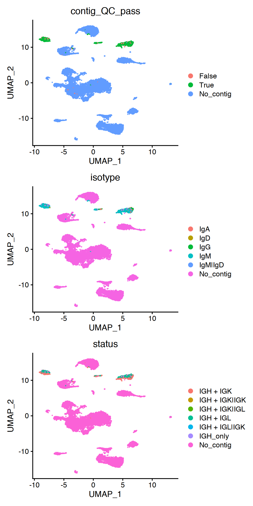
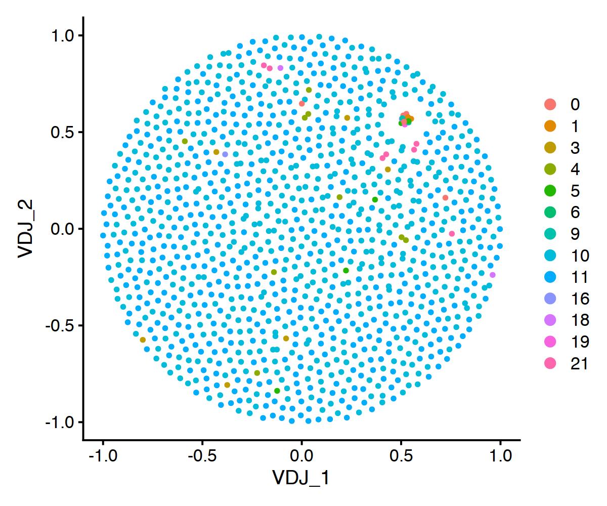

Running from R
==============

.. figure:: img/dandelion_logo_illustration.png
   :alt: dandelion_logo

   dandelion_logo

Foreword
--------

**dandelion** is written in ``python==3.7.6`` and it is primarily a
single-cell BCR-seq analysis package. It makes use of some tools from
the fantastic `immcantation
suite <https://immcantation.readthedocs.io/>`__ and the main idea is
that it implements a workflow for the pre-processing and exploratory
stages with integrated use of tools from *immcantation* for the BCR side
of things and analysis tools from
`scanpy <https://scanpy.readthedocs.io/>`__ for the RNA-seq side of
things. I hope to be able to introduce some new single-cell BCR-seq
exploratory tools down the road through *dandelion*.

**dandelion** can be run in ``R`` through ``reticulate``. This section
will try to replicate the examples using ``R``.

There are some issues with the conversion of dataframes between python
and R so I would **not** recommend saving the final ``AnnData`` object
as a final out file, but only use this to help generate the intermediate
files from the BCR processing and the plots. Please store your original
analysis some where safe. I would also skip quantify mutation step due
to conflicts between rpy2 and reticulate.

For more details, please refer to the original python tutorial.

Let’s start!

First, install reticulate via if you don’t already have it:

.. code:: r

   install.packages('reticulate')

Because we are managing the packages through a conda virtual
environment, we will need to point reticulate to the right python paths.

Currently, rpy2>=3.4 or >=3.3.2,<3.3.5 works.

.. code:: r

    library(reticulate)
    use_condaenv('dandelion')
    # or use Sys.setenv(RETICULATE_PYTHON = conda_python(envname='dandelion'))

You can check if the python config is set up properly with
``py_config()``

.. code:: r

    py_config()

To proceed with the analyses, we first change the working directory and
also import the dandelion module.

.. code:: r

    # change directory to somewhere more workable
    setwd('/Users/kt16/Downloads/dandelion_tutorial/')
    ddl = import('dandelion')

As per reticulate convention, python ``.`` operators are to be swaped
with ``$`` in R.

Pre-processing
--------------

To being the BCR preprocessing, the minimum files you require are the
following:

.. code:: console

   filtered_contig.fasta
   filtered_contig_annotations.csv

Step 1: Formatting the headers of the Cell Ranger fasta file
~~~~~~~~~~~~~~~~~~~~~~~~~~~~~~~~~~~~~~~~~~~~~~~~~~~~~~~~~~~~

This will do the following: 1) add the prefix provided to every sequence
header

2) add the prefix provided to every contig_id in the annotation.csv file

3) create a folder called ``dandelion/data`` (if left as default) and
   saves a copy of these files in that directory.

.. code:: r

    # the first option is a list of fasta files to format and the second option is the list of prefix to add to each file.
    samples = c('sc5p_v2_hs_PBMC_1k', 'sc5p_v2_hs_PBMC_10k', 'vdj_v1_hs_pbmc3', 'vdj_nextgem_hs_pbmc3')
    ddl$pp$format_fastas(samples, prefix = samples)

Step 2: Reannotate the V/D/J genes with *igblastn*.
~~~~~~~~~~~~~~~~~~~~~~~~~~~~~~~~~~~~~~~~~~~~~~~~~~~

``ddl$pp$reannotate_genes`` uses
`changeo <https://changeo.readthedocs.io/en/stable/examples/10x.html>`__\ ’s
scripts to call *igblastn* to reannotate the fasta files. Depending on
the ``fileformat`` option, it will parse out as either an ``airr``
(default) or ``changeo``-legacy TSV file. Importantly, with the recent
update to changeo v1.0.0, all the column headers, including *changeo*
format, are now adhereing to the
`AIRR <http://docs.airr-community.org/>`__ standard (lowercase and some
column name changes). Specifying ``extended = True`` will return the
additional 10x annotation of V/D/J genes but they are unnecessary at
this stage.

.. code:: r

    ddl$pp$reannotate_genes(samples)

you should see something like this in the terminal:

.. code:: console

   Assigning genes :   0%|                                        | 0/4 [00:00<?, ?it/s]   
   START> AssignGenes
    COMMAND> igblast
    VERSION> 1.15.0
       FILE> sc5p_v2_hs_PBMC_10k_b_filtered_contig.fasta
   ORGANISM> human
       LOCI> ig
      NPROC> 4

   PROGRESS> 12:30:37 |Running IgBLAST          | 0.0 min

Step 3 : Reassigning heavy chain V gene alleles *(optional but recommended)*
~~~~~~~~~~~~~~~~~~~~~~~~~~~~~~~~~~~~~~~~~~~~~~~~~~~~~~~~~~~~~~~~~~~~~~~~~~~~

Next, we use *immcantation’s TIgGER* method to reassign allelic calls
for heavy chain V genes with ``pp.reassign_alleles``. As stated in
TIgGER’s `website <https://tigger.readthedocs.io/en/stable/>`__ and
`manuscript <https://pubmed.ncbi.nlm.nih.gov/25675496/>`__, *‘TIgGER is
a computational method that significantly improves V(D)J allele
assignments by first determining the complete set of gene segments
carried by an individual (including novel alleles) from V(D)J-rearrange
sequences. TIgGER can then infer a subject’s genotype from these
sequences, and use this genotype to correct the initial V(D)J allele
assignments.’*

This impact’s on how contigs are chosen for finding clones later so it
is highly recommended to run it. It is also important when considering
to do mutational analysis.

However, the main caveat is that this needs to be run on multiple
samples from the same subject to allow for more information to be used
to confidently assign a genotyped *v_call*. In this tutorial, I’m
assuming the four samples can be split into two sets where sets of two
corresponds to a different/single individual. So while important, this
step can be skipped if you don’t have the samples to do this.

``pp.reassign_alleles`` requires the ``combined_folder`` option to be
specified so that a merged/concatenated file can be produced for running
TIgGER. The function also runs ``pp.create_germlines`` using the
germline database updated with the germline corrections from TIgGER. The
default behavior is that it will return a ``germline_alignment_d_mask``
column in the final output. This can be changed by specifying
``germ_types`` option; see
`here <https://changeo.readthedocs.io/en/stable/tools/CreateGermlines.html#creategermlines>`__
for other options.

Specifying ``fileformat = 'changeo'`` will run on changeo formatted
files if this was run earlier; but it’s probably best to stick to airr’s
standard format.

.. code:: r

    # reassigning alleles on the first set of samples
    ddl$pp$reassign_alleles(samples[1:2], combined_folder = 'tutorial_scgp1')

.. code:: r

    # reassigning alleles on the first set of samples
    ddl$pp$reassign_alleles(samples[3:4], combined_folder = 'tutorial_scgp2')

We can see that most of the original ambiguous V calls have now been
corrected and only a few remain. These will be flagged as multi later on
and can probably be excluded from detailed analyses. For now, leaving
them in the data will not impact on subsequent analyses.

Step 4: Assigning constant region calls
~~~~~~~~~~~~~~~~~~~~~~~~~~~~~~~~~~~~~~~

10X’s annotation.csv files provides a *c_gene* column, but rather than
simply relying on 10x’s annotation,
`hk6 <https://twitter.com/hamish_king>`__ recommended using
`immcantation-presto\ ’s
MaskPrimers.py <https://presto.readthedocs.io/en/version-0.5.3---license-change/tools/MaskPrimers.html>`__
with his custom primer list and I tested that; worked well but it took
**20 min** for the first file (~6k contigs). It also only calls the
constant region for the heavy chains. The processing speed for
MaskPrimers can be sped up with using the filtered file.

Anyway, as an alternative, I wrote a pre-processing function,
``ddl$pp$assign_isotypes``, to use *blast* to annotate constant region
calls for all contigs and retrieves the call, merging it with the tsv
files. This function will simply overwrite the output from previous
steps and add a *c_call* column at the end, or replace the existing
column if it already exists.

To deal with incorrect constant gene calls due to insufficient length,
an internal subfunction will run a pairwise alignment against
`hk6 <https://twitter.com/hamish_king>`__\ ’s curated sequences that
were deemed to be highly specific in distinguishing IGHA1-2, IGHG1-4. I
have also curated sets of sequences that should help deal with
``IGLC3/6/7`` as these are problematic too. If there’s insufficient
info, the ``c_call`` will be returned as a combination of the most
aligned sets of sequences. Because of how similar the light chains are,
extremely ambiguous calls (only able to map to a common sequence across
the light chains) will be returned as ``IGLC``. This typically occurs
when the constant sequence is very short. Those that have equal
alignment scores between ``IGLC3/6/7`` sequences and the common sequence
will be returned as a concatenated call; for example with a contig
initially annotated as ``IGLC3`` will be returned as ``IGLC,IGLC3``. If
you do not want this subfunction to run, toggle:

.. code:: r

   correct_c_call = FALSE

==========================

Before running, there is a need to set up a database with IMGT constant
gene fasta sequences using *makeblastdb*, basically following the
instructions from https://www.ncbi.nlm.nih.gov/books/NBK279688/. **This
only needs to be done once.**

The fasta files were downloaded from IMGT and only sequences
corresponding to *CH1* region for each constant gene/allele were
retained. The headers were trimmed to only keep the gene and allele
information. Links to find the sequences can be found here :
`human <http://www.imgt.org/genedb/GENElect?query=7.2+IGHC&species=Homo+sapiens>`__
and
`mouse <http://www.imgt.org/genedb/GENElect?query=7.2+IGHC&species=Mus>`__.

The database file is provided in the repository and I’ve written a
utility function ``ddl$utl$makeblastdb`` to prep new fasta
files/databases if you need to.

.. code:: r

   ddl$utl$makeblastdb('/path/to/folder/containing/database/blast/human/human_BCR_C.fasta')

**Again, we really only need to do it once**; the file path can be added
as an environmental variable after running:

.. code:: bash

   echo "export BLASTDB=/path/to/folder/containing/database/blast/" >> ~/.bash_profile
   source ~/.bash_profile

I’ve set it up so that if the default option for ``blastdb`` is left as
``None``, the function will retrieve a relative path from the
environmental variable ``$BLASTDB`` and then, depending on which
organism was specified (default = human), point to the correct fasta
file. If you choose not to add it to environment, you can provide a
string specifying a path to the fasta file for the ``blastdb`` option.
The string has to point directly to the fasta file, i.e. end with
``.fasta``.

==========================

.. code:: r

    # ddl$utl$makeblastdb('/Users/kt16/Documents/Github/dandelion/database/blast/human/human_BCR_C.fasta')

.. code:: r

    ddl$pp$assign_isotypes(samples)

This still takes a while when dealing with large files; the number of
cpus to size of file isn’t exactly linear. Nevertheless, I have enabled
parallelization as default because there were noticeable improvements in
processing speeds with the smaller files. Maybe it will work better on a
cluster with more cpus, rather than just a standard laptop. Other than a
couple of samples that took about **~10-40min**, most ran within
**2-5min**. I expect that this should run faster with filtered files
too.

The default option will return a summary plot that can be disabled with
``plot = FALSE``. In R, if you leave the ``plot = TRUE``, it will wait
for you to close the plots before continuing.

Also, the function can be run with ``fileformat = 'changeo'`` if
preferred.

It’s worthwhile to manually check the the sequences for constant calls
returned as IGHA1-2, IGHG1-4 and the light chains and manually correct
them if necessary.

Step 5: Quantify mutations *(optional)*.
~~~~~~~~~~~~~~~~~~~~~~~~~~~~~~~~~~~~~~~~

In the python tutorial, at this stage, I quantified the basic mutational
load with ``ddl.pp.quantify_mutations`` before subsequent analyses. This
would not run properly within this R session due to rpy2/reticulate
conflict. Instead, i’d recommend you to run this separately on the.
``*_igblast_gap_genotyped.tsv`` file that was generated in the previous
step, by following `Shazam’s
tutorial <https://shazam.readthedocs.io/en/stable/vignettes/Mutation-Vignette/>`__
on basic mutational analysis, before continuing to step 6.

Filtering
---------

**Create a Seurat object from the transcriptome data**

Let’s first import the gene expression data. Let’s try from Seurat
object.

.. code:: r

    setwd('/Users/kt16/Downloads/dandelion_tutorial/')
    library(Seurat)
    samples = c('sc5p_v2_hs_PBMC_1k', 'sc5p_v2_hs_PBMC_10k', 'vdj_v1_hs_pbmc3', 'vdj_nextgem_hs_pbmc3')
    seurat_objects = list()
    for (i in 1:length(samples)){
        filename = paste0(samples[i], '/filtered_feature_bc_matrix.h5')
        data <- Read10X_h5(filename)
        seurat_objects[[i]] <- CreateSeuratObject(counts = data$`Gene Expression`)
    }

.. parsed-literal::

    Warning message in sparseMatrix(i = indices[] + 1, p = indptr[], x = as.numeric(x = counts[]), :
    “'giveCsparse' has been deprecated; setting 'repr = "T"' for you”
    Genome matrix has multiple modalities, returning a list of matrices for this genome
    
    Warning message in sparseMatrix(i = indices[] + 1, p = indptr[], x = as.numeric(x = counts[]), :
    “'giveCsparse' has been deprecated; setting 'repr = "T"' for you”
    Genome matrix has multiple modalities, returning a list of matrices for this genome
    
    Warning message in sparseMatrix(i = indices[] + 1, p = indptr[], x = as.numeric(x = counts[]), :
    “'giveCsparse' has been deprecated; setting 'repr = "T"' for you”
    Genome matrix has multiple modalities, returning a list of matrices for this genome
    
    Warning message in sparseMatrix(i = indices[] + 1, p = indptr[], x = as.numeric(x = counts[]), :
    “'giveCsparse' has been deprecated; setting 'repr = "T"' for you”
    Genome matrix has multiple modalities, returning a list of matrices for this genome
    

.. code:: r

    # merge them, there's probably better ways
    merged1 = merge(seurat_objects[[1]], seurat_objects[[2]], add.cell.ids = samples[1:2])
    merged2 = merge(seurat_objects[[3]], seurat_objects[[4]], add.cell.ids = samples[3:4])
    merged = merge(merged1, merged2)

.. code:: r

    head(merged@meta.data)

.. raw:: html

    <table class="dataframe">
    <caption>A data.frame: 6 × 3</caption>
    <thead>
    	<tr><th></th><th scope=col>orig.ident</th><th scope=col>nCount_RNA</th><th scope=col>nFeature_RNA</th></tr>
    	<tr><th></th><th scope=col>&lt;chr&gt;</th><th scope=col>&lt;dbl&gt;</th><th scope=col>&lt;int&gt;</th></tr>
    </thead>
    <tbody>
    	<tr><th scope=row>sc5p_v2_hs_PBMC_1k_AAACCTGAGATCTGAA-1</th><td>SeuratProject</td><td>4386</td><td>1206</td></tr>
    	<tr><th scope=row>sc5p_v2_hs_PBMC_1k_AAACCTGAGGAACTGC-1</th><td>SeuratProject</td><td>6258</td><td>1723</td></tr>
    	<tr><th scope=row>sc5p_v2_hs_PBMC_1k_AAACCTGAGGAGTCTG-1</th><td>SeuratProject</td><td>4243</td><td>1404</td></tr>
    	<tr><th scope=row>sc5p_v2_hs_PBMC_1k_AAACCTGAGGCTCTTA-1</th><td>SeuratProject</td><td>5205</td><td>1622</td></tr>
    	<tr><th scope=row>sc5p_v2_hs_PBMC_1k_AAACCTGAGTACGTTC-1</th><td>SeuratProject</td><td>7098</td><td>2123</td></tr>
    	<tr><th scope=row>sc5p_v2_hs_PBMC_1k_AAACCTGGTATCACCA-1</th><td>SeuratProject</td><td>1095</td><td> 604</td></tr>
    </tbody>
    </table>

``dandelion`` removes hyphen from the cell barcodes as a default
behaviour, so we will do the same for the ``Seurat`` object.

.. code:: r

    # remove the -# from the end of each cell name
    merged <- RenameCells(merged, new.names = gsub('-.*', '', row.names(merged@meta.data)))
    merged

.. parsed-literal::

    An object of class Seurat 
    38224 features across 36730 samples within 1 assay 
    Active assay: RNA (38224 features, 0 variable features)

**Standard Seurat pre-processing workflow**

.. code:: r

    merged[["percent.mt"]] <- PercentageFeatureSet(merged, pattern = "^MT-")
    merged <- subset(merged, subset = nFeature_RNA > 200 & nFeature_RNA < 2500 & percent.mt < 5)
    merged <- NormalizeData(merged)
    merged <- FindVariableFeatures(merged, selection.method = "vst", nfeatures = 2000)
    merged <- ScaleData(merged)
    merged <- RunPCA(merged, features = VariableFeatures(object = merged))
    merged <- FindNeighbors(merged, dims = 1:50)
    merged <- FindClusters(merged)
    merged <- RunUMAP(merged, dims = 1:50)

.. parsed-literal::

    Centering and scaling data matrix
    
    PC_ 1 
    Positive:  IFITM1, RPS27, IL32, LTB, RPS18, IL7R, TRBC2, TCF7, CD7, RPS29 
    	   NOSIP, LEF1, CD247, ETS1, AES, CCR7, MAL, LIME1, CD2, TRBC1 
    	   SELL, CD69, GZMM, AQP3, OXNAD1, SEPT6, SEPT1, ARL4C, PIM2, TRAC 
    Negative:  LYZ, S100A9, FCN1, S100A8, CST3, VCAN, MNDA, IFI30, SPI1, SERPINA1 
    	   S100A12, CSTA, CD14, TYMP, LST1, CTSS, CYBB, MS4A6A, CSF3R, CD68 
    	   TYROBP, NCF2, CFD, TNFAIP2, FTL, CD36, CEBPD, AIF1, GRN, LILRB2 
    PC_ 2 
    Positive:  MS4A1, CD79A, BANK1, LINC00926, IGHM, HLA-DQA1, FCER2, HLA-DQB1, TCL1A, CD79B 
    	   FCRLA, CD19, VPREB3, RALGPS2, CD22, FCRL1, HLA-DRA, HLA-DOB, AFF3, IGHD 
    	   BLNK, POU2AF1, NIBAN3, IGKC, CD24, SPIB, BLK, ADAM28, HLA-DPB1, TSPAN13 
    Negative:  NKG7, CST7, GZMA, PRF1, GNLY, HCST, KLRD1, CTSW, FGFBP2, FCGR3A 
    	   KLRF1, HOPX, SPON2, GZMB, CLIC3, IFITM1, CCL5, MATK, TBX21, IFITM2 
    	   IL2RB, SH2D1B, SRGN, S100A4, S1PR5, KLRB1, MYOM2, ITGB2, ADGRG1, PTGDR 
    PC_ 3 
    Positive:  TCF7, LEF1, IL7R, TPT1, VIM, CCR7, MAL, NOSIP, RPL36A, OXNAD1 
    	   ACTN1, RGCC, PRKCQ-AS1, RPL17, AQP3, LTB, BCL11B, GIMAP5, SNHG29, INPP4B 
    	   NELL2, RPS18, EEF1G, GIMAP1, GAS5, RPS29, RPS4Y1, LRRN3, AIF1, CD40LG 
    Negative:  NKG7, GZMB, GNLY, CST7, PRF1, KLRD1, FCGR3A, GZMA, KLRF1, CLIC3 
    	   FGFBP2, SPON2, HOPX, SH2D1B, TBX21, CCL4, ADGRG1, S1PR5, MYOM2, MATK 
    	   PTGDR, TTC38, IL2RB, CXXC5, PRSS23, CTSW, GZMH, CCL5, PLEK, CX3CR1 
    PC_ 4 
    Positive:  TLE5, RPS4Y1, EEF1G, SNHG29, GAS5, PCED1B-AS1, SNHG6, SEPTIN9, SEPTIN7, PLAAT4 
    	   LINC01578, SEPTIN1, IL2RG, AL138963.4, SEPTIN6, SNHG5, RPL17, TOMM6, JUND, GIMAP5 
    	   RESF1, PRKCQ-AS1, CD81, MICOS10, RBIS, ATP5PO, KLF2, RNASEK, GNAS, RPS17 
    Negative:  AES, SEPT9, SEPT6, SEPT1, RARRES3, AL138963.3, KIAA1551, JUNB, DUSP1, FOS 
    	   FTH1, JUN, GAPDH, MTRNR2L12, HLA-DQA2, RETN, CD69, COTL1, HLA-DRB5, FAM129C 
    	   SAT1, VIM, NFKBIA, DUSP2, PPP1R15A, TNFAIP3, LGALS3, LTB, NR4A1, AL121748.1 
    PC_ 5 
    Positive:  CAVIN2, GNG11, PPBP, TUBB1, PF4, SPARC, MPIG6B, CLU, GP9, TREML1 
    	   ITGA2B, CMTM5, PTGS1, PRKAR2B, NRGN, AL731557.1, MYL9, MAP3K7CL, MMD, TRIM58 
    	   F13A1, ACRBP, AC147651.1, AP001189.1, THBS1, TMEM40, CD9, C2orf88, PTCRA, MGLL 
    Negative:  RPS18, MALAT1, RPS27, TPT1, CYBA, RPS29, CD37, ITGB2, RPL36A, CD74 
    	   JUN, RPL17, IER2, JUNB, VIM, S100A6, IFITM2, NKG7, DUSP1, ZFP36 
    	   S100A4, GSTP1, FGR, EFHD2, TYROBP, S100A10, KLF2, PRF1, GZMA, CST7 
    
    Computing nearest neighbor graph
    
    Computing SNN
    

.. parsed-literal::

    Modularity Optimizer version 1.3.0 by Ludo Waltman and Nees Jan van Eck
    
    Number of nodes: 20766
    Number of edges: 928189
    
    Running Louvain algorithm...
    Maximum modularity in 10 random starts: 0.9138
    Number of communities: 24
    Elapsed time: 2 seconds

.. parsed-literal::

    Warning message:
    “The default method for RunUMAP has changed from calling Python UMAP via reticulate to the R-native UWOT using the cosine metric
    To use Python UMAP via reticulate, set umap.method to 'umap-learn' and metric to 'correlation'
    This message will be shown once per session”
    23:51:32 UMAP embedding parameters a = 0.9922 b = 1.112
    
    23:51:32 Read 20766 rows and found 50 numeric columns
    
    23:51:32 Using Annoy for neighbor search, n_neighbors = 30
    
    23:51:32 Building Annoy index with metric = cosine, n_trees = 50
    
    0%   10   20   30   40   50   60   70   80   90   100%
    
    [----|----|----|----|----|----|----|----|----|----|
    
    *
    *
    *
    *
    *
    *
    *
    *
    *
    *
    *
    *
    *
    *
    *
    *
    *
    *
    *
    *
    *
    *
    *
    *
    *
    *
    *
    *
    *
    *
    *
    *
    *
    *
    *
    *
    *
    *
    *
    *
    *
    *
    *
    *
    *
    *
    *
    *
    *
    *
    |
    
    23:51:34 Writing NN index file to temp file /var/folders/nb/wrd6px6171j52lqpmkljt6vw000l2l/T//RtmpKTzwsS/filee47b1be59093
    
    23:51:35 Searching Annoy index using 1 thread, search_k = 3000
    
    23:51:41 Annoy recall = 100%
    
    23:51:41 Commencing smooth kNN distance calibration using 1 thread
    
    23:51:42 Initializing from normalized Laplacian + noise
    
    23:51:49 Commencing optimization for 200 epochs, with 905388 positive edges
    
    23:52:02 Optimization finished
    

.. code:: r

    options(repr.plot.width = 6, repr.plot.height = 4)
    DimPlot(merged, reduction = "umap")

.. image:: 6_dandelion_running_from_R-10x_data_files/6_dandelion_running_from_R-10x_data_32_0.png
   :width: 360px
   :height: 240px

.. code:: r

    merged

.. parsed-literal::

    An object of class Seurat 
    38224 features across 20766 samples within 1 assay 
    Active assay: RNA (38224 features, 2000 variable features)
     2 dimensional reductions calculated: pca, umap

In order for ``dandelion`` to do the next step (marking/filtering of
poor quality BCRs and BCR doublets), we need to include a column in the
metadata, ``filter_rna``. This column will tell ``dandelion`` whether or
not the cell has passed transcriptomic QCs. So, we will set the column
to ``FALSE`` i.e. every cell passed QC. This is important because we
want to remove as many doublets and poor quality contigs to save time on
computation and construction of the final data tables.

.. code:: r

    # create a column called filter_rna and set it to FALSE
    merged@meta.data$filter_rna = FALSE

**Convert to AnnData**

We will need to convert the ``Seurat`` object to ``AnnData`` to be able
to continue. ``AnnData`` ``.obs`` slot is essentially the same as
``@meta.data`` in seurat.

.. code:: r

    library(reticulate)
    sc = import("scanpy")
    # convert the meta.data slot to a python friendly object
    obs = r_to_py(merged@meta.data)
    normcounts = r_to_py(Matrix::t(GetAssayData(merged)))

.. code:: r

    adata = sc$AnnData(X = normcounts, obs = obs)
    adata

.. parsed-literal::

    AnnData object with n_obs × n_vars = 20766 × 38224
        obs: 'orig.ident', 'nCount_RNA', 'nFeature_RNA', 'percent.mt', 'RNA_snn_res.0.8', 'seurat_clusters', 'filter_rna'

We need to populate the ``.neighbors`` slots via scanpy for smooth
transfer later.

.. code:: r

    sc$pp$neighbors(adata)
    adata

.. parsed-literal::

    AnnData object with n_obs × n_vars = 20766 × 38224
        obs: 'orig.ident', 'nCount_RNA', 'nFeature_RNA', 'percent.mt', 'RNA_snn_res.0.8', 'seurat_clusters', 'filter_rna'
        uns: 'neighbors'
        obsm: 'X_pca'
        obsp: 'distances', 'connectivities'

**Read in the BCR files and merge them**

.. code:: r

    files = list()
    for (i in 1:length(samples)){
        filename = paste0(samples[i], '/dandelion/filtered_contig_igblast_db-pass_genotyped.tsv')
        files[[i]] <- readr::read_tsv(filename)
    }
    combined_bcr = do.call(rbind, files)
    head(combined_bcr)

.. parsed-literal::

    Registered S3 method overwritten by 'cli':
      method     from    
      print.boxx spatstat
    
    ── Column specification ─────────────────────────────────────────────────────────────────────────────────────────────────────────────────────────────────────
    cols(
      .default = col_character(),
      rev_comp = col_logical(),
      productive = col_logical(),
      stop_codon = col_logical(),
      vj_in_frame = col_logical(),
      junction_length = col_double(),
      np1_length = col_double(),
      np2_length = col_double(),
      v_sequence_start = col_double(),
      v_sequence_end = col_double(),
      v_germline_start = col_double(),
      v_germline_end = col_double(),
      d_sequence_start = col_double(),
      d_sequence_end = col_double(),
      d_germline_start = col_double(),
      d_germline_end = col_double(),
      j_sequence_start = col_double(),
      j_sequence_end = col_double(),
      j_germline_start = col_double(),
      j_germline_end = col_double(),
      v_score = col_double()
      # ... with 16 more columns
    )
    ℹ Use `spec()` for the full column specifications.
    
    
    
    ── Column specification ─────────────────────────────────────────────────────────────────────────────────────────────────────────────────────────────────────
    cols(
      .default = col_character(),
      rev_comp = col_logical(),
      productive = col_logical(),
      stop_codon = col_logical(),
      vj_in_frame = col_logical(),
      junction_length = col_double(),
      np1_length = col_double(),
      np2_length = col_double(),
      v_sequence_start = col_double(),
      v_sequence_end = col_double(),
      v_germline_start = col_double(),
      v_germline_end = col_double(),
      d_sequence_start = col_double(),
      d_sequence_end = col_double(),
      d_germline_start = col_double(),
      d_germline_end = col_double(),
      j_sequence_start = col_double(),
      j_sequence_end = col_double(),
      j_germline_start = col_double(),
      j_germline_end = col_double(),
      v_score = col_double()
      # ... with 16 more columns
    )
    ℹ Use `spec()` for the full column specifications.
    
    
    
    ── Column specification ─────────────────────────────────────────────────────────────────────────────────────────────────────────────────────────────────────
    cols(
      .default = col_character(),
      rev_comp = col_logical(),
      productive = col_logical(),
      stop_codon = col_logical(),
      vj_in_frame = col_logical(),
      junction_length = col_double(),
      np1_length = col_double(),
      np2_length = col_double(),
      v_sequence_start = col_double(),
      v_sequence_end = col_double(),
      v_germline_start = col_double(),
      v_germline_end = col_double(),
      d_sequence_start = col_double(),
      d_sequence_end = col_double(),
      d_germline_start = col_double(),
      d_germline_end = col_double(),
      j_sequence_start = col_double(),
      j_sequence_end = col_double(),
      j_germline_start = col_double(),
      j_germline_end = col_double(),
      v_score = col_double()
      # ... with 16 more columns
    )
    ℹ Use `spec()` for the full column specifications.
    
    
    
    ── Column specification ─────────────────────────────────────────────────────────────────────────────────────────────────────────────────────────────────────
    cols(
      .default = col_character(),
      rev_comp = col_logical(),
      productive = col_logical(),
      stop_codon = col_logical(),
      vj_in_frame = col_logical(),
      junction_length = col_double(),
      np1_length = col_double(),
      np2_length = col_double(),
      v_sequence_start = col_double(),
      v_sequence_end = col_double(),
      v_germline_start = col_double(),
      v_germline_end = col_double(),
      d_sequence_start = col_double(),
      d_sequence_end = col_double(),
      d_germline_start = col_double(),
      d_germline_end = col_double(),
      j_sequence_start = col_double(),
      j_sequence_end = col_double(),
      j_germline_start = col_double(),
      j_germline_end = col_double(),
      v_score = col_double()
      # ... with 16 more columns
    )
    ℹ Use `spec()` for the full column specifications.
    
    

.. raw:: html

    <table class="dataframe">
    <caption>A tibble: 6 × 80</caption>
    <thead>
    	<tr><th scope=col>sequence_id</th><th scope=col>sequence</th><th scope=col>rev_comp</th><th scope=col>productive</th><th scope=col>v_call</th><th scope=col>d_call</th><th scope=col>j_call</th><th scope=col>sequence_alignment</th><th scope=col>germline_alignment</th><th scope=col>junction</th><th scope=col>⋯</th><th scope=col>fwr2_aa</th><th scope=col>fwr3_aa</th><th scope=col>fwr4_aa</th><th scope=col>cdr1_aa</th><th scope=col>cdr2_aa</th><th scope=col>cdr3_aa</th><th scope=col>sequence_alignment_aa</th><th scope=col>v_sequence_alignment_aa</th><th scope=col>d_sequence_alignment_aa</th><th scope=col>j_sequence_alignment_aa</th></tr>
    	<tr><th scope=col>&lt;chr&gt;</th><th scope=col>&lt;chr&gt;</th><th scope=col>&lt;lgl&gt;</th><th scope=col>&lt;lgl&gt;</th><th scope=col>&lt;chr&gt;</th><th scope=col>&lt;chr&gt;</th><th scope=col>&lt;chr&gt;</th><th scope=col>&lt;chr&gt;</th><th scope=col>&lt;chr&gt;</th><th scope=col>&lt;chr&gt;</th><th scope=col>⋯</th><th scope=col>&lt;chr&gt;</th><th scope=col>&lt;chr&gt;</th><th scope=col>&lt;chr&gt;</th><th scope=col>&lt;chr&gt;</th><th scope=col>&lt;chr&gt;</th><th scope=col>&lt;chr&gt;</th><th scope=col>&lt;chr&gt;</th><th scope=col>&lt;chr&gt;</th><th scope=col>&lt;chr&gt;</th><th scope=col>&lt;chr&gt;</th></tr>
    </thead>
    <tbody>
    	<tr><td>sc5p_v2_hs_PBMC_1k_AAACCTGTCACTGGGC_contig_2</td><td>GGGGACTTTCTGAGAGTCCTGGACCTCCTGCACAAGAACATGAAACACCTGTGGTTCTTCCTCCTCCTGGTGGCAGCTCCCAGATGGGTCCTGTCCCAGGTGCAGCTGCAGGAGTCGGGCCCAGGACTGGTGAAGCCTTCGGAGACCCTGTCCCTCACCTGCACTGTCTCTGGTGGCTCCATCAGGAGTTACTACTGGAGCTGGATCCGGCAGCCCGCCGGGAAGGGACTGGAGTGGATTGGGCGTATCTATATTAGTGGGAGCACCAACTACAACCCCTCCCTCAAGAGTCGAGTCACCATGTCAGTAGACACGTCCAAGAACCAATTCTCCCTGAAGCTGAGCTCTGTGACCGCCGCGGACACGGCCGTGTATTACTGTGCGAGAGGCGGGAACAGTGGCTTAGACCCCTGGGGCCAGGGAACCCTGGTCACCGTCTCCTCAGGGAGTGCATCCGCCCCAACCCTTTTCCCCCTCGTCTCCTGTGAGAATTCCCCGTCGGATACGAGCAGCGTG                                                     </td><td>FALSE</td><td> TRUE</td><td>IGHV4-4*07                          </td><td>IGHD6-19*01</td><td>IGHJ5*02         </td><td>CAGGTGCAGCTGCAGGAGTCGGGCCCA...GGACTGGTGAAGCCTTCGGAGACCCTGTCCCTCACCTGCACTGTCTCTGGTGGCTCCATC............AGGAGTTACTACTGGAGCTGGATCCGGCAGCCCGCCGGGAAGGGACTGGAGTGGATTGGGCGTATCTATATTAGT.........GGGAGCACCAACTACAACCCCTCCCTCAAG...AGTCGAGTCACCATGTCAGTAGACACGTCCAAGAACCAATTCTCCCTGAAGCTGAGCTCTGTGACCGCCGCGGACACGGCCGTGTATTACTGTGCGAGAGGCGGGAACAGTGGCTTAGACCCCTGGGGCCAGGGAACCCTGGTCACCGTCTCCTCAG</td><td>CAGGTGCAGCTGCAGGAGTCGGGCCCA...GGACTGGTGAAGCCTTCGGAGACCCTGTCCCTCACCTGCACTGTCTCTGGTGGCTCCATC............AGTAGTTACTACTGGAGCTGGATCCGGCAGCCCGCCGGGAAGGGACTGGAGTGGATTGGGCGTATCTATACCAGT.........GGGAGCACCAACTACAACCCCTCCCTCAAG...AGTCGAGTCACCATGTCAGTAGACACGTCCAAGAACCAGTTCTCCCTGAAGCTGAGCTCTGTGACCGCCGCGGACACGGCCGTGTATTACTGTGCGAGAGNNNNNNNCAGTGGCTNNGACCCCTGGGGCCAGGGAACCCTGGTCACCGTCTCCTCAG</td><td>TGTGCGAGAGGCGGGAACAGTGGCTTAGACCCCTGG</td><td>⋯</td><td>WSWIRQPAGKGLEWIGR</td><td>NYNPSLKSRVTMSVDTSKNQFSLKLSSVTAADTAVYYC</td><td>WGQGTLVTVSS</td><td>GGSIRSYY   </td><td>IYISGST</td><td>ARGGNSGLDP</td><td>QVQLQESGPGLVKPSETLSLTCTVSGGSIRSYYWSWIRQPAGKGLEWIGRIYISGSTNYNPSLKSRVTMSVDTSKNQFSLKLSSVTAADTAVYYCARGGNSGLDPWGQGTLVTVSS</td><td>QVQLQESGPGLVKPSETLSLTCTVSGGSIRSYYWSWIRQPAGKGLEWIGRIYISGSTNYNPSLKSRVTMSVDTSKNQFSLKLSSVTAADTAVYYCAR       </td><td>SG</td><td>DPWGQGTLVTVSS</td></tr>
    	<tr><td>sc5p_v2_hs_PBMC_1k_AAACCTGTCACTGGGC_contig_3</td><td>GGGGACTGATCAGGACTCCTCAGTTCACCTTCTCACAATGAGGCTCCCTGCTCAGCTCCTGGGGCTGCTAATGCTCTGGGTCCCAGGATCCAGTGGGGATGTTGTGATGACTCAGTCTCCACTCTCCCTGCCCGTCACCCTTGGACAGCCGGCCTCCATCTCCTGCAGGTCTAGTCAAAGCCTCGTATACAGTGATGGAAACACCTACTTGAATTGGTTTCAGCAGAGGCCAGGCCAATCTCCAAGGCGCCTAATTTATAAGTTTTCTAACTGGGACTCTGGGGTCCCAGACAGATTCAGCGGCAGTGGGTCAGGCACTGATTTCACACTGAAAATCAGCAGGGTGGAGGCTGAGGATGTTGGGGTTTATTACTGCATGCAAGGTACACACTGGCCTGGACGTTCGGCCAAGGGACCAAGGTGGAAATCAAACGAACTGTGGCTGCACCATCTGTCTTCATCTTCCCGCCATCTGATGAGCAGTTGAAATCTGGAACTGCCTCTGTTGTGTGCCTGCTGAATAACTTCTATCCCAGAGAGGCCAAAGTACAGTGGAAGGTGGATAACGC</td><td>FALSE</td><td>FALSE</td><td>IGKV2D-30*01                        </td><td>NA         </td><td>IGKJ1*01         </td><td>GATGTTGTGATGACTCAGTCTCCACTCTCCCTGCCCGTCACCCTTGGACAGCCGGCCTCCATCTCCTGCAGGTCTAGTCAAAGCCTCGTATACAGT...GATGGAAACACCTACTTGAATTGGTTTCAGCAGAGGCCAGGCCAATCTCCAAGGCGCCTAATTTATAAGTTT.....................TCTAACTGGGACTCTGGGGTCCCA...GACAGATTCAGCGGCAGTGGG......TCAGGCACTGATTTCACACTGAAAATCAGCAGGGTGGAGGCTGAGGATGTTGGGGTTTATTACTGCATGCAAGGTACACACTGGCCTGGACGTTCGGCCAAGGGACCAAGGTGGAAATCAAAC       </td><td>GATGTTGTGATGACTCAGTCTCCACTCTCCCTGCCCGTCACCCTTGGACAGCCGGCCTCCATCTCCTGCAGGTCTAGTCAAAGCCTCGTATACAGT...GATGGAAACACCTACTTGAATTGGTTTCAGCAGAGGCCAGGCCAATCTCCAAGGCGCCTAATTTATAAGGTT.....................TCTAACTGGGACTCTGGGGTCCCA...GACAGATTCAGCGGCAGTGGG......TCAGGCACTGATTTCACACTGAAAATCAGCAGGGTGGAGGCTGAGGATGTTGGGGTTTATTACTGCATGCAAGGTACACACTGGCCTGGACGTTCGGCCAAGGGACCAAGGTGGAAATCAAAC       </td><td>TGCATGCAAGGTACACACTGGCCTGGACGTTC    </td><td>⋯</td><td>LNWFQQRPGQSPRRLIY</td><td>NWDSGVPDRFSGSGSGTDFTLKISRVEAEDVGVYYC  </td><td>SAKGPRWKS  </td><td>QSLVYSDGNTY</td><td>KFS    </td><td>MQGTHWPGR </td><td>DVVMTQSPLSLPVTLGQPASISCRSSQSLVYSDGNTYLNWFQQRPGQSPRRLIYKFSNWDSGVPDRFSGSGSGTDFTLKISRVEAEDVGVYYCMQGTHWPGRSAKGPRWKSN    </td><td>DVVMTQSPLSLPVTLGQPASISCRSSQSLVYSDGNTYLNWFQQRPGQSPRRLIYKFSNWDSGVPDRFSGSGSGTDFTLKISRVEAEDVGVYYCMQGTHWP    </td><td>NA</td><td>GRSAKGPRWKSN </td></tr>
    	<tr><td>sc5p_v2_hs_PBMC_1k_AAACCTGTCACTGGGC_contig_1</td><td>GGGGGAGGAGTCAGTCCCAACCAGGACACAGCATGGACATGAGGGTCCCTGCTCAGCTCCTGGGGCTCCTGCTGCTCTGGCTCTCAGGTGCCAGATGTGCCATCCAGATGACCCAGTCTCCATCCTCCCTGTCTGCATCTGTAGGAGACAGAGTCACCATCACTTGCCAGGCGAGTCAGGACATTAGCAACTATTTAAATTGGTATCAGCAGAAACCAGGGAAAGCCCCTAAGCTCCTGATCTACGATGCATCCAATTTGGAAGCAGGGGTCCCATCAAGGTTCAGTGGAAGTGGATCTGGGACAGATTTTACTTTCACCATCAGCAGCCTGCAGCCTGAAGATATTGCAACATATTACTGTCAACAGTATGATAATCTCCCGCTCACTTTCGGCGGAGGGACCAAGGTGGAGATCAAACGAACTGTGGCTGCACCATCTGTCTTCATCTTCCCGCCATCTGATGAGCAGTTGAAATCTGGAACTGCCTCTGTTGTGTGCCTGCTGAATAACTTCTATCCCAGAGAGGCCAAAGTACAGTGGAAGGTGGATAACGC             </td><td>FALSE</td><td> TRUE</td><td>IGKV1-33*01,IGKV1D-33*01            </td><td>NA         </td><td>IGKJ4*01         </td><td>..CATCCAGATGACCCAGTCTCCATCCTCCCTGTCTGCATCTGTAGGAGACAGAGTCACCATCACTTGCCAGGCGAGTCAGGACATT..................AGCAACTATTTAAATTGGTATCAGCAGAAACCAGGGAAAGCCCCTAAGCTCCTGATCTACGATGCA.....................TCCAATTTGGAAGCAGGGGTCCCA...TCAAGGTTCAGTGGAAGTGGA......TCTGGGACAGATTTTACTTTCACCATCAGCAGCCTGCAGCCTGAAGATATTGCAACATATTACTGTCAACAGTATGATAATCTCCCGCTCACTTTCGGCGGAGGGACCAAGGTGGAGATCAAAC      </td><td>GACATCCAGATGACCCAGTCTCCATCCTCCCTGTCTGCATCTGTAGGAGACAGAGTCACCATCACTTGCCAGGCGAGTCAGGACATT..................AGCAACTATTTAAATTGGTATCAGCAGAAACCAGGGAAAGCCCCTAAGCTCCTGATCTACGATGCA.....................TCCAATTTGGAAACAGGGGTCCCA...TCAAGGTTCAGTGGAAGTGGA......TCTGGGACAGATTTTACTTTCACCATCAGCAGCCTGCAGCCTGAAGATATTGCAACATATTACTGTCAACAGTATGATAATCTCCCGCTCACTTTCGGCGGAGGGACCAAGGTGGAGATCAAAC      </td><td>TGTCAACAGTATGATAATCTCCCGCTCACTTTC   </td><td>⋯</td><td>LNWYQQKPGKAPKLLIY</td><td>NLEAGVPSRFSGSGSGTDFTFTISSLQPEDIATYYC  </td><td>FGGGTKVEIK </td><td>QDISNY     </td><td>DAS    </td><td>QQYDNLPLT </td><td>IQMTQSPSSLSASVGDRVTITCQASQDISNYLNWYQQKPGKAPKLLIYDASNLEAGVPSRFSGSGSGTDFTFTISSLQPEDIATYYCQQYDNLPLTFGGGTKVEIK          </td><td>IQMTQSPSSLSASVGDRVTITCQASQDISNYLNWYQQKPGKAPKLLIYDASNLEAGVPSRFSGSGSGTDFTFTISSLQPEDIATYYCQQYDNLP          </td><td>NA</td><td>LTFGGGTKVEIK </td></tr>
    	<tr><td>sc5p_v2_hs_PBMC_1k_AAACCTGTCAGGTAAA_contig_1</td><td>AGGAGTCAGACCCAGTCAGGACACAGCATGGACATGAGGGTCCCCGCTCAGCTCCTGGGGCTCCTGCTGCTCTGGTTCCCAGGTTCCAGATGCGACATCCAGATGACCCAGTCTCCATCTTCCGTGTCTGCATCTGTAGGAGACAGAGTCACCATCACTTGTCGGGCGAGTCAGGGTATTAGCGACTGGTTAGCCTGGTATCAGCAGAAGCCAGGGAAAGCCCCTAAGTTCCTGATCTATGCTGCATCCACTTTGCAAAGTGGGGTCCCATCAAGGTTCAGCGGCAGTGGATCTGGGACAGATTTCACTCTCACCATCAGCCTGCAGCCTGAAGATTTTGCAACTTACTATTGTCAACAGGCTAACAGTTTCCCGCTCACTTTCGGCGGAGGGACCAAGGTGGAGATCAAACGAACTGTGGCTGCACCATCTGTCTTCATCTTCCCGCCATCTGATGAGCAGTTGAAATCTGGAACTGCCTCTGTTGTGTGCCTGCTGAATAACTTCTATCCCAGAGAGGCCAAAGTACAGTGGAAGGTGGATAACGC                     </td><td>FALSE</td><td> TRUE</td><td>IGKV1-12*01,IGKV1-12*02,IGKV1D-12*02</td><td>NA         </td><td>IGKJ4*01         </td><td>GACATCCAGATGACCCAGTCTCCATCTTCCGTGTCTGCATCTGTAGGAGACAGAGTCACCATCACTTGTCGGGCGAGTCAGGGTATT..................AGCGACTGGTTAGCCTGGTATCAGCAGAAGCCAGGGAAAGCCCCTAAGTTCCTGATCTATGCTGCA.....................TCCACTTTGCAAAGTGGGGTCCCA...TCAAGGTTCAGCGGCAGTGGA......TCTGGGACAGATTTCACTCTCACCAT---CAGCCTGCAGCCTGAAGATTTTGCAACTTACTATTGTCAACAGGCTAACAGTTTCCCGCTCACTTTCGGCGGAGGGACCAAGGTGGAGATCAAAC      </td><td>GACATCCAGATGACCCAGTCTCCATCTTCCGTGTCTGCATCTGTAGGAGACAGAGTCACCATCACTTGTCGGGCGAGTCAGGGTATT..................AGCAGCTGGTTAGCCTGGTATCAGCAGAAACCAGGGAAAGCCCCTAAGCTCCTGATCTATGCTGCA.....................TCCAGTTTGCAAAGTGGGGTCCCA...TCAAGGTTCAGCGGCAGTGGA......TCTGGGACAGATTTCACTCTCACCATCAGCAGCCTGCAGCCTGAAGATTTTGCAACTTACTATTGTCAACAGGCTAACAGTTTCCCGCTCACTTTCGGCGGAGGGACCAAGGTGGAGATCAAAC      </td><td>TGTCAACAGGCTAACAGTTTCCCGCTCACTTTC   </td><td>⋯</td><td>LAWYQQKPGKAPKFLIY</td><td>TLQSGVPSRFSGSGSGTDFTLTISLQPEDFATYYC   </td><td>FGGGTKVEIK </td><td>QGISDW     </td><td>AAS    </td><td>QQANSFPLT </td><td>DIQMTQSPSSVSASVGDRVTITCRASQGISDWLAWYQQKPGKAPKFLIYAASTLQSGVPSRFSGSGSGTDFTLTISLQPEDFATYYCQQANSFPLTFGGGTKVEIK          </td><td>DIQMTQSPSSVSASVGDRVTITCRASQGISDWLAWYQQKPGKAPKFLIYAASTLQSGVPSRFSGSGSGTDFTLTISLQPEDFATYYCQQANSFP          </td><td>NA</td><td>LTFGGGTKVEIK </td></tr>
    	<tr><td>sc5p_v2_hs_PBMC_1k_AAACCTGTCAGGTAAA_contig_2</td><td>GGAGGAACTGCTCAGTTAGGACCCAGACGGAACCATGGAAGCCCCAGCGCAGCTTCTCTTCCTCCTGCTACTCTGGCTCCCAGATACCACTGGAGAAATAGTGATGACGCAGTCTCCAGCCACCCTGTCTGTGTCTCCAGGGGAAAGAGCCACCCTCTCCTGCAGGGCCAGTCAGAGTGTTAGCAGCAACTTGGCCTGGTACCAGCAGAAACCTGGCCAGGCTCCCAGGCTCCTCATCTATGGTACATCCACCAGGGCCACTGGTATCCCAGCCAGGTTCAGTGGCAGTGGGTCTGGGACAGAGTTCACTCTCACCATCAGCAGCCTGCAGTCTGAAGATTTTGCAGTTTATTACTGTCAGCAGTATGATAACTGGCCTCCGTACACTTTTGGCCAGGGGACCAAGCTGGAGATCAAACGAACTGTGGCTGCACCATCTGTCTTCATCTTCCCGCCATCTGATGAGCAGTTGAAATCTGGAACTGCCTCTGTTGTGTGCCTGCTGAATAACTTCTATCCCAGAGAGGCCAAAGTACAGTGGAAGGTGGATAACGC              </td><td>FALSE</td><td> TRUE</td><td>IGKV3-15*01                         </td><td>NA         </td><td>IGKJ2*01         </td><td>GAAATAGTGATGACGCAGTCTCCAGCCACCCTGTCTGTGTCTCCAGGGGAAAGAGCCACCCTCTCCTGCAGGGCCAGTCAGAGTGTT..................AGCAGCAACTTGGCCTGGTACCAGCAGAAACCTGGCCAGGCTCCCAGGCTCCTCATCTATGGTACA.....................TCCACCAGGGCCACTGGTATCCCA...GCCAGGTTCAGTGGCAGTGGG......TCTGGGACAGAGTTCACTCTCACCATCAGCAGCCTGCAGTCTGAAGATTTTGCAGTTTATTACTGTCAGCAGTATGATAACTGGCCTCCGTACACTTTTGGCCAGGGGACCAAGCTGGAGATCAAAC   </td><td>GAAATAGTGATGACGCAGTCTCCAGCCACCCTGTCTGTGTCTCCAGGGGAAAGAGCCACCCTCTCCTGCAGGGCCAGTCAGAGTGTT..................AGCAGCAACTTAGCCTGGTACCAGCAGAAACCTGGCCAGGCTCCCAGGCTCCTCATCTATGGTGCA.....................TCCACCAGGGCCACTGGTATCCCA...GCCAGGTTCAGTGGCAGTGGG......TCTGGGACAGAGTTCACTCTCACCATCAGCAGCCTGCAGTCTGAAGATTTTGCAGTTTATTACTGTCAGCAGTATAATAACTGGCCTCCGTACACTTTTGGCCAGGGGACCAAGCTGGAGATCAAAC   </td><td>TGTCAGCAGTATGATAACTGGCCTCCGTACACTTTT</td><td>⋯</td><td>LAWYQQKPGQAPRLLIY</td><td>TRATGIPARFSGSGSGTEFTLTISSLQSEDFAVYYC  </td><td>FGQGTKLEIK </td><td>QSVSSN     </td><td>GTS    </td><td>QQYDNWPPYT</td><td>EIVMTQSPATLSVSPGERATLSCRASQSVSSNLAWYQQKPGQAPRLLIYGTSTRATGIPARFSGSGSGTEFTLTISSLQSEDFAVYYCQQYDNWPPYTFGQGTKLEIK        </td><td>EIVMTQSPATLSVSPGERATLSCRASQSVSSNLAWYQQKPGQAPRLLIYGTSTRATGIPARFSGSGSGTEFTLTISSLQSEDFAVYYCQQYDNWPP        </td><td>NA</td><td>YTFGQGTKLEIK </td></tr>
    	<tr><td>sc5p_v2_hs_PBMC_1k_AAACCTGTCAGGTAAA_contig_3</td><td>GGAATCCTCTCCTCCTCCTGTTCCTCTCTCACTGCACAGGTTCCCTCTCGCAGCCTGTGCTGACTCAGCCAACTTCCCTCTCAGCATCTCCTGGAGCATCAGCCAGACTCACCTGCACCTTGCGCAGTGGCATCAATCTTGGTAGCTACAGGATATTCTGGTACCAGCAGAAGCCAGAGAGCCCTCCCCGGTATCTCCTGAGCTACTACTCAGACTCAAGTAAGCATCAGGGCTCTGGAGTCCCCAGCCGCTTCTCTGGATCCAAAGATGCTTCGAGCAATGCAGGGATTTTAGTCATCTCTGGGCTCCAGTCTGAGGATGAGGCTGACTATTACTGTATGATTTGGCACAGCAGTGCTTCGGTATTCGGCGGAGGGACCAAGCTGACCGTCCTAGGTCAGCCCAAGGCTGCCCCCTCGGTCACTCTGTTCCCGCCCTCCTCTGAGGAGCTTCAAGCCAACAAGGCCACACTGGTGTGTCTCATAAGTGACTTCTACCCGGGAGCCGTGACAGTGGCC                                                   </td><td>FALSE</td><td> TRUE</td><td>IGLV5-48*01                         </td><td>NA         </td><td>IGLJ2*01,IGLJ3*01</td><td>CAGCCTGTGCTGACTCAGCCAACTTCC...CTCTCAGCATCTCCTGGAGCATCAGCCAGACTCACCTGCACCTTGCGCAGTGGCATCAATCTT.........GGTAGCTACAGGATATTCTGGTACCAGCAGAAGCCAGAGAGCCCTCCCCGGTATCTCCTGAGCTACTACTCAGAC.........TCAAGTAAGCATCAGGGCTCTGGAGTCCCC...AGCCGCTTCTCTGGATCCAAAGATGCTTCGAGCAATGCAGGGATTTTAGTCATCTCTGGGCTCCAGTCTGAGGATGAGGCTGACTATTACTGTATGATTTGGCACAGCAGTGCTTCGGTATTCGGCGGAGGGACCAAGCTGACCGTCCTAG      </td><td>CAGCCTGTGCTGACTCAGCCAACTTCC...CTCTCAGCATCTCCTGGAGCATCAGCCAGACTCACCTGCACCTTGCGCAGTGGCATCAATCTT.........GGTAGCTACAGGATATTCTGGTACCAGCAGAAGCCAGAGAGCCCTCCCCGGTATCTCCTGAGCTACTACTCAGAC.........TCAAGTAAGCATCAGGGCTCTGGAGTCCCC...AGCCGCTTCTCTGGATCCAAAGATGCTTCGAGCAATGCAGGGATTTTAGTCATCTCTGGGCTCCAGTCTGAGGATGAGGCTGACTATTACTGTATGATTTGGCACAGCAGTGCTTCGGTATTCGGCGGAGGGACCAAGCTGACCGTCCTAG      </td><td>TGTATGATTTGGCACAGCAGTGCTTCGGTATTC   </td><td>⋯</td><td>IFWYQQKPESPPRYLLS</td><td>HQGSGVPSRFSGSKDASSNAGILVISGLQSEDEADYYC</td><td>FGGGTKLTVL </td><td>SGINLGSYR  </td><td>YYSDSSK</td><td>MIWHSSASV </td><td>QPVLTQPTSLSASPGASARLTCTLRSGINLGSYRIFWYQQKPESPPRYLLSYYSDSSKHQGSGVPSRFSGSKDASSNAGILVISGLQSEDEADYYCMIWHSSASVFGGGTKLTVL </td><td>QPVLTQPTSLSASPGASARLTCTLRSGINLGSYRIFWYQQKPESPPRYLLSYYSDSSKHQGSGVPSRFSGSKDASSNAGILVISGLQSEDEADYYCMIWHSSAS</td><td>NA</td><td>VFGGGTKLTVL  </td></tr>
    </tbody>
    </table>

Run ``ddl$pp$filter_contigs``
~~~~~~~~~~~~~~~~~~~~~~~~~~~~~

.. code:: r

    ddl = import('dandelion')
    vdj_results_list = ddl$pp$filter_contigs(combined_bcr, adata)
    vdj_results_list

.. parsed-literal::

    [[1]]
    Dandelion class object with n_obs = 1123 and n_contigs = 2254
        data: 'sequence_id', 'sequence', 'rev_comp', 'productive', 'v_call', 'd_call', 'j_call', 'sequence_alignment', 'germline_alignment', 'junction', 'junction_aa', 'v_cigar', 'd_cigar', 'j_cigar', 'stop_codon', 'vj_in_frame', 'locus', 'junction_length', 'np1_length', 'np2_length', 'v_sequence_start', 'v_sequence_end', 'v_germline_start', 'v_germline_end', 'd_sequence_start', 'd_sequence_end', 'd_germline_start', 'd_germline_end', 'j_sequence_start', 'j_sequence_end', 'j_germline_start', 'j_germline_end', 'v_score', 'v_identity', 'v_support', 'd_score', 'd_identity', 'd_support', 'j_score', 'j_identity', 'j_support', 'fwr1', 'fwr2', 'fwr3', 'fwr4', 'cdr1', 'cdr2', 'cdr3', 'cell_id', 'c_call', 'consensus_count', 'umi_count', 'v_call_10x', 'd_call_10x', 'j_call_10x', 'junction_10x', 'junction_10x_aa', 'v_call_genotyped', 'germline_alignment_d_mask', 'sample_id', 'c_sequence_alignment', 'c_germline_alignment', 'c_sequence_start', 'c_sequence_end', 'c_score', 'c_identity', 'c_support', 'c_call_10x', 'junction_aa_length', 'fwr1_aa', 'fwr2_aa', 'fwr3_aa', 'fwr4_aa', 'cdr1_aa', 'cdr2_aa', 'cdr3_aa', 'sequence_alignment_aa', 'v_sequence_alignment_aa', 'd_sequence_alignment_aa', 'j_sequence_alignment_aa', 'duplicate_count'
        metadata: 'sample_id', 'locus_VDJ', 'locus_VJ', 'productive_VDJ', 'productive_VJ', 'v_call_genotyped_VDJ', 'v_call_genotyped_VJ', 'j_call_VDJ', 'j_call_VJ', 'c_call_VDJ', 'c_call_VJ', 'duplicate_count_VDJ_0', 'duplicate_count_VDJ_1', 'duplicate_count_VDJ_2', 'duplicate_count_VJ_0', 'duplicate_count_VJ_1', 'junction_aa_VDJ', 'junction_aa_VJ', 'status', 'status_summary', 'productive', 'productive_summary', 'isotype', 'isotype_summary', 'vdj_status', 'vdj_status_summary', 'constant_status_summary'
        distance: None
        edges: None
        layout: None
        graph: None
    
    [[2]]
    AnnData object with n_obs × n_vars = 20766 × 38224
        obs: 'orig.ident', 'nCount_RNA', 'nFeature_RNA', 'percent.mt', 'RNA_snn_res.0.8', 'seurat_clusters', 'filter_rna', 'has_contig', 'filter_contig_quality', 'filter_contig_VDJ', 'filter_contig_VJ', 'contig_QC_pass', 'filter_contig'
        uns: 'neighbors'
        obsm: 'X_pca'
        obsp: 'distances', 'connectivities'

This returns a two level list in R. The first level is the VDJ results,
stored as a ``Dandelion`` python-class object and the second level is
the accompanying ``AnnData`` object.

The ``Dandelion`` class is structured like a multi-slot object and the
two data frames below are linked: 1) data <- AIRR table with row names
as individual vdj contigs

2) metadata <- AIRR table collapsed to cell barcodes as row names

More details on the ``Dandelion`` class are in my python tutorials. The
most important slot for now, is the ``metadata`` slot within
``Dandelion``.

In order for the ``metadata`` to form properly, there must not be any
duplicate barcodes, or incorrectly retrieved information from the
``data`` slot. If you end up with a ``Dandelion`` object that only
contains the ``data`` slot filled, it means one of the two conditions
happened. In those situations, I would recommend you to send me a copy
of the file so I can check why it’s failing; it is usually due to coding
eror that arise from string and float incompatibilities when
constructing the object.

To save the ``Dandelion`` object, you can do the following:

.. code:: r

    vdj_results_list[[1]]$write_pkl('vdj_save.pkl.pbz2')

The ``.pkl.pbz2`` extension is basically a bzip2-compressed pickle file
format from python.

You can also save using ``$write_h5ddl``.

.. code:: r

    vdj_results_list[[1]]$write_h5ddl('vdj_save.h5ddl')

To read the file back into R, you can do the following:

.. code:: r

    vdj_data <- ddl$read_pkl('vdj_save.pkl.pbz2')
    vdj_data

.. parsed-literal::

    Dandelion class object with n_obs = 1123 and n_contigs = 2254
        data: 'sequence_id', 'sequence', 'rev_comp', 'productive', 'v_call', 'd_call', 'j_call', 'sequence_alignment', 'germline_alignment', 'junction', 'junction_aa', 'v_cigar', 'd_cigar', 'j_cigar', 'stop_codon', 'vj_in_frame', 'locus', 'junction_length', 'np1_length', 'np2_length', 'v_sequence_start', 'v_sequence_end', 'v_germline_start', 'v_germline_end', 'd_sequence_start', 'd_sequence_end', 'd_germline_start', 'd_germline_end', 'j_sequence_start', 'j_sequence_end', 'j_germline_start', 'j_germline_end', 'v_score', 'v_identity', 'v_support', 'd_score', 'd_identity', 'd_support', 'j_score', 'j_identity', 'j_support', 'fwr1', 'fwr2', 'fwr3', 'fwr4', 'cdr1', 'cdr2', 'cdr3', 'cell_id', 'c_call', 'consensus_count', 'umi_count', 'v_call_10x', 'd_call_10x', 'j_call_10x', 'junction_10x', 'junction_10x_aa', 'v_call_genotyped', 'germline_alignment_d_mask', 'sample_id', 'c_sequence_alignment', 'c_germline_alignment', 'c_sequence_start', 'c_sequence_end', 'c_score', 'c_identity', 'c_support', 'c_call_10x', 'junction_aa_length', 'fwr1_aa', 'fwr2_aa', 'fwr3_aa', 'fwr4_aa', 'cdr1_aa', 'cdr2_aa', 'cdr3_aa', 'sequence_alignment_aa', 'v_sequence_alignment_aa', 'd_sequence_alignment_aa', 'j_sequence_alignment_aa', 'duplicate_count'
        metadata: 'sample_id', 'locus_VDJ', 'locus_VJ', 'productive_VDJ', 'productive_VJ', 'v_call_genotyped_VDJ', 'v_call_genotyped_VJ', 'j_call_VDJ', 'j_call_VJ', 'c_call_VDJ', 'c_call_VJ', 'duplicate_count_VDJ_0', 'duplicate_count_VDJ_1', 'duplicate_count_VDJ_2', 'duplicate_count_VJ_0', 'duplicate_count_VJ_1', 'junction_aa_VDJ', 'junction_aa_VJ', 'status', 'status_summary', 'productive', 'productive_summary', 'isotype', 'isotype_summary', 'vdj_status', 'vdj_status_summary', 'constant_status_summary'
        distance: None
        edges: None
        layout: None
        graph: None

or

.. code:: r

    vdj_data2 <- ddl$read_h5ddl('vdj_save.h5ddl')
    vdj_data2

.. parsed-literal::

    Dandelion class object with n_obs = 1123 and n_contigs = 2254
        data: 'sequence_id', 'sequence', 'rev_comp', 'productive', 'v_call', 'd_call', 'j_call', 'sequence_alignment', 'germline_alignment', 'junction', 'junction_aa', 'v_cigar', 'd_cigar', 'j_cigar', 'stop_codon', 'vj_in_frame', 'locus', 'junction_length', 'np1_length', 'np2_length', 'v_sequence_start', 'v_sequence_end', 'v_germline_start', 'v_germline_end', 'd_sequence_start', 'd_sequence_end', 'd_germline_start', 'd_germline_end', 'j_sequence_start', 'j_sequence_end', 'j_germline_start', 'j_germline_end', 'v_score', 'v_identity', 'v_support', 'd_score', 'd_identity', 'd_support', 'j_score', 'j_identity', 'j_support', 'fwr1', 'fwr2', 'fwr3', 'fwr4', 'cdr1', 'cdr2', 'cdr3', 'cell_id', 'c_call', 'consensus_count', 'umi_count', 'v_call_10x', 'd_call_10x', 'j_call_10x', 'junction_10x', 'junction_10x_aa', 'v_call_genotyped', 'germline_alignment_d_mask', 'sample_id', 'c_sequence_alignment', 'c_germline_alignment', 'c_sequence_start', 'c_sequence_end', 'c_score', 'c_identity', 'c_support', 'c_call_10x', 'junction_aa_length', 'fwr1_aa', 'fwr2_aa', 'fwr3_aa', 'fwr4_aa', 'cdr1_aa', 'cdr2_aa', 'cdr3_aa', 'sequence_alignment_aa', 'v_sequence_alignment_aa', 'd_sequence_alignment_aa', 'j_sequence_alignment_aa', 'duplicate_count'
        metadata: 'sample_id', 'locus_VDJ', 'locus_VJ', 'productive_VDJ', 'productive_VJ', 'v_call_genotyped_VDJ', 'v_call_genotyped_VJ', 'j_call_VDJ', 'j_call_VJ', 'c_call_VDJ', 'c_call_VJ', 'duplicate_count_VDJ_0', 'duplicate_count_VDJ_1', 'duplicate_count_VDJ_2', 'duplicate_count_VJ_0', 'duplicate_count_VJ_1', 'junction_aa_VDJ', 'junction_aa_VJ', 'status', 'status_summary', 'productive', 'productive_summary', 'isotype', 'isotype_summary', 'vdj_status', 'vdj_status_summary', 'constant_status_summary'
        distance: None
        edges: None
        layout: None
        graph: None

Finding clones
--------------

``Dandelion`` comes with a method to define clones based on V-J gene
usuage and CDR3 junction similarity but you can always run
Immcantation/Change-O’s DefineClones with the filtered file from earlier
using their
`tutorial <https://changeo.readthedocs.io/en/stable/examples/10x.html>`__.
To use dandelion’s you just need to do the following:

.. code:: r

    ddl$tl$find_clones(vdj_data)

Calculating size of clones
--------------------------

Sometimes it’s useful to evaluate the size of the clone. Here
``ddl$tl$clone_size`` does a simple calculation to enable that.

.. code:: r

    ddl$tl$clone_size(vdj_data)

You can also specify ``max_size`` to clip off the calculation at a fixed
value.

.. code:: r

    ddl$tl$clone_size(vdj_data, max_size = 3)

I have blitz through the last 3 functions without showing you the output
but don’t worry, they are all stashed in the ``Dandelion`` object.

.. code:: r

    # compare the column names in the metadata slot of the object below with the one above.
    vdj_data

.. parsed-literal::

    Dandelion class object with n_obs = 1123 and n_contigs = 2254
        data: 'sequence_id', 'sequence', 'rev_comp', 'productive', 'v_call', 'd_call', 'j_call', 'sequence_alignment', 'germline_alignment', 'junction', 'junction_aa', 'v_cigar', 'd_cigar', 'j_cigar', 'stop_codon', 'vj_in_frame', 'locus', 'junction_length', 'np1_length', 'np2_length', 'v_sequence_start', 'v_sequence_end', 'v_germline_start', 'v_germline_end', 'd_sequence_start', 'd_sequence_end', 'd_germline_start', 'd_germline_end', 'j_sequence_start', 'j_sequence_end', 'j_germline_start', 'j_germline_end', 'v_score', 'v_identity', 'v_support', 'd_score', 'd_identity', 'd_support', 'j_score', 'j_identity', 'j_support', 'fwr1', 'fwr2', 'fwr3', 'fwr4', 'cdr1', 'cdr2', 'cdr3', 'cell_id', 'c_call', 'consensus_count', 'umi_count', 'v_call_10x', 'd_call_10x', 'j_call_10x', 'junction_10x', 'junction_10x_aa', 'v_call_genotyped', 'germline_alignment_d_mask', 'sample_id', 'c_sequence_alignment', 'c_germline_alignment', 'c_sequence_start', 'c_sequence_end', 'c_score', 'c_identity', 'c_support', 'c_call_10x', 'junction_aa_length', 'fwr1_aa', 'fwr2_aa', 'fwr3_aa', 'fwr4_aa', 'cdr1_aa', 'cdr2_aa', 'cdr3_aa', 'sequence_alignment_aa', 'v_sequence_alignment_aa', 'd_sequence_alignment_aa', 'j_sequence_alignment_aa', 'duplicate_count', 'clone_id'
        metadata: 'clone_id', 'clone_id_by_size', 'sample_id', 'locus_VDJ', 'locus_VJ', 'productive_VDJ', 'productive_VJ', 'v_call_genotyped_VDJ', 'v_call_genotyped_VJ', 'j_call_VDJ', 'j_call_VJ', 'c_call_VDJ', 'c_call_VJ', 'duplicate_count_VDJ_0', 'duplicate_count_VDJ_1', 'duplicate_count_VDJ_2', 'duplicate_count_VJ_0', 'duplicate_count_VJ_1', 'junction_aa_VDJ', 'junction_aa_VJ', 'status', 'status_summary', 'productive', 'productive_summary', 'isotype', 'isotype_summary', 'vdj_status', 'vdj_status_summary', 'constant_status_summary', 'clone_id_size', 'clone_id_size_max_3.0'
        distance: None
        edges: None
        layout: None
        graph: None

Generate BCR network visualization
----------------------------------

The name of ``Dandelion`` came from the way it visualizes the BCR as
networks, that look like dandelions in the field. We need to first
generate the network. We will hopewfully visualize in Seurat later.

.. code:: r

    ddl$tl$generate_network(vdj_data)

Integrating with Seurat
-----------------------

At this point, you might want to transfer the metadata slot back to
Seurat so you can visualise some things. You can do that column by
column directly from ``Dandelion`` object like as follows:

.. code:: r

   isotype = unlist(vdj_data$metadata$isotype) # because of the python to R conversion, it thinks it's a list rather than a vector. we can correct this with unlist
   names(isotype) <- row.names(vdj_data$metadata)
   merged <- AddMetaData(merged, isotype, 'isotype')
   DimPlot(merged, group.by = 'isotype')

I will demonstrate how to do this via the ``AnnData`` object.

.. code:: r

    adata2 = vdj_results_list[[2]]
    adata2

.. parsed-literal::

    AnnData object with n_obs × n_vars = 20766 × 38224
        obs: 'orig.ident', 'nCount_RNA', 'nFeature_RNA', 'percent.mt', 'RNA_snn_res.0.8', 'seurat_clusters', 'filter_rna', 'has_contig', 'filter_contig_quality', 'filter_contig_VDJ', 'filter_contig_VJ', 'contig_QC_pass', 'filter_contig'
        uns: 'neighbors'
        obsm: 'X_pca'
        obsp: 'distances', 'connectivities'

Transfer ``Dandelion`` to ``AnnData``
-------------------------------------

``ddl$tl$transfer`` will act to transfer the metadata and graph slots
from ``Dandelion`` object to ``AnnData``.

.. code:: r

    ddl$tl$transfer(adata2, vdj_data) # switch expanded_only to TRUE if you only want to get the coordinates for expanded clones

This will populate the adata ``.obs`` slot with the metadata from the
``Dandelion`` object.

.. code:: r

    adata2

.. parsed-literal::

    AnnData object with n_obs × n_vars = 20766 × 38224
        obs: 'orig.ident', 'nCount_RNA', 'nFeature_RNA', 'percent.mt', 'RNA_snn_res.0.8', 'seurat_clusters', 'filter_rna', 'has_contig', 'filter_contig_quality', 'filter_contig_VDJ', 'filter_contig_VJ', 'contig_QC_pass', 'filter_contig', 'clone_id', 'clone_id_by_size', 'sample_id', 'locus_VDJ', 'locus_VJ', 'productive_VDJ', 'productive_VJ', 'v_call_genotyped_VDJ', 'v_call_genotyped_VJ', 'j_call_VDJ', 'j_call_VJ', 'c_call_VDJ', 'c_call_VJ', 'duplicate_count_VDJ_0', 'duplicate_count_VDJ_1', 'duplicate_count_VDJ_2', 'duplicate_count_VJ_0', 'duplicate_count_VJ_1', 'junction_aa_VDJ', 'junction_aa_VJ', 'status', 'status_summary', 'productive', 'productive_summary', 'isotype', 'isotype_summary', 'vdj_status', 'vdj_status_summary', 'constant_status_summary', 'clone_id_size', 'clone_id_size_max_3.0'
        uns: 'neighbors', 'rna_neighbors'
        obsm: 'X_pca', 'X_vdj'
        obsp: 'distances', 'connectivities', 'rna_connectivities', 'rna_distances', 'vdj_connectivities', 'vdj_distances'

**Saving**

There may be some issues with conversions between python and R and vice
versa. So my recommendation at this stage is to save the three objects
separately and load them up in a fresh session. There’s a high chance
your session will crash and/or corrupt your file if you ignore this.

.. code:: r

    adata2$write('adata_test.h5ad', compression = 'gzip')

.. code:: r

    saveRDS(merged, 'merged.RDS')

.. code:: r

    vdj_data$write_pkl('vdj_save.pkl.pbz2')

New Session: Transfer ``AnnData`` to ``Seurat``
-----------------------------------------------

We start a new session and read in the files.

.. code:: r

    setwd('/Users/kt16/Downloads/dandelion_tutorial/')
    library(reticulate)
    ddl = import('dandelion')
    sc = import('scanpy')

.. code:: r

    library(Seurat)
    samples = c('sc5p_v2_hs_PBMC_1k', 'sc5p_v2_hs_PBMC_10k', 'vdj_v1_hs_pbmc3', 'vdj_nextgem_hs_pbmc3')
    adata = sc$read_h5ad('adata_test.h5ad')
    # vdj = ddl$read('vdj_save.pkl.pbz2') # don't need this at this stage 
    merged = readRDS('merged.RDS')

.. code:: r

    adata

.. parsed-literal::

    AnnData object with n_obs × n_vars = 20766 × 38224
        obs: 'orig.ident', 'nCount_RNA', 'nFeature_RNA', 'percent.mt', 'RNA_snn_res.0.8', 'seurat_clusters', 'filter_rna', 'has_contig', 'filter_contig_quality', 'filter_contig_VDJ', 'filter_contig_VJ', 'contig_QC_pass', 'filter_contig', 'clone_id', 'clone_id_by_size', 'sample_id', 'locus_VDJ', 'locus_VJ', 'productive_VDJ', 'productive_VJ', 'v_call_genotyped_VDJ', 'v_call_genotyped_VJ', 'j_call_VDJ', 'j_call_VJ', 'c_call_VDJ', 'c_call_VJ', 'duplicate_count_VDJ_0', 'duplicate_count_VDJ_1', 'duplicate_count_VDJ_2', 'duplicate_count_VJ_0', 'duplicate_count_VJ_1', 'junction_aa_VDJ', 'junction_aa_VJ', 'status', 'status_summary', 'productive', 'productive_summary', 'isotype', 'isotype_summary', 'vdj_status', 'vdj_status_summary', 'constant_status_summary', 'clone_id_size', 'clone_id_size_max_3.0'
        uns: 'neighbors', 'rna_neighbors'
        obsm: 'X_pca', 'X_vdj'
        obsp: 'connectivities', 'distances', 'rna_connectivities', 'rna_distances', 'vdj_connectivities', 'vdj_distances'

.. code:: r

    merged

.. parsed-literal::

    An object of class Seurat 
    38224 features across 20766 samples within 1 assay 
    Active assay: RNA (38224 features, 2000 variable features)
     2 dimensional reductions calculated: pca, umap

So there are a few cells missing from the ``AnnData`` object because
they were filtered away. Let’s do a simple merge to populate the
``Seurat`` object’s ``meta.data`` slot.

.. code:: r

    merged_meta = merged@meta.data
    head(merged_meta)

.. raw:: html

    <table class="dataframe">
    <caption>A data.frame: 6 × 7</caption>
    <thead>
    	<tr><th></th><th scope=col>orig.ident</th><th scope=col>nCount_RNA</th><th scope=col>nFeature_RNA</th><th scope=col>percent.mt</th><th scope=col>RNA_snn_res.0.8</th><th scope=col>seurat_clusters</th><th scope=col>filter_rna</th></tr>
    	<tr><th></th><th scope=col>&lt;chr&gt;</th><th scope=col>&lt;dbl&gt;</th><th scope=col>&lt;int&gt;</th><th scope=col>&lt;dbl&gt;</th><th scope=col>&lt;fct&gt;</th><th scope=col>&lt;fct&gt;</th><th scope=col>&lt;lgl&gt;</th></tr>
    </thead>
    <tbody>
    	<tr><th scope=row>sc5p_v2_hs_PBMC_1k_AAACCTGAGATCTGAA</th><td>SeuratProject</td><td>4386</td><td>1206</td><td>2.507980</td><td>1</td><td>1</td><td>FALSE</td></tr>
    	<tr><th scope=row>sc5p_v2_hs_PBMC_1k_AAACCTGAGGAACTGC</th><td>SeuratProject</td><td>6258</td><td>1723</td><td>4.873762</td><td>0</td><td>0</td><td>FALSE</td></tr>
    	<tr><th scope=row>sc5p_v2_hs_PBMC_1k_AAACCTGAGGAGTCTG</th><td>SeuratProject</td><td>4243</td><td>1404</td><td>4.572237</td><td>0</td><td>0</td><td>FALSE</td></tr>
    	<tr><th scope=row>sc5p_v2_hs_PBMC_1k_AAACCTGAGGCTCTTA</th><td>SeuratProject</td><td>5205</td><td>1622</td><td>4.591739</td><td>0</td><td>0</td><td>FALSE</td></tr>
    	<tr><th scope=row>sc5p_v2_hs_PBMC_1k_AAACGGGAGACATAAC</th><td>SeuratProject</td><td>5775</td><td>1444</td><td>3.307359</td><td>0</td><td>0</td><td>FALSE</td></tr>
    	<tr><th scope=row>sc5p_v2_hs_PBMC_1k_AAACGGGCAGATGAGC</th><td>SeuratProject</td><td>4607</td><td>1268</td><td>4.167571</td><td>1</td><td>1</td><td>FALSE</td></tr>
    </tbody>
    </table>

.. code:: r

    # extract the metadata from the anndata object
    adata_meta = as.data.frame(adata$obs)
    # two rounds to convert NAs
    is.nan.data.frame <- function(x)
      do.call(cbind, lapply(x, is.nan))
    
    adata_meta[is.nan(adata_meta)] <- NA
    
    is.nan.data.frame <- function(x)
      do.call(cbind, lapply(x, function(y) y == 'nan'))
    
    adata_meta[is.nan(adata_meta)] <- NA

.. parsed-literal::

    Warning message in (function (..., deparse.level = 1) :
    “number of rows of result is not a multiple of vector length (arg 15)”

If you run into issues with the conversion, unfortunately there’s not
much I can do about it. One alternative is to just transfer the ``.obs``
slot from the dandelion object one by one as above into the seurat
object.

.. code:: r

    # merge into a data frame and then make sure the format is correct
    merged_data <- as.data.frame(merge(merged_meta, adata_meta, by=0, all=TRUE))
    rownames(merged_data) <- merged_data[,1]
    merged_data[,1] <- NULL

.. code:: r

    # now just replace the current Seurat@meta.data
    merged@meta.data = merged_data

.. code:: r

    options(repr.plot.width = 6, repr.plot.height = 12, repr.plot.res = 200)
    DimPlot(merged, group.by = c('contig_QC_pass', 'isotype', 'status'), ncol = 1)

If you want to visualise the BCR network, you will have to subset to
cells that contain BCR.

.. code:: r

    merged_bcr = subset(merged, subset = contig_QC_pass == 'True')
    merged_bcr

.. parsed-literal::

    An object of class Seurat 
    38224 features across 1123 samples within 1 assay 
    Active assay: RNA (38224 features, 2000 variable features)
     2 dimensional reductions calculated: pca, umap

Plotting BCR network
--------------------

.. code:: r

    X_vdj = adata$obsm['X_vdj']
    X_vdj <- apply(X_vdj, 2, function(x) gsub('NaN', NA, x)) # convert python NAs to R NAs
    X_vdj <- apply(X_vdj, 2, function(x) as.numeric(x)) # Make sure they are actually numbers
    X_vdj <- as.matrix(X_vdj)
    row.names(X_vdj) <- row.names(adata$obs) # will not work if the anndata .obs slot is malformed. the row.names for adata$obs and row.names(merged_bcr@meta.data) should be identical anyway, so just replace with row.names(merged_bcr@meta.data)
    X_vdj <- X_vdj[!is.na(X_vdj[,1]), ]
    colnames(X_vdj) <- c('VDJ_1', 'VDJ_2')

.. code:: r

    merged_bcr[["VDJ"]] <- CreateDimReducObject(embeddings = X_vdj, key = "VDJ_", assay = DefaultAssay(merged_bcr))

.. code:: r

    merged_bcr

.. parsed-literal::

    An object of class Seurat 
    38224 features across 1123 samples within 1 assay 
    Active assay: RNA (38224 features, 2000 variable features)
     3 dimensional reductions calculated: pca, umap, VDJ

.. code:: r

    options(repr.plot.width = 6, repr.plot.height = 5, repr.plot.res = 200)
    DimPlot(merged_bcr, reduction = 'VDJ')

.. code:: r

    DimPlot(merged_bcr, reduction = 'VDJ', group.by = 'isotype')

.. image:: 6_dandelion_running_from_R-10x_data_files/6_dandelion_running_from_R-10x_data_94_0.png
   :width: 600px
   :height: 500px

This concludes a quick primer on how to use ``dandelion`` from R. It may
be a bit buggy from time to time due to how reticulate works but
hopefully it will be overall alright.

The rest of the functions could be potentially run from R (just be
changing ``.`` to ``$`` for example), but I haven’t tested it. Might be
easier to run it through python, or maybe with the new RStudio 4?

.. code:: r

    sessionInfo()

.. parsed-literal::

    R version 4.0.2 (2020-06-22)
    Platform: x86_64-apple-darwin17.0 (64-bit)
    Running under: macOS Mojave 10.14.6
    
    Matrix products: default
    BLAS:   /Library/Frameworks/R.framework/Versions/4.0/Resources/lib/libRblas.dylib
    LAPACK: /Library/Frameworks/R.framework/Versions/4.0/Resources/lib/libRlapack.dylib
    
    locale:
    [1] en_GB.UTF-8/en_GB.UTF-8/en_GB.UTF-8/C/en_GB.UTF-8/en_GB.UTF-8
    
    attached base packages:
    [1] stats     graphics  grDevices utils     datasets  methods   base     
    
    other attached packages:
    [1] Seurat_3.2.3    reticulate_1.18
    
    loaded via a namespace (and not attached):
      [1] nlme_3.1-148         matrixStats_0.58.0   RcppAnnoy_0.0.18    
      [4] RColorBrewer_1.1-2   httr_1.4.2           repr_1.1.3          
      [7] sctransform_0.3.2    tools_4.0.2          utf8_1.2.1          
     [10] R6_2.5.0             irlba_2.3.3          rpart_4.1-15        
     [13] KernSmooth_2.23-17   uwot_0.1.10          mgcv_1.8-31         
     [16] DBI_1.1.1            lazyeval_0.2.2       colorspace_2.0-0    
     [19] gridExtra_2.3        tidyselect_1.1.1     compiler_4.0.2      
     [22] Cairo_1.5-12.2       plotly_4.9.3         labeling_0.4.2      
     [25] scales_1.1.1         spatstat.data_2.1-0  lmtest_0.9-38       
     [28] ggridges_0.5.3       pbapply_1.4-3        goftest_1.2-2       
     [31] spatstat_1.64-1      pbdZMQ_0.3-5         stringr_1.4.0       
     [34] digest_0.6.27        spatstat.utils_2.1-0 base64enc_0.1-3     
     [37] pkgconfig_2.0.3      htmltools_0.5.1.1    parallelly_1.23.0   
     [40] fastmap_1.1.0        htmlwidgets_1.5.3    rlang_0.4.11        
     [43] shiny_1.6.0          farver_2.1.0         generics_0.1.0      
     [46] zoo_1.8-9            jsonlite_1.7.2       ica_1.0-2           
     [49] dplyr_1.0.6          magrittr_2.0.1       patchwork_1.1.1     
     [52] Matrix_1.3-2         Rcpp_1.0.6           IRkernel_1.1.1      
     [55] munsell_0.5.0        fansi_0.5.0          abind_1.4-5         
     [58] lifecycle_1.0.0      stringi_1.6.2        MASS_7.3-51.6       
     [61] Rtsne_0.15           plyr_1.8.6           grid_4.0.2          
     [64] parallel_4.0.2       listenv_0.8.0        promises_1.2.0.1    
     [67] ggrepel_0.9.1        crayon_1.4.1         deldir_0.2-10       
     [70] miniUI_0.1.1.1       lattice_0.20-41      IRdisplay_1.0       
     [73] cowplot_1.1.1        splines_4.0.2        tensor_1.5          
     [76] pillar_1.6.1         igraph_1.2.6         uuid_0.1-4          
     [79] future.apply_1.7.0   reshape2_1.4.4       codetools_0.2-16    
     [82] leiden_0.3.7         glue_1.4.2           evaluate_0.14       
     [85] data.table_1.14.0    vctrs_0.3.8          png_0.1-7           
     [88] httpuv_1.5.5         polyclip_1.10-0      gtable_0.3.0        
     [91] RANN_2.6.1           purrr_0.3.4          tidyr_1.1.3         
     [94] scattermore_0.7      future_1.21.0        assertthat_0.2.1    
     [97] ggplot2_3.3.3        rsvd_1.0.3           mime_0.10           
    [100] xtable_1.8-4         later_1.1.0.1        survival_3.1-12     
    [103] viridisLite_0.3.0    tibble_3.1.2         cluster_2.1.0       
    [106] globals_0.14.0       fitdistrplus_1.1-3   ellipsis_0.3.2      
    [109] ROCR_1.0-11         

