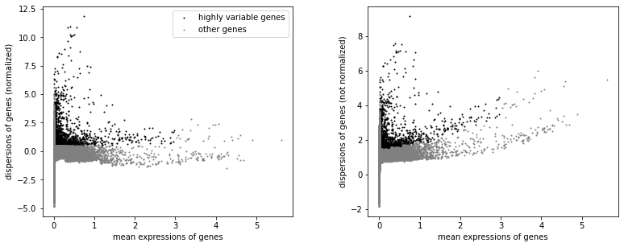
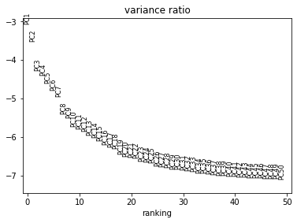
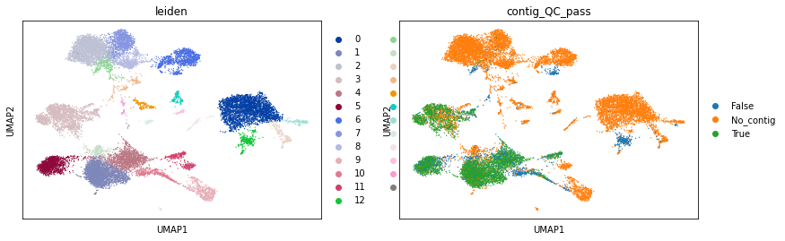
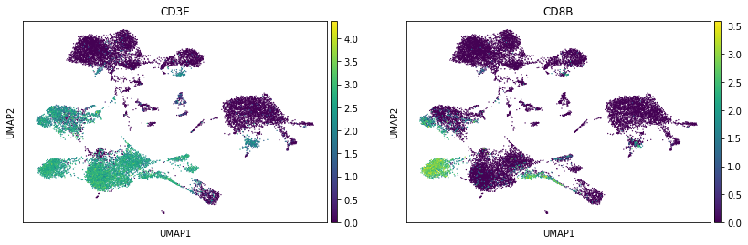
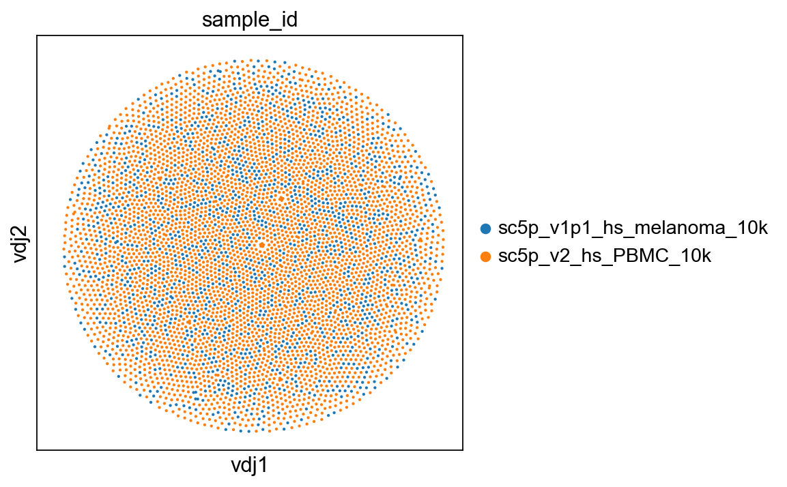
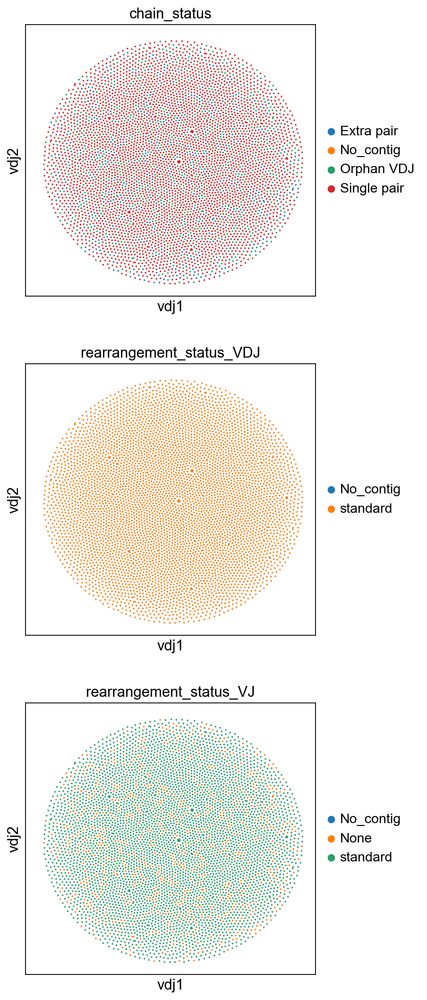
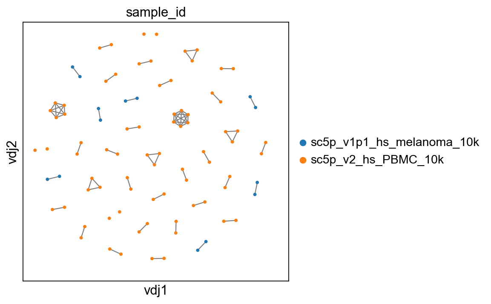
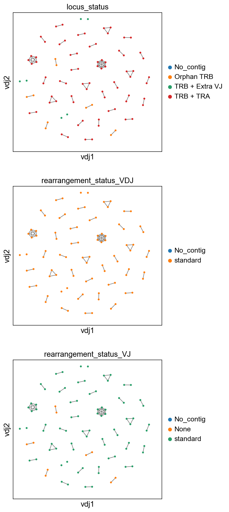
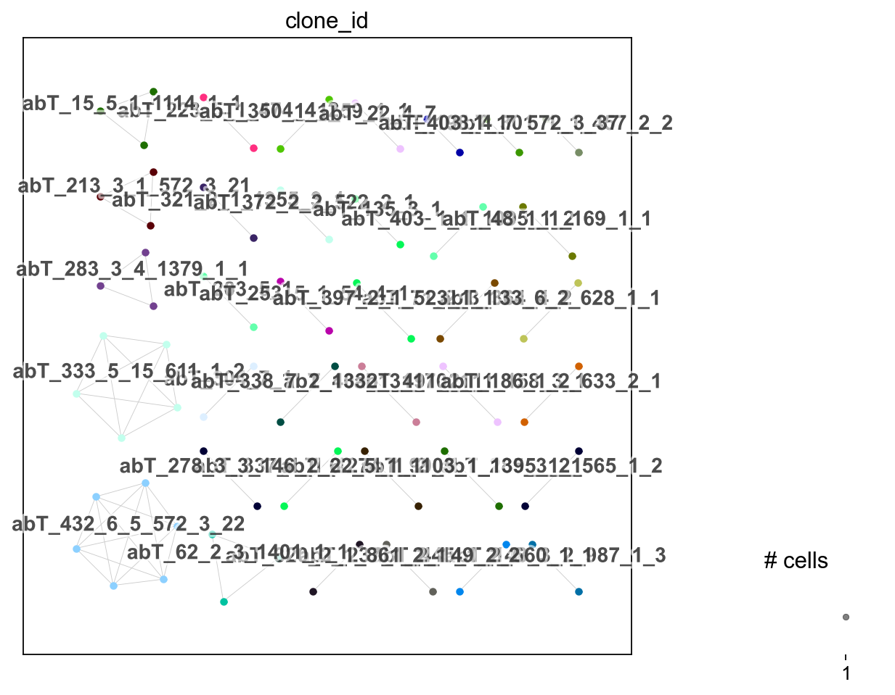
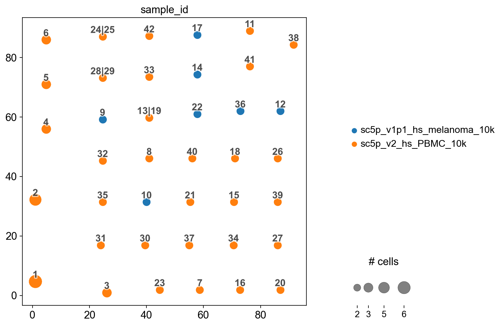

Analyzing TCR data
==================

.. figure:: img/dandelion_logo_illustration.png
   :alt: dandelion_logo

   dandelion_logo

With ``dandelion>=1.3`` onwards, there will be the ability to start
analyzing 10x single-cell TCR data with the existing setup for both
alpha-beta and gamma-delta TCR data formats. Currently, the alpha-beta
and gamma-delta data sets have to be analyzed separately.

The workflow may be a bit buggy because it’s not optimised for TCR data;
do let me know if you find any bugs and I can see if i can try to fix
the issue(s).

We will download the various input formats of TCR files from 10x’s
`resource page <https://www.10xgenomics.com/resources/datasets>`__ as
part of this tutorial:

.. code:: bash

   # bash
   mkdir -p dandelion_tutorial/sc5p_v2_hs_PBMC_10k;
   mkdir -p dandelion_tutorial/sc5p_v1p1_hs_melanoma_10k;

   cd dandelion_tutorial/sc5p_v2_hs_PBMC_10k;
   wget https://cf.10xgenomics.com/samples/cell-vdj/4.0.0/sc5p_v2_hs_PBMC_10k/sc5p_v2_hs_PBMC_10k_filtered_feature_bc_matrix.h5;
   wget https://cf.10xgenomics.com/samples/cell-vdj/4.0.0/sc5p_v2_hs_PBMC_10k/sc5p_v2_hs_PBMC_10k_t_airr_rearrangement.tsv;
   wget https://cf.10xgenomics.com/samples/cell-vdj/4.0.0/sc5p_v2_hs_PBMC_10k/sc5p_v2_hs_PBMC_10k_t_filtered_contig_annotations.csv;
   wget https://cf.10xgenomics.com/samples/cell-vdj/4.0.0/sc5p_v2_hs_PBMC_10k/sc5p_v2_hs_PBMC_10k_t_filtered_contig.fasta;

   cd ../sc5p_v1p1_hs_melanoma_10k;
   wget https://cf.10xgenomics.com/samples/cell-vdj/4.0.0/sc5p_v1p1_hs_melanoma_10k/sc5p_v1p1_hs_melanoma_10k_filtered_feature_bc_matrix.h5;
   wget https://cf.10xgenomics.com/samples/cell-vdj/4.0.0/sc5p_v1p1_hs_melanoma_10k/sc5p_v1p1_hs_melanoma_10k_t_airr_rearrangement.tsv;
   wget https://cf.10xgenomics.com/samples/cell-vdj/4.0.0/sc5p_v1p1_hs_melanoma_10k/sc5p_v1p1_hs_melanoma_10k_t_filtered_contig_annotations.csv;
   wget https://cf.10xgenomics.com/samples/cell-vdj/4.0.0/sc5p_v1p1_hs_melanoma_10k/sc5p_v1p1_hs_melanoma_10k_t_filtered_contig.fasta;

**Import dandelion module**

.. code:: ipython3

    import os
    import dandelion as ddl
    # change directory to somewhere more workable
    os.chdir(os.path.expanduser('/Users/kt16/Downloads/dandelion_tutorial/'))
    ddl.logging.print_versions()

.. parsed-literal::

    dandelion==0.2.4.dev58 pandas==1.4.2 numpy==1.21.6 matplotlib==3.5.2 networkx==2.8.4 scipy==1.8.1

I’m showing two examples for reading in the data: with or without
reannotation.

**Read in AIRR format**

.. code:: ipython3

    # read in the airr_rearrangement.tsv file
    file1 = 'sc5p_v2_hs_PBMC_10k/sc5p_v2_hs_PBMC_10k_t_airr_rearrangement.tsv'
    file2 = 'sc5p_v1p1_hs_melanoma_10k/sc5p_v1p1_hs_melanoma_10k_t_airr_rearrangement.tsv'

.. code:: ipython3

    vdj1 = ddl.read_10x_airr(file1)
    vdj1

.. parsed-literal::

    Dandelion class object with n_obs = 5351 and n_contigs = 10860
        data: 'cell_id', 'sequence_id', 'sequence', 'sequence_aa', 'productive', 'rev_comp', 'v_call', 'v_cigar', 'd_call', 'd_cigar', 'j_call', 'j_cigar', 'c_call', 'c_cigar', 'sequence_alignment', 'germline_alignment', 'junction', 'junction_aa', 'junction_length', 'junction_aa_length', 'v_sequence_start', 'v_sequence_end', 'd_sequence_start', 'd_sequence_end', 'j_sequence_start', 'j_sequence_end', 'c_sequence_start', 'c_sequence_end', 'consensus_count', 'duplicate_count', 'is_cell', 'locus', 'rearrangement_status'
        metadata: 'locus_VDJ', 'locus_VJ', 'productive_VDJ', 'productive_VJ', 'v_call_VDJ', 'd_call_VDJ', 'j_call_VDJ', 'v_call_VJ', 'j_call_VJ', 'c_call_VDJ', 'c_call_VJ', 'junction_VDJ', 'junction_VJ', 'junction_aa_VDJ', 'junction_aa_VJ', 'v_call_abT_VDJ', 'd_call_abT_VDJ', 'j_call_abT_VDJ', 'v_call_abT_VJ', 'j_call_abT_VJ', 'productive_abT_VDJ', 'productive_abT_VJ', 'duplicate_count_abT_VDJ', 'duplicate_count_abT_VJ', 'isotype', 'isotype_status', 'locus_status', 'chain_status', 'rearrangement_status_VDJ', 'rearrangement_status_VJ'

.. code:: ipython3

    vdj2 = ddl.read_10x_airr(file2)
    vdj2

.. parsed-literal::

    Dandelion class object with n_obs = 1560 and n_contigs = 2755
        data: 'cell_id', 'sequence_id', 'sequence', 'sequence_aa', 'productive', 'rev_comp', 'v_call', 'v_cigar', 'd_call', 'd_cigar', 'j_call', 'j_cigar', 'c_call', 'c_cigar', 'sequence_alignment', 'germline_alignment', 'junction', 'junction_aa', 'junction_length', 'junction_aa_length', 'v_sequence_start', 'v_sequence_end', 'd_sequence_start', 'd_sequence_end', 'j_sequence_start', 'j_sequence_end', 'c_sequence_start', 'c_sequence_end', 'consensus_count', 'duplicate_count', 'is_cell', 'locus', 'rearrangement_status'
        metadata: 'locus_VDJ', 'locus_VJ', 'productive_VDJ', 'productive_VJ', 'v_call_VDJ', 'd_call_VDJ', 'j_call_VDJ', 'v_call_VJ', 'j_call_VJ', 'c_call_VDJ', 'c_call_VJ', 'junction_VDJ', 'junction_VJ', 'junction_aa_VDJ', 'junction_aa_VJ', 'v_call_abT_VDJ', 'd_call_abT_VDJ', 'j_call_abT_VDJ', 'v_call_abT_VJ', 'j_call_abT_VJ', 'productive_abT_VDJ', 'productive_abT_VJ', 'duplicate_count_abT_VDJ', 'duplicate_count_abT_VJ', 'isotype', 'isotype_status', 'locus_status', 'chain_status', 'rearrangement_status_VDJ', 'rearrangement_status_VJ'

.. code:: ipython3

    # combine into a singular object
    # let's add the sample_id to each cell barcode so that we don't end up overlapping later on
    sample_id = 'sc5p_v2_hs_PBMC_10k'
    vdj1.data['sample_id'] = sample_id
    vdj1.data['cell_id'] = [sample_id + '_' + c for c in vdj1.data['cell_id']]
    vdj1.data['sequence_id'] = [sample_id + '_' + s for s in vdj1.data['sequence_id']]
    
    sample_id = 'sc5p_v1p1_hs_melanoma_10k'
    vdj2.data['sample_id'] = sample_id
    vdj2.data['cell_id'] = [sample_id + '_' + c for c in vdj2.data['cell_id']]
    vdj2.data['sequence_id'] = [sample_id + '_' + s for s in vdj2.data['sequence_id']]
    
    # combine into a singular object
    vdj = ddl.concat([vdj1, vdj2])
    vdj

.. parsed-literal::

    Dandelion class object with n_obs = 6911 and n_contigs = 13615
        data: 'cell_id', 'sequence_id', 'sequence', 'sequence_aa', 'productive', 'rev_comp', 'v_call', 'v_cigar', 'd_call', 'd_cigar', 'j_call', 'j_cigar', 'c_call', 'c_cigar', 'sequence_alignment', 'germline_alignment', 'junction', 'junction_aa', 'junction_length', 'junction_aa_length', 'v_sequence_start', 'v_sequence_end', 'd_sequence_start', 'd_sequence_end', 'j_sequence_start', 'j_sequence_end', 'c_sequence_start', 'c_sequence_end', 'consensus_count', 'duplicate_count', 'is_cell', 'locus', 'rearrangement_status', 'sample_id'
        metadata: 'sample_id', 'locus_VDJ', 'locus_VJ', 'productive_VDJ', 'productive_VJ', 'v_call_VDJ', 'd_call_VDJ', 'j_call_VDJ', 'v_call_VJ', 'j_call_VJ', 'c_call_VDJ', 'c_call_VJ', 'junction_VDJ', 'junction_VJ', 'junction_aa_VDJ', 'junction_aa_VJ', 'v_call_abT_VDJ', 'd_call_abT_VDJ', 'j_call_abT_VDJ', 'v_call_abT_VJ', 'j_call_abT_VJ', 'productive_abT_VDJ', 'productive_abT_VJ', 'duplicate_count_abT_VDJ', 'duplicate_count_abT_VJ', 'isotype', 'isotype_status', 'locus_status', 'chain_status', 'rearrangement_status_VDJ', 'rearrangement_status_VJ'

**Read in with reannotation**

We specify the ``filename_prefix`` option because they have different
prefixes that precedes ``_contig.fasta`` and
``_contig_annotations.csv``.

.. code:: ipython3

    samples = ['sc5p_v2_hs_PBMC_10k', 'sc5p_v1p1_hs_melanoma_10k']
    filename_prefixes = ['sc5p_v2_hs_PBMC_10k_t_filtered', 'sc5p_v1p1_hs_melanoma_10k_t_filtered']
    ddl.pp.format_fastas(samples, prefix = samples, filename_prefix = filename_prefixes)

.. parsed-literal::

    Formating fasta(s) : 100%|██████████| 2/2 [00:04<00:00,  2.11s/it]                                                                               

Make sure to toggle ``loci = 'tr'`` for TCR data. I’m setting
``reassign_dj = True`` so as to try and force a reassignment of J genes
(and D genes if it can) with stricter cut offs.

.. code:: ipython3

    ddl.pp.reannotate_genes(samples, loci = 'tr', reassign_dj = True, filename_prefix = filename_prefixes)

.. parsed-literal::

    Assigning genes :   0%|          | 0/2 [00:00<?, ?it/s]                                                                                          

.. parsed-literal::

             START> MakeDB
           COMMAND> igblast
      ALIGNER_FILE> sc5p_v2_hs_PBMC_10k_t_filtered_contig_igblast.fmt7
          SEQ_FILE> sc5p_v2_hs_PBMC_10k_t_filtered_contig.fasta
           ASIS_ID> False
        ASIS_CALLS> False
           PARTIAL> False
          EXTENDED> True
    INFER_JUNCTION> False
    
    PROGRESS> 09:44:07 |Done                | 0.0 min
    
    PROGRESS> 09:44:22 |####################| 100% (13,630) 0.2 min
    
    OUTPUT> sc5p_v2_hs_PBMC_10k_t_filtered_contig_igblast_db-pass.tsv
      PASS> 12246
      FAIL> 1384
       END> MakeDb
    
             START> MakeDB
           COMMAND> igblast
      ALIGNER_FILE> sc5p_v2_hs_PBMC_10k_t_filtered_contig_igblast.fmt7
          SEQ_FILE> sc5p_v2_hs_PBMC_10k_t_filtered_contig.fasta
           ASIS_ID> False
        ASIS_CALLS> False
           PARTIAL> False
          EXTENDED> True
    INFER_JUNCTION> False
    
    PROGRESS> 09:44:22 |Done                | 0.0 min
    
    PROGRESS> 09:44:35 |####################| 100% (13,630) 0.2 min
    
    OUTPUT> sc5p_v2_hs_PBMC_10k_t_filtered_contig_igblast_db-pass.tsv
      PASS> 12246
      FAIL> 1384
       END> MakeDb
    

.. parsed-literal::

    Assigning genes :  50%|█████     | 1/2 [06:07<06:07, 367.16s/it]                                                                                 

.. parsed-literal::

             START> MakeDB
           COMMAND> igblast
      ALIGNER_FILE> sc5p_v1p1_hs_melanoma_10k_t_filtered_contig_igblast.fmt7
          SEQ_FILE> sc5p_v1p1_hs_melanoma_10k_t_filtered_contig.fasta
           ASIS_ID> False
        ASIS_CALLS> False
           PARTIAL> False
          EXTENDED> True
    INFER_JUNCTION> False
    
    PROGRESS> 09:46:12 |Done                | 0.0 min
    
    PROGRESS> 09:46:18 |####################| 100% (3,706) 0.1 min
    
    OUTPUT> sc5p_v1p1_hs_melanoma_10k_t_filtered_contig_igblast_db-pass.tsv
      PASS> 3217
      FAIL> 489
       END> MakeDb
    
             START> MakeDB
           COMMAND> igblast
      ALIGNER_FILE> sc5p_v1p1_hs_melanoma_10k_t_filtered_contig_igblast.fmt7
          SEQ_FILE> sc5p_v1p1_hs_melanoma_10k_t_filtered_contig.fasta
           ASIS_ID> False
        ASIS_CALLS> False
           PARTIAL> False
          EXTENDED> True
    INFER_JUNCTION> False
    
    PROGRESS> 09:46:19 |Done                | 0.0 min
    
    PROGRESS> 09:46:25 |####################| 100% (3,706) 0.1 min
    
    OUTPUT> sc5p_v1p1_hs_melanoma_10k_t_filtered_contig_igblast_db-pass.tsv
      PASS> 3217
      FAIL> 489
       END> MakeDb
    

.. parsed-literal::

    Assigning genes : 100%|██████████| 2/2 [07:40<00:00, 230.43s/it]                                                                                 

.. parsed-literal::

    building file list ... done
    sc5p_v2_hs_PBMC_10k_t_filtered_contig_igblast_db-pass.tsv
    
    sent 5.11M bytes  received 42 bytes  2.05M bytes/sec
    total size is 32.04M  speedup is 6.26
    building file list ... done
    sc5p_v1p1_hs_melanoma_10k_t_filtered_contig_igblast_db-pass.tsv
    
    sent 1.32M bytes  received 42 bytes  883.17K bytes/sec
    total size is 8.42M  speedup is 6.36

There’s no need to run the the rest of the preprocessing steps.

We’ll read in the reannotated files like as follow:

.. code:: ipython3

    import pandas as pd
    tcr_files = []
    for sample in samples:
        file_location = sample +'/dandelion/' + sample + '_t_filtered_contig_dandelion.tsv'
        tcr_files.append(pd.read_csv(file_location, sep = '\t'))
    tcr = tcr_files[0].append(tcr_files[1:])
    tcr.reset_index(inplace = True, drop = True)
    tcr

.. parsed-literal::

    /var/folders/nb/wrd6px6171j52lqpmkljt6vw000l2l/T/ipykernel_44286/552048275.py:6: FutureWarning: The frame.append method is deprecated and will be removed from pandas in a future version. Use pandas.concat instead.

.. raw:: html

    

    
    <table border="1" class="dataframe">
      <thead>
        <tr style="text-align: right;">
          <th></th>
          <th>sequence_id</th>
          <th>sequence</th>
          <th>rev_comp</th>
          <th>productive</th>
          <th>v_call</th>
          <th>d_call</th>
          <th>j_call</th>
          <th>sequence_alignment</th>
          <th>germline_alignment</th>
          <th>junction</th>
          <th>...</th>
          <th>fwr2_aa</th>
          <th>fwr3_aa</th>
          <th>fwr4_aa</th>
          <th>cdr1_aa</th>
          <th>cdr2_aa</th>
          <th>cdr3_aa</th>
          <th>sequence_alignment_aa</th>
          <th>v_sequence_alignment_aa</th>
          <th>d_sequence_alignment_aa</th>
          <th>j_sequence_alignment_aa</th>
        </tr>
      </thead>
      <tbody>
        <tr>
          <th>0</th>
          <td>sc5p_v2_hs_PBMC_10k_AAACCTGAGCGATAGC_contig_1</td>
          <td>CTGGAAGACCACCTGGGCTGTCATTGAGCTCTGGTGCCAGGAGGAA...</td>
          <td>F</td>
          <td>T</td>
          <td>TRAV23/DV6*02</td>
          <td>NaN</td>
          <td>TRAJ22*01</td>
          <td>CAGCAGCAGGTGAAACAAAGTCCTCAATCTTTGATAGTCCAGAAAG...</td>
          <td>CAGCAGCAGGTGAAACAAAGTCCTCAATCTTTGATAGTCCAGAAAG...</td>
          <td>TGTGCAGCAAGCAAGGGTTCTGCAAGGCAACTGACCTTT</td>
          <td>...</td>
          <td>FPWYQQFPGKGPALLIA</td>
          <td>KKEGRFTISFNKSAKQFSLHIMDSQPGDSATYFC</td>
          <td>FGSGTQLTVLP</td>
          <td>NTAFDY</td>
          <td>IRPDVSE</td>
          <td>AASKGSARQLT</td>
          <td>QQQVKQSPQSLIVQKGGIPIINCAYENTAFDYFPWYQQFPGKGPAL...</td>
          <td>QQQVKQSPQSLIVQKGGIPIINCAYENTAFDYFPWYQQFPGKGPAL...</td>
          <td>NaN</td>
          <td>GSARQLTFGSGTQLTVLP</td>
        </tr>
        <tr>
          <th>1</th>
          <td>sc5p_v2_hs_PBMC_10k_AAACCTGAGCGATAGC_contig_2</td>
          <td>GAGAGTCCTGCTCCCCTTTCATCAATGCACAGATACAGAAGACCCC...</td>
          <td>F</td>
          <td>T</td>
          <td>TRBV6-5*01</td>
          <td>NaN</td>
          <td>TRBJ2-3*01</td>
          <td>AATGCTGGTGTCACTCAGACCCCAAAATTCCAGGTCCTGAAGACAG...</td>
          <td>AATGCTGGTGTCACTCAGACCCCAAAATTCCAGGTCCTGAAGACAG...</td>
          <td>TGTGCCAGCAGTTACCGGGGGGGATCGGAAGATACGCAGTATTTT</td>
          <td>...</td>
          <td>MSWYRQDPGMGLRLIHY</td>
          <td>TDQGEVPNGYNVSRSTTEDFPLRLLSAAPSQTSVYFC</td>
          <td>FGPGTRLTVL</td>
          <td>MNHEY</td>
          <td>SVGAGI</td>
          <td>ASSYRGGSEDTQY</td>
          <td>NAGVTQTPKFQVLKTGQSMTLQCAQDMNHEYMSWYRQDPGMGLRLI...</td>
          <td>NAGVTQTPKFQVLKTGQSMTLQCAQDMNHEYMSWYRQDPGMGLRLI...</td>
          <td>NaN</td>
          <td>DTQYFGPGTRLTVL</td>
        </tr>
        <tr>
          <th>2</th>
          <td>sc5p_v2_hs_PBMC_10k_AAACCTGAGTCACGCC_contig_2</td>
          <td>CCTTTTCACCAATGCACAGACCCAGAGGACCCCTCCATCCTGCAGT...</td>
          <td>F</td>
          <td>T</td>
          <td>TRBV6-2*01,TRBV6-3*01</td>
          <td>NaN</td>
          <td>TRBJ2-6*01</td>
          <td>AATGCTGGTGTCACTCAGACCCCAAAATTCCGGGTCCTGAAGACAG...</td>
          <td>AATGCTGGTGTCACTCAGACCCCAAAATTCCGGGTCCTGAAGACAG...</td>
          <td>TGTGCCAGCAGTTATCTCCCCCGTAGACAGGACAGGGAATCCTCTG...</td>
          <td>...</td>
          <td>MYWYRQDPGMGLRLIHY</td>
          <td>TAKGEVPDGYNVSRLKKQNFLLGLESAAPSQTSVYFC</td>
          <td>FGAGSRLTVL</td>
          <td>MNHEY</td>
          <td>SVGEGT</td>
          <td>ASSYLPRRQDRESSGANVLT</td>
          <td>NAGVTQTPKFRVLKTGQSMTLLCAQDMNHEYMYWYRQDPGMGLRLI...</td>
          <td>NAGVTQTPKFRVLKTGQSMTLLCAQDMNHEYMYWYRQDPGMGLRLI...</td>
          <td>NaN</td>
          <td>SGANVLTFGAGSRLTVL</td>
        </tr>
        <tr>
          <th>3</th>
          <td>sc5p_v2_hs_PBMC_10k_AAACCTGAGTCACGCC_contig_1</td>
          <td>GTAGCTCGTTGATATCTGTGTGGATAGGGAGCTGTGACGAGGGCAA...</td>
          <td>F</td>
          <td>T</td>
          <td>TRAV8-6*02</td>
          <td>NaN</td>
          <td>TRAJ8*01</td>
          <td>GCCCAGTCTGTGACCCAGCTTGACAGCCAAGTCCCTGTCTTTGAAG...</td>
          <td>GCCCAGTCTGTGACCCAGCTTGACAGCCAAGTCCCTGTCTTTGAAG...</td>
          <td>TGTGCTGTGAGTGCGTTTTTTCAGAAACTTGTATTT</td>
          <td>...</td>
          <td>LFWYVQYPNQGLQLLLK</td>
          <td>KGINGFEAEFNKSQTSFHLRKPSVHISDTAEYFC</td>
          <td>FGTGTRLLVSP</td>
          <td>SSVSVY</td>
          <td>YLSGSTLV</td>
          <td>AVSAFFQKLV</td>
          <td>AQSVTQLDSQVPVFEEAPVELRCNYSSSVSVYLFWYVQYPNQGLQL...</td>
          <td>AQSVTQLDSQVPVFEEAPVELRCNYSSSVSVYLFWYVQYPNQGLQL...</td>
          <td>NaN</td>
          <td>FQKLVFGTGTRLLVSP</td>
        </tr>
        <tr>
          <th>4</th>
          <td>sc5p_v2_hs_PBMC_10k_AAACCTGCACGTCAGC_contig_1</td>
          <td>CCCACATGAAGTGTCTACCTTCTGCAGACTCCAATGGCTCAGGAAC...</td>
          <td>F</td>
          <td>T</td>
          <td>TRAV1-2*01</td>
          <td>NaN</td>
          <td>TRAJ33*01</td>
          <td>GGACAAAACATTGACCAG...CCCACTGAGATGACAGCTACGGAAG...</td>
          <td>GGACAAAACATTGACCAG...CCCACTGAGATGACAGCTACGGAAG...</td>
          <td>TGTGCTGTCATGGATAGCAACTATCAGTTAATCTGG</td>
          <td>...</td>
          <td>LFWYQQHAGEAPTFLSY</td>
          <td>EEKGRFSSFLSRSKGYSYLLLKELQMKDSASYLC</td>
          <td>WGAGTKLIIKP</td>
          <td>TSGFNG</td>
          <td>NVLDGL</td>
          <td>AVMDSNYQLI</td>
          <td>GQNIDQPTEMTATEGAIVQINCTYQTSGFNGLFWYQQHAGEAPTFL...</td>
          <td>GQNIDQPTEMTATEGAIVQINCTYQTSGFNGLFWYQQHAGEAPTFL...</td>
          <td>NaN</td>
          <td>DSNYQLIWGAGTKLIIKP</td>
        </tr>
        <tr>
          <th>...</th>
          <td>...</td>
          <td>...</td>
          <td>...</td>
          <td>...</td>
          <td>...</td>
          <td>...</td>
          <td>...</td>
          <td>...</td>
          <td>...</td>
          <td>...</td>
          <td>...</td>
          <td>...</td>
          <td>...</td>
          <td>...</td>
          <td>...</td>
          <td>...</td>
          <td>...</td>
          <td>...</td>
          <td>...</td>
          <td>...</td>
          <td>...</td>
        </tr>
        <tr>
          <th>15458</th>
          <td>sc5p_v1p1_hs_melanoma_10k_TTTGGTTTCACAGGCC_con...</td>
          <td>AATGGCTCAGGAACTGGGAATGCAGTGCCAGGCTCGTGGTATCCTG...</td>
          <td>F</td>
          <td>T</td>
          <td>TRAV1-2*01</td>
          <td>NaN</td>
          <td>TRAJ20*01</td>
          <td>GGACAAAACATTGACCAG...CCCACTGAGATGACAGCTACGGAAG...</td>
          <td>GGACAAAACATTGACCAG...CCCACTGAGATGACAGCTACGGAAG...</td>
          <td>TGTGCTGTGATGGGGGACTACAAGCTCAGCTTT</td>
          <td>...</td>
          <td>LFWYQQHAGEAPTFLSY</td>
          <td>EEKGRFSSFLSRSKGYSYLLLKELQMKDSASYLC</td>
          <td>FGAGTTVTVRA</td>
          <td>TSGFNG</td>
          <td>NVLDGL</td>
          <td>AVMGDYKLS</td>
          <td>GQNIDQPTEMTATEGAIVQINCTYQTSGFNGLFWYQQHAGEAPTFL...</td>
          <td>GQNIDQPTEMTATEGAIVQINCTYQTSGFNGLFWYQQHAGEAPTFL...</td>
          <td>NaN</td>
          <td>DYKLSFGAGTTVTVRA</td>
        </tr>
        <tr>
          <th>15459</th>
          <td>sc5p_v1p1_hs_melanoma_10k_TTTGGTTTCTTTACGT_con...</td>
          <td>TTCCTCTGCTCTGGCAGCAGATCTCCCAGAGGGAGCAGCCTGACCA...</td>
          <td>F</td>
          <td>T</td>
          <td>TRBV30*01</td>
          <td>NaN</td>
          <td>TRBJ2-5*01</td>
          <td>TCTCAGACTATTCATCAATGGCCAGCGACCCTGGTGCAGCCTGTGG...</td>
          <td>TCTCAGACTATTCATCAATGGCCAGCGACCCTGGTGCAGCCTGTGG...</td>
          <td>TGTGCCTGGAGTGAGCTAGCGGCCCAAGAGACCCAGTACTTC</td>
          <td>...</td>
          <td>LYWYRQAAGRGLQLLFY</td>
          <td>QISSEVPQNLSASRPQDRQFILSSKKLLLSDSGFYLC</td>
          <td>FGPGTRLLVL</td>
          <td>GTSNPN</td>
          <td>SVGIG</td>
          <td>AWSELAAQETQY</td>
          <td>SQTIHQWPATLVQPVGSPLSLECTVEGTSNPNLYWYRQAAGRGLQL...</td>
          <td>SQTIHQWPATLVQPVGSPLSLECTVEGTSNPNLYWYRQAAGRGLQL...</td>
          <td>NaN</td>
          <td>QETQYFGPGTRLLVL</td>
        </tr>
        <tr>
          <th>15460</th>
          <td>sc5p_v1p1_hs_melanoma_10k_TTTGGTTTCTTTACGT_con...</td>
          <td>GATCTTAATTGGGAAGAACAAGGATGACATCCATTCGAGCTGTATT...</td>
          <td>F</td>
          <td>F</td>
          <td>TRAV13-1*02</td>
          <td>NaN</td>
          <td>TRAJ43*01</td>
          <td>GGAGAGAATGTGGAGCAGCATCCTTCAACCCTGAGTGTCCAGGAGG...</td>
          <td>GGAGAGAATGTGGAGCAGCATCCTTCAACCCTGAGTGTCCAGGAGG...</td>
          <td>TGTGCAGCAAGTACAACCCGAAGGTTAGGCGGGGTGGGGTCAAAAA...</td>
          <td>...</td>
          <td>FPWYKQELGKRPQLIID</td>
          <td>KKDQRIAVTLNKTAKHFSLHITETQPEDSAVYFC</td>
          <td>WSRDQTDSKT</td>
          <td>DSASNY</td>
          <td>IRSNVGE</td>
          <td>AASTTRRLGGVGSKK*HA</td>
          <td>GENVEQHPSTLSVQEGDSAVIKCTYSDSASNYFPWYKQELGKRPQL...</td>
          <td>GENVEQHPSTLSVQEGDSAVIKCTYSDSASNYFPWYKQELGKRPQL...</td>
          <td>NaN</td>
          <td>*HALWSRDQTDSKT</td>
        </tr>
        <tr>
          <th>15461</th>
          <td>sc5p_v1p1_hs_melanoma_10k_TTTGTCACATTTCACT_con...</td>
          <td>TCTGGGGATGTTCACAGAGGGCCTGGTCTGGAATATTCCACATCTG...</td>
          <td>F</td>
          <td>T</td>
          <td>TRBV12-4*01</td>
          <td>NaN</td>
          <td>TRBJ1-1*01</td>
          <td>GATGCTGGAGTTATCCAGTCACCCCGGCACGAGGTGACAGAGATGG...</td>
          <td>GATGCTGGAGTTATCCAGTCACCCCGGCACGAGGTGACAGAGATGG...</td>
          <td>TGTGCCAGCAGTTTAGGATGGGGAGACGGCACTGAAGCTTTCTTT</td>
          <td>...</td>
          <td>LFWYRQTMMRGLELLIY</td>
          <td>IDDSGMPEDRFSAKMPNASFSTLKIQPSEPRDSAVYFC</td>
          <td>FGQGTRLTVV</td>
          <td>SGHDY</td>
          <td>FNNNVP</td>
          <td>ASSLGWGDGTEAF</td>
          <td>DAGVIQSPRHEVTEMGQEVTLRCKPISGHDYLFWYRQTMMRGLELL...</td>
          <td>DAGVIQSPRHEVTEMGQEVTLRCKPISGHDYLFWYRQTMMRGLELL...</td>
          <td>NaN</td>
          <td>TEAFFGQGTRLTVV</td>
        </tr>
        <tr>
          <th>15462</th>
          <td>sc5p_v1p1_hs_melanoma_10k_TTTGTCACATTTCACT_con...</td>
          <td>AGATCAGAAGAGGAGGCTTCTCACCCTGCAGCAGGGACCTGTGAGC...</td>
          <td>F</td>
          <td>T</td>
          <td>TRAV38-2/DV8*01</td>
          <td>NaN</td>
          <td>TRAJ32*01,TRAJ32*02</td>
          <td>GCTCAGACAGTCACTCAGTCTCAACCAGAGATGTCTGTGCAGGAGG...</td>
          <td>GCTCAGACAGTCACTCAGTCTCAACCAGAGATGTCTGTGCAGGAGG...</td>
          <td>TGTGCTTATAGGAGCACCCAGATCCCCCAGCTCATCTTT</td>
          <td>...</td>
          <td>LFWYKQPPSRQMILVIR</td>
          <td>ATENRFSVNFQKAAKSFSLKISDSQLGDAAMYFC</td>
          <td>FGTGTLLAVQP</td>
          <td>TSESDYY</td>
          <td>QEAYKQQN</td>
          <td>AYRSTQIPQLI</td>
          <td>AQTVTQSQPEMSVQEAETVTLSCTYDTSESDYYLFWYKQPPSRQMI...</td>
          <td>AQTVTQSQPEMSVQEAETVTLSCTYDTSESDYYLFWYKQPPSRQMI...</td>
          <td>NaN</td>
          <td>LIFGTGTLLAVQP</td>
        </tr>
      </tbody>
    </table>
    
15463 rows × 104 columns

    

The reannotated file can be used with dandelion as per the BCR tutorial.

For the rest of the tutorial, I’m going to show how to proceed with
10x’s AIRR format file instead as there are some minor differences.

**Import modules for use with scanpy**

.. code:: ipython3

    import pandas as pd
    import numpy as np
    import scanpy as sc
    import warnings
    import functools
    import seaborn as sns
    import scipy.stats
    import anndata as ad
    
    warnings.filterwarnings('ignore')
    sc.logging.print_header()

.. parsed-literal::

    scanpy==1.9.1 anndata==0.8.0 umap==0.5.3 numpy==1.21.6 scipy==1.8.1 pandas==1.4.2 scikit-learn==1.1.1 statsmodels==0.13.2 python-igraph==0.9.11 pynndescent==0.5.7

**Import the transcriptome data**

.. code:: ipython3

    gex_files = {    
        'sc5p_v2_hs_PBMC_10k':'sc5p_v2_hs_PBMC_10k/sc5p_v2_hs_PBMC_10k_filtered_feature_bc_matrix.h5',
        'sc5p_v1p1_hs_melanoma_10k':'sc5p_v1p1_hs_melanoma_10k/sc5p_v1p1_hs_melanoma_10k_filtered_feature_bc_matrix.h5'
    }

.. code:: ipython3

    adata_list = []
    for f in gex_files:
        adata_tmp = sc.read_10x_h5(gex_files[f], gex_only=True)
        adata_tmp.obs['sample_id'] = f
        adata_tmp.obs_names = [f + '_' + x for x in adata_tmp.obs_names]
        adata_tmp.var_names_make_unique()
        adata_list.append(adata_tmp)
    adata = ad.concat(adata_list)
    adata

.. parsed-literal::

    AnnData object with n_obs × n_vars = 17275 × 36601
        obs: 'sample_id'

**Run QC on the transcriptome data.**

.. code:: ipython3

    ddl.pp.recipe_scanpy_qc(adata)
    adata

.. parsed-literal::

    AnnData object with n_obs × n_vars = 17275 × 36601
        obs: 'sample_id', 'scrublet_score', 'n_genes', 'n_genes_by_counts', 'total_counts', 'total_counts_mt', 'pct_counts_mt', 'is_doublet', 'filter_rna'

**Filtering TCR data.**

Note that I’m using the ``Dandelion`` object as input rather than the
pandas dataframe (yes both types of input will works. In fact, a file
path to the .tsv will work too).

.. code:: ipython3

    # The function will return both objects. 
    vdj, adata = ddl.pp.filter_contigs(vdj, adata) # please look at the other tutorials for using `ddl.pp.check_contigs` as well

.. parsed-literal::

    Preparing data: 13615it [00:02, 6238.54it/s]
    Scanning for poor quality/ambiguous contigs: 100%|██████████| 6911/6911 [00:23<00:00, 298.76it/s]                                                

**Check the output V(D)J table**

.. code:: ipython3

    vdj

.. parsed-literal::

    Dandelion class object with n_obs = 5336 and n_contigs = 10357
        data: 'cell_id', 'sequence_id', 'sequence', 'sequence_aa', 'productive', 'rev_comp', 'v_call', 'v_cigar', 'd_call', 'd_cigar', 'j_call', 'j_cigar', 'c_call', 'c_cigar', 'sequence_alignment', 'germline_alignment', 'junction', 'junction_aa', 'junction_length', 'junction_aa_length', 'v_sequence_start', 'v_sequence_end', 'd_sequence_start', 'd_sequence_end', 'j_sequence_start', 'j_sequence_end', 'c_sequence_start', 'c_sequence_end', 'consensus_count', 'duplicate_count', 'is_cell', 'locus', 'rearrangement_status', 'sample_id'
        metadata: 'sample_id', 'locus_VDJ', 'locus_VJ', 'productive_VDJ', 'productive_VJ', 'v_call_VDJ', 'd_call_VDJ', 'j_call_VDJ', 'v_call_VJ', 'j_call_VJ', 'c_call_VDJ', 'c_call_VJ', 'junction_VDJ', 'junction_VJ', 'junction_aa_VDJ', 'junction_aa_VJ', 'v_call_abT_VDJ', 'd_call_abT_VDJ', 'j_call_abT_VDJ', 'v_call_abT_VJ', 'j_call_abT_VJ', 'productive_abT_VDJ', 'productive_abT_VJ', 'duplicate_count_abT_VDJ', 'duplicate_count_abT_VJ', 'locus_status', 'chain_status', 'rearrangement_status_VDJ', 'rearrangement_status_VJ'

**Check the AnnData object as well**

.. code:: ipython3

    adata

.. parsed-literal::

    AnnData object with n_obs × n_vars = 17275 × 36601
        obs: 'sample_id', 'scrublet_score', 'n_genes', 'n_genes_by_counts', 'total_counts', 'total_counts_mt', 'pct_counts_mt', 'is_doublet', 'filter_rna', 'has_contig', 'filter_contig_quality', 'filter_contig_VDJ', 'filter_contig_VJ', 'contig_QC_pass', 'filter_contig'

**The number of cells that actually has a matching BCR can be
tabluated.**

.. code:: ipython3

    pd.crosstab(adata.obs['has_contig'], adata.obs['filter_contig'])

.. raw:: html

    

    
    <table border="1" class="dataframe">
      <thead>
        <tr style="text-align: right;">
          <th>filter_contig</th>
          <th>False</th>
          <th>True</th>
        </tr>
        <tr>
          <th>has_contig</th>
          <th></th>
          <th></th>
        </tr>
      </thead>
      <tbody>
        <tr>
          <th>No_contig</th>
          <td>6949</td>
          <td>3478</td>
        </tr>
        <tr>
          <th>True</th>
          <td>5441</td>
          <td>1407</td>
        </tr>
      </tbody>
    </table>
    

.. code:: ipython3

    pd.crosstab(adata.obs['has_contig'], adata.obs['contig_QC_pass'])

.. raw:: html

    

    
    <table border="1" class="dataframe">
      <thead>
        <tr style="text-align: right;">
          <th>contig_QC_pass</th>
          <th>False</th>
          <th>No_contig</th>
          <th>True</th>
        </tr>
        <tr>
          <th>has_contig</th>
          <th></th>
          <th></th>
          <th></th>
        </tr>
      </thead>
      <tbody>
        <tr>
          <th>No_contig</th>
          <td>0</td>
          <td>10427</td>
          <td>0</td>
        </tr>
        <tr>
          <th>True</th>
          <td>1512</td>
          <td>0</td>
          <td>5336</td>
        </tr>
      </tbody>
    </table>
    

.. code:: ipython3

    pd.crosstab(adata.obs['contig_QC_pass'], adata.obs['filter_contig'])

.. raw:: html

    

    
    <table border="1" class="dataframe">
      <thead>
        <tr style="text-align: right;">
          <th>filter_contig</th>
          <th>False</th>
          <th>True</th>
        </tr>
        <tr>
          <th>contig_QC_pass</th>
          <th></th>
          <th></th>
        </tr>
      </thead>
      <tbody>
        <tr>
          <th>False</th>
          <td>105</td>
          <td>1407</td>
        </tr>
        <tr>
          <th>No_contig</th>
          <td>6949</td>
          <td>3478</td>
        </tr>
        <tr>
          <th>True</th>
          <td>5336</td>
          <td>0</td>
        </tr>
      </tbody>
    </table>
    

**Now actually filter the AnnData object and run through a standard
workflow starting by filtering genes and normalizing the data**

Because the ‘filtered’ ``AnnData`` object was returned as a filtered but
otherwise unprocessed object, we still need to normalize and run through
the usual process here. The following is just a standard scanpy
workflow.

.. code:: ipython3

    # filter genes
    sc.pp.filter_genes(adata, min_cells=3)
    # Normalize the counts
    sc.pp.normalize_total(adata, target_sum=1e4)
    # Logarithmize the data
    sc.pp.log1p(adata)
    # Stash the normalised counts
    adata.raw = adata

**Identify highly-variable genes**

.. code:: ipython3

    sc.pp.highly_variable_genes(adata, min_mean=0.0125, max_mean=3, min_disp=0.5)
    sc.pl.highly_variable_genes(adata)

**Filter the genes to only those marked as highly-variable**

.. code:: ipython3

    adata = adata[:, adata.var.highly_variable]

**Regress out effects of total counts per cell and the percentage of
mitochondrial genes expressed. Scale the data to unit variance.**

.. code:: ipython3

    sc.pp.regress_out(adata, ['total_counts', 'pct_counts_mt'])
    sc.pp.scale(adata, max_value=10)

**Run PCA**

.. code:: ipython3

    sc.tl.pca(adata, svd_solver='arpack')
    sc.pl.pca_variance_ratio(adata, log=True, n_pcs = 50)

**Computing the neighborhood graph, umap and clusters**

.. code:: ipython3

    # Computing the neighborhood graph
    sc.pp.neighbors(adata)
    # Embedding the neighborhood graph
    sc.tl.umap(adata)
    # Clustering the neighborhood graph
    sc.tl.leiden(adata)

**Visualizing the clusters and whether or not there’s a corresponding
contig**.

.. code:: ipython3

    sc.pl.umap(adata, color=['leiden', 'contig_QC_pass'])

**Visualizing some T cell genes.**

.. code:: ipython3

    sc.pl.umap(adata, color=['CD3E', 'CD8B'])

**Find clones.**

Here we specify ``identity = 1`` so only cells with identical CDR3
nucleotide sequences (``key = 'junction'``) are grouped into
clones/clonotypes.

.. code:: ipython3

    ddl.tl.find_clones(vdj, identity = 1, key = 'junction')
    vdj

.. parsed-literal::

    Finding clones based on abT cell VDJ chains : 100%|██████████| 501/501 [00:00<00:00, 1515.93it/s]                                                
    Refining clone assignment based on VJ chain pairing : 100%|██████████| 5336/5336 [00:00<00:00, 329202.12it/s]                                    

.. parsed-literal::

    Dandelion class object with n_obs = 5336 and n_contigs = 10357
        data: 'cell_id', 'sequence_id', 'sequence', 'sequence_aa', 'productive', 'rev_comp', 'v_call', 'v_cigar', 'd_call', 'd_cigar', 'j_call', 'j_cigar', 'c_call', 'c_cigar', 'sequence_alignment', 'germline_alignment', 'junction', 'junction_aa', 'junction_length', 'junction_aa_length', 'v_sequence_start', 'v_sequence_end', 'd_sequence_start', 'd_sequence_end', 'j_sequence_start', 'j_sequence_end', 'c_sequence_start', 'c_sequence_end', 'consensus_count', 'duplicate_count', 'is_cell', 'locus', 'rearrangement_status', 'sample_id', 'clone_id'
        metadata: 'clone_id', 'clone_id_by_size', 'sample_id', 'locus_VDJ', 'locus_VJ', 'productive_VDJ', 'productive_VJ', 'v_call_VDJ', 'd_call_VDJ', 'j_call_VDJ', 'v_call_VJ', 'j_call_VJ', 'c_call_VDJ', 'c_call_VJ', 'junction_VDJ', 'junction_VJ', 'junction_aa_VDJ', 'junction_aa_VJ', 'v_call_abT_VDJ', 'd_call_abT_VDJ', 'j_call_abT_VDJ', 'v_call_abT_VJ', 'j_call_abT_VJ', 'productive_abT_VDJ', 'productive_abT_VJ', 'duplicate_count_abT_VDJ', 'duplicate_count_abT_VJ', 'locus_status', 'chain_status', 'rearrangement_status_VDJ', 'rearrangement_status_VJ'

**Generate TCR network.**

The 10x-provided AIRR file is missing columns like
``sequence_alignment`` and ``sequence_alignment_aa`` so we will use the
next best thing, which is ``sequence`` or ``sequence_aa``. Note that
these columns are not-gapped.

Specify ``key = 'sequence_aa'`` to toggle this behavior. Can also try
``junction`` or ``junction_aa`` if just want to visualise the CDR3
linkage.

.. code:: ipython3

    ddl.tl.generate_network(vdj, key = 'sequence_aa')

.. parsed-literal::

    Setting up data: 10357it [00:01, 5435.37it/s]
    Calculating distances... : 100%|██████████| 5732/5732 [00:01<00:00, 2966.07it/s]                                                                 
    Generating edge list : 100%|██████████| 39/39 [00:00<00:00, 963.94it/s]                                                                          
    Computing overlap : 100%|██████████| 5732/5732 [00:08<00:00, 650.92it/s]                                                                         
    Linking edges : 100%|██████████| 5286/5286 [00:00<00:00, 67821.41it/s]                                                                           

.. code:: ipython3

    vdj

.. parsed-literal::

    Dandelion class object with n_obs = 5336 and n_contigs = 10357
        data: 'cell_id', 'sequence_id', 'sequence', 'sequence_aa', 'productive', 'rev_comp', 'v_call', 'v_cigar', 'd_call', 'd_cigar', 'j_call', 'j_cigar', 'c_call', 'c_cigar', 'sequence_alignment', 'germline_alignment', 'junction', 'junction_aa', 'junction_length', 'junction_aa_length', 'v_sequence_start', 'v_sequence_end', 'd_sequence_start', 'd_sequence_end', 'j_sequence_start', 'j_sequence_end', 'c_sequence_start', 'c_sequence_end', 'consensus_count', 'duplicate_count', 'is_cell', 'locus', 'rearrangement_status', 'sample_id', 'clone_id'
        metadata: 'clone_id', 'clone_id_by_size', 'sample_id', 'locus_VDJ', 'locus_VJ', 'productive_VDJ', 'productive_VJ', 'v_call_VDJ', 'd_call_VDJ', 'j_call_VDJ', 'v_call_VJ', 'j_call_VJ', 'c_call_VDJ', 'c_call_VJ', 'junction_VDJ', 'junction_VJ', 'junction_aa_VDJ', 'junction_aa_VJ', 'v_call_abT_VDJ', 'd_call_abT_VDJ', 'j_call_abT_VDJ', 'v_call_abT_VJ', 'j_call_abT_VJ', 'productive_abT_VDJ', 'productive_abT_VJ', 'duplicate_count_abT_VDJ', 'duplicate_count_abT_VJ', 'locus_status', 'chain_status', 'rearrangement_status_VDJ', 'rearrangement_status_VJ'
        layout: layout for 5336 vertices, layout for 89 vertices
        graph: networkx graph of 5336 vertices, networkx graph of 89 vertices 

**Plotting in ``scanpy``.**

.. code:: ipython3

    ddl.tl.transfer(adata, vdj) # this will include singletons. To show only expanded clones, specify expanded_only=True

.. code:: ipython3

    sc.set_figure_params(figsize = [5,5])
    ddl.pl.clone_network(adata, 
                         color = ['sample_id'], 
                         edges_width = 1, size = 15) 

.. code:: ipython3

    adata

.. parsed-literal::

    AnnData object with n_obs × n_vars = 17275 × 2305
        obs: 'sample_id', 'scrublet_score', 'n_genes', 'n_genes_by_counts', 'total_counts', 'total_counts_mt', 'pct_counts_mt', 'is_doublet', 'filter_rna', 'has_contig', 'filter_contig_quality', 'filter_contig_VDJ', 'filter_contig_VJ', 'contig_QC_pass', 'filter_contig', 'leiden', 'clone_id', 'clone_id_by_size', 'locus_VDJ', 'locus_VJ', 'productive_VDJ', 'productive_VJ', 'v_call_VDJ', 'd_call_VDJ', 'j_call_VDJ', 'v_call_VJ', 'j_call_VJ', 'c_call_VDJ', 'c_call_VJ', 'junction_VDJ', 'junction_VJ', 'junction_aa_VDJ', 'junction_aa_VJ', 'v_call_abT_VDJ', 'd_call_abT_VDJ', 'j_call_abT_VDJ', 'v_call_abT_VJ', 'j_call_abT_VJ', 'productive_abT_VDJ', 'productive_abT_VJ', 'duplicate_count_abT_VDJ', 'duplicate_count_abT_VJ', 'locus_status', 'chain_status', 'rearrangement_status_VDJ', 'rearrangement_status_VJ'
        var: 'n_cells', 'highly_variable', 'means', 'dispersions', 'dispersions_norm', 'mean', 'std'
        uns: 'log1p', 'hvg', 'pca', 'neighbors', 'umap', 'leiden', 'leiden_colors', 'contig_QC_pass_colors', 'rna_neighbors', 'clone_id', 'sample_id_colors', 'locus_status_colors', 'chain_status_colors'
        obsm: 'X_pca', 'X_umap', 'X_vdj'
        varm: 'PCs'
        obsp: 'distances', 'connectivities', 'rna_connectivities', 'rna_distances', 'vdj_connectivities', 'vdj_distances'

.. code:: ipython3

    sc.set_figure_params(figsize = [4.5,5])
    ddl.pl.clone_network(adata, 
                         color = ['chain_status', 'rearrangement_status_VDJ', 'rearrangement_status_VJ'], 
                         ncols = 1, 
                         legend_fontoutline=3,
                         size = 10,
                         edges_width = 1)

.. code:: ipython3

    ddl.tl.transfer(adata, vdj, expanded_only = True)

.. code:: ipython3

    sc.set_figure_params(figsize = [5,5])
    ddl.pl.clone_network(adata, 
                         color = ['sample_id'], 
                         edges_width = 1,
                         size = 50) 

.. code:: ipython3

    sc.set_figure_params(figsize = [4.5,5])
    ddl.pl.clone_network(adata, 
                         color = ['locus_status', 'rearrangement_status_VDJ', 'rearrangement_status_VJ'], 
                         ncols = 1, 
                         legend_fontoutline=3, 
                         edges_width = 1,
                         size = 50)

Using ``scirpy`` to plot
~~~~~~~~~~~~~~~~~~~~~~~~

You can also use ``scirpy``\ ’s functions to plot the network.

A likely use case is if you have a lot of cells and you don’t want to
wait for ``dandelion`` to generate the layout because it’s taking too
long. Or you simply prefer scirpy’s style of plotting.

You can run ``ddl.tl.generate_network(..., generate_layout = False)``
and it will finish ultra-fast, and after transfer to ``scirpy``, you can
use its plotting functions to visualise the networks - the clone network
is generated very quickly but visualising it using spring layout does
take quite a while.

.. code:: ipython3

    import scirpy as ir
    ir.tl.clonotype_network(adata, min_cells = 2)
    ir.pl.clonotype_network(adata, color = 'clone_id', panel_size=(7, 7))

.. parsed-literal::

    <AxesSubplot:>

You can change the clonotype labels by transferring with a different
``clone_key``. For example, from numerically ordered from largest to
smallest.

.. code:: ipython3

    ddl.tl.transfer(adata, vdj, clone_key = 'clone_id_by_size')
    ir.tl.clonotype_network(adata, clonotype_key = 'clone_id_by_size', min_cells = 2)
    ir.pl.clonotype_network(adata, color = 'clone_id_by_size', panel_size=(7, 7))

.. parsed-literal::

    <AxesSubplot:>

.. image:: 7_dandelion_TCR_data_10x_data_files/7_dandelion_TCR_data_10x_data_64_1.png
   :width: 608px
   :height: 479px

You can also transfer with the clones collapsed for plotting as
pie-charts as per how ``scirpy`` does it.

.. code:: ipython3

    ddl.tl.transfer(adata, vdj, clone_key = 'clone_id_by_size', collapse_nodes = True)
    ir.tl.clonotype_network(adata, clonotype_key = 'clone_id_by_size', min_cells = 2)
    ir.pl.clonotype_network(adata, color = 'sample_id', panel_size=(7, 7))

.. parsed-literal::

    <AxesSubplot:>

**Finish.**

We can save the files.

.. code:: ipython3

    adata.write('adata_tcr.h5ad', compression = 'gzip')

.. code:: ipython3

    vdj.write_h5ddl('dandelion_results_tcr.h5ddl', complib = 'blosc:lz4')

